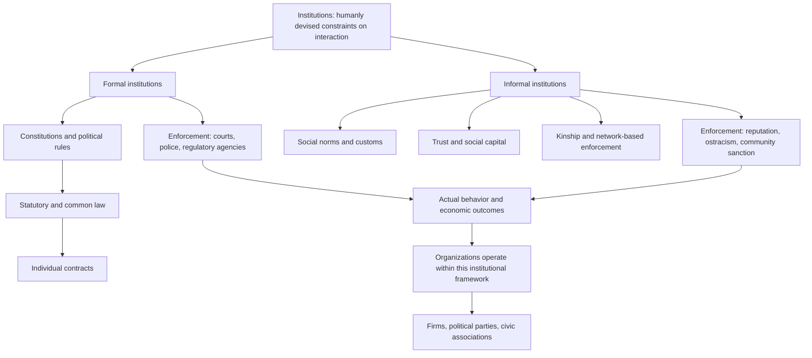

## Defining Institutions: Formal and Informal Rules

### Overview

Defining "institutions" with analytical precision is a foundational task in institutional economics and the political economy of development, since imprecise definitions have historically limited the field's ability to generate testable hypotheses and cumulative empirical evidence. This chapter examines the major conceptual definitions of institutions developed within new institutional economics, distinguishes formal from informal institutional constraints, and clarifies the closely related but analytically distinct concept of organizations.

### Foundational Definition: Douglass North's Framework

**Key Points**

- Douglass North, whose work forms the theoretical foundation of new institutional economics, defined institutions as **"the humanly devised constraints that structure political, economic, and social interaction."**
- North's framework emphasizes that institutions exist to **reduce uncertainty** in human exchange by establishing a stable (though not necessarily efficient) structure for everyday interaction — they are the "rules of the game" in a society, analogous to the rules of a competitive sport that define permissible strategies and constrain player behavior.
- Institutions consist of both **formal constraints** (rules that humans devise, typically written and codified) and **informal constraints** (conventions, norms of behavior, and self-imposed codes of conduct), along with the **enforcement characteristics** of both.
- Institutions are analytically distinct from **organizations**: North defines organizations (political bodies, economic firms, social bodies, educational bodies) as groups of individuals bound by a common purpose to achieve objectives, operating *within* the constraints established by the institutional framework. This distinction matters because institutions define the "playing field" while organizations are the "players" — conflating the two obscures whether observed outcomes reflect the rules themselves or the strategies of actors operating within them.

### Formal Institutions

#### Definition and Scope

**Key Points**

- Formal institutions comprise explicitly codified rules with identifiable authors and, typically, formal mechanisms of enactment and amendment: constitutions, statutory law, contract law, property rights systems, regulatory frameworks, and formal judicial and enforcement structures.
- Formal institutions are characterized by relatively clear boundaries (a law either applies or does not, at least in principle) and by centralized enforcement mechanisms — courts, police, regulatory agencies, and other state apparatus tasked with monitoring compliance and imposing sanctions for violations.
- North's hierarchy of formal rules ranges from the most fundamental and difficult-to-change ("political rules" embedded in constitutions) through intermediate-level rules (statutory and common law) to the most specific and adjustable level (individual contracts negotiated between specific parties within the constraints established by higher-level rules).

#### Property Rights as the Central Formal Institution

- Secure and well-defined **property rights** — the right to use, derive income from, and transfer an asset, combined with protection against arbitrary expropriation — are generally regarded within new institutional economics as the single most consequential category of formal institution for economic development, since insecure property rights directly undermine the incentive to invest, innovate, and engage in productive long-term economic activity.
- **Contract enforcement** is closely related: the capacity of a legal system to reliably and impartially enforce contractual agreements between parties (particularly parties without pre-existing personal relationships or repeated interaction) is what enables the shift from small-scale, personalized exchange toward large-scale, impersonal exchange characteristic of modern market economies — a transition North identified as central to long-run economic development.

### Informal Institutions

#### Definition and Scope

**Key Points**

- Informal institutions comprise unwritten, socially transmitted rules of behavior: social norms, customs, traditions, codes of conduct, conventions, and shared belief systems that shape behavior without relying on formal, centralized state enforcement.
- Enforcement of informal institutions typically operates through decentralized social mechanisms: reputation effects, social ostracism, reciprocity norms, and community-level sanctioning, rather than through courts or police.
- North emphasized that informal institutions are often **more resistant to deliberate change** than formal institutions — while a constitution or statute can be formally amended relatively quickly through legislative or constitutional processes, deeply embedded social norms and cultural practices tend to evolve far more slowly, creating potential tension when formal institutional reforms are introduced without corresponding evolution in the informal norms that shape how those formal rules are actually implemented and complied with in practice.

#### Examples and Mechanisms

- **Trust and social capital**: generalized trust within a society (studied extensively by political scientists including Robert Putnam) functions as an informal institution facilitating economic exchange by reducing the perceived risk of opportunistic behavior, particularly important in contexts where formal contract enforcement is weak or costly to access.
- **Kinship and clan-based networks**: in many developing-economy contexts, informal kinship, ethnic, or clan-based networks provide informal contract enforcement and risk-sharing mechanisms that substitute for weak formal institutions, though these networks can also generate exclusionary dynamics that limit exchange with those outside the network.
- **Corruption norms and anti-corruption norms**: whether bribery and favoritism are broadly socially tolerated or actively stigmatized within a given society functions as a powerful informal institution shaping the actual (as opposed to formally stated) rules governing economic and political transactions.
- **Business and trading customs**: informal commercial customs (such as reputation-based trading networks common in historical long-distance trade, studied extensively by economic historians including Avner Greif in his analysis of medieval Maghribi trader coalitions) demonstrate how informal institutional mechanisms can support complex economic exchange even in the absence of formal legal enforcement.

### Diagram: The Institutional Hierarchy and Formal-Informal Interaction

### The Interaction Between Formal and Informal Institutions

**Key Points**

- Formal and informal institutions can exist in several distinct relationships: they may be **complementary** (informal norms reinforcing compliance with formal rules, lowering enforcement costs), **substitutive** (informal mechanisms filling gaps where formal institutions are weak or absent, common in many developing-economy contexts), or **conflicting** (informal norms actively undermining or contradicting formal rules, as in societies where corruption is formally illegal but informally normalized or even socially expected).
- A substantial literature in comparative institutional economics and political science (including work by Gretchen Helmke and Steven Levitsky on informal institutions in political science, and parallel work in development economics) has examined why formally identical institutional reforms (e.g., similar anti-corruption legislation, similar property registration reforms) frequently produce very different real-world outcomes across countries — the explanation commonly offered is that the pre-existing informal institutional environment mediates how formal rules are actually implemented, interpreted, and complied with in practice.
- [Inference] This formal-informal interaction concept has significant implications for development policy: it suggests that formal institutional reforms transplanted from one context to another (a practice sometimes critiqued as "institutional transplantation" or "isomorphic mimicry" in development policy discourse) may fail to produce the intended effects if the underlying informal institutional environment does not support or is actively in tension with the newly introduced formal rules, a concern that has become increasingly influential in development policy design since the 2000s.

### Measurement Challenges

**Key Points**

- **Formal institutions** are relatively more straightforward to measure and codify, since their existence typically has documentary evidence (constitutional text, statutory law, court records), enabling the construction of indices such as the World Bank's Doing Business indicators (discontinued in 2021), property rights indices, and rule-of-law measures within composite governance indicators such as the Worldwide Governance Indicators.
- **Informal institutions** are considerably harder to measure directly, since they are by definition unwritten and often only observable through their behavioral effects rather than through direct documentary evidence. Researchers typically rely on proxy measures: household and firm surveys measuring generalized trust (e.g., World Values Survey trust questions), experimental economics measures of trust and reciprocity (trust games and public goods games conducted in field experiments), or indirect behavioral proxies such as observed rates of contract litigation versus informal dispute resolution.
- [Unverified] The reliability and cross-cultural comparability of survey-based informal institution measures (particularly generalized trust survey questions) has been questioned by some methodologists, who note that survey responses to abstract trust questions may not reliably predict actual trusting behavior in specific economic transactions, though experimental behavioral measures (trust games) are generally regarded as providing somewhat more behaviorally grounded evidence, albeit typically from smaller and less representative samples than large-scale surveys.

### Institutions Distinguished From Related Concepts

| Concept | Definition | Key Distinction from Institutions |
| --- | --- | --- |
| Institutions | Humanly devised constraints (rules) structuring interaction | The "rules of the game" |
| Organizations | Groups of individuals with common purpose operating within institutional constraints | The "players" — firms, parties, associations |
| Governance | The process and manner in which institutions and organizations are exercised/administered | Refers to the exercise of authority within an institutional framework, not the framework itself |
| Culture | Broader shared beliefs, values, and practices of a society | Culture is often considered a deeper substrate from which informal institutions emerge, but is a broader anthropological concept than the specifically behavior-constraining function of informal institutions |
| Policy | Specific deliberate government interventions or programs | Policies are typically enacted through and constrained by existing formal institutions, operating at a more granular and changeable level |

### Relevance to Development Economics

**Conclusion**

The formal-informal institutional distinction is foundational to understanding why institutional reform in development practice is often more difficult and slower-yielding than proponents anticipate: formal legal and regulatory changes can be enacted relatively quickly through legislative action, but the informal norms, trust relationships, and behavioral conventions that determine how those formal rules actually function in practice evolve on a much longer timescale, and the two do not necessarily move in tandem. This distinction underlies much of the subsequent literature on institutions and long-run growth (including the colonial-origins hypothesis, where colonial-era formal institutional choices interacted with and shaped subsequent informal norms with multi-century persistence), and remains central to contemporary debates about the design and sequencing of development-oriented institutional reform programs.

### Related Topics

- Institutions and long-run growth (application of the institutions concept to growth outcomes)
- The colonial origins hypothesis and institutional persistence (Acemoglu, Johnson, Robinson)
- Social capital and generalized trust (Putnam) as an informal institution
- Avner Greif's comparative institutional analysis of medieval trading networks
- Property rights theory and contract enforcement in development economics
- Extractive versus inclusive institutions (Acemoglu and Robinson)
- Governance indicators and their measurement limitations
- Institutional transplantation and isomorphic mimicry in development policy design