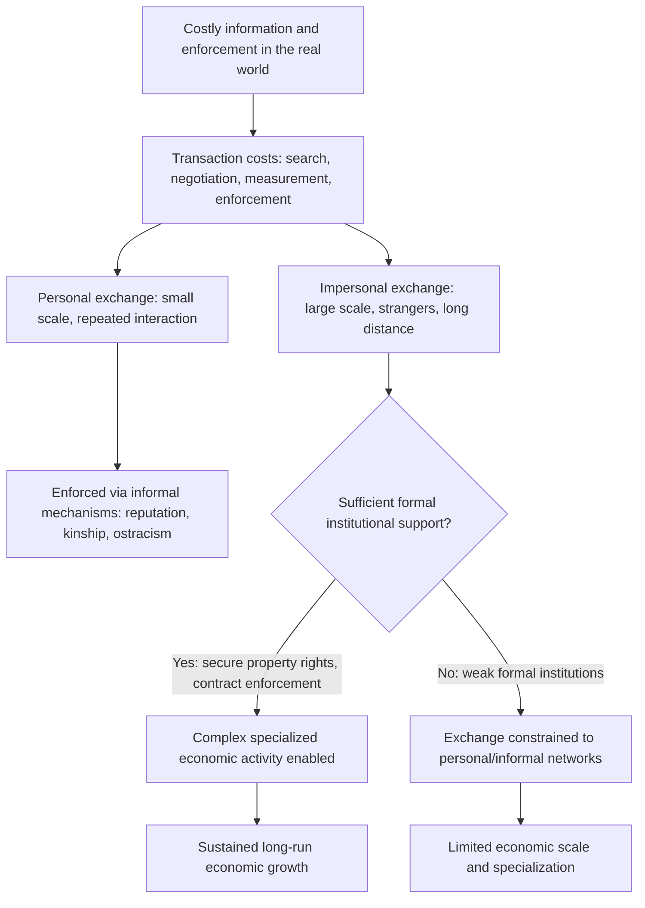

## North's Institutional Economics Framework

### Overview

Douglass North's institutional economics framework, developed across a body of work spanning the 1970s through the 2000s and recognized by the 1993 Nobel Memorial Prize in Economic Sciences (shared with Robert Fogel), provides the theoretical foundation for the entire "new institutional economics" research program and, by extension, much of the contemporary institutions-and-development literature. North's central project was to explain why some economies achieve sustained economic growth while others do not, by focusing on institutions as the fundamental determinant of the incentive structure governing economic behavior — addressing a gap he saw in neoclassical economics, which he argued assumed away the institutional conditions necessary for markets to function efficiently in the first place.

### Intellectual Motivation: The Limits of Neoclassical Theory

**Key Points**

- North argued that standard neoclassical economic theory, by assuming frictionless, costless market exchange (zero transaction costs, perfect information, costless contract enforcement), implicitly assumed away the very institutional questions most relevant to understanding why some economies develop and others do not.
- In a world of genuinely costless transacting, North argued, institutions would not matter economically — any institutional arrangement would be equally efficient, since parties could costlessly negotiate around any institutional inefficiency (an argument closely related to the Coase theorem, developed by Ronald Coase, whose 1937 and 1960 work on transaction costs substantially influenced North's framework).
- Because real-world transacting is *not* costless — information is imperfect, contracts are costly to write and enforce, and opportunistic behavior is a persistent risk — North argued that the institutional framework governing exchange has first-order economic consequences, determining which types of transactions are feasible and at what cost, and therefore shaping the overall trajectory of economic development.

### Transaction Costs as the Core Analytical Concept

#### Defining Transaction Costs

- North, building substantially on Coase's foundational insight, defined transaction costs broadly as the costs of measuring the valuable attributes of what is being exchanged and the costs of protecting rights and enforcing agreements — essentially, the costs of running the economic system beyond the direct costs of production itself.
- These costs include: costs of searching for trading partners and information, costs of negotiating and drafting agreements, costs of measuring and verifying the quality of goods or services being exchanged, and costs of monitoring and enforcing compliance with agreements after they are made.
- North's key insight was that institutions exist substantially *because* they reduce these transaction costs, making forms of exchange feasible that would otherwise be too costly or risky to undertake — this reframes institutions not as arbitrary historical accidents but as (at least potentially) functional responses to the challenge of enabling productive exchange under conditions of costly information and enforcement.

#### The Personal-to-Impersonal Exchange Transition

**Key Points**

- A central historical narrative in North's framework is the transition from **personal exchange** (small-scale trade among individuals with repeated interactions, shared cultural background, and direct reputational knowledge of trading partners, characteristic of small traditional communities) to **impersonal exchange** (large-scale trade among strangers, potentially across long distances and extended time periods, characteristic of modern market economies).
- Personal exchange can be sustained through informal mechanisms alone (reputation, repeated interaction, kinship ties) because the relevant transacting group is small and interactions are repeated, allowing informal sanctioning (ostracism, reputational damage) to enforce cooperative behavior without formal institutions.
- Impersonal exchange, by contrast, generally *requires* formal institutional support (reliable third-party contract enforcement, secure property rights, standardized measurement and verification systems) because the scale and anonymity of transactions make purely informal, reputation-based enforcement mechanisms insufficient to prevent opportunistic behavior.
- North argued that the **capacity of a society to develop the formal institutional infrastructure supporting impersonal exchange** — enabling large-scale, complex, specialized economic activity — is a central determinant of whether that society achieves sustained long-run economic development, since impersonal exchange enables far greater specialization, division of labor, and scale economies than personal exchange alone can support.

### Diagram: North's Transaction Cost Framework

### Institutional Change and Path Dependence

#### The Mechanics of Institutional Change

**Key Points**

- North theorized institutional change as typically **incremental** rather than abrupt, occurring through the accumulated actions of organizations (political parties, firms, interest groups) operating within and gradually reshaping the existing institutional framework, punctuated occasionally by more discontinuous change (revolutions, conquests, major reform episodes).
- A central and influential concept in North's framework is **path dependence**: because institutions generate powerful vested interests among organizations that have adapted successfully to the existing institutional framework, and because institutional change itself involves significant costs (learning new rules, renegotiating relationships), institutions tend to persist even when they become inefficient — historical institutional choices, once made, are difficult to reverse even long after the original circumstances that motivated them have changed.
- North's path dependence concept is analytically related to (and partly inspired discussion alongside) the economics of technology adoption and network effects (e.g., the QWERTY keyboard layout debate in economic history), applying similar increasing-returns-to-existing-arrangements logic to institutional evolution rather than purely to technology standards.

#### Institutions and Organizations: The Chess Analogy

- North's famous analytical distinction between institutions (the rules of the game) and organizations (the players) is often illustrated through the analogy of chess: the rules of chess (how pieces move, what constitutes checkmate) are analogous to institutions, while the specific strategies developed by individual chess players operating within those fixed rules are analogous to organizational behavior.
- This distinction matters for institutional change theory because North argued that organizations, in pursuing their own objectives within the existing institutional framework, are the primary agents that gradually reshape institutions over time — as organizations discover profitable opportunities requiring different rules than currently exist, they exert pressure (through political lobbying, legal challenges, or simply through evolving informal practice) to change the institutional framework, generating an ongoing, path-dependent co-evolution between institutions and organizations.

### Ideology and Belief Systems

- A less frequently emphasized but significant element of North's later work (particularly *Institutions, Institutional Change and Economic Performance*, 1990, and his subsequent collaborative work) incorporated the role of **ideology and shared mental models** in shaping institutional evolution — North argued that purely self-interested, narrowly rational-choice explanations of institutional persistence and change were insufficient, and that shared belief systems about fairness, legitimacy, and how the economic and political world works substantially shape which institutional arrangements are perceived as acceptable or possible within a given society.
- [Inference] This ideational dimension of North's later work is generally regarded within institutional economics as a less fully formalized component of his framework compared to the transaction-cost and property-rights elements, and has been developed further by subsequent researchers working at the intersection of institutional economics, political science, and behavioral economics, though it remains less amenable to the kind of empirical testing that has characterized the more formal transaction-cost and property-rights strands of the new institutional economics literature.

### North, Wallis, and Weingast: Limited Access vs. Open Access Orders

A significant extension of North's framework, developed in his later collaborative work with John Wallis and Barry Weingast (*Violence and Social Orders*, 2009), provides a more elaborate typology distinguishing societies by how they manage the fundamental problem of political violence.

**Key Points**

- **Limited access orders** (also termed "natural states"): the dominant social order throughout most of human history, in which political elites limit access to valuable economic and political privileges (land rights, trading monopolies, formal organizational status) to a narrow coalition, using the resulting rents to maintain elite cohesion and prevent internal violence — economic institutions in this framework are explicitly designed to support political stability rather than economic efficiency per se.
- **Open access orders**: a comparatively recent and rare social order (emerging first in a handful of Western European and North American societies from roughly the 19th century onward) in which political and economic entry is open to the broader population on an impersonal, rule-based basis, rather than being restricted to a narrow elite coalition — this framework requires developing what North, Wallis, and Weingast term "impersonal" institutions capable of treating citizens as holders of rights and obligations rather than as members of specific personal networks or factions.
- The transition from limited access to open access order — termed the "doorstep conditions" in their framework — requires specific institutional developments: rule of law extended to elites themselves (not merely to non-elites), perpetually existing organizational forms independent of specific individuals (e.g., corporations, political parties that persist beyond any single leader), and consolidated political control over the means of violence (a functioning, unified military and police apparatus not fragmented among competing factions).
- [Inference] This limited-access/open-access framework has been influential in subsequent political economy of development literature for providing a more explicitly political (rather than purely economic) account of institutional transition, complementing the more market-and-property-rights-focused emphasis of North's earlier individual-authored work, though the framework's very high level of historical abstraction has also drawn methodological critique regarding the difficulty of rigorously testing its specific causal claims against detailed country-level evidence.

### North's Framework Compared to Related Institutional Approaches

| Feature | North's Framework | Acemoglu-Robinson Extractive/Inclusive Framework | Rational Choice Institutionalism (broader political science) |
| --- | --- | --- | --- |
| Core unit of analysis | Transaction costs and institutions as rule systems | Political and economic institutional inclusiveness | Individual strategic behavior within institutional rules |
| Primary mechanism | Reducing costs of exchange enables specialization and growth | Elite incentives to permit or block creative destruction | Institutions as equilibria of repeated strategic interaction |
| Treatment of change | Incremental, path-dependent, shaped by organizations | Critical junctures can shift institutional trajectory | Institutional equilibria shift when underlying strategic incentives change |
| Empirical application | Broad historical and comparative economic history | Colonial origins and cross-country regression evidence | Game-theoretic modeling of specific political institutions |

### Contribution and Legacy

**Conclusion**

North's institutional economics framework fundamentally reoriented development economics away from a nearly exclusive focus on capital accumulation and technology (the traditional Solow-style growth framework) toward an emphasis on the underlying "rules of the game" that determine whether productive economic activity is incentivized or discouraged in the first place. This reorientation directly enabled and motivated the subsequent empirical institutions-and-growth literature (the colonial origins hypothesis, extractive-versus-inclusive institutions research, and related work), and North's transaction-cost-based analytical apparatus remains the conceptual starting point for virtually all subsequent work in the field, even where later researchers have developed more empirically testable or more explicitly political extensions of his original, primarily economic-historical framework.

### Related Topics

- Defining institutions: formal and informal rules (the taxonomic foundation for North's broader framework)
- Institutions and long-run growth (empirical application of North's theoretical framework)
- Ronald Coase's transaction cost theory and the Coase theorem
- Extractive versus inclusive institutions (Acemoglu and Robinson) as a subsequent extension
- Limited access orders and open access orders (North, Wallis, and Weingast)
- Path dependence and increasing returns in economic history
- The colonial origins hypothesis and institutional persistence
- Personal versus impersonal exchange and the historical development of market economies