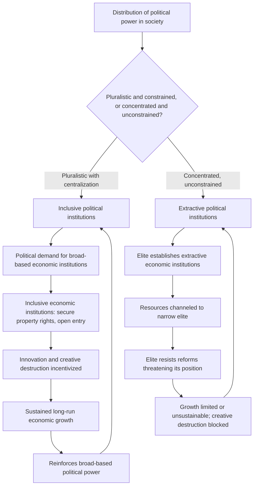

## Acemoglu and Robinson on Extractive Versus Inclusive Institutions

### Overview

Daron Acemoglu and James Robinson's extractive-versus-inclusive institutions framework represents the most influential contemporary synthesis in the political economy of development, integrating economic and political institutional analysis into a unified explanation for long-run divergence in national prosperity. Developed across a substantial body of academic work from the early 2000s onward and popularized in their 2012 book *Why Nations Fail: The Origins of Power, Prosperity, and Poverty*, the framework earned Acemoglu, Robinson, and their frequent collaborator Simon Johnson the 2024 Nobel Memorial Prize in Economic Sciences. The framework builds directly on Douglass North's institutional economics but places distinctly greater emphasis on the **political** determinants of institutional choice — specifically, the distribution of political power and its self-reinforcing relationship with economic institutions.

### Core Conceptual Framework

#### Defining Inclusive and Extractive Institutions

**Key Points**

- **Inclusive economic institutions** are characterized by secure and broadly distributed property rights, an even playing field allowing broad segments of the population to participate in economic activity according to their own choices, and institutional support for new firm entry, innovation, and the free flow of factors of production (labor and capital) to their most productive uses.
- **Extractive economic institutions**, by contrast, are structured to extract resources, labor, and output from the broader population for the benefit of a narrow ruling elite, typically involving insecure or selectively enforced property rights (protecting the elite while leaving the general population vulnerable to expropriation), barriers to entry protecting incumbent elite interests, and labor coercion mechanisms (historical examples include slavery, serfdom, and forced labor systems).
- The framework's central innovation over purely economic institutional analysis (such as North's earlier, more market-focused framework) is its explicit **political economy** dimension: Acemoglu and Robinson argue that economic institutions cannot be understood or explained independently of the **political institutions** that determine who holds power and how that power can be exercised, since political institutions determine which economic institutions a society's elites choose to establish and maintain.
- **Inclusive political institutions** involve pluralistic distribution of political power (broad-based political participation, meaningful constraints on how those in power can exercise it) combined with sufficient political centralization to enforce law and order — both conditions are necessary, since pluralism without centralization risks chaos, and centralization without pluralism risks the concentration of power in a narrow elite.
- **Extractive political institutions** involve political power concentrated in the hands of a narrow elite, without effective constraints on how that power can be used, enabling the elite to establish and maintain the extractive economic institutions serving their interests.

### The Synergy Between Political and Economic Institutions

**Key Points**

- A central theoretical claim of the framework is that political and economic institutions exhibit a mutually reinforcing "**synergy**": inclusive political institutions tend to support and sustain inclusive economic institutions (since a pluralistic political system with broad participation creates political demand for broadly beneficial, rather than narrowly extractive, economic arrangements), while extractive political institutions tend to generate and perpetuate extractive economic institutions (since a narrow ruling elite has strong incentives to establish economic institutions that channel resources toward itself).
- This synergy creates a powerful **self-reinforcing dynamic** in both directions: societies with inclusive institutions tend to see those institutions strengthen and persist over time (a "virtuous circle"), while societies with extractive institutions tend to see those institutions become further entrenched (a "vicious circle"), since extractive elites actively resist reforms that would erode their political and economic advantages.
- This framework directly connects to the field's earlier institutions-and-growth work: it provides an explicit political mechanism explaining why extractive institutions, once established (for instance, through the colonial-era institutional choices examined in Acemoglu, Johnson, and Robinson's earlier colonial-origins research), tend to persist across long historical periods rather than naturally evolving toward more efficient, inclusive arrangements — an outcome that a purely efficiency-based or apolitical institutional analysis would struggle to explain.

### Diagram: The Political-Economic Institutional Synergy

### Creative Destruction and Elite Resistance

**Key Points**

- A distinctive and influential element of the framework is its emphasis on why extractive institutions specifically block **sustained** (as opposed to short-term) economic growth: sustained growth generally requires ongoing technological and organizational innovation, which inherently involves Schumpeterian "creative destruction" — the disruption and displacement of existing economic arrangements, including those benefiting the current elite.
- Acemoglu and Robinson argue that political elites under extractive institutions have a rational incentive to **resist** creative destruction, even when it would generate substantial aggregate economic benefits, because such disruption threatens to undermine the specific economic and political advantages the existing elite currently enjoys — a form of resistance to change rooted not in ignorance or irrationality but in the elite's correctly perceived self-interest in preserving the extractive status quo.
- This mechanism explains the framework's key distinction between **extractive growth** (growth that can occur even under extractive institutions, typically through directing resources toward specific high-value activities the elite controls, such as natural resource extraction, or through authoritarian modernization drives) and **sustained, innovation-driven growth** (which the framework argues generally requires inclusive institutions, since it depends on the kind of decentralized, unpredictable creative destruction that threatens established elite interests) — providing a theoretical basis for expecting extractive-institution growth episodes to be more likely to stagnate or reverse over the long run.

### Critical Junctures and Institutional Drift

- The framework incorporates a historical mechanism for institutional change through the concept of **critical junctures**: major historical shocks or turning points (wars, revolutions, colonization, major economic crises, pandemics) that disrupt the existing political and economic equilibrium and create opportunities for institutional trajectories to shift, either toward greater inclusiveness or toward further entrenchment of extractive arrangements, depending on the specific balance of political forces present at that juncture.
- The framework argues that small differences in institutional arrangements existing *before* a critical juncture (a concept termed "**institutional drift**") can have outsized consequences for which institutional trajectory a society follows after the juncture, since these small pre-existing differences shape which groups are positioned to gain political advantage from the disruption — this provides a mechanism connecting historically contingent, seemingly minor institutional variations to substantially divergent long-run development outcomes, echoing themes present in the earlier colonial-origins and reversal-of-fortune research.

### Empirical Illustrations from *Why Nations Fail*

- **North and South Korea**: frequently cited as a natural experiment in institutional divergence, since the two Korean states shared essentially identical geography, culture, and pre-division history, yet adopted starkly different institutional trajectories after 1948 (South Korea developing progressively more inclusive economic institutions supporting its rapid industrialization, North Korea maintaining highly extractive and centrally controlled economic and political institutions), with dramatically divergent long-run economic outcomes.
- **Botswana versus other Sub-Saharan African economies**: Botswana is presented as a notable case of relatively successful post-colonial institutional development in Sub-Saharan Africa, attributed partly to pre-colonial Tswana political institutions that already incorporated elements of constrained chiefly authority and broad consultation, which interacted favorably with relatively limited direct colonial disruption to produce comparatively inclusive post-independence political institutions — contrasted with numerous other African cases where colonial and post-colonial institutional trajectories reinforced more extractive arrangements.
- **The Glorious Revolution (England, 1688)**: presented as a pivotal critical juncture in the framework's historical narrative, in which the political settlement constraining the English monarchy's power (strengthening Parliament's role and property rights protections against arbitrary royal expropriation) is argued to have laid the institutional foundation for England's subsequent leading role in the Industrial Revolution, by creating a political environment more supportive of secure property rights and the toleration of disruptive economic innovation.

### Critiques and Debates

**Key Points**

- **Determinism and the "just-so story" critique**: some economic historians and political scientists (this critique has been articulated by, among others, economic historians reviewing *Why Nations Fail*) have argued that the framework's historical case studies risk functioning as retrospective, curve-fitting narratives — selecting historical evidence that supports the predetermined inclusive/extractive institutional narrative, rather than being derived from a fully independent and rigorously falsifiable historical analysis. Acemoglu and Robinson's defenders respond that the framework generates testable predictions (as in the earlier colonial-origins econometric work) that go beyond narrative case-study illustration.
- **Underspecification of the transition mechanism**: critics have noted the framework is considerably better developed at explaining institutional *persistence* (why extractive or inclusive institutions, once established, tend to reinforce themselves) than at precisely specifying *when and why* critical junctures produce a shift toward more inclusive institutions rather than simply replacing one extractive elite with another — a concern given that many historical revolutions and major political upheavals have resulted in new extractive arrangements rather than durable movement toward inclusiveness.
- **Relationship to the geography hypothesis**: as with the earlier colonial-origins work, Jeffrey Sachs and other geography-focused economists have maintained that the framework understates the independent causal role of geographic and ecological factors, arguing institutions and geography interact in ways not fully captured by treating institutions as the dominant "fundamental cause."
- **China as a complicating case**: China's substantial and sustained economic growth since 1978, achieved under a political system generally classified as authoritarian and exhibiting many features the framework would characterize as extractive political institutions (concentrated political power without meaningful electoral constraint), presents an ongoing interpretive challenge for the framework. [Inference] Acemoglu and Robinson have addressed this by arguing China's growth, while substantial, may prove difficult to sustain over the very long run without further political institutional evolution toward greater inclusiveness, particularly as the economy approaches the technological frontier and requires more decentralized, innovation-driven (rather than catch-up, factor-accumulation-driven) growth — but this remains a forward-looking claim rather than a settled empirical finding, and whether China's trajectory ultimately supports or challenges the framework's core predictions remains genuinely unresolved and actively debated among China-focused political economists.

### Comparative Summary: Extractive vs. Inclusive Institutional Features

| Dimension | Extractive Institutions | Inclusive Institutions |
| --- | --- | --- |
| Political power distribution | Concentrated in narrow elite | Pluralistic, broadly distributed |
| Constraints on power | Weak or absent | Strong constitutional/legal constraints |
| Property rights | Selective, protecting elite only | Secure and broadly enforced |
| Market entry | Barriers protecting incumbents | Open, broad-based participation |
| Innovation/creative destruction | Actively resisted by elite | Incentivized and tolerated |
| Growth pattern | Possible but typically unsustainable | Associated with sustained long-run growth |
| Self-reinforcement | Vicious circle of entrenchment | Virtuous circle of persistence |

### Related Topics

- North's institutional economics framework (theoretical foundation this work builds upon)
- The colonial origins hypothesis and reversal of fortune (Acemoglu, Johnson, Robinson's earlier empirical work)
- Institutions and long-run growth (broader empirical literature this framework contributes to)
- Critical junctures and path dependence in comparative political economy
- Schumpeterian creative destruction and endogenous growth theory
- The China growth model and its interpretation within institutional frameworks
- Sachs's geography hypothesis as a competing explanatory framework
- Limited access orders and open access orders (North, Wallis, and Weingast)