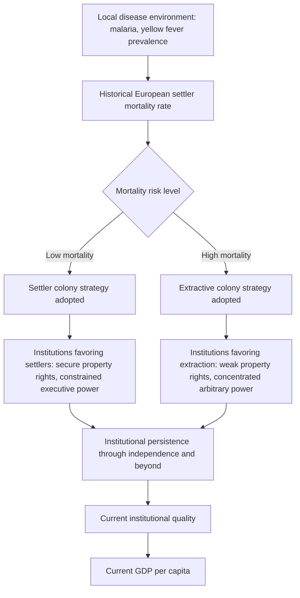

## Colonial Origins of Comparative Development

### Overview

"The Colonial Origins of Comparative Development: An Empirical Investigation," published by Daron Acemoglu, Simon Johnson, and James Robinson in the *American Economic Review* in 2001, is among the most cited and influential papers in modern development economics. The paper proposed a novel empirical strategy for establishing a **causal** relationship between institutions and long-run economic development, using historical variation in European colonial settlement patterns as a source of exogenous variation in institutional quality. This chapter provides a detailed technical treatment of the paper's argument, empirical strategy, findings, and the substantial subsequent debate it generated.

### The Central Research Problem

**Key Points**

- Prior to this paper, empirical work correlating institutional quality with economic development faced a fundamental identification problem: institutional quality and income are jointly determined, meaning simple cross-country correlations cannot distinguish whether good institutions cause high income, high income enables the development of good institutions (reverse causality), or some third, unobserved factor drives both.
- The paper's core contribution was identifying a plausible **instrumental variable** — a variable correlated with current institutional quality but argued to be uncorrelated with current income except through its effect on institutions — allowing the authors to isolate the causal component of the institutions-income relationship.

### The Theoretical Argument: Settler Mortality and Colonization Strategy

#### The Causal Chain

**Key Points**

- European colonizing powers, when establishing colonies from the 15th through 19th centuries, faced sharply varying disease environments across different potential colonial territories, primarily driven by the prevalence of malaria and yellow fever, to which many European colonizers had little acquired immunity.
- In regions with **low settler mortality** (climates and disease environments similar to Europe, or where indigenous disease burden was more manageable for European physiology), colonizing powers established **settler colonies**: colonial administrations designed to support large-scale permanent European settlement, exemplified by North America, Australia, New Zealand, and parts of southern South America.
- In regions with **high settler mortality** (particularly tropical regions with high malaria and yellow fever prevalence, such as much of West Africa, and parts of South and Southeast Asia and Central America), colonizing powers instead established **extractive colonies**: colonial administrations designed to extract resources, labor, and tax revenue as efficiently as possible with minimal permanent European settlement, since high mortality risk discouraged colonizers from intending to reside there long-term.
- The type of colonial institution established — settler-oriented (emphasizing property rights protection and constraints on arbitrary power, since colonizers intended to live under these institutions themselves) versus extraction-oriented (emphasizing efficient resource extraction with limited concern for long-run institutional quality, since colonizers had no intention of permanent settlement) — is argued to exhibit strong **historical persistence**, substantially shaping the institutional environment inherited by post-colonial states after independence.

#### Diagram: The Colonial Origins Causal Mechanism

### The Empirical Strategy

#### Data Construction

- The authors constructed a historical settler mortality dataset drawing primarily from records of European soldiers, bishops, and sailors stationed in various colonial territories during the 17th through 19th centuries, using mortality rates from these populations as a proxy for the disease environment that would have confronted potential European settlers.
- Current institutional quality was measured using an index of "protection against expropriation risk" drawn from the International Country Risk Guide (ICRG), a commercially produced political risk rating service, chosen for providing relatively comparable institutional quality ratings across a broad cross-section of countries with a reasonably long time series.
- Current income was measured as log GDP per capita (purchasing-power-parity-adjusted), drawn from standard international national accounts sources.

#### The Two-Stage Least Squares Specification

The core econometric approach uses two-stage least squares (2SLS):

**First stage:**

$$\text{Institutional Quality}_i = \pi_0 + \pi_1 \ln(\text{Settler Mortality}_i) + \pi_2' Z_i + u_i$$

**Second stage:**

$$\ln(\text{GDP per capita}_i) = \beta_0 + \beta_1 \widehat{\text{Institutional Quality}}_i + \beta_2' Z_i + \varepsilon_i$$

**Explanation of terms**

- The first stage estimates the relationship between historical settler mortality and current institutional quality, testing whether the instrument has sufficient explanatory power (a "strong instrument" concern addressed via the first-stage F-statistic).
- $\widehat{\text{Institutional Quality}}_i$ represents the *predicted* value of institutional quality from the first-stage regression, used in place of the potentially endogenous actual institutional quality measure in the second stage.
- $Z_i$ represents any additional exogenous control variables included in both stages (such as geographic controls, in various robustness specifications).
- The **exclusion restriction** — the critical identifying assumption — is that historical settler mortality affects current GDP per capita *only* through its effect on institutional quality, and has no other direct channel of influence on current income.

### Key Empirical Findings

**Key Points**

- The first-stage regression found a strong, statistically significant negative relationship between historical settler mortality and current institutional quality: higher historical settler mortality is associated with weaker current institutional protection against expropriation risk, consistent with the theorized colonization-strategy mechanism.
- The second-stage (instrumented) estimate of institutions' effect on income was found to be large and highly statistically significant, and notably **larger** in magnitude than the simple OLS (non-instrumented) correlation between institutional quality and income — the authors interpreted this pattern as consistent with OLS estimates being biased *downward* by measurement error in institutional quality indices (attenuation bias), rather than upward by reverse causality, since instrumenting typically corrects for such attenuation.
- The estimated relationship implied that institutional differences could account for a very substantial share of observed cross-country income variation, providing quantitative support for the broader claim that institutions represent a "fundamental" (rather than merely correlated or proximate) cause of long-run economic development.
- The results were found to be robust to the inclusion of a range of geographic controls (latitude, climate zone dummies, being landlocked), a specific test designed to address the competing geography-hypothesis explanation for the observed institutions-income relationship.

### Robustness Checks and Alternative Specifications

- The authors tested robustness to excluding specific colonizing powers (concerned that particular colonial administrations, such as Spain's, might exhibit distinctive patterns not representative of the general mechanism), excluding specific geographic regions (to address concerns that the relationship was driven entirely by, for instance, the African continent), and using alternative institutional quality measures beyond the primary ICRG expropriation-risk index.
- The paper also examined the **direct historical link** between settler mortality and early colonial institutions (using historical measures of constraints on the executive in the colonial period itself, drawn from the Polity project's historical coding), providing more direct evidence for the specific causal chain (mortality → colonial institutional choice → persistence → current institutions) rather than relying solely on the reduced-form mortality-to-current-income relationship.

### The Reversal of Fortune: A Complementary Finding

A closely related follow-up paper by the same authors, "Reversal of Fortune: Geography and Institutions in the Making of the Modern World Income Distribution" (2002), provided a striking complementary empirical finding.

**Key Points**

- Using historical population density and urbanization estimates as proxies for pre-colonial prosperity, the authors found that territories that were **relatively prosperous and densely populated before European colonization** frequently became **relatively poorer** after colonization than territories that were sparsely populated and less developed pre-colonization — a "reversal of fortune" in relative income rankings.
- The proposed explanation integrates directly with the settler mortality mechanism: densely populated, relatively prosperous pre-colonial societies were generally more attractive targets for establishing extractive colonial institutions (an existing population base and productive economic structure to extract from, often via appropriating and intensifying existing indigenous extractive arrangements), while sparsely populated territories were more likely to become settler colonies with more inclusive institutions, since there was no existing dense population or economic structure to extract from and colonizers instead built new societies from a more limited base.
- This reversal-of-fortune pattern is presented as evidence specifically favoring the **institutions-based** explanation for long-run development over a purely **geography-based** explanation, since a pure geography hypothesis would predict persistent (not reversed) relative prosperity rankings tied to time-invariant geographic characteristics.

### Major Critiques

#### The Albouy Data Critique

**Key Points**

- David Albouy's (2012) reanalysis of the original settler mortality dataset raised substantial concerns regarding data quality and construction: Albouy argued that a considerable portion of the historical mortality data was drawn from selective and non-representative sources — often military garrison and campaign mortality data (reflecting conditions of active warfare and poor field sanitation) rather than data more representative of the conditions actual civilian settlers would have faced — and that mortality rates had been applied inconsistently or extrapolated across countries lacking direct data using questionable matching procedures.
- Albouy's reanalysis, using a revised and more restricted dataset addressing these data quality concerns, found the core instrumental variable results to be considerably less robust than originally reported, though he did not claim to fully overturn the institutions-matter conclusion — rather, his critique primarily concerned the statistical robustness and precision of the specific settler-mortality instrumental variable estimates.
- Acemoglu, Johnson, and Robinson published a response defending their original data construction and results, and the resulting exchange has been treated by the broader development economics field as illustrating both the genuine value and the significant practical difficulty of constructing historically-grounded instrumental variables from imperfect archival data.

#### The Exclusion Restriction Debate

- Critics have questioned whether the exclusion restriction genuinely holds — whether historical settler mortality affects current income *solely* through institutions, or whether it might also proxy for other persistent factors (the direct effects of disease burden on human capital formation and health outcomes, for instance, or other correlated geographic and ecological characteristics) that could independently affect current development outcomes through channels other than institutions.
- [Unverified] Because the exclusion restriction is fundamentally a theoretical assumption rather than something directly testable within the paper's own data, reasonable disagreement about its validity persists in the literature, and different researchers weighing the same evidence have reached different conclusions about how much confidence the instrumental variable strategy warrants regarding a purely institutional (rather than partly health- or geography-mediated) causal channel.

#### The Persistence of Geography Hypothesis Debate

- Jeffrey Sachs and collaborators have maintained across a series of responses that geographic and ecological factors (tropical disease burden's direct effects, agricultural productivity constraints, transportation costs related to being landlocked or having limited coastal access) exert an economically significant and at least partially independent effect on development that is not fully mediated through institutions, generating an extended and still not fully resolved academic exchange between the "institutions primacy" and "geography primacy" camps within development economics.

### Legacy and Influence

**Conclusion**

Despite the substantial methodological critiques it has generated, "The Colonial Origins of Comparative Development" remains one of the most influential papers in the modern development economics canon, both for its substantive institutions-focused findings and, arguably more importantly, for demonstrating a viable empirical strategy for addressing endogeneity concerns in institutions-and-growth research using historically grounded instrumental variables. The paper substantially shaped the subsequent two decades of empirical development economics research, contributed directly to Acemoglu, Johnson, and Robinson's 2024 Nobel Memorial Prize, and continues to serve as the primary reference point (whether cited approvingly or critically) for discussions of the causal relationship between institutions and long-run economic development.

### Related Topics

- Acemoglu and Robinson on extractive versus inclusive institutions (the broader theoretical framework this empirical paper supports)
- North's institutional economics framework (theoretical foundation)
- Institutions and long-run growth (broader empirical literature context)
- The reversal of fortune and pre-colonial population density evidence
- Sachs's geography hypothesis as the primary competing explanation
- Albouy's data critique and the settler mortality instrument debate
- Cross-country growth regressions methodology (instrumental variable techniques)
- International Country Risk Guide (ICRG) and institutional quality measurement