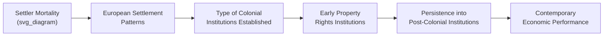
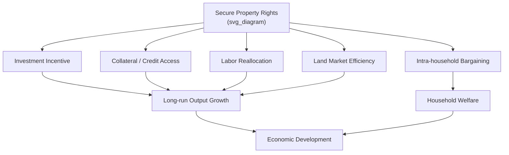
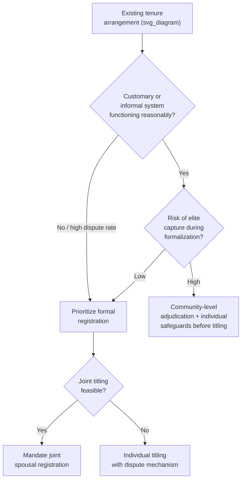

## Property Rights and Economic Development

### Definition and Core Concepts

Property rights are the socially and legally recognized rights to use, control, derive income from, and transfer an asset. In development economics, they are typically analyzed along several dimensions:

- **Use rights**: the ability to employ an asset (land, capital, intellectual output) for production or consumption
- **Transfer rights**: the ability to sell, lease, bequeath, or otherwise alienate the asset
- **Exclusion rights**: the ability to prevent others from using the asset without consent
- **Income rights**: the ability to capture the returns generated by the asset

Property rights exist on a spectrum from **de jure** (legally codified and formally recognized by the state) to **de facto** (actually enforced and respected in practice, whether or not formally codified). A central finding in the institutional economics literature is that de facto security often matters more for investment behavior than de jure title, particularly in settings with weak formal enforcement.

**Key Points**

- Property rights are not binary (present/absent) but exist as a bundle of separable rights that can be held by different parties simultaneously
- Security of tenure (the probability that rights will be respected and enforced over time) is analytically distinct from the *allocation* of rights (who holds them)
- Property rights institutions are usually classified as a subset of "economic institutions" in the sense of Acemoglu, Johnson, and Robinson (2001, 2005), distinguished from "political institutions" that determine who holds power

### Theoretical Foundations

#### The Coase Theorem and Its Limits

Coase (1960) argued that, absent transaction costs, the initial allocation of property rights does not affect the efficiency of the eventual resource allocation, because parties will bargain to the efficient outcome regardless of who holds the right. Formally, if two parties can bargain costlessly over externality $E$, the efficient outcome $E^*$ is reached independent of the initial rights assignment $R_0$.

$$E^* = \arg\max_{E} \left[ B(E) - C(E) \right]$$

where $B(E)$ is the benefit to the rights-holder and $C(E)$ is the cost imposed on the other party. In development contexts, transaction costs (information asymmetries, weak courts, high litigation costs, corruption) are typically large and heterogeneous across income groups, so the Coasean irrelevance result breaks down—the initial allocation of rights becomes a first-order determinant of outcomes.

#### Property Rights as Investment Incentive

The canonical mechanism linking property rights to development runs through investment. A landholder who is not secure in tenure discounts the future returns to investment by the probability of expropriation or dispossession. A simplified two-period model:

$$V = -I + \frac{\pi \cdot R(I)}{1+r}$$

where $I$ is investment, $R(I)$ is the return to investment (with $R'(I) > 0$, $R''(I) < 0$), $r$ is the discount rate, and $\pi \in [0,1]$ is the probability of retaining control of the asset in period 2 (tenure security). As $\pi \to 0$, the marginal return to investment collapses and $I \to 0$ regardless of the technical productivity of $R(\cdot)$. This underpins the empirical prediction that insecure tenure suppresses investment in land improvements, irrigation, tree planting, and soil conservation.

#### Property Rights and Collateralizable Wealth (De Soto Hypothesis)

Hernando de Soto's *The Mystery of Capital* (2000) argues that the primary barrier to capital formation among the poor in developing countries is not lack of assets but lack of formal, transferable title, which prevents assets from being used as **collateral** in credit markets. Informal or extralegal assets are "dead capital"—economically inert because they cannot be leveraged.

$$\text{Credit Access} = f(\text{Collateral Value} \times \text{Legal Enforceability})$$

This hypothesis motivated a wave of titling programs in the 1990s–2000s, though subsequent empirical work (see below) found the credit-access channel to be weaker than the de Soto framework predicted, while investment and land-value channels were more robust.

### Institutions, Property Rights, and Long-Run Growth

#### The AJR Framework

Acemoglu, Johnson, and Robinson (AJR, 2001, "The Colonial Origins of Comparative Development") propose a causal chain:

Their identification strategy uses historical settler mortality as an instrument for institutional quality, on the argument that Europeans established "extractive states" (concentrated power, weak property rights protection for the general population) where disease environments discouraged settlement, and "settler colonies" (inclusive institutions, broad property rights protection) where they could settle in large numbers. This is one of the most cited (and most contested) instrumental variables designs in development economics.

**Key Points**

- AJR's measure of institutional quality is "protection against expropriation risk," a de facto security-of-property index from Political Risk Services
- The reduced-form finding: countries with institutions protecting property rights broadly have GDP per capita several multiples higher than those without, controlling for geography and other covariates
- [Unverified] The exact magnitude of the settler-mortality-to-institutions channel is contested; subsequent work (Albouy 2012) raised measurement concerns about the mortality data underlying the original instrument, and the debate remains unresolved in the literature

#### Property Rights vs. Contracting Institutions (Acemoglu and Johnson, 2005)

Acemoglu and Johnson (2005) decompose institutions into two categories and test their differential effects:

| Institution Type | Definition | Empirical Effect on Growth/Investment |
| --- | --- | --- |
| Property rights institutions | Constraints on government/elite expropriation of citizens | Strong, robust effect on long-run GDP per capita, investment, and financial development |
| Contracting institutions | Rules governing private contract enforcement between citizens | Affects the form of financial intermediation but weaker/insignificant effect on aggregate growth |

Their conclusion is that protection from the *state* (and powerful private actors) matters more for aggregate development than the formal machinery of private contract enforcement—reinforcing a "political economy first" reading of the institutions literature.

#### North's Framework: Institutions as the Rules of the Game

Douglass North (1990) frames institutions, including property rights, as the humanly devised constraints structuring political, economic, and social interaction. He emphasizes:

- **Transaction cost reduction**: well-defined property rights lower the costs of measuring, monitoring, and enforcing exchange
- **Path dependence**: institutional arrangements, once established, persist due to increasing returns and self-reinforcing political coalitions
- **Adaptive vs. allocative efficiency**: institutions matter not only for static resource allocation but for a society's long-run capacity to adapt to new opportunities and shocks

### Mechanisms Linking Property Rights to Development Outcomes

#### 1. Investment Channel

Secure tenure raises the expected return to durable investments (irrigation, terracing, tree crops, building construction) by reducing the probability of expropriation or costly disputes.

#### 2. Credit/Collateral Channel

Formal, transferable title can (in principle) be pledged as collateral, relaxing credit constraints—though empirical support is mixed (see Field 2007; Galiani and Schargrodsky 2010 below).

#### 3. Labor Allocation Channel

Insecure land rights can tie labor to land as a means of asserting/defending claims (occupancy as proof of tenure), reducing labor mobility into higher-return non-agricultural activities. Field (2007) documents this "squatting effect" in Peru.

#### 4. Land Market Efficiency Channel

Clear title reduces transaction costs in land sales and rentals, enabling reallocation of land toward more productive users (a Coasean efficiency gain conditional on functioning markets).

#### 5. Female Bargaining Power / Intra-household Channel

Individual (versus joint or male-only) titling has been shown to affect intra-household bargaining, female labor supply, and children's welfare outcomes in several contexts.

#### 6. Political Economy / Elite Capture Channel

Where property rights protection is selective (protecting elites while leaving the majority exposed to expropriation), the aggregate growth benefits of "institutions" fail to materialize even as elite investment thrives—this is the core AJR/North critique of narrowly defined property rights.

### Empirical Evidence: Land Titling Studies

#### Peru: Urban Titling (Field, 2007)

Erica Field's study of Peru's urban land titling program (PETT/COFOPRI) found that formal titling significantly increased labor supply—particularly among households previously required to keep a member at home to guard the property against squatters. This is widely cited as clean evidence for the labor-allocation channel operating independently of the credit channel, since Peru's credit markets did not respond much to the new titles in the short run.

#### Argentina: Squatter Settlements (Galiani and Schargrodsky, 2010, 2011)

Galiani and Schargrodsky exploit a natural experiment from a land expropriation in Buenos Aires where some squatter families received titles and others (due to owners' litigation) did not, despite similar initial conditions. Findings:

- Titled households showed significantly greater housing investment
- Titling reduced household size (via reduced need for extended family for security) and increased educational attainment of children
- **Notably**, access to credit markets did **not** increase substantially—undercutting the strong version of the de Soto collateral hypothesis while supporting the investment-security channel

#### Ghana and Sub-Saharan Africa (Goldstein and Udry, 2008)

Goldstein and Udry study customary land tenure in Ghana, showing that individuals with greater political power/office within the local land governance hierarchy have more secure tenure, invest more in fallowing, and achieve higher yields—demonstrating that "security" is often endogenous to *political* position even under customary (non-titled) systems, not purely a function of formal legal status.

#### Rwanda: National Land Tenure Regularization (Ali, Deininger, and Goldstein, 2014)

Rwanda's nationwide, low-cost land demarcation and registration program showed increased investment in soil conservation and a notable narrowing of the gender gap in investment incentives, since the program required documentation of both spouses' claims—an example of titling design mechanics mattering as much as titling per se.

**Key Points**

- The land-titling empirical literature broadly supports the **investment security** and **labor reallocation** channels
- The **credit/collateral** channel is more fragile empirically than the original de Soto hypothesis suggested; formal title alone is often insufficient without complementary financial-sector development
- Design details (individual vs. joint titling, cost of registration, complementary services) substantially affect outcomes—titling is not a homogeneous treatment across studies

### Property Rights Beyond Land: Broader Applications

#### Intellectual Property and Technology Transfer

Weak IP enforcement is theorized to reduce incentives for domestic innovation but may also lower prices for technology diffusion (e.g., generic pharmaceuticals) in the short run—a genuine efficiency-equity trade-off actively debated in development and trade economics. [Inference] The net welfare effect is highly context- and sector-specific and does not admit a general theoretical resolution independent of local market structure and enforcement capacity.

#### Firm Formalization and Business Property Rights

Secure rights over business assets and formal firm registration affect a firm's access to formal credit, its incentive to grow beyond a scale that attracts state predation ("staying small to stay hidden"), and its ability to enter formal supply chains (de Soto's "extralegal sector" framework applied to firms rather than just households).

#### Common-Pool Resources

Elinor Ostrom's work (Governing the Commons, 1990) demonstrated that community-based, self-governed property regimes for common-pool resources (fisheries, forests, irrigation systems) can sustain resource use efficiently without either full privatization or centralized state control, challenging the presumption that only private or state property regimes avoid the "tragedy of the commons." Ostrom identified design principles (clearly defined boundaries, congruence between rules and local conditions, collective-choice arrangements, monitoring, graduated sanctions, conflict-resolution mechanisms) associated with durable, effective commons governance.

#### Water Rights

Water rights present distinct challenges due to the resource's mobility and rivalrous-but-fluctuating nature; prior appropriation, riparian, and permit-based systems each embody different property rights logics with distinct efficiency and equity implications for irrigation-dependent agricultural development.

### Measurement of Property Rights Institutions

| Measure/Index | Source | Captures |
| --- | --- | --- |
| Protection Against Expropriation Risk | Political Risk Services (PRS) / ICRG | De facto risk of government seizure of private assets |
| Rule of Law Index | World Bank Worldwide Governance Indicators | Confidence in and abidance by rules, contract enforcement, property rights, courts |
| Registering Property indicators | World Bank Doing Business (discontinued 2021; successor: Business Ready/B-READY) | Procedures, time, cost to register property transfers |
| Economic Freedom of the World, Property Rights component | Fraser Institute | Judicial independence, legal enforcement of contracts, integrity of the legal system |
| Land tenure security surveys | LSMS, national household surveys | Self-reported perceived security, documentation status |

[Unverified] Cross-country institutional indices are subject to well-documented measurement error and potential reverse causality (richer countries may better afford institutional quality measurement and enforcement), a standing methodological concern raised by Glaeser et al. (2004) regarding the AJR-style institutions literature broadly.

### Endogeneity and Identification Challenges

A persistent methodological difficulty in this literature is that property rights institutions are not randomly assigned—wealthier, more developed regions may simply be better able to afford strong legal institutions (reverse causality), and omitted geographic, cultural, or historical factors may drive both institutional quality and development outcomes (confounding). Common identification strategies include:

- **Historical instruments**: settler mortality (AJR 2001), historical population density (Acemoglu, Johnson, Robinson 2002), colonial legal origin (La Porta et al.)
- **Natural experiments**: discontinuities in program rollout, litigation-driven title variation (Galiani and Schargrodsky)
- **Randomized titling interventions**: phased-in titling programs allow difference-in-differences or randomized-encouragement designs

**Key Points**

- Legal origin theory (La Porta, Lopez-de-Silanes, Shleifer, Vishny, 1998) argues that common-law systems provide stronger investor/property protections than civil-law systems, though this claim has faced substantial methodological criticism and remains debated
- [Speculation] Some scholars argue institutional persistence itself may be better explained by continuity of human capital or culture rather than the formal legal/political institutions per se (an ongoing "institutions vs. culture vs. human capital" debate in growth economics)

### Policy Design Considerations

**Example**

A typical land titling reform design decision tree faced by policymakers:

Design parameters that materially affect outcomes:

- **Cost and complexity of registration**: high transaction costs in the formalization process itself can replicate the exclusion problem that titling is meant to solve
- **Sequencing with credit market development**: titling without complementary financial sector reform yields weaker credit-access gains
- **Gender-inclusive design**: joint titling requirements have been shown to improve intra-household equity outcomes (Rwanda case)
- **Interaction with customary authorities**: abrupt formalization that bypasses functioning customary systems can create new sources of insecurity and elite capture (Goldstein and Udry finding on political position and tenure)

### Critiques and Open Debates

- **Overreach of the "property rights suffice" narrative**: critics argue that titling programs sometimes proceed as technocratic fixes disconnected from the underlying political economy that produced insecure tenure in the first place
- **Elite capture risk**: formalization processes can be captured by politically connected actors, converting communal or customary land into privately titled elite holdings (documented in various African land-formalization contexts)
- **De Soto hypothesis empirical fragility**: as summarized above, the credit-collateral channel has weaker empirical support than the investment-security channel across multiple RCTs and natural experiments
- **Institutions-are-endogenous critique**: some scholars (e.g., Glaeser, La Porta, Lopez-de-Silanes, Shleifer, 2004) argue that human capital, not institutions per se, is the more fundamental driver of growth, with institutions themselves partly a product of accumulated human capital and political stability

### Property Rights Security Diagram (SVG)

<svg xmlns="http://www.w3.org/2000/svg" viewBox="0 0 720 320" font-family="Helvetica, Arial, sans-serif">
<text x="360" y="28" text-anchor="middle" font-size="18" font-weight="bold" fill="#1a1a1a">Property Rights Security Spectrum (svg_diagram)</text>
<line x1="60" y1="160" x2="660" y2="160" stroke="#333" stroke-width="3" />
<polygon points="660,160 648,153 648,167" fill="#333" />
<circle cx="100" cy="160" r="8" fill="#c0392b" />
<text x="100" y="195" text-anchor="middle" font-size="12" fill="#1a1a1a">No recognized</text>
<text x="100" y="210" text-anchor="middle" font-size="12" fill="#1a1a1a">rights</text>
<text x="100" y="130" text-anchor="middle" font-size="11" fill="#555">Open-access /</text>
<text x="100" y="115" text-anchor="middle" font-size="11" fill="#555">squatting</text>
<circle cx="260" cy="160" r="8" fill="#e67e22" />
<text x="260" y="195" text-anchor="middle" font-size="12" fill="#1a1a1a">De facto</text>
<text x="260" y="210" text-anchor="middle" font-size="12" fill="#1a1a1a">customary</text>
<text x="260" y="130" text-anchor="middle" font-size="11" fill="#555">Community-</text>
<text x="260" y="115" text-anchor="middle" font-size="11" fill="#555">enforced norms</text>
<circle cx="420" cy="160" r="8" fill="#f1c40f" />
<text x="420" y="195" text-anchor="middle" font-size="12" fill="#1a1a1a">Local formal</text>
<text x="420" y="210" text-anchor="middle" font-size="12" fill="#1a1a1a">recognition</text>
<text x="420" y="130" text-anchor="middle" font-size="11" fill="#555">Registered but</text>
<text x="420" y="115" text-anchor="middle" font-size="11" fill="#555">weakly enforced</text>
<circle cx="580" cy="160" r="8" fill="#27ae60" />
<text x="580" y="195" text-anchor="middle" font-size="12" fill="#1a1a1a">Full de jure</text>
<text x="580" y="210" text-anchor="middle" font-size="12" fill="#1a1a1a">title</text>
<text x="580" y="130" text-anchor="middle" font-size="11" fill="#555">State-backed,</text>
<text x="580" y="115" text-anchor="middle" font-size="11" fill="#555">court-enforceable</text>

<text x="360" y="260" text-anchor="middle" font-size="13" fill="`#1a1a1a`" font-weight="bold">Increasing investment incentive, credit eligibility, and market liquidity →</text>

<text x="360" y="285" text-anchor="middle" font-size="11" fill="#777">Security is a continuum; de facto enforcement can exceed de jure status and vice versa</text>

</svg>

### Country Comparison Snapshot

**Example**

| Country/Program | Mechanism Studied | Primary Channel Confirmed | Credit Channel Confirmed? |
| --- | --- | --- | --- |
| Peru (urban titling) | PETT/COFOPRI formalization | Labor supply reallocation | Weak/no |
| Argentina (squatter settlements) | Litigation-driven title variation | Investment, household composition | No |
| Ghana (customary tenure) | Political position within land governance | Investment tied to political security, not legal title | N/A |
| Rwanda (national regularization) | Systematic low-cost demarcation | Investment, gender equity in claims | Limited |

### Related Topics

- Institutional persistence and the colonial origins hypothesis (Acemoglu, Johnson, Robinson)
- Rule of law, judicial independence, and contract enforcement institutions
- Land reform and redistribution (as distinct from titling/formalization)
- Elite capture and political economy of resource allocation
- Common-pool resource governance (Ostrom's design principles)
- Financial development and credit market frictions in developing economies
- Firm formalization, informality, and the "missing middle" in enterprise development
- Legal origins theory (La Porta et al.) and comparative law and finance
- Gender and land rights: intra-household bargaining models
- Extractive vs. inclusive institutions (Acemoglu and Robinson, *Why Nations Fail*)
- Randomized controlled trials in land tenure policy evaluation