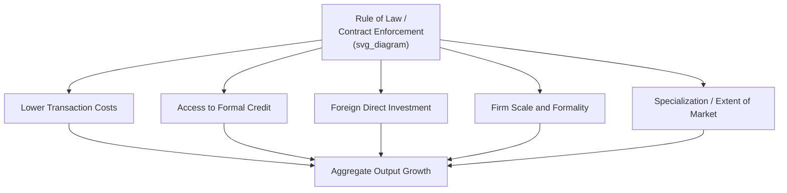

## Rule of Law and Contract Enforcement

### Definition and Core Concepts

**Rule of law** refers to the principle that all actors—including the state itself—are bound by publicly known, prospectively applied, and impartially enforced legal rules, as opposed to arbitrary decisions by rulers or powerful actors. In development economics it is typically decomposed into several component dimensions:

- **Constraints on the executive**: the degree to which political leaders and state agents are bound by law rather than acting arbitrarily
- **Judicial independence**: the extent to which courts can adjudicate disputes (including disputes involving the state) without political interference
- **Contract enforcement**: the reliability, cost, and speed with which courts and other mechanisms enforce private agreements between parties
- **Predictability/consistency**: the degree to which similar cases yield similar outcomes over time, enabling economic actors to form stable expectations

**Contract enforcement** is the narrower, transaction-level counterpart: the set of formal (courts, arbitration) and informal (reputation, relational sanctions, community norms) mechanisms that ensure parties honor the terms of an agreement, or compensate the other party when they do not.

**Key Points**

- Rule of law is a *macro-institutional* concept (how power is constrained society-wide); contract enforcement is a *micro-transactional* mechanism (how a specific agreement is honored). Strong rule of law is generally a precondition for reliable formal contract enforcement, but informal enforcement can partially substitute where formal rule of law is weak
- The distinction mirrors Acemoglu and Johnson's (2005) split between "property rights institutions" (constraints on the state) and "contracting institutions" (rules governing private exchange)—see the companion note on Property Rights

### Theoretical Foundations

#### Contract Enforcement as a Transaction Cost Problem

Following Coase (1937) and Williamson (1985), any exchange that is not instantaneous and self-enforcing (i.e., involves a time lag between performance and payment, or requires costly-to-verify quality) creates a **hold-up problem**: once one party has sunk costs or delivered performance, the counterparty has an incentive to renege or renegotiate on more favorable terms. Formally, consider a buyer-seller relationship where the seller must make a relationship-specific investment $I$ before trade:

$$\Pi_{\text{seller}} = \alpha \cdot R(I) - I$$

where $R(I)$ is total surplus generated by the investment and $\alpha \in [0,1]$ is the seller's bargaining share ex post. Without a credible enforcement mechanism to guarantee $\alpha$, sellers rationally anticipate hold-up and set $I < I^*$ (the first-best investment level), a classic underinvestment result. Reliable contract enforcement raises the credibility of $\alpha$, restoring investment incentives.

#### Formal vs. Relational (Informal) Enforcement

Development economists distinguish two broad enforcement technologies:

| Mechanism | Enforcement Basis | Strengths | Weaknesses |
| --- | --- | --- | --- |
| Formal (courts, legal system) | Third-party state adjudication and coercive enforcement | Scales to strangers/anonymous transactions; codifies precedent | Slow, costly, subject to corruption/capture, requires state capacity |
| Relational/informal | Repeated interaction, reputation, social sanctions, ostracism | Fast, low-cost, works absent state capacity | Does not scale beyond networks of repeated interaction; vulnerable to network fragmentation |

Formally, relational contracting is sustainable when the discounted value of future cooperation exceeds the one-shot gain from reneging:

$$\frac{\delta}{1-\delta} \cdot \pi^{\text{coop}} \geq \pi^{\text{deviate}}$$

where $\delta$ is the discount factor and $\pi^{\text{coop}}, \pi^{\text{deviate}}$ are per-period payoffs from cooperating versus reneging. This is the standard folk-theorem logic underlying trust-based trade networks (e.g., diamond merchants, rotating credit associations, ethnic trading networks documented by Greif 1993 for Maghribi traders).

**Key Points**

- Weak formal enforcement does not eliminate exchange; it shifts the economy toward relational contracting, which is typically limited to smaller, more homogeneous, or ethnically/socially connected networks
- This has an efficiency cost: relational enforcement caps the scale and anonymity of feasible trade, constraining market size and specialization gains (a Smithian "extent of the market" limitation)

#### Greif's Comparative Institutional Analysis

Avner Greif's (1993, 2006) comparative work on Maghribi traders (informal, reputation-based multilateral punishment) versus Genoese traders (formal, state-backed contract law) is a foundational reference illustrating two divergent historical enforcement equilibria and their differential capacity to scale into impersonal, large-volume trade.

### Institutional Quality and Growth: The Cross-Country Evidence

#### Knack and Keefer (1995) and Related Indices

Cross-country regressions using rule-of-law and institutional quality indices (International Country Risk Guide, Business Environment Risk Intelligence) consistently find a positive association between measures of contract enforceability/rule of law and investment rates and GDP per capita growth, though these results share the endogeneity concerns discussed under Property Rights (reverse causality, omitted variables).

#### World Bank Doing Business / Enforcing Contracts Indicator

Prior to its 2021 discontinuation, the World Bank's "Doing Business" project maintained an **Enforcing Contracts** indicator measuring the time, cost, and procedural steps required to resolve a standardized commercial dispute through local first-instance courts. Successor data collection continues under the **Business Ready (B-READY)** project. Key stylized facts from this literature:

- Contract enforcement time varies enormously across countries—from a few months in efficient systems to several years in others [Unverified — exact current cross-country figures should be checked against the latest B-READY release, as Doing Business data collection methodology changed with the transition]
- Longer and costlier enforcement is associated with smaller average firm size, less arm's-length trade credit, and greater reliance on relationship-based finance

#### Djankov, La Porta, Lopez-de-Silanes, and Shleifer (2003) — "Courts"

This influential study constructs standardized measures of procedural formalism (the number of legal procedures required to resolve two simple disputes—an eviction and a bounced check—across countries) and finds that:

- Greater procedural formalism is associated with slower, less consistent, and less accessible justice
- Civil-law countries (particularly French-origin civil law) exhibit systematically higher formalism than common-law countries, a finding used to support **legal origins theory** (La Porta, Lopez-de-Silanes, Shleifer, Vishny 1998), which argues legal origin (common law vs. French, German, Scandinavian civil law) causally shapes investor protection and regulatory style through historical transplantation

[Inference] Legal origins theory remains actively contested; critics (e.g., Rodrik, and later empirical work re-examining the "legal origins" instrument) argue that legal origin proxies for a broader bundle of colonial and historical factors rather than isolating a clean causal channel, so the strong causal reading should be treated cautiously.

### Mechanisms Linking Rule of Law to Development Outcomes

#### 1. Financial Development Channel

Reliable contract enforcement underpins debt and equity finance: lenders extend credit more readily when they can seize collateral or compel repayment through courts. La Porta et al. (1997, 1998) link "law and finance"—investor protection strength predicts the depth of external capital markets across countries.

#### 2. Firm Size and Organizational Form Channel

Where courts are unreliable, firms substitute vertical integration for arm's-length contracting (make rather than buy), and rely more heavily on family or ethnic-network-based transacting, both of which cap efficient firm scale (a Coasean "boundary of the firm" argument extended to weak-institution settings).

#### 3. Trade Credit and Input Market Channel

Weak enforcement reduces trade credit extension between firms (since suppliers cannot reliably collect on unpaid invoices), forcing greater reliance on cash transactions and reducing liquidity for working capital.

#### 4. Foreign Direct Investment and International Trade Channel

Multinational firms are especially sensitive to contract enforceability given large sunk costs and limited local reputational capital; rule-of-law indices are robust predictors of bilateral FDI flows in gravity-model estimations.

#### 5. Entrepreneurship and Firm Entry Channel

Djankov et al. (2002, "The Regulation of Entry") show that countries with more burdensome business registration procedures (a related but distinct rule-of-law/regulatory-quality dimension) have larger informal sectors and more corruption, consistent with weak formal institutions pushing activity into unregulated space.

### Empirical Microevidence

#### McMillan and Woodruff (1999) — Vietnam

Studying trade credit among Vietnamese firms in a weak-formal-enforcement environment, McMillan and Woodruff find that firms extend more trade credit to partners with whom they have longer relationships and denser social/business network ties—direct microevidence for the relational-substitutes-for-formal-enforcement mechanism.

#### Johnson, McMillan, and Woodruff (2002) — Post-Communist Economies

Comparing firms across post-Soviet transition economies, this study finds that firms' willingness to make relationship-specific investments correlates with their subjective confidence in courts' ability to enforce contracts, providing cross-country microeconomic evidence linking perceived enforcement quality to the hold-up-driven underinvestment mechanism described above.

#### Chemin (2009, 2012) — India and Pakistan Judicial Reforms

Exploiting variation in judicial efficiency (e.g., differential court backlogs across Indian states, judicial reforms in Pakistan), Chemin finds that faster contract enforcement is associated with more formal (versus informal/relational) contracting, greater firm investment, and improved credit market outcomes—among the clearer quasi-experimental confirmations of the theoretical mechanism.

#### Visaria (2009) — Debt Recovery Tribunals, India

Visaria studies India's Debt Recovery Tribunals (specialized fast-track courts for bank loan recovery) and finds that faster enforcement significantly reduced default rates and lowered borrowing costs, supporting the credit-channel link between enforcement speed and financial market functioning.

**Key Points**

- Microeconomic, quasi-experimental studies (India, Pakistan, Vietnam) generally provide cleaner causal evidence than cross-country macro regressions, and consistently confirm the theoretical prediction that faster/more reliable enforcement raises investment, formal credit access, and arm's-length trade
- The magnitude of these effects is context-dependent [Inference]: gains from judicial reform appear largest where informal substitutes (dense social networks, reputation systems) are weakest, since formal enforcement has the most room to add value in exactly those settings

### Judicial Reform: Design and Implementation

**Example**

Common categories of judicial/contract-enforcement reform interventions studied in the literature:

| Reform Type | Mechanism | Illustrative Study/Context |
| --- | --- | --- |
| Specialized fast-track courts | Reduce case backlog and adjudication time for specific dispute types | Debt Recovery Tribunals, India (Visaria 2009) |
| Procedural simplification | Reduce number of legal steps/formalism required | Djankov et al. cross-country "Courts" study |
| Alternative dispute resolution (ADR) / arbitration | Route disputes outside congested court systems | Widely promoted by World Bank/IFC investment climate programs |
| Judicial independence reforms | Insulate courts from executive/political interference | Constitutional and appointment-process reforms (various contexts) |
| Court information technology / case management systems | Improve tracking, reduce corruption opportunities, cut delay | Various e-courts initiatives in India, Kenya, and elsewhere |
| Legal aid / access-to-justice programs | Lower the cost of accessing courts for smaller/poorer litigants | NGO and government legal-aid programs studied via RCTs |

Design considerations affecting reform impact:

- **Complementarity with legal literacy**: enforcement reforms have muted impact if potential litigants (especially poorer or less-educated ones) do not know their rights or how to access courts
- **Corruption interaction**: procedural reforms can be undermined if judicial corruption persists alongside faster nominal case processing
- **Political economy of judicial independence**: reforms that would meaningfully constrain the executive face resistance from incumbent political actors who benefit from selective/arbitrary enforcement (a core political-economy tension distinguishing "rule of law" reform from purely technical/administrative reform)

### Rule of Law Measurement

| Index/Source | Coverage | Notes |
| --- | --- | --- |
| World Bank Worldwide Governance Indicators (WGI) — Rule of Law | ~200 countries, annual | Composite of multiple underlying data sources; perceptions-based |
| World Justice Project — Rule of Law Index | ~140 countries | Survey-based, disaggregates into 8 sub-factors including constraints on government and civil/criminal justice |
| ICRG (International Country Risk Guide) | Broad country coverage | Long historical time series, used in early cross-country growth regressions (Knack and Keefer 1995) |
| Freedom House, Polity5 | Broad country coverage | Primarily political-institution focused; used as complements/instruments in institutions literature |
| World Bank Enforcing Contracts (Doing Business, discontinued) / B-READY | Country-level, standardized case study methodology | Measures time, cost, procedural steps for a standardized commercial dispute |

[Unverified] All perception-based indices face the standard measurement critique: respondent perceptions may be influenced by contemporaneous economic performance, creating potential reverse-causality bias in cross-country regressions using these indices as right-hand-side variables.

### Rule of Law and Contract Enforcement Pathway (SVG)

<svg xmlns="http://www.w3.org/2000/svg" viewBox="0 0 720 300" font-family="Helvetica, Arial, sans-serif">
<text x="360" y="26" text-anchor="middle" font-size="17" font-weight="bold" fill="#1a1a1a">Enforcement Mechanism Choice by Institutional Strength (svg_diagram)</text>
<rect x="40" y="60" width="180" height="90" rx="8" fill="#fdecea" stroke="#c0392b" stroke-width="2" />
<text x="130" y="90" text-anchor="middle" font-size="13" font-weight="bold" fill="#1a1a1a">Weak Rule of Law</text>
<text x="130" y="112" text-anchor="middle" font-size="11" fill="#333">Relational/informal</text>
<text x="130" y="128" text-anchor="middle" font-size="11" fill="#333">enforcement dominates</text>
<rect x="270" y="60" width="180" height="90" rx="8" fill="#fef9e7" stroke="#f1c40f" stroke-width="2" />
<text x="360" y="90" text-anchor="middle" font-size="13" font-weight="bold" fill="#1a1a1a">Moderate Rule of Law</text>
<text x="360" y="112" text-anchor="middle" font-size="11" fill="#333">Mixed: relational core,</text>
<text x="360" y="128" text-anchor="middle" font-size="11" fill="#333">formal for high-value deals</text>
<rect x="500" y="60" width="180" height="90" rx="8" fill="#eafaf1" stroke="#27ae60" stroke-width="2" />
<text x="590" y="90" text-anchor="middle" font-size="13" font-weight="bold" fill="#1a1a1a">Strong Rule of Law</text>
<text x="590" y="112" text-anchor="middle" font-size="11" fill="#333">Formal courts enable</text>
<text x="590" y="128" text-anchor="middle" font-size="11" fill="#333">anonymous, arm's-length trade</text>
<line x1="220" y1="105" x2="270" y2="105" stroke="#555" stroke-width="2" marker-end="url(#arrow)" />
<line x1="450" y1="105" x2="500" y2="105" stroke="#555" stroke-width="2" marker-end="url(#arrow)" />
<text x="130" y="185" text-anchor="middle" font-size="11" fill="#555">Trade limited to</text>

<text x="130" y="200" text-anchor="middle" font-size="11" fill="#555">social/ethnic networks</text>

<text x="360" y="185" text-anchor="middle" font-size="11" fill="#555">Firm size grows;</text>

<text x="360" y="200" text-anchor="middle" font-size="11" fill="#555">trade credit expands</text>

<text x="590" y="185" text-anchor="middle" font-size="11" fill="#555">Market extent maximized;</text>

<text x="590" y="200" text-anchor="middle" font-size="11" fill="#555">specialization gains realized</text>

<text x="360" y="250" text-anchor="middle" font-size="12" fill="`#1a1a1a`" font-weight="bold">Increasing formal enforcement reliability →</text>

<text x="360" y="270" text-anchor="middle" font-size="10" fill="#777">Economies do not switch discretely; enforcement modes typically coexist and are chosen per-transaction</text>

</svg>

### Interaction with Political Economy

Rule of law is not a purely technical or administrative variable—its presence or absence is itself the outcome of political bargaining. Key linkages to the broader political economy of institutions:

- **Selective enforcement**: incumbent elites may prefer weak, arbitrary enforcement precisely because it allows selective application against political or economic rivals while protecting insiders—consistent with the "extractive institutions" framework (Acemoglu and Robinson)
- **Judicial independence as a credible commitment device**: an independent judiciary constrains the executive's ability to expropriate or discriminate, functioning as part of the broader system of checks and balances central to North, Wallis, and Weingast's (2009) "limited access order" versus "open access order" distinction
- **Colonial legal transplantation**: legal origins theory situates contemporary rule-of-law variation partly in the historical transplantation of common-law versus civil-law systems during colonization, linking this topic directly to the colonial-origins-of-institutions literature (AJR)

### Critiques and Open Debates

- **Reverse causality and measurement**: nearly all cross-country rule-of-law indices are correlated with income itself, complicating causal inference; the cleanest evidence remains micro/quasi-experimental (Chemin, Visaria) rather than cross-country regression-based
- **Formalism is not synonymous with quality**: some legal systems combine low procedural formalism with weak actual enforcement (or vice versa), so procedural-step counts (e.g., Djankov et al.) are an imperfect proxy for enforcement quality broadly construed
- **One-size-fits-all reform skepticism**: transplanting formal common-law-style contract enforcement institutions into contexts with strong existing relational/customary enforcement systems can be costly and slow to take root; [Inference] some scholars argue hybrid or graduated reform sequencing outperforms wholesale formal-system imports, though the evidence base on optimal sequencing remains limited
- **Rule of law versus rule by law**: a normative/definitional debate distinguishes genuine rule of law (law binds the state) from "rule by law" (law is merely an instrument the state uses to govern others while remaining itself unconstrained)—a distinction with direct empirical relevance for interpreting perception-based indices in authoritarian contexts

### Related Topics

- Property rights and economic development (companion institutional channel)
- Legal origins theory (La Porta, Lopez-de-Silanes, Shleifer, Vishny)
- Extractive vs. inclusive institutions (Acemoglu and Robinson)
- Financial development and law-and-finance literature
- Informality, firm size distribution, and the "missing middle"
- Judicial reform and access-to-justice program evaluation (RCT literature)
- North, Wallis, and Weingast's limited-access vs. open-access orders
- Corruption and state capacity
- Relational contracting and reputation mechanisms in trade networks (Greif)
- Foreign direct investment and institutional quality (gravity models)