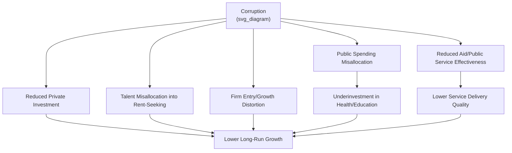

## Corruption and Its Effects on Development

### Definition and Core Concepts

**Corruption** is standardly defined in the development economics literature (following the World Bank and Transparency International) as the **abuse of entrusted power for private gain**. This umbrella definition covers a heterogeneous set of behaviors that are usually disaggregated along several dimensions:

- **Petty vs. grand corruption**: petty corruption involves small-scale bribery by low-level officials (e.g., bribes to police, clerks, teachers); grand corruption involves high-level officials or politicians extracting large rents (embezzlement, procurement fraud, state capture)
- **Bureaucratic vs. political corruption**: bureaucratic corruption occurs in the implementation of policy (permit issuance, inspections); political corruption occurs in the formation of policy itself (vote-buying, legislative capture, campaign finance abuse)
- **Centralized vs. decentralized corruption**: centralized corruption is coordinated (a single "price" set by a hierarchy, as under some authoritarian regimes); decentralized corruption involves multiple independent actors extracting rents from the same transaction, which is generally more distortionary (Shleifer and Vishny 1993)
- **Collusive vs. coercive corruption**: collusive corruption benefits both bribe-payer and bribe-taker at a third party's expense (e.g., tax evasion facilitated by an official); coercive corruption is extortive, imposed on an unwilling payer (e.g., a bribe demanded to receive a service the citizen is legally entitled to)

**Key Points**

- Corruption is best understood as a *symptom* of underlying institutional weakness (discretion + weak accountability + weak rule of law) rather than a standalone phenomenon—this connects directly to the companion notes on property rights and rule of law
- Klitgaard's (1988) widely cited formula frames the incentive structure: $\text{Corruption} = \text{Monopoly} + \text{Discretion} - \text{Accountability}$

### Theoretical Foundations

#### Corruption as a Rent-Extraction Problem

The canonical principal-agent framing treats the state (principal) as delegating authority to bureaucrats/officials (agents) who interact with citizens/firms (clients). Because the principal cannot perfectly monitor the agent, the agent can extract a bribe $b$ in exchange for providing (or withholding) a service, good, or favorable ruling. A simple model of a bribe-seeking official facing detection risk $p$ and penalty $F$:

$$E[\pi_{\text{official}}] = b - p \cdot F$$

The official demands a bribe as long as $b > p \cdot F$, i.e., whenever expected punishment is smaller than the private gain. This yields the standard comparative statics used throughout the empirical literature: corruption falls with (i) higher detection probability $p$ (monitoring, audits, transparency), (ii) higher penalties $F$ (enforcement, prosecution), and (iii) lower discretionary rents available to extract in the first place (deregulation, simplified procedures, reduced monopoly power).

#### "Sand" vs. "Grease" in the Wheels Hypothesis

Two competing theoretical predictions about corruption's efficiency effect, given as fixed, poorly designed regulation:

$$\text{Grease Hypothesis: } \quad \frac{\partial \text{Output}}{\partial \text{Corruption}} > 0 \quad \text{(bribes bypass inefficient red tape)}$$

$$\text{Sand Hypothesis: } \quad \frac{\partial \text{Output}}{\partial \text{Corruption}} < 0 \quad \text{(bribes add cost, uncertainty, distort allocation toward rent-seekers)}$$

The "grease the wheels" hypothesis (associated with Leff 1964, Huntington 1968) argues that in a second-best world of bad regulation, bribery lets efficient firms bypass bureaucratic obstacles, functioning as a market-clearing mechanism. The "sand the wheels" / predominant contemporary view (Mauro 1995 and much subsequent empirical work) argues corruption introduces additional transaction costs, uncertainty (bribe demands are not fixed-price and are unenforceable via contract), and misallocates resources toward rent-seeking and away from productive investment; it also tends to endogenously *increase* red tape, since officials have an incentive to create additional discretionary hurdles precisely to extract more bribes (Myrdal's original "grease" critique reversed).

**Key Points**

- The empirical consensus, following Mauro (1995) and later work, strongly favors "sand" over "grease" for aggregate investment and growth outcomes, though [Inference] firm-level heterogeneity studies (e.g., some transition-economy evidence) find conditions under which bribery correlates with faster firm-level processing times, suggesting a genuine but narrow micro-level "grease" effect coexists with a negative macro-level "sand" effect
- The bribe's *unenforceability* is a first-order distinguishing feature versus formal taxation: a bribe-taking official has no contractual obligation to actually deliver the promised service after payment, creating additional uncertainty costs relative to a fixed, predictable formal fee

#### Corruption as a Tax with Deadweight Loss

Corruption can be modeled as an implicit tax on economic activity, but one with materially worse properties than formal taxation:

$$DWL_{\text{corruption}} > DWL_{\text{formal tax}}$$

because (i) the "tax rate" (bribe size) is uncertain and subject to renegotiation/holdup, (ii) revenue is not recycled into public goods but captured privately, and (iii) multiple independent extractors under decentralized corruption can each set a monopoly markup, producing a "tragedy of the commons" over the tax base analogous to double marginalization in industrial organization (Shleifer and Vishny 1993).

### Cross-Country Empirical Evidence

#### Mauro (1995) — "Corruption and Growth"

Using the Business International corruption index across roughly 70 countries, Mauro's foundational study finds that corruption is negatively and significantly associated with investment rates and GDP growth, instrumenting corruption with measures of ethnolinguistic fractionalization to address reverse causality. This paper established the now-standard empirical prior that corruption is growth-retarding, not growth-neutral or growth-enhancing.

#### Mauro (1998) and Subsequent Work — Corruption and Public Spending Composition

Follow-up work finds corruption distorts the *composition* of government spending, not just its level: corrupt governments tend to under-invest in education and health (harder to extract large kickbacks from, more transparent per-unit spending) relative to large capital-intensive infrastructure projects (easier to pad with kickbacks, less transparent unit costs)—a mechanism with direct human-capital-formation implications for long-run development.

#### Knack and Keefer (1995) and the ICRG Corruption Index

Cross-country growth regressions using the ICRG corruption index (alongside broader institutional quality measures) consistently show corruption entering with a negative and significant coefficient on investment and growth, robust across index sources, though again subject to the general reverse-causality and omitted-variable critiques applicable to the broader institutions-and-growth literature (see companion notes on Property Rights and Rule of Law).

### Firm-Level and Micro Evidence

#### Fisman (2001) — Indonesia, Suharto Connections

Fisman's widely cited event study measures the stock market value of political connections by examining firm valuations around rumors of Suharto's declining health; firms with closer ties to Suharto experienced sharper valuation declines, providing a market-based estimate of the private value of political connection/corruption-enabled favoritism.

#### Olken (2007) — Missing in Action, Indonesia Road Projects

Olken's field experiment in Indonesian village road-building projects compares (i) increased probability of government audit and (ii) increased grassroots/community monitoring as anti-corruption interventions, measured against an independent engineering estimate of "missing expenditures" (the gap between reported and estimated actual construction costs). Findings:

- Increasing audit probability from roughly 4% to 100% reduced missing expenditures by approximately 8 percentage points
- Grassroots monitoring (invitations to village accountability meetings) had little average effect, but was more effective when free-rider problems were addressed (e.g., anonymous comment forms)
- This paper is a foundational reference for the "top-down vs. bottom-up" anti-corruption monitoring debate

#### Olken (2006) — Corruption Perceptions vs. Reality

Olken separately shows that corruption *perceptions* (villagers' subjective assessments) correlate only weakly with objectively measured "missing rice" in an Indonesian subsidized rice distribution program, an important methodological caution for the many empirical studies that rely on perception-based corruption indices (ICRG, Transparency International CPI, WGI Control of Corruption) as if they were direct measures of actual corruption levels.

#### Reinikka and Svensson (2004, 2005) — Uganda Public Expenditure Tracking

Studying a public expenditure tracking survey (PETS) for Uganda's education capitation grant, Reinikka and Svensson find that in the mid-1990s only a small fraction of intended per-student funding actually reached schools, with most diverted at intermediate government levels—a canonical "leakage" study. A subsequent newspaper-based information campaign informing schools/parents of their funding entitlements substantially increased the share of funds reaching schools, an early demonstration of the "information as anti-corruption tool" mechanism (see Transparency/Accountability section below).

#### Sequeira and Djankov (2014) — Port Corruption, Southern Africa

Studying bribery at Southern African ports, this study documents how competing corrupt "regimes" (bribery vs. smuggling-enabling collusion between officials and shippers) can substitute for one another and shows how firms strategically choose between them depending on relative enforcement intensity, illustrating that anti-corruption interventions targeting one channel can simply displace rent extraction into an alternative channel—a caution relevant to intervention design.

**Key Points**

- The credible identification frontier in this literature has moved decisively toward field experiments and administrative-data audits (Olken, Reinikka and Svensson) rather than cross-country perception-index regressions, because perception measures are noisy proxies for actual corrupt behavior (Olken 2006) and are subject to reverse causality with income/growth
- A recurring finding across contexts: increasing detection probability (audits) is generally a more robust corruption-reduction lever than increasing formal penalties or relying on community/social monitoring alone, though the latter can be effective when properly designed to overcome free-rider problems

### Mechanisms Linking Corruption to Development Outcomes

#### 1. Investment Channel

Uncertain, unenforceable bribe demands raise the effective cost of capital and discourage both domestic and foreign investment (Mauro 1995; corroborated by subsequent FDI-gravity-model studies showing corruption reduces bilateral FDI flows, often more strongly than formal tax rates, precisely because of the unenforceability/uncertainty premium).

#### 2. Public Spending Composition Channel

As above (Mauro 1998), corrupt governments bias spending toward large, kickback-friendly capital projects and away from human-capital-forming health/education spending.

#### 3. Talent Allocation Channel

Murphy, Shleifer, and Vishny's (1991) "Allocation of Talent" model argues that where returns to rent-seeking (including corruption-enabled activity) exceed returns to productive entrepreneurship, talented individuals are drawn into rent-seeking occupations (law, lobbying, government positions with bribe-extraction potential) rather than productive innovation—a general-equilibrium channel by which corruption depresses growth even beyond its direct transaction costs.

#### 4. Firm Entry and Size Distortion Channel

Corruption functions as a regressive, discretionary tax that disproportionately burdens smaller firms lacking the connections or scale to negotiate favorable treatment, discouraging formal-sector entry and reinforcing informality (linking to the companion Rule of Law note's firm-size/formality channel).

#### 5. Aid and Public Service Delivery Channel

Leakage in aid-funded and government-funded service delivery (Reinikka and Svensson) directly reduces the effectiveness of health, education, and infrastructure spending—a first-order concern for development practitioners and aid agencies designing program delivery mechanisms.

#### 6. State Capture / Political Channel

At the grand-corruption end, politically connected firms or oligarchic networks can capture policy formation itself (regulation, procurement rules, judicial appointments), entrenching extractive institutional equilibria (Hellman, Jones, and Kaufmann's 2000 "state capture" concept, developed for post-communist transition economies).

### Measurement of Corruption

| Index/Source | Type | Notes |
| --- | --- | --- |
| Transparency International — Corruption Perceptions Index (CPI) | Expert/business survey perceptions | Most widely cited; explicitly a *perceptions* measure, not a direct behavioral measure |
| World Bank Worldwide Governance Indicators — Control of Corruption | Composite of multiple underlying perception sources | Used extensively in growth regressions |
| ICRG Corruption Index | Expert risk-assessment | Long historical series; used in Mauro (1995), Knack and Keefer (1995) |
| Public Expenditure Tracking Surveys (PETS) | Administrative/field-audit-based | Direct measurement of leakage; Reinikka and Svensson (Uganda) |
| Engineering cost audits / "missing expenditure" methodology | Field-experimental/administrative | Direct measurement; Olken (2007) Indonesia roads |
| Global Corruption Barometer | Household survey, direct bribery experience | Asks respondents about actual bribe payment, closer to a behavioral measure than pure perception indices |

**Key Points**

- A major methodological divide exists between **perception-based** indices (CPI, WGI, ICRG—cheap, broad coverage, but noisy and potentially confounded with income) and **behavioral/administrative** measures (PETS, engineering audits, household bribery-experience surveys—more direct but far more costly and narrower in coverage)
- Olken's (2006) finding that perceptions correlate only weakly with measured leakage is a standing caution against treating perception indices as ground truth in causal analysis

### Anti-Corruption Policy Design

**Example**

Categorization of anti-corruption intervention types studied in the empirical literature:

| Intervention Type | Mechanism | Illustrative Evidence |
| --- | --- | --- |
| Increased audit probability | Raises detection risk $p$ in the rent-extraction model | Olken (2007), Indonesia road audits |
| Community/social monitoring | Leverages local information advantage of citizens/beneficiaries | Olken (2007) — modest average effect, larger when free-rider problems addressed |
| Information/transparency campaigns | Reduces information asymmetry enabling leakage | Reinikka and Svensson (2005), Uganda newspaper campaign |
| E-governance / digitization of transactions | Removes discretionary human interface, creates audit trail | Widely promoted (e.g., e-procurement, digital land registries); reduces monopoly + discretion per Klitgaard's formula |
| Wage incentives for officials ("efficiency wages") | Raises the opportunity cost of detection/dismissal, per Becker-Stigler logic | Mixed empirical support; theoretically motivated but harder to implement at scale |
| Meritocratic recruitment / civil service reform | Reduces patronage-based hiring that entrenches corrupt networks | Cross-country and historical case study evidence (e.g., Rauch and Evans 2000 on bureaucratic structure and growth) |
| Judicial/prosecutorial strengthening | Raises penalty $F$ and credibility of enforcement | Linked directly to companion Rule of Law note |
| Simplification of regulation/discretion reduction | Reduces the rent base per Klitgaard's formula | Djankov et al. (2002) "Regulation of Entry" — simpler entry rules associated with less corruption |

Design considerations:

- **Displacement risk**: interventions targeting one corruption channel can simply displace rent-extraction into an untargeted channel (Sequeira and Djankov 2014 port study)
- **Political economy constraints**: anti-corruption reforms that would reduce incumbent elites' rents face predictable political resistance, so reform sequencing and coalition-building matter as much as technical design (a direct link to the chapter's broader political-economy framing)
- **Measurement for evaluation**: given the perception-versus-behavior measurement gap, rigorous program evaluation increasingly relies on administrative/audit-based outcome measures rather than perception surveys

### Corruption Rent-Extraction Model Diagram (SVG)

<svg xmlns="http://www.w3.org/2000/svg" viewBox="0 0 720 300" font-family="Helvetica, Arial, sans-serif">
<text x="360" y="26" text-anchor="middle" font-size="17" font-weight="bold" fill="#1a1a1a">Klitgaard's Corruption Formula (svg_diagram)</text>
<circle cx="180" cy="140" r="70" fill="#fdecea" stroke="#c0392b" stroke-width="2" opacity="0.85" />
<text x="180" y="135" text-anchor="middle" font-size="14" font-weight="bold" fill="#1a1a1a">Monopoly</text>
<text x="180" y="155" text-anchor="middle" font-size="11" fill="#333">(sole provider</text>
<text x="180" y="170" text-anchor="middle" font-size="11" fill="#333">of service)</text>
<circle cx="360" cy="140" r="70" fill="#fef9e7" stroke="#f1c40f" stroke-width="2" opacity="0.85" />
<text x="360" y="135" text-anchor="middle" font-size="14" font-weight="bold" fill="#1a1a1a">Discretion</text>
<text x="360" y="155" text-anchor="middle" font-size="11" fill="#333">(official judgment,</text>
<text x="360" y="170" text-anchor="middle" font-size="11" fill="#333">no fixed rule)</text>
<circle cx="540" cy="140" r="70" fill="#eafaf1" stroke="#27ae60" stroke-width="2" opacity="0.85" />
<text x="540" y="135" text-anchor="middle" font-size="14" font-weight="bold" fill="#1a1a1a">− Accountability</text>
<text x="540" y="155" text-anchor="middle" font-size="11" fill="#333">(monitoring,</text>
<text x="540" y="170" text-anchor="middle" font-size="11" fill="#333">audit, penalty)</text>

<text x="270" y="140" text-anchor="middle" font-size="20" fill="`#1a1a1a`">+</text>

<text x="450" y="140" text-anchor="middle" font-size="20" fill="`#1a1a1a`">−</text>

<text x="360" y="250" text-anchor="middle" font-size="14" font-weight="bold" fill="`#1a1a1a`">Corruption = Monopoly + Discretion − Accountability</text>

<text x="360" y="272" text-anchor="middle" font-size="11" fill="#777">Reform levers: reduce monopoly/discretion, or raise accountability (audit probability, penalties)</text>

</svg>

### Interaction with Political Economy and Institutions

Corruption is theoretically and empirically tied to the broader chapter themes:

- **Extractive institutions link**: high corruption is a defining feature of Acemoglu and Robinson's "extractive institutions" equilibrium, where elites use state discretion to extract rents rather than provide broad-based property rights and public goods
- **Rule of law link**: weak judicial enforcement (companion note) directly raises the effective penalty-avoidance probability for corrupt officials, since prosecution and conviction depend on functioning courts
- **State capacity link**: corruption both reflects and undermines state capacity—low-capacity states have weaker monitoring technology (raising corruption), while corruption itself diverts resources away from state-capacity-building investments (a potential vicious-cycle/multiple-equilibria dynamic emphasized in the broader institutions literature)
- **Decentralization debate**: decentralizing government authority can reduce corruption by increasing local accountability and competition among jurisdictions (Tiebout-style), or increase it by multiplying the number of independent rent-extraction points (echoing the centralized-vs-decentralized corruption distinction above)—the empirical evidence on decentralization's net effect on corruption is genuinely mixed across contexts

### Critiques and Open Debates

- **Endogeneity in cross-country regressions**: as with the broader institutions literature, most corruption-growth cross-country regressions face serious reverse-causality concerns (poverty may cause corruption via low civil-service wages and weak monitoring capacity, rather than the reverse), motivating the shift toward micro/field-experimental identification
- **Perception-behavior gap**: Olken's (2006) finding substantially weakens confidence in results based purely on perception indices, though much of the earlier canonical literature (including Mauro 1995) relies on exactly these measures
- **"Grease the wheels" residual debate**: while the sand hypothesis dominates the consensus view, some contexts (particularly heavily over-regulated economies) show firm-level evidence consistent with a narrow grease effect; [Speculation] reconciling these findings likely requires distinguishing corruption's effect on the marginal firm navigating a fixed bad regulatory environment (potentially positive, narrowly) from its general-equilibrium effect on aggregate investment, institutional quality, and talent allocation (negative)
- **Cultural/relativist critique**: some scholars caution against a purely legalistic Western definition of corruption that fails to distinguish gift-giving/reciprocity norms embedded in some societies from genuinely welfare-reducing rent extraction—though this critique is itself contested as potentially excusing genuinely harmful extraction under a cultural label
- **Displacement and unintended consequences**: as the Sequeira and Djankov study shows, narrowly targeted anti-corruption interventions can shift rent-extraction to untargeted margins rather than eliminating it, cautioning against evaluating interventions solely on their targeted-channel effect

### Related Topics

- Rule of law and contract enforcement (companion institutional channel)
- Property rights and economic development (companion institutional channel)
- Extractive vs. inclusive institutions (Acemoglu and Robinson)
- State capacity and public finance in developing countries
- Aid effectiveness and the aid-delivery leakage literature
- Allocation of talent and rent-seeking (Murphy, Shleifer, Vishny 1991)
- Decentralization and local accountability
- Public expenditure tracking surveys and administrative-data-based program evaluation
- Political connections and firm valuation (Fisman-style event studies)
- Bureaucratic capacity and meritocratic civil service design (Rauch and Evans)