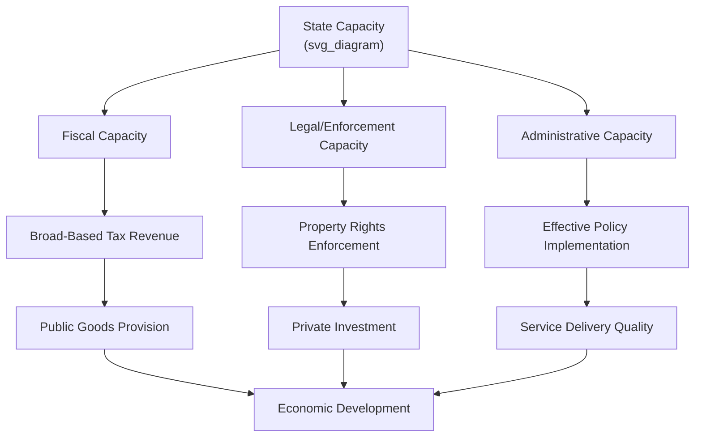

## State Capacity and Development Outcomes

### Definition and Core Concepts

**State capacity** refers to a government's ability to implement policy effectively and achieve intended objectives, typically decomposed into interrelated dimensions in the development economics literature:

- **Fiscal capacity**: the state's ability to raise revenue, especially through broad-based taxation rather than reliance on natural resource rents or trade taxes (Besley and Persson's core framework)
- **Legal/coercive capacity**: the state's ability to enforce contracts, property rights, and legal rules uniformly across territory (overlapping with the companion Rule of Law note, but emphasizing the *administrative* machinery rather than judicial independence per se)
- **Administrative/bureaucratic capacity**: the competence, professionalism, and coordination capability of the civil service to design and implement policy (Weberian bureaucracy in Evans and Rauch's sense)
- **Infrastructural/territorial capacity**: Michael Mann's (1984) concept of the state's ability to penetrate civil society and implement decisions across its claimed territory, distinguished from **despotic power** (the state's ability to act without negotiating with civil society groups)

**Key Points**

- State capacity is best understood as *investment-like*: it is built over time through costly, often politically contested investments in fiscal, legal, and administrative systems, rather than a fixed endowment
- Unlike the "quality of institutions" literature's focus on constraints on power (property rights, rule of law), state capacity emphasizes the *technical and organizational ability to act at all*—a state can be highly constrained (strong rule of law) yet have very low capacity to actually collect taxes, deliver services, or enforce rulings uniformly, and vice versa

### Theoretical Foundations

#### The Besley-Persson Framework: Investments in State Capacity

Besley and Persson (2009, 2010, and their 2011 book *Pillars of Prosperity*) provide the dominant modern formal framework, modeling state capacity as the outcome of forward-looking political investment decisions. Governments choose to invest in fiscal capacity (tax collection infrastructure) and legal capacity (contract-enforcing institutions) based on:

$$V(\tau_t) = \max_{I_f, I_l} \, \left[ R(\tau_t, I_f) + Y(I_l) - C(I_f, I_l) \right] + \beta \cdot E[V(\tau_{t+1}) \mid I_f, I_l]$$

where $I_f$ and $I_l$ are investments in fiscal and legal capacity, $R(\cdot)$ is tax revenue as a function of the tax rate $\tau_t$ and fiscal infrastructure, $Y(\cdot)$ is output enabled by legal capacity, and $C(\cdot)$ is the investment cost. The framework's central insight is that **political incentives** shape capacity investment: a government facing a high probability of losing power (weak political stability), high political competition without cohesion, or narrow "winner-take-all" institutions has weaker incentives to invest in capacity that a rival might inherit and use.

#### Common-Interest vs. Winner-Take-All Politics

Besley and Persson distinguish political environments by the alignment of incentives across potential rulers:

| Political Environment | Capacity Investment Incentive | Mechanism |
| --- | --- | --- |
| Common-interest / broad political institutions | High | Groups expect to benefit from state capacity regardless of who holds power, or expect to alternate in power under stable rules |
| Winner-take-all / narrow political institutions | Low | Incumbents fear investments benefiting future rivals; underinvestment in capacity that outlasts their tenure |
| High political instability | Low | Short time horizons reduce the present value of capacity investments with long payback periods |
| Political violence / civil conflict risk | Low (redirected toward coercive capacity) | Resources shift toward repression/security capacity rather than fiscal/legal capacity for broad-based development |

This directly connects state capacity to the chapter's broader themes: political institutions (who holds power, how contested it is) determine the *incentive* to build the economic institutions (fiscal systems, courts) that in turn drive development outcomes.

#### War and State-Building: The "Bellicist" Hypothesis

Following Tilly's (1975, 1990) historical thesis "war made the state, and the state made war," a strand of the literature argues that historical inter-state warfare in early modern Europe forced rulers to build fiscal and administrative capacity (to raise armies and taxes) that later proved durable and repurposable for peacetime governance and development. Besley and Persson (2009) and subsequent empirical work extend this argument, testing whether external war exposure predicts fiscal capacity investment historically and in some contemporary cross-country settings.

$$\text{External Conflict Pressure} \rightarrow \text{Fiscal/Administrative Investment (survival motive)} \rightarrow \text{Persistent State Capacity}$$

[Unverified] The bellicist hypothesis is contested when applied outside the European historical context: critics (e.g., Herbst 2000, studying African state formation) argue that post-colonial African states, having inherited fixed colonial borders without experiencing the same inter-state war pressures, largely did not undergo an equivalent capacity-building process, helping explain persistently low fiscal and administrative capacity in much of the region. This is a genuinely open historical-comparative debate rather than a settled finding.

#### Fiscal Capacity and the Tax-Base Problem

A recurring theoretical point: low-income countries frequently rely disproportionately on trade taxes, resource rents, or narrow bases (large firms, formal-sector payroll) rather than broad-based income or value-added taxation, because:

$$\text{Effective Tax Rate} = \tau \times (1 - \text{Evasion Rate}) \times \text{Base Coverage}$$

Building the administrative infrastructure (taxpayer registries, third-party information reporting, audit capacity, banking-sector integration) to expand *base coverage* and reduce evasion is itself a costly capacity investment—explaining why revenue-to-GDP ratios rise systematically with income per capita across the development spectrum, a well-documented empirical regularity (Besley and Persson 2013, "Taxation and Development").

### Empirical Evidence

#### Besley and Persson (2009, 2010) — Cross-Country and Historical Evidence

Using historical and contemporary cross-country panel data, Besley and Persson find that measures of political stability, political cohesion, and (in historical samples) external war exposure predict subsequent investment in fiscal and legal capacity, which in turn predicts income growth—providing the empirical backbone for their theoretical framework. [Inference] As with other institutions-and-growth cross-country work, these results face standard identification challenges (reverse causality, omitted historical/geographic confounds), and the authors themselves emphasize the framework's value as an organizing lens more than a fully identified causal chain in every specification.

#### Dincecco and Katz (2016) — European Fiscal Capacity and Growth

Using historical data on European state formation, Dincecco and colleagues find that early investments in centralized fiscal capacity (replacing fragmented, feudal-era tax collection with unified national systems) are associated with higher subsequent long-run economic growth, providing historical-panel support for the capacity-growth link in a setting with plausibly exogenous variation from historical conflict and dynastic consolidation.

#### Herbst (2000) — States and Power in Africa

Herbst's influential historical-comparative account argues that the absence of the European-style inter-state war pressures (combined with colonially imposed, often geographically inconvenient borders and low population density relative to land area) left many African states without the historical impetus to build the "broadcasting power" (infrastructural capacity to project authority across territory) that characterized European state formation, offering a structural explanation for persistent low capacity distinct from purely institutional-quality explanations.

#### Kraay and coauthors / World Bank Governance Research — Bureaucratic Quality and Growth

Cross-country work using bureaucratic quality indices (e.g., ICRG bureaucratic quality component, ratings of civil service professionalism) finds a positive association between measures of administrative competence and both growth and public service delivery quality, complementing the fiscal-capacity-focused Besley-Persson literature with an administrative/personnel-focused lens.

#### Evans and Rauch (1999) — "Bureaucracy and Growth"

Constructing a "Weberianness scale" (meritocratic recruitment, predictable long-term careers, competitive salaries) across a sample of developing-country bureaucracies, Evans and Rauch find that more Weberian (professionalized, insulated from political patronage) bureaucracies are associated with higher economic growth, providing microfoundational support for the administrative-capacity channel independent of the fiscal-capacity framework.

### Mechanisms Linking State Capacity to Development Outcomes

#### 1. Public Goods Provision Channel

Fiscal capacity determines the resource envelope available for public goods (infrastructure, health, education) that raise aggregate productivity and human capital; low fiscal capacity forces reliance on user fees, aid dependence, or resource rents, each with distinct efficiency and accountability implications.

#### 2. Property Rights and Contract Enforcement Channel

Legal/coercive capacity is the *implementation* layer underlying the property rights and rule of law institutions discussed in the companion notes—formal rights on paper require administrative and judicial machinery with sufficient reach and competence to actually enforce them, especially outside capital cities and among poorer/less-connected citizens.

#### 3. Tax Compliance and Formalization Channel

Administrative capacity to monitor and verify economic activity (third-party reporting, digital payment tracking, business registries) affects the incentive for firms to remain informal; low-capacity states with weak monitoring push economic activity into the informal sector, reducing the tax base and reinforcing low capacity in a potential vicious cycle.

#### 4. Policy Implementation Fidelity Channel

Even well-designed policies (targeted transfer programs, health interventions, regulatory reforms) depend on administrative capacity for effective delivery; the "missing middle" between policy design and ground-level outcomes—street-level bureaucrat behavior, local administrative competence—has become a major focus of the state-capacity-and-service-delivery literature (see below).

#### 5. Coercive/Security Capacity Channel

Basic order and security (monopoly on legitimate violence, per Weber's classical definition of the state) are prerequisites for markets to function at all; state fragility and civil conflict are strongly associated with capacity collapse and are a central concern of the "fragile states" literature within development economics.

### Micro-Level Evidence: Bureaucrats and Frontline State Capacity

#### Ashraf, Bandiera, and Lee (2020) — Career Incentives and Health Worker Performance, Zambia

This study, part of a broader research program on public-sector personnel economics, examines how career incentives (promotion prospects tied to performance versus seniority) affect the recruitment and performance of community health workers, illustrating how micro-level civil-service design choices are a component of aggregate state capacity.

#### Rasul and Rogger (2018) — Management Practices and Bureaucratic Performance, Nigeria

Rasul and Rogger's study of the Nigerian civil service finds that management practices emphasizing autonomy and monitoring (rather than rigid rule-following) are associated with more project completion by bureaucrats, part of a growing "state capacity as organizational/management problem" literature that treats bureaucracies analogously to firms in the management-practices-and-productivity tradition (Bloom and Van Reenen).

#### Muralidharan, Niehaus, and Sukhtankar (2016) — Biometric Payments and Leakage Reduction, India

Studying India's NREGA workfare program, this study finds that introducing biometric smartcard payments (an administrative/technological capacity investment) substantially reduced payment delays and leakage relative to the traditional cash-and-passbook system, providing microeconomic evidence that targeted administrative capacity investments can improve program delivery even absent broader institutional reform—directly relevant to contemporary "state capacity via digital infrastructure" policy discussions.

**Key Points**

- A distinct and increasingly influential strand of the state-capacity literature operates at the *organizational/personnel economics* level (bureaucrat incentives, management practices, monitoring technology) rather than the macro-historical fiscal-capacity level of Besley-Persson, reflecting a broader trend toward micro-empirical, quasi-experimental methods within development economics generally
- Digital/biometric identification and payment infrastructure has emerged as a major applied area for building administrative state capacity in lower-capacity settings, illustrated by India's Aadhaar-linked systems and similar programs elsewhere

### State Capacity Building: Design and Policy Considerations

**Example**

Categorization of state-capacity-building interventions studied or implemented in development practice:

| Intervention Category | Mechanism | Illustrative Reference/Context |
| --- | --- | --- |
| Taxpayer registry and third-party information systems | Expand tax base coverage, reduce evasion | Besley and Persson (2013) "Taxation and Development" |
| Digital ID and biometric payment systems | Reduce leakage, enable targeted transfers | Muralidharan, Niehaus, Sukhtankar (2016), India NREGA |
| Meritocratic civil service recruitment reform | Build Weberian bureaucratic professionalism | Evans and Rauch (1999) cross-country evidence |
| Performance management and monitoring systems | Improve frontline bureaucrat effort/output | Rasul and Rogger (2018), Nigeria |
| Decentralization of service delivery | Localize implementation, increase accountability | Mixed evidence; interacts with corruption/decentralization debate (see companion Corruption note) |
| E-governance and digitized administrative processes | Reduce discretion, create audit trails | Complementary to anti-corruption interventions (Klitgaard framework) |
| Judicial and legal system capacity investment | Improve enforcement machinery | Direct overlap with companion Rule of Law note (court backlogs, case management) |

Design considerations:

- **Sequencing and complementarity**: fiscal, legal, and administrative capacity investments tend to be complementary rather than substitutable in the Besley-Persson framework—building one in isolation (e.g., digital tax systems without complementary legal enforcement of tax obligations) may yield limited returns
- **Political economy of capacity investment**: since capacity investments are durable and can be inherited by political rivals, capacity-building reforms are more politically feasible where political competition is programmatic/common-interest rather than winner-take-all (a direct policy implication of the Besley-Persson theoretical framework)
- **Technology as a capacity shortcut**: digital infrastructure (biometric ID, mobile payments, satellite monitoring) has been argued to allow some "leapfrogging" of traditional administrative capacity-building stages, though [Speculation] the durability and scalability of these technology-based capacity gains outside pilot/RCT contexts remains an active area of research rather than a fully settled finding

### State Capacity Investment Pathway (SVG)

<svg xmlns="http://www.w3.org/2000/svg" viewBox="0 0 720 320" font-family="Helvetica, Arial, sans-serif">
<text x="360" y="26" text-anchor="middle" font-size="16" font-weight="bold" fill="#1a1a1a">Besley-Persson Political Incentive to Invest in Capacity (svg_diagram)</text>
<rect x="40" y="60" width="200" height="70" rx="8" fill="#eaf2fb" stroke="#2874a6" stroke-width="2" />
<text x="140" y="90" text-anchor="middle" font-size="12" font-weight="bold" fill="#1a1a1a">Political Environment</text>
<text x="140" y="108" text-anchor="middle" font-size="11" fill="#333">stability, cohesion,</text>
<text x="140" y="122" text-anchor="middle" font-size="11" fill="#333">common vs. winner-take-all</text>
<line x1="240" y1="95" x2="290" y2="95" stroke="#555" stroke-width="2" marker-end="url(#arrow2)" />
<rect x="290" y="60" width="200" height="70" rx="8" fill="#fef9e7" stroke="#b7950b" stroke-width="2" />
<text x="390" y="85" text-anchor="middle" font-size="12" font-weight="bold" fill="#1a1a1a">Capacity Investment</text>
<text x="390" y="103" text-anchor="middle" font-size="11" fill="#333">fiscal + legal + admin</text>
<text x="390" y="118" text-anchor="middle" font-size="11" fill="#333">infrastructure</text>
<line x1="490" y1="95" x2="540" y2="95" stroke="#555" stroke-width="2" marker-end="url(#arrow2)" />
<rect x="540" y="60" width="150" height="70" rx="8" fill="#eafaf1" stroke="#1e8449" stroke-width="2" />
<text x="615" y="90" text-anchor="middle" font-size="12" font-weight="bold" fill="#1a1a1a">Development</text>
<text x="615" y="108" text-anchor="middle" font-size="11" fill="#333">revenue, services,</text>
<text x="615" y="122" text-anchor="middle" font-size="11" fill="#333">enforcement, growth</text>
<line x1="615" y1="130" x2="615" y2="230" stroke="#888" stroke-width="1.5" stroke-dasharray="4,3" />
<line x1="615" y1="230" x2="140" y2="230" stroke="#888" stroke-width="1.5" stroke-dasharray="4,3" />
<line x1="140" y1="230" x2="140" y2="132" stroke="#888" stroke-width="1.5" stroke-dasharray="4,3" marker-end="url(#arrow2)" />
<text x="380" y="250" text-anchor="middle" font-size="11" fill="#777">Feedback: development outcomes reshape future political stability/cohesion</text>

<text x="380" y="290" text-anchor="middle" font-size="12" fill="`#1a1a1a`" font-weight="bold">War/external threat (bellicist channel) can raise investment incentive historically</text>

</svg>

### Interaction with the Broader Institutions Framework

State capacity sits in a distinct but tightly linked analytical position relative to the chapter's other topics:

- **Versus property rights/rule of law**: those topics ask whether the state is *constrained* from abusing power; state capacity asks whether the state is *able* to act (enforce, tax, deliver) at all. AJR-style "institutional quality" and Besley-Persson "state capacity" are complementary rather than competing frameworks—Besley and Persson explicitly frame capacity investment as occurring *conditional on* the political-institutional environment (who holds power and how constrained/contested that is)
- **Versus corruption**: low administrative capacity (weak monitoring, poor recordkeeping, low civil-service professionalism) directly increases the "discretion" and reduces the "accountability" terms in Klitgaard's corruption formula (companion Corruption note), so capacity-building and anti-corruption reform are frequently complementary policy tracks
- **State fragility and conflict**: at the low extreme of the capacity distribution, "fragile" or "failed" states exhibit capacity collapse across fiscal, legal, and coercive dimensions simultaneously, with civil conflict both a cause and consequence of capacity failure—a distinct but related literature (Fearon and Laitin, Collier and Hoeffler on civil war) that intersects heavily with state capacity research

### Critiques and Open Debates

- **Historical contingency vs. policy-actionable framework**: critics note that the bellicist/war-driven state-building narrative, even if historically accurate for early modern Europe, offers limited direct policy guidance for contemporary low-capacity states, since deliberately fostering the historical mechanism (inter-state war) is neither feasible nor desirable as development policy—raising the question of what *substitute* pathways (aid conditionality, technical assistance, technology leapfrogging) can achieve comparable capacity gains
- **Measurement challenges**: unlike property rights or rule of law, state capacity has no single widely agreed composite index; researchers use varied proxies (tax revenue/GDP, ICRG bureaucratic quality, Weberianness scales, administrative data completeness), complicating cross-study comparison
- **Capacity vs. willingness distinction**: some scholars caution against conflating low capacity (technical/organizational inability) with low willingness (elite preference for weak implementation to preserve rent-extraction opportunities, connecting to the Corruption note's political-economy critiques)—the same observed outcome (poor service delivery) can reflect either or both, with differing policy implications
- **Technology leapfrogging skepticism**: while digital/biometric systems show strong RCT-based results in specific programs (Muralidharan et al.), [Inference] whether such point interventions aggregate into durable, general-purpose state capacity comparable to historically built fiscal/legal/administrative systems is an open empirical question rather than an established finding

### Related Topics

- Property rights and economic development (companion institutional channel)
- Rule of law and contract enforcement (companion institutional channel)
- Corruption and its effects on development (companion institutional channel)
- Political institutions, political competition, and public goods provision
- Civil conflict, state fragility, and the "fragile states" literature
- Taxation and public finance in developing countries (Besley and Persson 2013)
- Personnel economics of the public sector (bureaucrat incentives, management practices)
- Digital governance, biometric identification, and administrative technology
- Colonial state formation and its persistence (Herbst; AJR colonial-origins literature)
- Decentralization and local government capacity