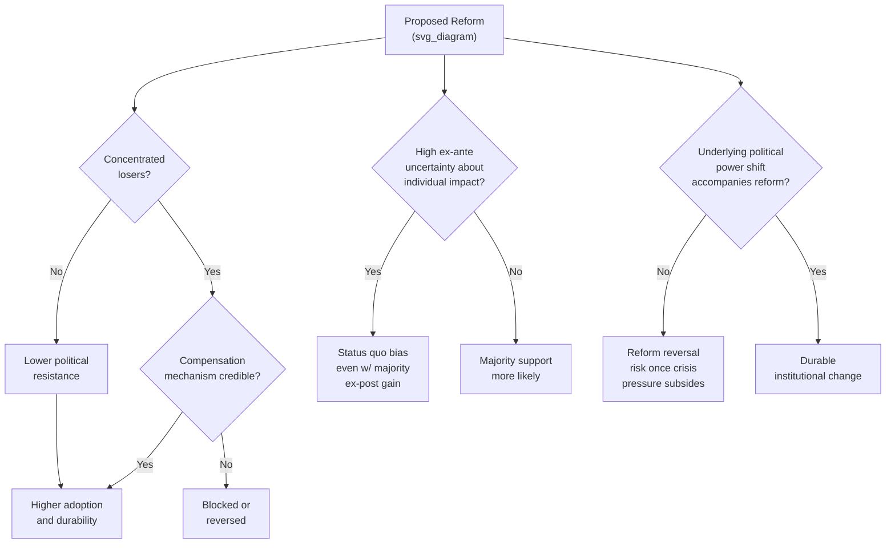

## Political Economy of Reform

### Definition and Core Concepts

The **political economy of reform** studies why economically beneficial policy changes (trade liberalization, subsidy removal, privatization, fiscal consolidation, deregulation) are frequently delayed, blocked, or reversed despite apparent aggregate net gains, and what conditions enable reforms to be adopted, sustained, and made politically durable. It sits at the intersection of public economics, political science, and institutional economics, and treats policy choice itself as an *equilibrium outcome* of political competition and bargaining rather than a technocratic optimization exercise.

- **Efficiency-enhancing reform**: a policy change that increases aggregate surplus (a Kaldor-Hicks improvement), but not necessarily a Pareto improvement—gainers could in principle compensate losers, but rarely do so in practice
- **Reform paradox**: the observation that many efficiency-improving reforms with clear aggregate benefits and identifiable net losers fail to be adopted, or are adopted then reversed, even when the losers are a minority of the population
- **Status quo bias**: the tendency of political and institutional systems to favor existing policy over alternatives, even efficient ones, due to a range of mechanisms detailed below

**Key Points**

- This topic synthesizes the chapter's other themes (property rights, rule of law, corruption, state capacity) into a *dynamic* question: not just "which institutions support development" but "how and why do societies move from worse to better institutional/policy equilibria, and why do they often fail to"
- The literature draws heavily on collective action theory (Olson), median voter and probabilistic voting models, and formal political bargaining theory (Acemoglu and Robinson)

### Theoretical Foundations

#### Concentrated Benefits, Diffuse Costs (Olson's Logic of Collective Action)

Mancur Olson's (1965) foundational insight: small, well-organized groups with large per-capita stakes in a policy (e.g., an import-competing industry benefiting from a tariff) can overcome collective-action problems and lobby effectively, while large, diffuse groups with small per-capita stakes (consumers paying marginally higher prices) face free-rider problems and rarely organize to oppose that same policy—even though aggregate consumer losses may exceed producer gains.

$$\text{Political Influence} \propto \frac{\text{Stake per member} \times \text{Organizational cohesion}}{\text{Free-rider problem severity}}$$

This asymmetry explains a recurring empirical pattern: protectionist, subsidy, and rent-preserving policies persist not because they are efficient but because their beneficiaries are concentrated and organized while the diffuse losers (consumers, taxpayers, future generations) are not.

#### Status Quo Bias: Uncertainty and the Fernandez-Rodrik Model

Fernandez and Rodrik (1991) provide a formal explanation for why efficiency-enhancing reforms can fail to secure majority support even when a majority would benefit *ex post*, if there is **individual-specific uncertainty** about who gains and who loses ex ante. Consider a reform where a known fraction of the population will gain and the rest will lose, but *which* individuals fall into each group is uncertain before the reform is implemented:

$$E[U_i(\text{reform})] < U_i(\text{status quo}) \quad \text{even when} \quad \sum_i \left[U_i(\text{reform}) - U_i(\text{status quo})\right] > 0$$

Because individuals are risk-averse and cannot identify themselves as certain winners in advance, a policy that would command majority support *after* the identities of winners and losers are revealed can fail to secure ex-ante majority support, creating a "status quo bias" purely from uncertainty rather than any assumption about political power asymmetry. This is one of the most influential formal results explaining reform paradoxes independent of the concentrated-benefits/diffuse-costs mechanism.

#### Loss Aversion and Reference-Dependent Preferences

A complementary behavioral mechanism (drawing on Kahneman and Tversky's prospect theory) posits that losses are weighted more heavily than equivalent gains relative to a reference point (typically the status quo):

$$U(\Delta) = \begin{cases} \Delta & \Delta \geq 0 \\ \lambda \Delta & \Delta < 0, \, \lambda > 1 \end{cases}$$

If potential losers from reform weight their losses by a factor $\lambda > 1$ relative to potential gainers' equally-sized gains, opposition to reform can be politically disproportionate to its aggregate welfare cost even absent Olson-style organizational asymmetries—reinforcing status quo bias through a purely psychological rather than organizational channel.

#### Political Institutions as Commitment Devices (Acemoglu-Robinson Framework)

Acemoglu and Robinson (2000, 2001, 2006, and their broader *Why Nations Fail* synthesis) model reform and institutional change as arising from bargaining between elites (holding political power) and citizens/challengers, where the central problem is a **commitment problem**: elites cannot credibly promise to share future gains from reform with citizens, because political power (not just current policy) determines who captures future surplus. Formally, de facto power today determines whether promises about tomorrow's distribution are credible:

$$\text{Reform sustained} \iff \text{De facto power distribution supports the new equilibrium}$$

This generates their well-known prediction that redistribution or reform undertaken merely as a policy concession (without accompanying change in the underlying distribution of political power) tends to be reversed once the threat that prompted it (e.g., revolution threat, social unrest) subsides—explaining reform *reversal* as a recurring equilibrium phenomenon, not simply a policy failure.

**Key Points**

- Three distinct (and non-mutually-exclusive) theoretical mechanisms generate reform failure or reversal: (1) organized-minority capture (Olson), (2) ex-ante uncertainty about individual gains/losses (Fernandez-Rodrik), and (3) lack of credible commitment to sustain redistribution absent underlying power shifts (Acemoglu-Robinson)
- These mechanisms are complementary explanatory layers rather than competing hypotheses—real-world reform episodes typically involve some combination of all three

### The "Crisis Hypothesis" and Reform Timing

A substantial applied literature (Drazen and Grilli 1993; Alesina and Drazen 1991's "war of attrition" model; Rodrik 1996) examines why major reforms often occur during or immediately after severe economic crises rather than through gradual, technocratically optimal adjustment.

#### Alesina-Drazen War of Attrition Model

Alesina and Drazen (1991) model fiscal stabilization delay as a **war of attrition** between interest groups, each hoping the other will concede first and bear a disproportionate share of the adjustment burden. Reform is delayed until accumulated costs (continued instability, inflation, crisis deepening) become severe enough that one group's resistance breaks:

$$\text{Reform occurs when} \quad C_{\text{delay}}(t) > B_{\text{holdout}}(t) \quad \text{for at least one contesting group}$$

This generates the empirical prediction that reform is more likely following periods of acute crisis (hyperinflation, currency collapse, debt default) than during periods of moderate but sustained inefficiency—a pattern with substantial empirical support across Latin American stabilization episodes in particular.

#### Crisis as a Coordination Device / Window of Opportunity

A complementary interpretation treats crises as coordinating mechanisms that shift public beliefs and reduce the perceived legitimacy of the status quo, temporarily weakening organized opposition to reform (Olson-style groups may find it harder to defend clearly failing policies during visible crisis) and altering politicians' assessment of the political costs of inaction relative to reform.

**Key Points**

- [Inference] The crisis-reform link is robust as a *descriptive* empirical pattern across many stabilization episodes, but the literature is more divided on whether crises are strictly *necessary* for major reform (versus merely one of several triggering mechanisms), and case-study evidence exists on both sides
- A close corollary is the "reform reversal" risk once crisis pressure subsides, connecting back to the Acemoglu-Robinson commitment-problem mechanism above

### Empirical and Case-Study Evidence

#### Rodrik (1996) — Understanding Economic Policy Reform

Rodrik's influential survey synthesizes the theoretical literature and argues that reform sustainability depends heavily on the credibility of the reforming government and the presence of complementary institutional reforms (rather than policy change alone), a theme echoed in the state-capacity companion note's emphasis on implementation capacity as distinct from policy design.

#### Trade Liberalization Episodes: Latin America (1980s–1990s)

Extensive case-study literature on trade liberalization across Latin America (Chile, Mexico, Argentina) during and after the debt crisis of the 1980s documents reform packages adopted under acute balance-of-payments crisis, with subsequent variation in reform durability linked to the strength of complementary institutional reforms (central bank independence, fiscal rules) versus purely executive-decree-based liberalization vulnerable to future reversal.

#### China's Gradualist Reform Path

China's post-1978 reform trajectory is frequently contrasted with the "shock therapy" approach taken in much of post-Soviet Eastern Europe, illustrating an alternative **gradualist/experimentalist** reform strategy: initial reforms were piloted in limited geographic zones (Special Economic Zones) or sectors, generating observable success that built political coalitions supporting further reform, rather than attempting comprehensive simultaneous liberalization. [Inference] The relative merits of gradualist versus "big bang" reform strategies remain genuinely debated in the comparative political economy literature, with outcomes appearing highly context-dependent (initial institutional endowments, state capacity, and political structure all plausibly mediating which strategy is more likely to succeed).

#### Fuel Subsidy Reform Episodes (Nigeria, Indonesia, Egypt, and Others)

Fuel subsidies are a canonical contemporary case of Olson-style concentrated-benefit political economy: subsidies are regressive in absolute terms (wealthier households consume more fuel in absolute quantity) yet politically difficult to remove because affected populations (transport operators, urban consumers) are geographically concentrated, highly visible, and capable of rapid collective mobilization (strikes, protests), while the diffuse fiscal benefits of subsidy removal (freed budget resources for targeted transfers or public investment) are less immediately visible to the electorate. Comparative studies of subsidy reform attempts across these countries generally find that reforms accompanied by credible, well-communicated compensating transfer programs (cash transfers replacing the subsidy) are more politically durable than reforms without such compensation—directly consistent with the Fernandez-Rodrik uncertainty-reduction and Olson compensation-of-losers logics.

### Mechanisms and Conditions Affecting Reform Success

#### 1. Compensation and Side-Payment Mechanisms

Reforms accompanied by credible compensation to concentrated losers (severance packages for displaced workers, cash transfers replacing regressive subsidies, phased implementation) reduce Olson-style organized resistance—though credibility of the compensation commitment is itself a political-economy problem (linking to the Acemoglu-Robinson commitment-device issue).

#### 2. Information and Uncertainty Reduction

Providing clearer information about reform's distributional consequences (who specifically gains/loses, and by how much) can reduce the Fernandez-Rodrik uncertainty-driven status quo bias, though this mechanism can cut both ways—clearer information can also sharpen and mobilize opposition among identified losers.

#### 3. Sequencing and Gradualism

Phased reform implementation (China-style pilots, gradual tariff phase-downs) allows political coalitions to observe reform benefits before bearing full costs, potentially building support incrementally, at the cost of extended periods during which partial/incomplete reform can create its own distortions (a recognized risk in the "reform sequencing" literature, e.g., partial capital account liberalization without complementary regulatory reform).

#### 4. Institutional Lock-In

Embedding reforms in constitutional provisions, independent regulatory agencies, or international commitments (trade agreements, IMF/World Bank conditionality, EU accession requirements) raises the cost of future reversal, addressing the Acemoglu-Robinson commitment problem by making the new policy harder to unwind even if the political coalition that enacted it later weakens.

#### 5. Crisis-Driven Coalition Realignment

As discussed above, acute crises can temporarily weaken entrenched opposition and create windows for reform adoption, though durability still depends on whether accompanying institutional/power changes occur (mechanism 4).

### Reform Strategy Comparison

**Example**

| Dimension | Gradualist/Sequenced Approach | Comprehensive/"Big Bang" Approach |
| --- | --- | --- |
| Political coalition building | Builds incrementally via observed early wins | Requires broad ex-ante coalition or crisis-driven mandate |
| Risk of partial-reform distortions | Higher (incomplete reform can create new distortions) | Lower (if credibly comprehensive) |
| Reversibility | Easier to halt or reverse mid-sequence | Harder to reverse once implemented, but higher failure cost if it collapses |
| Information requirements | Lower (can adapt based on observed pilot outcomes) | Higher (must anticipate full distributional consequences upfront) |
| Illustrative context | China's Special Economic Zones, gradual tariff phase-downs | Eastern European post-1989 "shock therapy," some IMF-conditioned stabilization packages |
| Vulnerability to Olson-style capture during transition | Higher (extended window for concentrated interests to organize resistance to further stages) | Lower (limited window before reform is locked in), but higher upfront resistance |

### Reform Political Economy Model Diagram (SVG)

<svg xmlns="http://www.w3.org/2000/svg" viewBox="0 0 720 300" font-family="Helvetica, Arial, sans-serif">
<text x="360" y="26" text-anchor="middle" font-size="16" font-weight="bold" fill="#1a1a1a">Concentrated Benefits vs. Diffuse Costs (svg_diagram)</text>
<rect x="60" y="60" width="260" height="100" rx="8" fill="#fdecea" stroke="#c0392b" stroke-width="2" />
<text x="190" y="88" text-anchor="middle" font-size="13" font-weight="bold" fill="#1a1a1a">Concentrated Group</text>
<text x="190" y="108" text-anchor="middle" font-size="11" fill="#333">Few members, large stake each</text>
<text x="190" y="124" text-anchor="middle" font-size="11" fill="#333">Low free-rider problem</text>
<text x="190" y="140" text-anchor="middle" font-size="11" fill="#333">→ Organizes and lobbies effectively</text>
<rect x="400" y="60" width="260" height="100" rx="8" fill="#eaf2fb" stroke="#2874a6" stroke-width="2" />
<text x="530" y="88" text-anchor="middle" font-size="13" font-weight="bold" fill="#1a1a1a">Diffuse Group</text>
<text x="530" y="108" text-anchor="middle" font-size="11" fill="#333">Many members, small stake each</text>
<text x="530" y="124" text-anchor="middle" font-size="11" fill="#333">High free-rider problem</text>
<text x="530" y="140" text-anchor="middle" font-size="11" fill="#333">→ Rarely organizes to oppose</text>

<text x="360" y="195" text-anchor="middle" font-size="13" font-weight="bold" fill="`#1a1a1a`">Net political outcome: policy favors concentrated group</text>

<text x="360" y="215" text-anchor="middle" font-size="12" fill="`#1a1a1a`">even where aggregate diffuse losses exceed concentrated gains</text>

<text x="360" y="260" text-anchor="middle" font-size="11" fill="#777">Olson (1965), The Logic of Collective Action</text>

</svg>

### Interaction with the Broader Institutions Framework

The political economy of reform functions as the *dynamic* complement to the chapter's other topics:

- **Property rights and rule of law**: reforms strengthening property rights or judicial independence are themselves subject to the same commitment-problem logic—elites benefiting from weak enforcement (selective expropriation risk, arbitrary application) may resist reforms that would bind their own future discretion, unless accompanied by genuine power redistribution (Acemoglu-Robinson)
- **Corruption**: anti-corruption reforms are a paradigm case of concentrated-loser (corrupt officials, connected firms) versus diffuse-gainer (citizens, taxpayers) political economy, explaining why technically straightforward anti-corruption measures (transparency requirements, procurement reform) frequently stall despite broad rhetorical support
- **State capacity**: Besley-Persson's framework (companion note) is itself a reform political economy argument—capacity investment is a *type* of reform subject to the same underinvestment-absent-credible-commitment logic, particularly regarding whether incumbents expect to capture the benefits of capacity they build

### Critiques and Open Debates

- **Technocratic vs. political framings in tension**: a persistent methodological divide exists between economists who emphasize identifying "optimal" policy and treating political resistance as an implementation obstacle to be managed, versus political economists who treat the political equilibrium itself as the object of analysis, with "reform failure" potentially reflecting a rational political equilibrium rather than a correctable market/policy failure—this framing choice has significant implications for what counts as a useful research question
- **External validity of crisis-reform findings**: much of the empirical crisis-reform literature draws on a relatively concentrated set of historical episodes (Latin American debt crisis stabilizations, post-Soviet transition); [Inference] generalizing these patterns to other regional or historical contexts (e.g., contemporary African fiscal reform, climate-related policy transitions) requires caution given differing initial institutional endowments and state capacity levels
- **Gradualism vs. comprehensive reform debate remains unresolved**: as noted above, the China-versus-shock-therapy comparison is frequently invoked but the underlying causal claim (that gradualism *caused* superior Chinese outcomes, as opposed to other confounding historical/institutional factors) is contested; single-country comparative case studies face substantial identification limitations relative to the micro-empirical evidence available for the other chapter topics
- **Reform "ownership" and external conditionality critique**: reforms imposed via international financial institution conditionality (IMF, World Bank structural adjustment) have drawn sustained criticism in the political economy literature for lacking durable domestic political coalition support, generating a distinct strand of research on "reform ownership" as a determinant of sustainability, separate from but related to the crisis-timing and commitment-device mechanisms above

### Related Topics

- Property rights and economic development (institutional outcome subject to reform dynamics)
- Rule of law and contract enforcement (institutional outcome subject to reform dynamics)
- Corruption and its effects on development (paradigm concentrated-benefit reform case)
- State capacity and development outcomes (capacity investment as a reform political economy problem)
- Extractive vs. inclusive institutions and institutional transitions (Acemoglu and Robinson)
- Collective action theory and interest group politics (Olson)
- Trade liberalization episodes and structural adjustment programs
- Fiscal consolidation and stabilization political economy (Alesina-Drazen)
- Comparative transition economics (gradualism vs. shock therapy)
- Conditionality and reform ownership in international financial institution programs