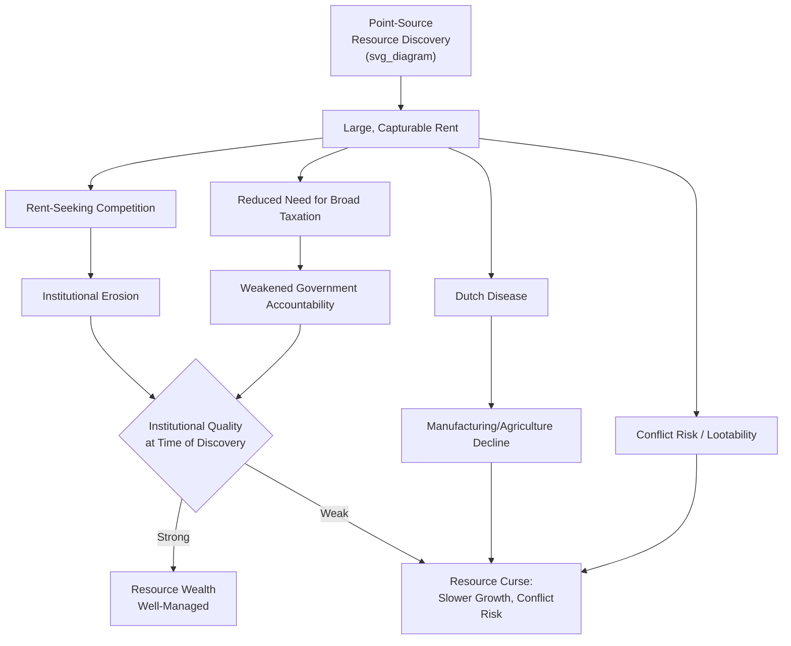

## Rent-Seeking and the Resource Curse

### Definition and Core Concepts

**Rent-seeking** refers to activity directed at capturing existing wealth or transfers (rents) through non-productive means—lobbying, bribery, litigation, monopolization—rather than creating new wealth through production or innovation (Tullock 1967; Krueger 1974). A **rent** in this context is a return above the minimum required to keep a resource in its current use (i.e., a payment in excess of opportunity cost), which becomes a target for competitive, socially wasteful capture efforts.

The **resource curse** (also "paradox of plenty") is the empirical and theoretical proposition that countries abundant in natural resources—particularly point-source resources like oil, gas, and minerals—often experience *worse* long-run economic and institutional outcomes than resource-poor counterparts, contrary to the naive expectation that resource wealth should straightforwardly finance development.

**Key Points**

- The resource curse is not a claim that resources are inherently harmful, but that resource abundance interacts with weak pre-existing institutions to produce worse outcomes than either resource abundance under strong institutions or resource scarcity under weak institutions would produce alone—the curse is fundamentally **conditional**, not universal
- Rent-seeking theory provides the principal *microeconomic mechanism* connecting resource wealth to poor macro outcomes: resource rents are unusually large, geographically concentrated (point-source), and easily capturable by whoever controls the extraction sites or state apparatus, making them an especially attractive target for the concentrated-interest political economy dynamics discussed in the companion Political Economy of Reform note

### Theoretical Foundations

#### Rent-Seeking as Socially Wasteful Competition

Tullock's (1967) foundational insight, extended by Krueger (1974) and Posner (1975), is that competition for a rent dissipates resources up to the *expected value* of the rent itself, converting what looks like a pure transfer (zero-sum, no efficiency loss) into a genuine deadweight loss. If $N$ risk-neutral agents compete for a rent of value $R$ through costly effort $e_i$, with each agent's probability of winning proportional to their effort share:

$$p_i = \frac{e_i}{\sum_{j=1}^N e_j}$$

In the symmetric Nash equilibrium of the standard Tullock contest, total rent-seeking expenditure can approach (and under certain contest-success-function parameterizations, exceed) the value of the rent itself:

$$\sum_i e_i^* \rightarrow R \quad \text{as competition intensifies}$$

This is the theoretical core of why rent-seeking is welfare-reducing even when the underlying transfer is not: resources that could have been used productively are instead consumed in the zero-sum contest for capturing the rent.

#### The Resource Curse: Channels in the Theoretical Literature

The resource curse literature identifies several distinct (and potentially co-occurring) mechanisms, only some of which operate through rent-seeking specifically:

| Mechanism | Type | Core Logic |
| --- | --- | --- |
| Dutch disease | Macroeconomic/real exchange rate | Resource exports appreciate the real exchange rate, crowding out tradable-sector manufacturing and agriculture |
| Rent-seeking and institutional erosion | Political economy | Point-source rents attract unproductive competition for capture; can *worsen* institutional quality over time |
| Volatility and boom-bust cycles | Macroeconomic | Commodity price volatility induces pro-cyclical fiscal policy, investment misallocation, debt overhang |
| Reduced incentive for broad-based taxation | Fiscal/political | Resource-rich governments can fund the state from rents rather than taxing citizens, weakening the fiscal-capacity and accountability links discussed in the companion State Capacity note |
| Civil conflict risk | Political/security | Lootable or capturable resource rents raise the value of controlling the state or territory, increasing conflict risk (Collier-Hoeffler "greed" channel) |
| Authoritarianism and weakened accountability | Political | Resource rents reduce the state's dependence on citizen consent/taxation, weakening the classical "no taxation without representation" accountability mechanism |

**Key Points**

- Dutch disease is a *macroeconomic* channel operating even under good institutions (it is a real exchange rate mechanism, not a political failure per se), while the rent-seeking, fiscal-accountability, and conflict channels are fundamentally *political economy* mechanisms—this chapter's rent-seeking framing sits specifically within the latter category
- The "no taxation without representation" / fiscal social contract argument (elaborated by Ross 2001, 2004; Moore 2004) is a particularly influential mechanism: broad-based taxation historically created bargaining leverage for citizens to demand accountability and representation in exchange for tax compliance (echoing the bellicist/fiscal-capacity state-building literature in the companion State Capacity note); resource rents allow governments to bypass this bargain entirely

#### Rent-Seeking, State Capture, and Institutional Feedback

A key theoretical extension (developed by Robinson, Torvik, and Verdier 2006, and related work) treats the resource curse as partly *endogenous* to political incentives rather than a fixed structural outcome: politicians anticipating future resource windfalls have an incentive to over-extract resources during their tenure (since a rival may capture future rents) and to use resource rents to build patronage networks that entrench their hold on power, creating a self-reinforcing equilibrium of weak institutions and resource dependence.

$$\text{Resource Rent} \rightarrow \text{Patronage/Rent-Seeking Investment} \rightarrow \text{Weaker Institutions} \rightarrow \text{Greater Reliance on Rents (vs. Tax Base)}$$

This feedback loop directly parallels the Besley-Persson state-capacity framework (companion note): where political incentives to invest in broad-based fiscal capacity are weak (because resource rents provide an easier revenue alternative), institutional quality can deteriorate over time rather than merely stagnate.

### Empirical Evidence: The Cross-Country Resource Curse Literature

#### Sachs and Warner (1995, 1997, 2001) — Foundational Cross-Country Evidence

Sachs and Warner's influential cross-country regressions find a robust negative correlation between the share of primary/resource exports in GDP and subsequent economic growth across a broad country panel, controlling for initial income and other standard growth covariates—the paper that established "resource curse" as a mainstream empirical regularity in development economics, though the authors themselves note the correlation does not by itself establish which of the several theoretical channels above is operative.

#### Mehlum, Moene, and Torvik (2006) — Institutions as the Conditioning Variable

This influential paper argues the resource curse is **conditional on institutional quality**: splitting their country sample by measures of institutional quality (property rights protection, rule of law), they find resource abundance is associated with *slower* growth in countries with weak ("grabber-friendly") institutions, but resource abundance shows a *positive or neutral* association with growth in countries with strong ("producer-friendly") institutions. This finding reframes the resource curse from a universal law into a strictly conditional/interactive relationship—directly connecting this topic to the chapter's property rights and rule of law themes.

$$\frac{\partial \text{Growth}}{\partial \text{Resource Abundance}} = \beta_1 + \beta_2 \cdot \text{Institutional Quality}, \quad \beta_2 > 0$$

#### Norway, Botswana, and Chile — Counterexamples

The existence of resource-rich countries that avoided the curse (Norway's Government Pension Fund Global sovereign wealth fund and strong pre-existing democratic institutions; Botswana's relatively strong property rights and constrained-executive institutions predating major diamond discoveries; Chile's fiscal rules governing copper revenue) is frequently cited as case-study support for the Mehlum-Moene-Torvik conditionality thesis: resource wealth did not independently determine these countries' outcomes, but interacted with (and was arguably successfully governed by) pre-existing institutional strength.

#### Michaels (2011) and Caselli and Michaels (2013) — Within-Country/Subnational Evidence

Using within-country variation in oil abundance across U.S. counties and Brazilian municipalities respectively, these studies find more nuanced results than the cross-country literature: oil abundance is associated with *higher* local public spending and *some* positive local economic effects, but public goods provision and reported spending frequently do not translate proportionally into measurable welfare improvements, consistent with a leakage/capture mechanism operating even in relatively higher-institutional-quality settings (the U.S. and Brazilian federal systems)—an important qualification refining the pure political-institutions-conditionality story with evidence of governance/accountability gaps even in imperfect but functioning democracies.

#### Van der Ploeg and Poelhekke (2009) — Volatility Channel

This study argues that a substantial share of the apparent resource curse in cross-country data operates through commodity price *volatility* (and its interaction with underdeveloped financial systems) rather than resource abundance per se, suggesting financial market development and volatility-smoothing mechanisms (stabilization funds, hedging) are important complementary policy levers distinct from institutional quality alone.

#### Cassidy (2019) and Related Instrumental-Variables Work

More recent applied work employs instruments such as global commodity price shocks interacted with a country's pre-existing resource endowment to isolate more plausibly exogenous variation in resource windfalls, generally finding support for negative institutional and conflict-risk effects of resource windfalls in weak-institution settings, reinforcing the Mehlum-Moene-Torvik conditionality framework with improved identification relative to the original Sachs-Warner cross-sectional correlations.

**Key Points**

- The empirical literature has moved from an early "universal curse" framing (Sachs and Warner) toward a **conditional curse** consensus (Mehlum, Moene, and Torvik and successors): institutional quality is the central moderating variable determining whether resource wealth helps or harms development outcomes
- Subnational/within-country studies (Michaels; Caselli and Michaels) provide methodologically cleaner identification than cross-country regressions and generally support a *qualified* version of the curse—resource windfalls do not straightforwardly translate into proportional welfare gains even in comparatively well-governed federal systems, suggesting capture/leakage mechanisms are pervasive rather than confined to the weakest-institution cases

### Rent-Seeking and Resource Curse Mechanism Map

### Civil Conflict Channel: Greed vs. Grievance

A distinct but related strand of the resource curse literature examines resource wealth's effect on civil conflict risk:

#### Collier and Hoeffler (1998, 2004) — "Greed" Hypothesis

Collier and Hoeffler's influential (and contested) empirical work finds that the share of primary commodity exports in GDP is a strong predictor of civil war onset, peaking at intermediate levels of resource dependence, which they interpret as evidence that lootable resource rents provide financing and motive for rebel organization (the "greed" mechanism), as opposed to purely "grievance"-based explanations of conflict (ethnic tension, political exclusion, inequality).

#### Fearon (2005) and Critiques

Fearon and other scholars raise significant methodological objections to the Collier-Hoeffler measure (primary commodity export share may proxy for weak state capacity or poor economic diversification generally, rather than specifically capturing a resource-driven "greed" mechanism), and find the relationship less robust to alternative specifications and conflict-onset definitions.

**Key Points**

- [Inference] The "greed vs. grievance" debate remains genuinely unresolved in the civil conflict literature; more recent work increasingly treats resource wealth as interacting with, rather than substituting for, grievance-based and state-capacity-based conflict determinants, echoing the broader shift toward conditional/interactive framings seen in the growth literature (Mehlum, Moene, and Torvik)
- Lootability matters: point-source, easily seized resources (alluvial diamonds, coltan) appear more strongly associated with conflict financing than diffuse resources (deep offshore oil requiring capital-intensive extraction), a distinction developed by Le Billon (2001) and subsequent conflict-resource literature

### Policy Responses: Resource Governance Design

**Example**

Categorization of institutional and policy mechanisms designed to mitigate the resource curse, drawing on both theory and comparative country experience:

| Mechanism | Purpose | Illustrative Case |
| --- | --- | --- |
| Sovereign wealth funds | Smooth volatility, save windfall for future generations, limit current-period rent-seeking pressure | Norway's Government Pension Fund Global |
| Fiscal rules (structural balance rules) | Delink government spending from short-run commodity price swings | Chile's structural fiscal balance rule for copper revenue |
| Revenue transparency initiatives | Reduce information asymmetry enabling capture (Extractive Industries Transparency Initiative, EITI) | Multi-country EITI membership |
| Direct cash transfer of resource revenue to citizens | Bypass government capture entirely by distributing rents directly to the population | Alaska Permanent Fund dividend; proposals studied for other resource-rich developing countries |
| Constitutional/legal earmarking of revenue for specific uses | Constrain discretionary allocation, reduce patronage-driven spending | Various subnational revenue-sharing arrangements (e.g., some Nigerian state-level formulas) |
| Strengthening pre-extraction institutional quality | Address the Mehlum-Moene-Torvik conditioning variable directly before major resource windfalls materialize | Emphasized in "resource governance" policy advocacy (Natural Resource Governance Institute) |
| Local content and revenue-sharing requirements | Broaden the distribution of rent capture beyond central government/elites | Various host-country regulatory frameworks for extractive industry contracts |

Design considerations:

- **Timing matters**: institutional strengthening and governance mechanisms are generally more effective when established *before* major resource discovery/extraction begins, consistent with the Botswana/Norway case-study contrast with countries that discovered resources under already-weak institutions
- **Direct distribution as a commitment device**: cash-transfer-based approaches (Alaska-style) directly address the fiscal-accountability channel by ensuring citizens, rather than the state apparatus, capture rents—though political feasibility of adopting such schemes in already-weak-institution settings is itself subject to the same rent-seeking/political-economy dynamics the policy aims to solve, a recognized circularity in the resource governance literature
- **International coordination**: transparency initiatives (EITI) rely on coordinated commitment from both resource-importing multinational firms and host governments, making them a partial solution to a problem that is fundamentally domestic-political in origin

### Rent-Seeking Contest Model Diagram (SVG)

<svg xmlns="http://www.w3.org/2000/svg" viewBox="0 0 720 300" font-family="Helvetica, Arial, sans-serif">
<text x="360" y="26" text-anchor="middle" font-size="16" font-weight="bold" fill="#1a1a1a">Tullock Rent-Seeking Contest (svg_diagram)</text>
<rect x="60" y="60" width="180" height="60" rx="6" fill="#eaf2fb" stroke="#2874a6" stroke-width="2" />
<text x="150" y="95" text-anchor="middle" font-size="12" fill="#1a1a1a">Agent A effort $e_A$</text>
<rect x="270" y="60" width="180" height="60" rx="6" fill="#fef9e7" stroke="#b7950b" stroke-width="2" />
<text x="360" y="95" text-anchor="middle" font-size="12" fill="#1a1a1a">Agent B effort $e_B$</text>
<rect x="480" y="60" width="180" height="60" rx="6" fill="#fdecea" stroke="#c0392b" stroke-width="2" />
<text x="570" y="95" text-anchor="middle" font-size="12" fill="#1a1a1a">Agent C effort $e_C$</text>
<line x1="150" y1="120" x2="360" y2="180" stroke="#888" stroke-width="1.5" />
<line x1="360" y1="120" x2="360" y2="180" stroke="#888" stroke-width="1.5" />
<line x1="570" y1="120" x2="360" y2="180" stroke="#888" stroke-width="1.5" />
<circle cx="360" cy="200" r="35" fill="#eafaf1" stroke="#1e8449" stroke-width="2" />
<text x="360" y="196" text-anchor="middle" font-size="11" font-weight="bold" fill="#1a1a1a">Resource</text>
<text x="360" y="210" text-anchor="middle" font-size="11" font-weight="bold" fill="#1a1a1a">Rent R</text>

<text x="360" y="260" text-anchor="middle" font-size="12" fill="`#1a1a1a`" font-weight="bold">Total effort e_A + e_B + e_C dissipates value approaching R</text>

<text x="360" y="280" text-anchor="middle" font-size="10" fill="#777">Only the resource discovery is productive; contest expenditure is pure social waste</text>

</svg>

### Interaction with the Broader Institutions Framework

Rent-seeking and the resource curse function as an applied stress test of the chapter's other institutional themes:

- **Property rights**: weak property rights protection (companion note) is precisely the condition under which resource wealth becomes most dangerous—when expropriation risk is high, resource control itself becomes the object of political contest rather than a base for broad-based investment
- **Rule of law**: contract enforcement quality determines whether extraction contracts (with multinational firms, between government and local communities) are honored, and weak rule of law increases the returns to renegotiation, expropriation, and side-payments around resource contracts specifically
- **Corruption**: the resource curse is arguably the paradigm empirical setting for grand corruption (companion note)—large, geographically concentrated, high-value rents with limited citizen oversight are close to Klitgaard's "monopoly + discretion − accountability" formula in its most extreme form
- **State capacity**: the fiscal-accountability channel (resource rents substituting for broad-based taxation) directly undermines the Besley-Persson fiscal-capacity-building incentive discussed in the companion State Capacity note, since governments funded by resource rents have weaker incentive to build the tax administration infrastructure that (per that framework) also tends to build broader state capacity and accountability

### Critiques and Open Debates

- **From "universal curse" to conditional relationship**: the literature has substantially revised its own foundational claim; contemporary scholarship (post Mehlum, Moene, and Torvik) treats the "resource curse" label as potentially misleading if read as implying resource wealth is intrinsically harmful, when the dominant view is now that the *interaction* with pre-existing institutional quality is the operative causal factor
- **Measurement and endogeneity challenges**: resource abundance/dependence measures (primary export share of GDP) are themselves potentially endogenous to broader economic structure (a country with a weak manufacturing sector for other reasons will show a higher resource export share mechanically), a persistent identification concern that within-country/subnational studies (Michaels; Caselli and Michaels) partially address but do not fully resolve at the cross-country level
- **Greed vs. grievance debate remains open**: as discussed above, the causal role of lootable resources in civil conflict onset is contested, with more recent work favoring interactive rather than independent-effect framings
- **Policy circularity concern**: since effective resource governance mechanisms (transparency, fiscal rules, direct distribution) themselves require a baseline level of political will and institutional capacity to adopt and sustain, [Speculation] a meaningful open question is whether resource governance reforms can be successfully introduced *reactively* in already-weak-institution settings, or whether (consistent with the Mehlum-Moene-Torvik conditionality logic) meaningful improvement generally requires institutional strengthening achieved through other channels first

### Related Topics

- Property rights and economic development (companion institutional channel)
- Rule of law and contract enforcement (companion institutional channel)
- Corruption and its effects on development (companion institutional channel)
- State capacity and development outcomes (fiscal-accountability channel connection)
- Political economy of reform (rent-seeking as an applied case of concentrated-benefit political economy)
- Civil conflict and state fragility (Collier-Hoeffler greed/grievance literature)
- Dutch disease and real exchange rate dynamics
- Sovereign wealth funds and fiscal rules for commodity-dependent economies
- Extractive Industries Transparency Initiative and resource revenue governance
- Fiscal social contract theory (Ross, Moore) and taxation-representation linkages