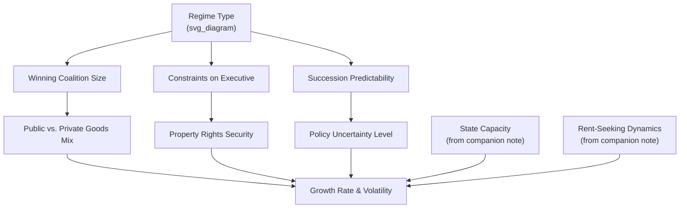

## Democracy versus Authoritarianism and Growth

### Definition and Core Concepts

This topic examines whether and how **political regime type**—the degree to which political power is constrained by competitive elections, checks on the executive, and civil liberties (democracy) versus concentrated in an unelected or minimally accountable ruler/elite (authoritarianism)—causally affects economic growth and development outcomes. It is among the most extensively studied and least conclusively resolved questions in comparative political economy.

- **Democracy** (in the standard operationalization used across this literature, e.g., Polity IV/V, Freedom House, or the binary Przeworski et al. classification) is typically defined by competitive, contested executive selection, meaningful constraints on executive power, and protection of political participation rights
- **Authoritarianism** covers a heterogeneous set of regime types—personalist dictatorships, single-party states, military juntas, monarchies—that the literature increasingly treats as analytically distinct from one another rather than a single undifferentiated category
- The **"regime type and growth" debate** asks whether democracy causes faster, slower, or statistically indistinguishable growth relative to authoritarianism, and—more productively in recent scholarship—*which features* of each regime type (constraints on the executive, policy stability, human capital investment, redistribution pressure) drive divergent growth outcomes

**Key Points**

- This topic functions as a synthesis and stress test of the chapter's other themes: democracy and authoritarianism are best understood not as direct growth determinants but as different configurations of the political-institutional variables already discussed (constraints on power, property rights security, state capacity investment incentives, reform credibility)
- The empirical literature has moved substantially away from simple binary regime-type regressions toward disaggregated analysis of specific institutional features and toward within-regime-type heterogeneity (i.e., "which autocracies" and "which democracies" grow, not just "autocracy vs. democracy" on average)

### Theoretical Foundations

#### The "Compatibility" View: Institutions as the Deep Determinant (AJR Framework)

Acemoglu, Johnson, and Robinson's institutions framework (introduced in the companion Property Rights note) implies that regime type matters for growth primarily *through* its effect on economic institutions—property rights security, constraints on expropriation—rather than through electoral competition per se. In this view, a well-institutionalized authoritarian regime with credible constraints on arbitrary expropriation (e.g., via strong bureaucratic/legal institutions, elite power-sharing arrangements, or reputational concerns) can support growth comparably to a democracy, while a poorly institutionalized "democracy" with weak rule of law and elite capture of formal democratic processes may not outperform authoritarian alternatives.

$$\text{Growth} = f(\text{Constraints on Executive}, \text{Property Rights Security}) \quad \text{regime label is a noisy proxy for these}$$

#### The "Political Survival" / Selectorate Theory View

Bueno de Mesquita, Smith, Siverson, and Morrow's (2003) **selectorate theory** models political leaders as choosing policy to maximize their probability of political survival, which depends on the size of their "winning coalition" (the group of supporters whose backing is necessary to retain power) relative to the broader "selectorate" (those with a formal say in selecting the leader):

$$W/S \text{ ratio (winning coalition size relative to selectorate size)} \rightarrow \text{Public goods vs. private goods provision mix}$$

Democracies typically have large winning coalitions relative to the selectorate, incentivizing leaders to provide broad public goods (which benefit the whole coalition efficiently) rather than narrow private transfers (which would be prohibitively expensive to distribute to a large coalition). Small-coalition authoritarian regimes, by contrast, can retain power more cheaply by providing concentrated private goods (patronage, rents) to a narrow support base, reducing the incentive for broad-based public goods provision (education, health, infrastructure) that support long-run growth.

**Key Points**

- Selectorate theory predicts regime-type effects operate primarily through the *public-versus-private-goods provision mix*, not through growth-oriented policy competence per se—this reframes the classic "democracy vs. autocracy" question as fundamentally about coalition size and accountability structure, echoing and extending the state-capacity and rent-seeking mechanisms discussed in earlier companion notes
- This framework helps explain heterogeneity *within* authoritarian regimes: small-coalition personalist dictatorships (predicted to underperform on public goods) versus larger-coalition single-party or military regimes with broader elite power-sharing (predicted to invest more in public goods, closer to democratic outcomes)

#### The "Uncertainty and Policy Volatility" View

A distinct theoretical strand emphasizes that democracies, through regular contested elections and institutionalized succession, provide more *predictable* and *credible* long-run policy environments than many authoritarian regimes, where succession crises, arbitrary leader turnover, and the absence of institutionalized constraints create policy uncertainty that discourages long-horizon investment—connecting directly to the investment-security mechanisms discussed in the companion Property Rights note. Formally, if investors discount expected returns by regime-type-specific policy volatility $\sigma^2_{\text{regime}}$:

$$E[V(I)] = R(I) - \gamma \cdot \sigma^2_{\text{regime}} \cdot I^2$$

higher policy uncertainty under some (though not all) authoritarian regimes reduces optimal investment $I^*$ relative to a more institutionally stable democratic or well-institutionalized authoritarian alternative.

#### The "Autocratic Advantage" / Developmental State View

A competing theoretical tradition (associated with East Asian "developmental state" scholarship—Amsden, Wade, Johnson—applied to South Korea, Taiwan, and Singapore's authoritarian-era growth) argues that authoritarian regimes can, under specific conditions, more easily implement growth-promoting but politically costly policies (financial repression to fund industrial investment, wage suppression, land reform against landed elite interests, resistance to short-run redistributive pressure) without facing the electoral constraints that might otherwise block such reforms—an argument closely related to the "insulated technocracy" thesis in the political economy of reform literature.

**Key Points**

- These four theoretical views are not mutually exclusive; contemporary scholarship generally treats them as identifying different *conditional* mechanisms rather than competing universal claims, consistent with the broader pattern (seen throughout this chapter) of the literature moving from unconditional claims toward interaction-effect and heterogeneity-focused frameworks

### Empirical Evidence: Cross-Country Regressions

#### Przeworski and Limongi (1993) — Early Survey and Null Result

Przeworski and Limongi's influential survey of the early cross-country literature concludes that the evidence up to that point did not support a robust, unconditional growth advantage for either democracy or authoritarianism—among the most frequently cited "no clear average effect" findings in the literature, and a result that has proven remarkably durable across subsequent decades of additional data and methodological refinement.

#### Barro (1996) — Nonlinear/Inverted-U Relationship

Barro's cross-country panel regressions find a nonlinear relationship: democracy is associated with faster growth at *low* initial levels of democratic development, but the relationship weakens and can turn negative at *high* levels of democracy, generating an inverted-U pattern he interprets as consistent with a "threshold" level of political rights being growth-supporting (via constraints on expropriation) while further democratization beyond that point may increase redistributive pressure with more ambiguous growth effects.

#### Acemoglu, Naidu, Restrepo, and Robinson (2019) — "Democracy Does Cause Growth"

Using a large panel dataset and addressing reverse-causality concerns through dynamic panel methods, this influential and comparatively recent study finds that democratization is associated with a substantial and statistically robust *increase* in subsequent GDP per capita growth (their headline estimate suggests roughly 20% higher long-run GDP from democratization relative to remaining non-democratic, materializing gradually over one to two decades), operating primarily through channels of increased investment, education spending, and reduced social unrest—among the most methodologically careful recent contributions supporting a positive average democracy effect.

$$\Delta \log(\text{GDP}_{it}) = \alpha + \beta \cdot \text{Democracy}_{i,t-1} + \text{country FE} + \text{year FE} + \varepsilon_{it}, \quad \hat{\beta} > 0 \text{ and significant}$$

[Unverified] While methodologically influential, this finding has not fully displaced the earlier "no clear effect" consensus in the broader field; the estimated effect sizes and the plausibility of the identifying assumptions (that democratization timing is not driven by anticipated future growth) remain subjects of ongoing methodological discussion, and readers should treat this as an important but not universally settled contribution rather than a closed question.

#### Cross-Country Variance Findings: Growth Volatility, Not Just Growth Level

A separate and somewhat more robust empirical finding across multiple studies (including work by Quinn and Woolley 2001, and others) is that democracies exhibit **lower growth volatility** than autocracies, even where average growth rates are similar—autocracies show both the highest and lowest growth episodes in cross-country samples (e.g., some of the fastest-growing East Asian "tiger" economies were authoritarian during their rapid growth phases, but so were some of the worst-performing economies, such as several Sub-Saharan African kleptocracies and North Korea), while democracies cluster more narrowly around moderate positive growth. This "variance" finding is arguably better empirically supported than claims about differences in the *average* growth rate.

**Key Points**

- The cross-country average-growth-rate literature has genuinely mixed and evolving findings, ranging from "no significant difference" (Przeworski and Limongi) to "positive democracy effect" (Acemoglu et al. 2019), with the balance of recent, more methodologically careful work leaning toward a modest positive average democracy effect, though this remains an active area of debate rather than settled consensus
- The **volatility/variance** finding—that authoritarian regimes produce a wider dispersion of growth outcomes (both spectacular successes and catastrophic failures) while democracies cluster around more moderate outcomes—is comparatively more robust across studies and arguably more analytically useful than debates over average effects alone

### Case Study Evidence: Regime Heterogeneity

#### East Asian Developmental States (South Korea, Taiwan, Singapore)

These economies achieved historically exceptional growth rates during periods of authoritarian or semi-authoritarian rule (South Korea under Park Chung-hee, Taiwan under Kuomintang single-party rule, Singapore under the People's Action Party), frequently cited as evidence for the "autocratic advantage" thesis. However, all three cases are also characterized by unusually strong bureaucratic capacity (Weberian, meritocratic civil services per the companion State Capacity note), significant land reform that weakened traditional landed elite rent-seeking, and export-oriented industrial policy—complicating any simple "authoritarianism causes growth" reading, since [Inference] the specific *combination* of authoritarian political control with strong state capacity and elite-constraining reforms may be doing more causal work than the authoritarian regime type per se, an interpretation broadly consistent with the AJR institutions-first framework above.

#### Sub-Saharan African Authoritarian Regimes (Contrast Cases)

Many Sub-Saharan African authoritarian regimes during the same broad historical period (1960s–1990s) experienced stagnant or declining per capita growth alongside extensive rent-seeking, weak bureaucratic capacity, and (per the companion Corruption and Resource Curse notes) frequently resource-rent-dependent, low-accountability governance—illustrating the wide variance in authoritarian-regime growth outcomes noted in the cross-country volatility finding above, and reinforcing that "authoritarianism" alone is not a sufficient predictor of either strong or weak growth without reference to accompanying state capacity and institutional characteristics.

#### China's Post-1978 Growth Under Single-Party Authoritarian Rule

China's sustained high growth since market-oriented reforms began in 1978, achieved under continuous single-party authoritarian political control, is among the most frequently invoked contemporary cases in this debate. Explanations offered in the literature range from strong (if imperfectly constrained) bureaucratic and administrative capacity, gradualist reform sequencing (companion Political Economy of Reform note), local government competition and performance-based cadre promotion incentives (Li and Zhou 2005 and related work on China's political meritocracy/tournament model), to more skeptical readings emphasizing that China's growth may reflect catch-up convergence dynamics and specific historical/demographic factors not easily generalizable to other authoritarian contexts. [Inference] Whether China's trajectory should be read as evidence for an authoritarian growth advantage, or as a case where growth occurred *despite* rather than *because of* authoritarian political control (with success driven by other institutional and policy factors), remains a genuinely contested interpretive question in the literature rather than one with a clear resolution.

### Growth-Regime Interaction Diagram

### Mechanisms Linking Regime Type to Development Outcomes

#### 1. Public Goods Provision Channel (Selectorate Theory)

Large-coalition regimes (most democracies, some broad-based single-party or power-sharing authoritarian regimes) have stronger incentives to invest in broadly beneficial public goods (education, health, infrastructure) than small-coalition regimes reliant on narrow patronage.

#### 2. Property Rights and Expropriation Risk Channel

Constraints on executive power—whether from electoral accountability or from institutionalized elite power-sharing arrangements within an authoritarian system—reduce arbitrary expropriation risk, directly connecting to the companion Property Rights note's investment-security mechanism.

#### 3. Policy Volatility and Succession Channel

Institutionalized, predictable leadership transitions (whether democratic elections or well-established authoritarian succession rules) reduce policy uncertainty; regimes with unpredictable, contested, or violent succession processes impose an uncertainty premium on long-horizon investment.

#### 4. Redistributive Pressure Channel

Democracies with broad-based electoral competition may face stronger pressure for short-run redistribution (potentially at the expense of long-run investment), an argument associated with median-voter-theorem-based political economy models, though this channel's empirical importance is genuinely disputed relative to the public-goods-provision channel above, which points in the opposite direction.

#### 5. Reform Implementation Capacity Channel

As discussed in the companion Political Economy of Reform note, some authoritarian regimes with strong bureaucratic capacity may implement politically costly but growth-promoting reforms (financial repression for investment mobilization, land reform against elite interests) with fewer electoral veto points than democracies, though this "insulated technocracy" advantage appears highly conditional on the *quality* of the insulated bureaucracy, per the East Asian versus Sub-Saharan African contrast above.

### Regime Type and Development Outcome Comparison

**Example**

| Dimension | Typical Democratic Pattern | Typical Authoritarian Pattern (Heterogeneous) |
| --- | --- | --- |
| Average growth rate | Moderate, evidence increasingly leans positive relative to autocracy (Acemoglu et al. 2019) | Highly variable—includes both fastest and slowest growth episodes in cross-country data |
| Growth volatility | Generally lower | Generally higher (wider dispersion of outcomes) |
| Public goods provision | Generally broader-based (large winning coalition) | Depends heavily on coalition size/type—broad in some single-party/power-sharing regimes, narrow in personalist dictatorships |
| Policy/succession predictability | Institutionalized via regular elections | Highly variable—institutionalized in some single-party systems, highly unpredictable in personalist regimes |
| Vulnerability to elite capture/rent-seeking | Present but constrained by electoral accountability and civil liberties | Varies with degree of institutionalized power-sharing; can be severe in low-capacity personalist regimes |
| Illustrative high-growth cases | Post-war Western Europe, contemporary India (mixed record) | South Korea, Taiwan, Singapore (authoritarian-era), contemporary China |
| Illustrative low-growth cases | Some fragile/weakly institutionalized democracies | Several Sub-Saharan African kleptocracies, North Korea |

### Interaction with the Broader Institutions Framework

This topic functions as a capstone synthesis of the chapter's preceding themes:

- **Property rights and rule of law**: regime type is best understood as one determinant (among several) of whether credible constraints on expropriation and predictable contract enforcement exist—the AJR institutions-first view treats these underlying institutional features, not the democracy/autocracy label itself, as the deeper causal variable
- **Corruption**: selectorate theory's small-coalition prediction directly parallels the companion Corruption note's Klitgaard formula—narrow winning coalitions correspond to concentrated discretion with weak broad-based accountability, a structural predisposition toward corruption
- **State capacity**: the Besley-Persson framework's political-stability and political-cohesion determinants of capacity investment (companion State Capacity note) apply across both regime types; well-institutionalized authoritarian regimes and consolidated democracies can both generate the political conditions favorable to capacity investment, while weakly institutionalized versions of either regime type tend to underinvest
- **Rent-seeking and the resource curse**: the resource curse literature's finding that resource wealth is particularly damaging under weak accountability structures (companion note) is a direct application of the selectorate/winning-coalition logic—resource rents allow narrow-coalition regimes to fund patronage without broad-based taxation, reinforcing low accountability
- **Political economy of reform**: the "insulated technocracy" argument for authoritarian reform capacity directly engages the companion Political Economy of Reform note's discussion of Olson-style concentrated-interest veto points, positing that authoritarian regimes face fewer such veto points—though at the cost of weaker commitment credibility per the Acemoglu-Robinson framework discussed there

### Critiques and Open Debates

- **Persistent lack of empirical consensus on average effects**: despite decades of research and increasingly sophisticated identification strategies, the field has not converged on a settled answer to whether democracy causes faster growth on average; Acemoglu et al. (2019) represents an important recent contribution toward a positive-effect consensus, but does not resolve the debate definitively, and reasonable methodological disagreement persists
- **Regime type as a coarse/noisy proxy**: a recurring critique (implicit throughout this note) is that "democracy" and "authoritarianism" are heterogeneous categories bundling together very different underlying institutional configurations (winning coalition size, bureaucratic capacity, elite power-sharing arrangements, succession rules); much contemporary research has shifted toward disaggregating these underlying features rather than testing the binary regime label directly, following the broader trajectory of the institutions literature discussed throughout this chapter
- **Reverse causality and selection into regime type**: countries do not randomly become democracies or autocracies; income level, historical institutional legacy, and other confounds that also affect growth complicate causal inference in both directions, a concern the Acemoglu et al. (2019) paper attempts to address methodologically but which remains a live methodological issue in the broader literature
- **Generalizability of developmental-state cases**: the East Asian authoritarian growth "miracle" cases are frequently invoked but represent a small number of historically and geopolitically specific episodes (Cold War-era U.S. strategic support, specific land reform histories, particular bureaucratic traditions); [Speculation] whether these cases offer a generalizable "authoritarian development model" or are better understood as historically contingent and largely non-replicable is a genuinely open interpretive question, with the weight of comparative evidence (given the poor performance of many other authoritarian regimes) leaning toward skepticism about generalizability

### Related Topics

- Property rights and economic development (institutions-first interpretation of regime effects)
- Rule of law and contract enforcement (constraints-on-executive channel)
- Corruption and its effects on development (selectorate theory parallel)
- State capacity and development outcomes (political stability and capacity investment incentives)
- Political economy of reform (insulated technocracy and veto-point arguments)
- Rent-seeking and the resource curse (winning-coalition and accountability parallels)
- Selectorate theory and the logic of political survival (Bueno de Mesquita et al.)
- East Asian developmental state literature (Amsden, Wade, Johnson)
- Extractive vs. inclusive political institutions (Acemoglu and Robinson)
- Political meritocracy and cadre incentive systems (China-focused literature)