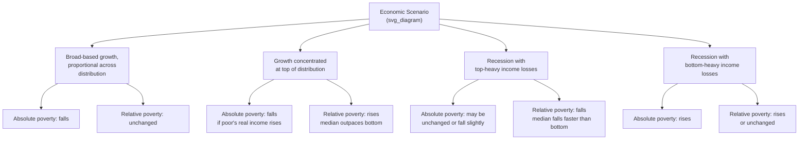

## Absolute versus Relative Poverty Concepts

### Definition and Core Concepts

**Absolute poverty** defines deprivation relative to a fixed, minimum standard of material welfare deemed necessary for basic subsistence—typically anchored in the cost of a basket of goods (food, and often non-food essentials) required to meet minimum nutritional and living needs, independent of the surrounding society's overall income level. **Relative poverty** defines deprivation relative to the prevailing living standards of the society in which a person lives—typically a fraction of median or mean income/consumption in that society—so that the poverty threshold moves with overall economic conditions.

- **Absolute poverty line**: a threshold fixed in *real* terms (constant purchasing power) across time and, in international comparisons, across countries via purchasing power parity (PPP) adjustment—e.g., the World Bank's International Poverty Line
- **Relative poverty line**: a threshold defined as a percentage of a distributional statistic of the *same* population being measured—e.g., 50% or 60% of national median equivalized household income, the standard EU and OECD convention
- **Anchored (or "quasi-relative") poverty line**: a hybrid approach that fixes a relative line at a point in time and then holds it fixed in real terms going forward, used to track absolute progress against a line that was originally set relative to a specific period's living standards (common in EU social inclusion monitoring)

**Key Points**

- The absolute/relative distinction is fundamentally about *what poverty measures respond to*: absolute poverty falls (mechanically) whenever real incomes rise for the poor, regardless of what happens to the rest of the distribution; relative poverty can remain unchanged or even rise during a period of broad-based income growth if growth is not proportionally shared, and can fall during a recession if incomes at the top fall faster than at the bottom
- Neither concept is "more correct" in an absolute sense—they encode different normative judgments about what poverty *is* (a state of insufficient resources to meet basic needs, versus a state of social exclusion relative to prevailing community standards), a distinction elaborated further below

### Theoretical and Philosophical Foundations

#### Absolute Poverty: The Subsistence Tradition

The absolute poverty tradition traces to Seebohm Rowntree's (1901) pioneering poverty studies in York, England, which defined "primary poverty" using a costed basket of minimum nutritional requirements plus minimal non-food necessities—an approach subsequently formalized and extended in the cost-of-basic-needs (CBN) methodology widely used in developing-country poverty measurement (Ravallion 1994, 1998). The underlying philosophical position is that poverty represents a failure to meet objectively definable minimum physiological and functional needs, largely independent of how the rest of society lives.

$$z^{\text{absolute}} = \sum_i p_i \cdot q_i^{\text{min}}$$

where $z$ is the poverty line, $p_i$ are prices, and $q_i^{\text{min}}$ are the minimum quantities of good $i$ (calories, essential non-food items) deemed necessary for basic functioning.

#### Relative Poverty: The Social Exclusion / Relative Deprivation Tradition

The relative poverty tradition is most closely associated with Peter Townsend's (1979) critique of purely subsistence-based measures, arguing that poverty is fundamentally a socially constructed condition: individuals are poor when they lack the resources to participate in the customary activities, diet, and living conditions considered normal in their society, even if they can meet minimum caloric/physiological needs. This connects to Amartya Sen's (1983, 1985) broader **capability approach**, which argues that the *commodities* required to achieve the same *functioning* (e.g., "appearing in public without shame," a functioning Sen explicitly attributes to Adam Smith's discussion of necessities) vary systematically with a society's average living standard—so that what counts as a "minimum needs" basket is itself partly relative to social context even under an ostensibly absolute framework.

$$z^{\text{relative}} = \theta \cdot m, \quad \theta \in (0,1)$$

where $m$ is median (or mean) income/consumption in the reference population and $\theta$ is a conventionally chosen fraction (commonly 0.5 or 0.6).

**Key Points**

- Sen's capability framework is frequently invoked to argue that the absolute/relative dichotomy is, at a deeper conceptual level, a false binary: the *capabilities* required for basic functioning (nutrition, social participation, dignity) may be genuinely universal/absolute, while the specific *commodity bundle* needed to achieve those capabilities is relative to social and economic context—this reframing (sometimes called "absolute poverty in the space of capabilities, relative in the space of commodities") has been influential in bridging the two traditions rather than treating them as strictly opposed
- Townsend's original operationalization drew methodological criticism (notably from Amartya Sen and separately from Piachaud 1981) for using an essentially arbitrary statistical cutoff (households below a certain income threshold showing a sharp increase in the number of "deprivation indicators" they lack) rather than a theoretically grounded minimum-needs derivation—an early instance of the broader "line-setting arbitrariness" critique that applies to both absolute and relative approaches

### Formal Construction and International Practice

#### The World Bank International Poverty Line (Absolute, PPP-Adjusted)

The World Bank's international extreme poverty line is the most widely used global absolute poverty benchmark, constructed by:

1. Identifying national poverty lines from the poorest countries in the world
2. Converting these national lines into a common currency using Purchasing Power Parity (PPP) exchange rates (which account for cross-country differences in the cost of non-tradable goods and services, unlike market exchange rates)
3. Taking a representative value (historically the mean or median of these lines) as the global line

The line has been periodically revised as underlying PPP price data (International Comparison Program rounds) are updated: $1.00/day (1990 base), $1.25/day (2005 PPP), $1.90/day (2011 PPP), and $2.15/day (2017 PPP) in the most recent major revision. [Unverified] Given the pace of methodological updates, readers should verify the currently operative line and PPP base year directly against current World Bank PovcalNet/Poverty and Inequality Platform documentation, as further revisions may have occurred since this note's reference period.

$$\text{Headcount}_{\text{absolute, global}} = \frac{1}{N} \sum_{i=1}^N \mathbb{1}[y_i < z^{\text{PPP}}]$$

#### National Absolute Poverty Lines (Cost-of-Basic-Needs Method)

Most developing-country governments maintain a national absolute poverty line constructed via the cost-of-basic-needs (CBN) approach (Ravallion 1994, 1998): a food poverty line is set as the cost of a reference basket delivering a specified minimum caloric intake (commonly around 2,100–2,200 kcal/day per adult equivalent, though exact standards vary by country and body), and a non-food allowance is added—either by direct costing of minimum non-food essentials, or by scaling up the food line using the budget share the poor typically devote to food (the Engel-curve-based approach).

$$z^{\text{CBN}} = z^{\text{food}} \times \left(1 + \text{non-food allowance ratio}\right)$$

#### OECD and EU Relative Poverty Conventions

The OECD and European Union's standard relative poverty (formally "at-risk-of-poverty") threshold is set at 50% (OECD convention) or 60% (EU convention) of national median equivalized disposable household income, using an equivalence scale (commonly the OECD-modified scale) to adjust for household size and composition:

$$z^{\text{relative}}_{\text{EU}} = 0.60 \times \text{median}(y^{\text{equiv}})$$

**Key Points**

- Absolute poverty lines are held fixed in real (inflation-adjusted) terms over time within a country, and PPP-adjusted for cross-country comparison; relative poverty lines automatically update each period based on the *contemporaneous* income distribution of the population being measured, which is the source of their fundamentally different behavior during periods of broad income growth or decline
- The specific $\theta$ (50% vs. 60%) and equivalence scale choices in relative poverty measurement are conventional rather than theoretically derived, paralleling the line-arbitrariness critique noted above for Townsend's original approach

### Behavioral Divergence: Absolute vs. Relative Measures Over Time

**Example**

A stylized numerical illustration of the divergence: suppose a country's median income rises from 100 to 150 (a 50% increase) while the income of a household initially at 40 rises only to 50 (a 25% increase, in real terms an actual improvement in living standards).

- Against a fixed absolute line of, say, 35 (in the same real units): this household was above the line before (40 > 35) and remains above it after (50 > 35)—**no change in absolute poverty status**, and indeed the household's real welfare has improved
- Against a relative line of 50% of median: the line was 50 before (household at 40 was *below* it, i.e., poor) and rises to 75 after (household at 50 remains *below* it, still poor)—**no change in relative poverty status either**, but for an entirely different reason: the household's income grew more slowly than the median, so it fell further behind in *relative* terms even while gaining in *absolute* terms

This numerical case illustrates the core conceptual point: a household can simultaneously experience genuine absolute welfare improvement while its *relative* position in society stagnates or worsens—both measurements are "correct" in their own terms, but they answer different questions.

### Standard Poverty Measurement Formalism (Applies to Both Concepts)

Once a poverty line $z$ (absolute or relative) is chosen, standard poverty indices apply identically regardless of which line type is used. The **Foster-Greer-Thorbecke (FGT)** class of poverty measures (Foster, Greer, and Thorbecke 1984) is the dominant framework:

$$FGT_\alpha = \frac{1}{N} \sum_{i=1}^{N} \left(\frac{z - y_i}{z}\right)^\alpha \cdot \mathbb{1}[y_i < z]$$

where $\alpha \geq 0$ is a poverty-aversion parameter:

| $\alpha$ | Measure Name | Interpretation |
| --- | --- | --- |
| 0 | Headcount ratio ($P_0$) | Share of population below the poverty line—captures incidence but not depth |
| 1 | Poverty gap ratio ($P_1$) | Average normalized shortfall below the line across the whole population (zero for the non-poor)—captures depth |
| 2 | Squared poverty gap / poverty severity ($P_2$) | Weights larger shortfalls more heavily—captures severity/inequality among the poor |

**Key Points**

- The FGT framework is *measure-agnostic* with respect to the absolute/relative distinction—the choice of $z$ determines *who* counts as poor and by how much, while $\alpha$ determines *how* that shortfall information is aggregated into a summary statistic; these are independent methodological choices
- Because relative poverty lines move with the distribution being measured, relative FGT measures can behave counterintuitively during recessions (a "shrinking median" can mechanically reduce measured relative poverty even as absolute material conditions worsen for the poor)—a well-recognized measurement artifact that motivated the "anchored poverty line" hybrid approach used in EU social monitoring

### Comparative Table: Absolute vs. Relative Poverty

**Example**

| Dimension | Absolute Poverty | Relative Poverty |
| --- | --- | --- |
| Reference standard | Fixed minimum needs basket (real terms) | Percentage of contemporaneous distributional statistic (e.g., median income) |
| Response to broad-based growth | Falls as real incomes of the poor rise | Can remain unchanged if growth is proportional across distribution |
| Response to recession | Rises if real incomes of the poor fall | Can fall if incomes at top fall faster (shrinking median) |
| Cross-country comparability | Enabled via PPP adjustment (World Bank international line) | Typically country-specific (each country's own median); cross-country comparison requires care |
| Primary theoretical grounding | Subsistence/basic needs tradition (Rowntree, Ravallion CBN method) | Relative deprivation/social exclusion tradition (Townsend, Sen's capability approach) |
| Typical use context | Global/developing-country poverty monitoring (World Bank, national CBN lines) | High-income country social policy monitoring (OECD, EU at-risk-of-poverty rate) |
| Key critique | Arbitrary calorie/basket standard; ignores social participation needs | Arbitrary percentage threshold; can produce counterintuitive recession dynamics |

### Absolute and Relative Poverty Line Behavior (SVG)

<svg xmlns="http://www.w3.org/2000/svg" viewBox="0 0 720 340" font-family="Helvetica, Arial, sans-serif">
<text x="360" y="26" text-anchor="middle" font-size="16" font-weight="bold" fill="#1a1a1a">Poverty Line Trajectories Over Time (svg_diagram)</text>
<line x1="70" y1="290" x2="670" y2="290" stroke="#333" stroke-width="2" />
<line x1="70" y1="290" x2="70" y2="60" stroke="#333" stroke-width="2" />
<text x="370" y="320" text-anchor="middle" font-size="12" fill="#1a1a1a">Time (economic growth period)</text>
<text x="35" y="175" text-anchor="middle" font-size="12" fill="#1a1a1a" transform="rotate(-90 35 175)">Real Income Level</text>
<line x1="90" y1="230" x2="650" y2="230" stroke="#c0392b" stroke-width="2.5" stroke-dasharray="6,3" />
<text x="500" y="220" font-size="12" fill="#c0392b" font-weight="bold">Absolute poverty line (fixed real value)</text>
<path d="M 90 230 Q 370 150 650 90" fill="none" stroke="#2874a6" stroke-width="2.5" stroke-dasharray="6,3" />
<text x="480" y="105" font-size="12" fill="#2874a6" font-weight="bold">Relative poverty line (50% of rising median)</text>
<path d="M 90 210 Q 370 190 650 175" fill="none" stroke="#1e8449" stroke-width="2.5" />
<text x="480" y="195" font-size="12" fill="#1e8449" font-weight="bold">Poor household's actual income path</text>

<text x="150" y="255" font-size="11" fill="#333">Below both lines</text>

<text x="420" y="150" font-size="11" fill="#333">Above absolute line,</text>

<text x="420" y="165" font-size="11" fill="#333">still below relative line</text>

</svg>

### Measurement Debates and Methodological Issues

#### The Line-Setting Arbitrariness Critique

Both absolute and relative approaches face a version of the same underlying critique: the specific threshold chosen (2,100 kcal, 50% vs. 60% of median, a particular non-food allowance ratio) is a conventional judgment rather than a scientifically derived cutoff, and different reasonable choices can meaningfully change measured poverty rates and trends. This has motivated the widespread use of **poverty profiles across a range of lines** (rather than reporting a single headcount at one line) and stochastic dominance techniques (Atkinson 1987; Foster and Shorrocks 1988) that test whether poverty comparisons (e.g., country A has more poverty than country B, or poverty fell over time) are robust across a *wide range* of plausible poverty lines rather than depending on one specific threshold.

#### Multidimensional Poverty as a Complementary (Not Competing) Framework

Both absolute and relative income/consumption poverty concepts are unidimensional (measuring a single resource variable). The **Multidimensional Poverty Index** (Alkire and Foster 2011, implemented globally by UNDP/OPHI) measures deprivation directly across multiple domains (health, education, living standards) using an absolute-style cutoff-based methodology within each dimension, representing a distinct methodological axis (dimensionality) that cuts across, rather than substitutes for, the absolute/relative distinction discussed in this note. [Inference] Multidimensional and monetary poverty measures (whether absolute or relative) frequently identify overlapping but non-identical sets of "poor" households in empirical applications, reflecting genuine differences in what each approach captures rather than measurement error in either.

#### Equivalence Scales and Household Composition

Both absolute and relative poverty measurement require converting household-level income/consumption into comparable per-capita or per-adult-equivalent terms, using an equivalence scale that accounts for economies of scale in household consumption (e.g., shared housing costs) and different needs by age (children typically assigned lower weights than adults). Choice of equivalence scale (OECD-modified, square-root scale, and others) is itself a further methodological decision that can materially affect measured poverty rates and comparisons across household types—a technical issue orthogonal to, but interacting with, the absolute/relative choice.

### Related Topics

- Foster-Greer-Thorbecke poverty index family and axiomatic poverty measurement
- Multidimensional Poverty Index and the capability approach (Sen, Alkire and Foster)
- Purchasing power parity adjustment and cross-country welfare comparison
- Cost-of-basic-needs methodology and national poverty line construction (Ravallion)
- Inequality measurement (Gini coefficient, Lorenz curves) and its relationship to relative poverty
- Poverty dynamics: chronic versus transient poverty
- Stochastic dominance and robustness of poverty comparisons across lines
- Equivalence scales and household welfare measurement
- Growth incidence curves and pro-poor growth measurement
- Social exclusion and non-monetary deprivation indicators