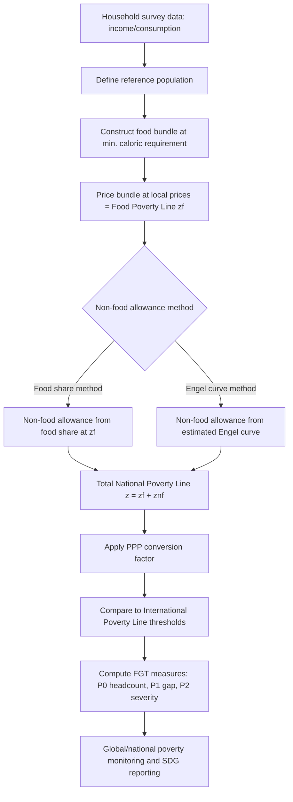

## Poverty Lines and International Poverty Thresholds

### Definition and Conceptual Foundations

A poverty line is a threshold level of income, consumption, or welfare below which an individual or household is classified as poor. Poverty lines serve as the operational boundary that converts a continuous welfare distribution into a binary (or graduated) classification of poor versus non-poor, enabling headcount measurement, targeting, and policy evaluation.

Poverty lines are generally derived from one of two conceptual traditions:

- **Absolute poverty lines**: Fixed in terms of real purchasing power, representing a threshold sufficient to meet a defined basket of basic needs (food and non-food essentials) regardless of the overall income distribution of the society.
- **Relative poverty lines**: Defined relative to the overall distribution of income or consumption in a society (e.g., 50% or 60% of median income), reflecting the idea that poverty is partly about social exclusion and relative deprivation, not just physical subsistence.

A third category, **subjective poverty lines**, derives thresholds from survey respondents' own assessments of the income needed to make ends meet, though these are less commonly used in official statistics due to comparability problems across contexts.

### The Cost of Basic Needs (CBN) Method

The dominant approach to constructing absolute, country-specific poverty lines is the **Cost of Basic Needs (CBN)** method, developed and formalized in the World Bank tradition (notably by Martin Ravallion). It proceeds in stages:

1. **Define a reference population**: Typically households in the lower-middle segment of the consumption distribution, used to derive realistic consumption patterns.
2. **Construct a food poverty line**: Identify a food bundle that delivers a minimum caloric requirement (commonly 2,100 kcal/person/day, though this varies by country and demographic composition), priced at local prices, consistent with the consumption patterns of the reference group.
3. **Add a non-food allowance**: Estimate the non-food spending of households whose food spending is near the food poverty line, using either:
   - **Food share method**: Non-food allowance implied by the share of food in total spending for households at the food poverty line.
   - **Engel curve method**: Statistically estimating the non-food allowance from the relationship between food share and total expenditure.
4. **Sum to obtain the total poverty line**: Food poverty line + non-food allowance = total (absolute) poverty line.

$$z = z_f + z_{nf}$$

where $z$ is the total poverty line, $z_f$ is the food component, and $z_{nf}$ is the non-food component.

**Key Points**

- CBN lines are anchored to a specific bundle of goods and a specific reference population, which makes them context-appropriate but harder to compare across countries or over long time periods without careful price adjustment.
- Non-food allowances are highly sensitive to the choice of reference group and method (food share vs. Engel curve), and this is a well-documented source of measurement variation. [Inference: the practical magnitude of this sensitivity is country- and dataset-specific and not something that can be generalized without empirical testing.]
- CBN lines require periodic rebasing as consumption patterns, relative prices, and the reference population's composition shift.

### National Poverty Lines vs. International Poverty Lines

**National poverty lines** are set by individual governments (usually statistical agencies or planning ministries) using CBN or similar methods calibrated to that country's own basic needs, prices, and consumption norms. They are the preferred basis for domestic policy targeting because they reflect context-specific costs of living.

**International poverty lines** are designed for cross-country comparison and global poverty monitoring (e.g., tracking progress toward Sustainable Development Goal 1: "End poverty in all its forms everywhere"). Because national lines differ in methodology, reference baskets, and currency, they cannot be directly compared across countries. International lines solve this by:

1. Converting national currency values into a common unit using **Purchasing Power Parity (PPP) exchange rates**, which adjust for cross-country differences in the cost of living, rather than market exchange rates, which reflect only tradable-goods prices and capital flows.
2. Anchoring the global threshold to the **typical national poverty lines of the poorest countries**, so the international line represents what "extreme poverty" means in the world's lowest-income contexts.

### The World Bank's International Poverty Line

The World Bank's International Poverty Line (IPL) is the most widely used global threshold and is the basis for official global poverty headcount estimates and SDG monitoring.

**Historical evolution of the line:**

| Line | Introduced | PPP base year | Basis |
| --- | --- | --- | --- |
| $1/day | 1990 | 1985 PPP | Median of national poverty lines from a sample of low-income countries |
| $1.08/day | 2000 | 1993 PPP | Updated PPP data |
| $1.25/day | 2008 | 2005 PPP | Average of the 15 poorest countries' national poverty lines |
| $1.90/day | 2015 | 2011 PPP | Recalculated average of the poorest countries' lines using updated PPP |
| $2.15/day | 2022 | 2017 PPP | Recalculated average using 2017 PPP round |

The 2022 revision to $2.15/day (2017 PPPs) is the currently operative extreme poverty line as documented by the World Bank's Poverty and Inequality Platform (PIP). [Unverified: exact figures and thresholds should be cross-checked against the current World Bank PIP methodology documentation at time of use, since PPP rounds and line values are periodically revised.]

**Multiple thresholds for different development levels:** Since 2017, the World Bank has supplemented the extreme poverty line with two additional thresholds calibrated to typical national poverty lines at different income levels, recognizing that a single global line is not equally meaningful across the income spectrum:

- **Extreme poverty line**: $2.15/day (2017 PPP) — typical of low-income countries.
- **Lower-middle-income poverty line**: $3.65/day (2017 PPP) — typical of lower-middle-income countries.
- **Upper-middle-income poverty line**: $6.85/day (2017 PPP) — typical of upper-middle-income countries.

**Key Points**

- All these lines represent per-person, per-day consumption or income expressed in PPP-adjusted dollars, not market-exchange-rate dollars.
- The lines are not meant to represent a "true" universal subsistence minimum; they are empirically derived from the national poverty lines that exist in countries at each income tier.
- Because they are anchored to national lines circa a specific data-collection period, periodic revisions when new International Comparison Program (ICP) PPP data become available can produce discontinuous jumps in measured global poverty rates that reflect methodology changes rather than real welfare changes. This is a well-documented feature of the series, not a claim requiring hedging.

### Purchasing Power Parity (PPP) Conversion

PPP conversion factors are central to constructing and applying international poverty lines. A PPP exchange rate is defined as the number of units of a country's currency needed to buy the same basket of goods and services that one US dollar (or another base currency) would buy in the United States (or base country).

$$\text{PPP-adjusted value} = \frac{\text{Local currency value}}{\text{PPP conversion factor}}$$

PPP conversion factors used for poverty measurement are typically **consumption PPPs** (sometimes households' final consumption expenditure PPPs), distinct from GDP PPPs, because they are designed to reflect the cost of a consumption basket relevant to households, not the full economy's output basket.

**Key Points**

- PPPs are produced periodically through the International Comparison Program (ICP), a large multi-country price survey exercise coordinated globally (most recently benchmarked to 2011 and 2017, with a 2021 round underway/rolled out in subsequent years). [Inference: exact ICP round availability and adoption timing should be verified against current World Bank/ICP publications, since rollout schedules are subject to change.]
- PPP conversion introduces its own measurement uncertainty: price surveys may not fully capture rural vs. urban price differences, informal market prices, or goods consumed disproportionately by the poor, which can bias poverty comparisons. [Inference: the direction and magnitude of this bias vary by country and cannot be asserted as a fixed universal pattern.]
- Using market exchange rates instead of PPPs for poverty comparison is a well-known methodological error, since market rates are driven by tradable goods, capital flows, and financial markets rather than the relative cost of living for a typical consumer.

### Constructing a Poverty Headcount from a Poverty Line

Once a poverty line $z$ is defined, the basic **headcount ratio (H)** is computed as:

$$H = \frac{N_{poor}}{N}$$

where $N_{poor}$ is the number of individuals with welfare (income or consumption) below $z$, and $N$ is the total population.

More refined measures build on the headcount using the **Foster–Greer–Thorbecke (FGT) class of poverty measures**:

$$P_\alpha = \frac{1}{N}\sum_{i=1}^{N}\left(\frac{z - y_i}{z}\right)^{\alpha} \cdot \mathbb{1}(y_i < z)$$

where $y_i$ is the welfare measure of individual $i$, $z$ is the poverty line, and $\mathbb{1}(\cdot)$ is an indicator function equal to 1 if the individual is poor and 0 otherwise.

- $\alpha = 0$: headcount ratio (incidence of poverty)
- $\alpha = 1$: poverty gap index (depth of poverty — how far below the line the poor are, on average)
- $\alpha = 2$: squared poverty gap (severity of poverty — gives extra weight to the poorest of the poor)

**Example**

Suppose a population of 5 individuals has daily consumption (PPP-adjusted) of $1.50, $2.00, $2.50, $3.00, and $5.00, with a poverty line $z = \$2.15$.

- Poor individuals: those with $y_i < 2.15$ → $1.50 and $2.00 (2 out of 5 people)
- Headcount ratio: $H = P_0 = 2/5 = 0.40$ (40% poverty rate)
- Poverty gap for each poor person: $(2.15 - 1.50)/2.15 = 0.302$; $(2.15 - 2.00)/2.15 = 0.070$
- Poverty gap index: $P_1 = \frac{1}{5}(0.302 + 0.070 + 0 + 0 + 0) = 0.0744$

This shows how the same poverty line generates not just an incidence figure but also a depth-of-poverty metric, which matters for policy: two countries can have the same headcount ratio but very different average shortfalls below the line.

### Sensitivity, Robustness, and Critiques

**Poverty line arbitrariness**: Any single cutoff introduces discontinuities — someone earning $2.16/day (just above the line) is classified identically to someone earning $20/day, while someone earning $2.14/day is grouped with someone earning $0.10/day. This is a structural property of any threshold-based measure, not a flaw unique to the World Bank's line.

**Stochastic dominance and robustness checks**: To avoid conclusions that hinge entirely on the exact choice of poverty line, researchers commonly test whether poverty comparisons (e.g., between two countries or two time periods) are robust across a *range* of plausible poverty lines, using tools such as **poverty incidence curves (cumulative distribution functions)** and **first-order/second-order stochastic dominance** tests. If Distribution A's CDF lies entirely below Distribution B's CDF over the relevant range of poverty lines, A has unambiguously less poverty than B regardless of exactly where the line is drawn.

**Equivalence scales and household composition**: Poverty lines are typically defined per capita, but households vary in size and composition (children consume less than adults; there are economies of scale in shared housing, utilities, etc.). Many national methodologies apply **equivalence scales** or **adult-equivalent units** to adjust for this, though the World Bank's international line uses a simple per-capita basis for comparability, which is a recognized simplification. [Inference: the practical impact of not using equivalence scales in cross-country comparisons is context-dependent and debated in the literature, not settled.]

**Multidimensional critique**: A substantial body of literature (e.g., Sen's capability approach, the Multidimensional Poverty Index developed by OPHI and UNDP) argues that monetary poverty lines miss non-income dimensions of deprivation — health, education, living standards — and advocates supplementing or replacing monetary lines with multidimensional indices. This is a normative and methodological debate rather than a factual dispute about how monetary lines are constructed.

**Relative vs. absolute debate**: Critics of purely absolute lines (especially in high-income country contexts) argue that a fixed real threshold fails to capture social relative deprivation as economies grow; this underlies the EU's and OECD's preference for relative poverty lines (e.g., 60% of median equivalized income) for their own member states, in contrast to the World Bank's absolute approach for global monitoring.

### Diagram: Poverty Line Construction and Application Pipeline

### Illustration: Poverty Line Relative to a Welfare Distribution

<svg xmlns="http://www.w3.org/2000/svg" viewBox="0 0 700 380">
<text x="350" y="25" text-anchor="middle" font-size="16" font-weight="bold" fill="#1a1a1a">Welfare Distribution and Poverty Line (svg_diagram)</text>
<line x1="60" y1="320" x2="650" y2="320" stroke="#333" stroke-width="2" />
<line x1="60" y1="320" x2="60" y2="50" stroke="#333" stroke-width="2" />
<text x="355" y="355" text-anchor="middle" font-size="13" fill="#333">Daily consumption/income (PPP $)</text>
<text x="25" y="185" text-anchor="middle" font-size="13" fill="#333" transform="rotate(-90 25 185)">Number of people</text>
<path d="M 60 310 Q 150 280 220 200 Q 300 90 380 90 Q 460 90 520 180 Q 590 260 650 305" fill="none" stroke="#2563eb" stroke-width="3" />
<line x1="230" y1="60" x2="230" y2="320" stroke="#dc2626" stroke-width="2" stroke-dasharray="6,4" />
<text x="230" y="45" text-anchor="middle" font-size="13" fill="#dc2626" font-weight="bold">Poverty line (z)</text>
<path d="M 60 310 Q 150 280 220 200 L 230 190 L 230 320 L 60 320 Z" fill="#fca5a5" fill-opacity="0.5" stroke="none" />
<text x="130" y="300" text-anchor="middle" font-size="12" fill="#7f1d1d">Poor</text>
<text x="420" y="300" text-anchor="middle" font-size="12" fill="#1e3a5f">Non-poor</text>
<text x="230" y="335" text-anchor="middle" font-size="11" fill="#333">z</text>
</svg>

**Next Steps**

- Foster–Greer–Thorbecke (FGT) poverty measures in depth (poverty gap and severity indices)
- Multidimensional Poverty Index (MPI) methodology and construction
- Purchasing Power Parity and the International Comparison Program (ICP) methodology
- Equivalence scales and adult-equivalent consumption units
- Stochastic dominance and robustness testing in poverty comparisons
- Inequality measurement (Gini coefficient, Lorenz curves) as a complement to poverty analysis
- Targeting mechanisms for social protection programs using poverty lines (means-testing, proxy means-testing)
- National vs. international poverty line reconciliation and "poverty line harmonization" debates