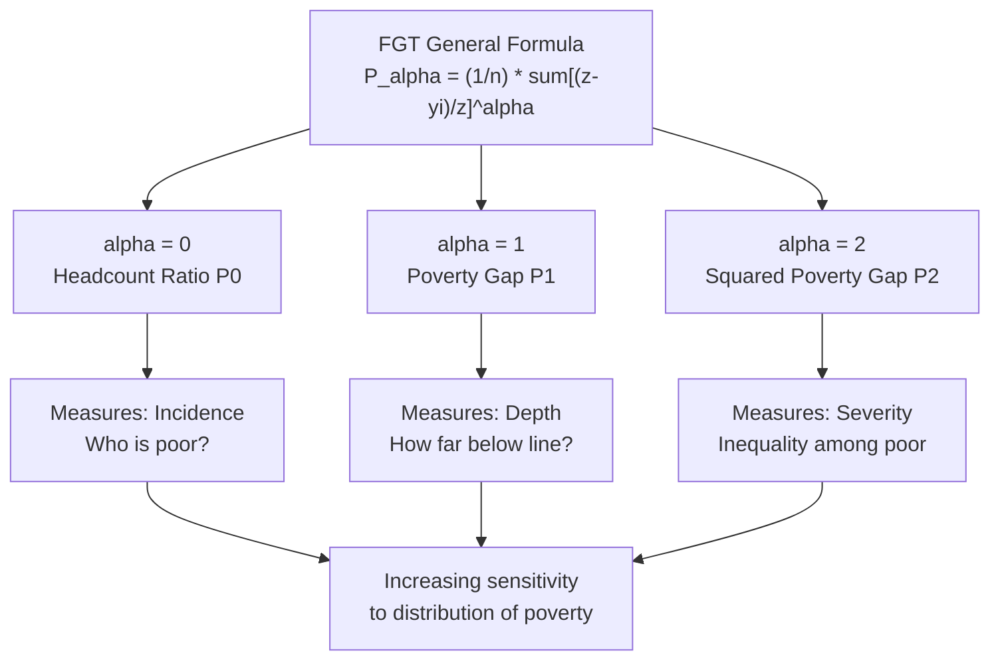

## Headcount Ratio, Poverty Gap, and Squared Poverty Gap

### Overview

These three measures form the **Foster-Greer-Thorbecke (FGT) class of poverty indices**, the most widely used family of poverty measures in development economics. They share a common mathematical structure but differ in a single parameter, $\alpha$, which controls sensitivity to the severity of poverty (i.e., how far below the poverty line the poor actually are).

### The FGT General Formula

The general FGT index is defined as:

$$FGT_{\alpha} = \frac{1}{n} \sum_{i=1}^{q} \left( \frac{z - y_i}{z} \right)^{\alpha}$$

Where:

- $n$ = total population size
- $q$ = number of individuals below the poverty line (the poor)
- $z$ = the poverty line
- $y_i$ = income (or consumption/expenditure) of individual $i$
- $\alpha$ = the "aversion to poverty" parameter ($\alpha \geq 0$)
- $\frac{z - y_i}{z}$ = the normalized poverty gap of individual $i$ (only computed for $y_i < z$; for the non-poor this term is excluded or treated as zero)

Setting $\alpha = 0$, $\alpha = 1$, and $\alpha = 2$ yields the three canonical measures discussed here.

---

### 1. Headcount Ratio ($\alpha = 0$)

#### Definition

The headcount ratio (also called the **headcount index** or **poverty incidence**) is the simplest and most widely reported poverty statistic. It measures the proportion of the population whose income or consumption falls below the poverty line.

$$P_0 = \frac{q}{n}$$

Equivalently, using the FGT formula with $\alpha = 0$, every poor person contributes a value of $1$ (since $\left(\frac{z-y_i}{z}\right)^0 = 1$) regardless of how poor they are, and the sum is simply the count of the poor divided by $n$.

#### Interpretation

- $P_0$ ranges from $0$ (no one is poor) to $1$ (everyone is poor).
- Often reported as a percentage: the "poverty rate" or "poverty headcount ratio."
- Answers the question: **"What fraction of the population is poor?"**

#### Example

Consider a village of $n = 10$ people with the following monthly incomes (in $), and a poverty line of $z = \$50$:

| Person | Income ($y_i$) | Poor? ($y_i < z$) |
| --- | --- | --- |
| 1 | 10 | Yes |
| 2 | 20 | Yes |
| 3 | 30 | Yes |
| 4 | 40 | Yes |
| 5 | 60 | No |
| 6 | 70 | No |
| 7 | 80 | No |
| 8 | 90 | No |
| 9 | 100 | No |
| 10 | 110 | No |

Here $q = 4$ (persons 1–4 are below $z = \$50$), so:

$$P_0 = \frac{4}{10} = 0.40 = 40\%$$

#### Key Limitations

- **Insensitive to the depth of poverty**: A person earning $1 and a person earning $49 are counted identically — both simply "poor." Transferring income from the poorest of the poor to someone just below the line does not change $P_0$.
- **Insensitive to inequality among the poor**: Any redistribution among the poor that keeps everyone below $z$ leaves $P_0$ unchanged.
- **Violates the monotonicity axiom**: If a poor person's income falls further (but remains below $z$), $P_0$ does not register any change. This is why economists rarely use $P_0$ alone.
- Can produce misleading policy signals: a government could reduce $P_0$ substantially by transferring resources to those *just* below the poverty line (the "easiest to lift out"), while ignoring the ultra-poor — even though social welfare arguably worsens or stays flat for the poorest.

---

### 2. Poverty Gap Index ($\alpha = 1$)

#### Definition

The poverty gap index measures not just *how many* are poor, but *how far below* the poverty line they are on average — i.e., the **depth of poverty**, or the aggregate shortfall of the poor from the poverty line, normalized by the poverty line and total population.

$$P_1 = \frac{1}{n} \sum_{i=1}^{q} \frac{z - y_i}{z}$$

An equivalent and highly intuitive decomposition is:

$$P_1 = P_0 \times I$$

where $I$ is the **income gap ratio** (average shortfall of the poor, expressed as a fraction of the poverty line):

$$I = \frac{1}{q} \sum_{i=1}^{q} \frac{z - y_i}{z}$$

This decomposition shows that the poverty gap index is the product of the **incidence** of poverty ($P_0$) and the **intensity** of poverty ($I$) among those who are poor.

#### Interpretation

- $P_1$ can be interpreted as **the minimum cost of eliminating poverty (as a share of the poverty line), if transfers were perfectly targeted** — i.e., the total amount of money needed to bring every poor person's income exactly up to $z$, divided by $n \times z$.
- It satisfies the **monotonicity axiom**: if a poor person's income decreases, $P_1$ increases, correctly reflecting worsened poverty — unlike $P_0$.
- Still does **not** fully capture inequality *among* the poor (see limitation below).

#### Example (continued)

Using the same village data ($z = 50$, $n = 10$, poor = persons 1–4 with incomes 10, 20, 30, 40):

Compute each poor person's normalized gap $\frac{z - y_i}{z}$:

| Person | $y_i$ | $z - y_i$ | $(z-y_i)/z$ |
| --- | --- | --- | --- |
| 1 | 10 | 40 | 0.80 |
| 2 | 20 | 30 | 0.60 |
| 3 | 30 | 20 | 0.40 |
| 4 | 40 | 10 | 0.20 |

Sum of normalized gaps $= 0.80 + 0.60 + 0.40 + 0.20 = 2.00$

$$P_1 = \frac{1}{10} \times 2.00 = 0.20 = 20\%$$

Cross-check via decomposition: $I = \frac{2.00}{4} = 0.50$, and $P_1 = P_0 \times I = 0.40 \times 0.50 = 0.20$. ✓

**Policy interpretation**: To eliminate poverty in this village via perfectly targeted cash transfers, one would need to transfer $\$40+\$30+\$20+\$10 = \$100$ total. As a fraction of $n \times z = 10 \times 50 = 500$, that is $100/500 = 0.20$, matching $P_1$.

#### Key Limitations

- Still **insensitive to inequality among the poor**: transferring $5 from person 1 (income $10) to person 4 (income $40) leaves the sum of gaps — and thus $P_1$ — unchanged, even though most would judge this transfer as increasing the severity of destitution for the poorest person. This is a violation of the **transfer axiom** (also called the Pigou-Dalton principle applied to poverty measurement).

---

### 3. Squared Poverty Gap Index ($\alpha = 2$)

#### Definition

Also called the **poverty severity index**, this measure squares the normalized poverty gap before averaging, which gives disproportionately higher weight to those who are furthest below the poverty line.

$$P_2 = \frac{1}{n} \sum_{i=1}^{q} \left( \frac{z - y_i}{z} \right)^2$$

#### Interpretation

- By squaring the gap, $P_2$ is **sensitive to inequality among the poor** — it satisfies the **transfer axiom**: a transfer from a poorer to a less-poor individual (both remaining poor) increases $P_2$, correctly registering that inequality/severity among the poor has worsened.
- $P_2$ has no simple standalone real-world unit interpretation (unlike $P_0$ as a "rate" or $P_1$ as a "cost share"); it is primarily used as a **relative/comparative severity indicator** — e.g., to rank regions, compare policy scenarios, or track trends in the depth and inequality of poverty over time.
- Because squaring amplifies large gaps, $P_2$ is particularly useful for identifying where the *most acute* deprivation is concentrated, which is critical for targeting interventions like unconditional cash transfers or emergency relief.

#### Example (continued)

Squaring each normalized gap from the table above:

| Person | $(z-y_i)/z$ | $[(z-y_i)/z]^2$ |
| --- | --- | --- |
| 1 | 0.80 | 0.64 |
| 2 | 0.60 | 0.36 |
| 3 | 0.40 | 0.16 |
| 4 | 0.20 | 0.04 |

Sum of squared gaps $= 0.64 + 0.36 + 0.16 + 0.04 = 1.20$

$$P_2 = \frac{1}{10} \times 1.20 = 0.12 = 12\%$$

**Illustrating sensitivity to inequality among the poor**: Suppose $5 is transferred from Person 1 (income $10 → $5) to Person 4 (income $40 → $45):

- New gaps: Person 1: $(50-5)/50 = 0.90$; Person 4: $(50-45)/50 = 0.10$
- New $P_1$: sum of gaps $= 0.90 + 0.60 + 0.40 + 0.10 = 2.00$ → $P_1 = 0.20$ (**unchanged**)
- New $P_2$: sum of squared gaps $= 0.81 + 0.36 + 0.16 + 0.01 = 1.34$ → $P_2 = 0.134$ (**increased** from 0.12)

This confirms $P_2$ correctly detects that poverty has become more severe/unequal among the poor, while $P_1$ and $P_0$ remain blind to this change.

---

### Comparative Summary Table

| Measure | $\alpha$ | Formula | Captures | Satisfies Monotonicity | Satisfies Transfer Axiom |
| --- | --- | --- | --- | --- | --- |
| Headcount Ratio ($P_0$) | 0 | $q/n$ | Incidence (how many poor) | No | No |
| Poverty Gap ($P_1$) | 1 | $\frac{1}{n}\sum (z-y_i)/z$ | Depth/intensity | Yes | No |
| Squared Poverty Gap ($P_2$) | 2 | $\frac{1}{n}\sum [(z-y_i)/z]^2$ | Severity/inequality among poor | Yes | Yes |

### Relationship Diagram

### Axiomatic Properties (Formal Definitions)

- **Focus axiom**: A poverty measure should not change if the income of a non-poor person changes (as long as they remain non-poor). All three FGT measures satisfy this, since the sum runs only over $i = 1, \dots, q$.
- **Monotonicity axiom**: Holding all else constant, a reduction in a poor person's income must increase (or not decrease) the poverty measure. $P_0$ violates this; $P_1$ and $P_2$ satisfy it.
- **Transfer axiom (Pigou-Dalton for poverty)**: A regressive transfer among the poor (from poorer to less-poor, both remaining poor) should increase the poverty measure. Only $P_2$ (and higher $\alpha$) satisfies this among the FGT family; $P_0$ and $P_1$ do not.

### Decomposability

A major practical advantage of the entire FGT family is **additive decomposability across population subgroups**. If a population is partitioned into $m$ mutually exclusive and exhaustive subgroups (e.g., rural/urban, regions, ethnic groups), the national FGT index is the population-weighted average of subgroup indices:

$$P_{\alpha} = \sum_{j=1}^{m} \frac{n_j}{n} P_{\alpha}^{j}$$

where $n_j$ is the population of subgroup $j$ and $P_{\alpha}^j$ is the FGT index computed within that subgroup. This property is extensively used in **poverty profiling** — decomposing national poverty into contributions from rural vs. urban areas, or by region, to guide targeted policy design. Headcount ratios themselves cannot be simply averaged across groups without population weighting; naive unweighted averaging is a common analytical error.

### Practical/Policy Applications

- **World Bank and national statistical offices** report $P_0$ (headcount ratio) as the headline "poverty rate" (e.g., "$2.15/day poverty rate"), but increasingly pair it with $P_1$ and $P_2$ for a fuller poverty profile.
- **Targeting cash transfer programs**: $P_1$ approximates the theoretical minimum budget needed for a perfectly targeted transfer program to eliminate poverty; comparing this to actual program budgets reveals targeting inefficiency.
- **Tracking severe/chronic poverty**: $P_2$ is often used alongside $P_0$ to check whether poverty reduction is broad-based or concentrated among those just below the line while the extreme poor are left behind — a distinction $P_0$ alone cannot reveal. [Inference: the specific choice of $\alpha=2$ versus other values above 1 for severity-sensitive analysis is a convention, not an axiomatically "correct" value — any $\alpha > 1$ satisfies the transfer axiom, and $\alpha = 2$ is used primarily for tractability and interpretability.]

### Common Pitfalls in Application

- Comparing $P_0$ across countries or time periods **using different poverty lines** ($z$) is not meaningful; the poverty line must be held constant (adjusted only for inflation/PPP) for valid comparison.
- Reporting only $P_0$ in policy documents can mask worsening conditions among the extreme poor if a shift in resources moves people just below $z$ to just above it while others fall deeper into poverty — aggregate $P_0$ could even *improve* while $P_2$ worsens.
- $I$ (income gap ratio) is sometimes confused with $P_1$; recall $P_1 = P_0 \times I$, so $I$ alone (average gap *among the poor only*) is not directly comparable across populations with different headcount ratios.

**Related Topics**

- Sen Index and Sen-Shorrocks-Thon (SST) Index (incorporating inequality among the poor via the Gini coefficient)
- Watts Index (a logarithmic poverty measure satisfying additional axioms)
- Poverty line construction (absolute vs. relative, cost-of-basic-needs method, $2.15/day international poverty line)
- Multidimensional Poverty Index (MPI) and the Alkire-Foster methodology
- Lorenz curves and the Gini coefficient (inequality measurement)
- Poverty decomposition by growth and redistribution (Datt-Ravallion decomposition)
- Targeting mechanisms: means-testing, proxy means tests, geographic targeting
- Stochastic dominance tests for poverty comparisons (robustness to poverty line choice)