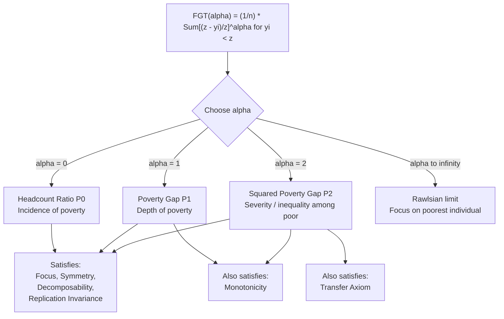

## Foster-Greer-Thorbecke Poverty Measures


### Overview

The Foster-Greer-Thorbecke (FGT) class of poverty measures, introduced by James Foster, Joel Greer, and Erik Thorbecke in 1984, is the dominant analytical framework for measuring poverty in development economics. Its central contribution is a single parametric family of indices — indexed by a parameter $\alpha$ — that nests the most commonly used poverty statistics as special cases, while satisfying a set of desirable axiomatic properties (subgroup decomposability chief among them) that earlier measures lacked.

### Historical Context and Motivation

Before FGT (1984), poverty measurement relied primarily on the **headcount ratio** (share of the population below a poverty line) and, to a lesser extent, the **poverty gap**. Amartya Sen's 1976 paper "Poverty: An Ordinal Approach to Measurement" had already criticized the headcount ratio for ignoring both the depth of poverty and inequality among the poor, proposing the **Sen Index**, which incorporated the Gini coefficient of income among the poor. However, the Sen Index and similar measures were **not additively decomposable across population subgroups** — a serious practical limitation, since policymakers need to break down national poverty into regional, rural/urban, or demographic components to design targeted interventions. The FGT paper solved this by proposing a measure that is simultaneously sensitive to the depth and severity of poverty (like Sen's index) *and* perfectly decomposable (unlike Sen's index).

### The General FGT Formula

$$FGT_{\alpha} = \frac{1}{n} \sum_{i=1}^{q} \left( \frac{z - y_i}{z} \right)^{\alpha}$$

Where:

- $n$ = total population (or sample) size
- $q$ = number of individuals below the poverty line $z$ (the poor)
- $y_i$ = income, consumption, or expenditure of individual $i$
- $z$ = the poverty line
- $\alpha \geq 0$ = the **poverty aversion parameter**, which determines how much weight is placed on the depth of poverty experienced by the poorest individuals

The term $g_i = \frac{z - y_i}{z}$ (for $y_i < z$, and $0$ otherwise) is called the **normalized poverty gap** of individual $i$ — the shortfall of that person's income from the poverty line, expressed as a fraction of the poverty line.

An equivalent way to write the formula, emphasizing that non-poor individuals contribute zero, is:

$$FGT_{\alpha} = \frac{1}{n} \sum_{i=1}^{n} \left[ \frac{\max(z - y_i, 0)}{z} \right]^{\alpha}$$

This form sums over the *entire* population $n$ (not just the poor), since $\max(z-y_i, 0) = 0$ automatically zeroes out the non-poor.

### Role of the Parameter $\alpha$

The parameter $\alpha$ controls how much extra weight is given to the poorest of the poor:

- **$\alpha = 0$**: Every poor person contributes equally (weight of 1 regardless of gap size) → **Headcount Ratio ($P_0$)**, measuring the *incidence* of poverty.
- **$\alpha = 1$**: Each poor person's contribution is proportional to their gap → **Poverty Gap Index ($P_1$)**, measuring the *depth* of poverty.
- **$\alpha = 2$**: Each poor person's contribution is proportional to the *square* of their gap, so larger gaps are weighted disproportionately more → **Squared Poverty Gap / Severity Index ($P_2$)**, measuring the *severity* (and implicitly, inequality among the poor).
- **$\alpha > 2$**: Rarely used in practice, but mathematically valid; as $\alpha \to \infty$, the measure becomes dominated entirely by the poorest individual in the population (a Rawlsian, "maximin" concern for the worst-off).

As $\alpha$ increases, the index becomes progressively more sensitive to the *distribution* of income among the poor rather than merely their *number*.

### Formal Statement of the Three Common Cases

**Headcount Ratio ($\alpha=0$):**

$$P_0 = \frac{q}{n}$$

**Poverty Gap Index ($\alpha=1$):**

$$P_1 = \frac{1}{n} \sum_{i=1}^{q} \frac{z-y_i}{z} = P_0 \cdot I$$

where $I$ is the mean income gap ratio among the poor.

**Squared Poverty Gap Index ($\alpha=2$):**

$$P_2 = \frac{1}{n} \sum_{i=1}^{q} \left( \frac{z-y_i}{z} \right)^2$$

*(Full worked numerical examples and detailed axiomatic comparison of these three specific measures are covered in the companion topic "Headcount ratio, poverty gap, and squared poverty gap.")*

### Axiomatic Foundations

The FGT class was explicitly designed to satisfy a set of poverty-measurement axioms proposed in the poverty-measurement literature (building on Sen 1976):

| Axiom | Definition | Satisfied by which $\alpha$? |
| --- | --- | --- |
| **Focus** | Measure is unaffected by income changes among the non-poor | All $\alpha \geq 0$ |
| **Symmetry (Anonymity)** | Measure is unaffected by relabeling/reordering individuals | All $\alpha \geq 0$ |
| **Monotonicity** | A fall in a poor person's income (ceteris paribus) must increase the measure | $\alpha \geq 1$ |
| **Transfer (Pigou-Dalton)** | A regressive transfer between two poor individuals must increase the measure | $\alpha > 1$ (i.e., $\alpha \geq 2$ in common practice) |
| **Subgroup Decomposability** | National measure equals population-weighted sum of subgroup measures | All $\alpha \geq 0$ |
| **Replication Invariance** | Measure is unchanged if the population is replicated (e.g., doubled with identical distribution) | All $\alpha \geq 0$ |
| **Scale Invariance** | Measure is unaffected by proportional scaling of $z$ and all $y_i$ together (i.e., unit-independent) | All $\alpha \geq 0$ |

The **subgroup decomposability** property is the FGT class's signature contribution and is what distinguishes it from the Sen Index:

$$FGT_{\alpha} = \sum_{j=1}^{m} \left( \frac{n_j}{n} \right) FGT_{\alpha}^{j}$$

where the population is partitioned into $m$ mutually exclusive, exhaustive subgroups $j = 1, \ldots, m$ (e.g., regions, urban/rural strata), $n_j$ is subgroup $j$'s population, and $FGT_{\alpha}^j$ is the FGT index computed using only subgroup $j$'s data. This allows analysts to compute each subgroup's **percentage contribution to national poverty**:

$$\text{Contribution}_j = \frac{(n_j/n) \cdot FGT_\alpha^j}{FGT_\alpha} \times 100\%$$

### Worked Illustration of Decomposability

Consider a country with two regions:

| Region | Population share ($n_j/n$) | $P_0^j$ (regional headcount) |
| --- | --- | --- |
| Rural | 0.60 | 0.50 |
| Urban | 0.40 | 0.20 |

National headcount ratio:

$$P_0 = (0.60)(0.50) + (0.40)(0.20) = 0.30 + 0.08 = 0.38$$

Rural contribution to national poverty:

$$\frac{0.30}{0.38} \times 100\% \approx 78.9\%$$

Even though rural areas hold only 60% of the population, they account for nearly 79% of national poverty — a finding directly actionable for geographic targeting of anti-poverty programs. This decomposition works identically for $P_1$ and $P_2$, allowing depth- and severity-based targeting as well.

### Structural Diagram of the FGT Family



### Data Requirements and Estimation

Computing FGT indices in practice requires:

1. **A welfare metric** ($y_i$): typically per-capita household consumption expenditure or income, drawn from household surveys (e.g., Living Standards Measurement Study surveys, national household budget/income-expenditure surveys).
2. **A poverty line** ($z$): commonly constructed via the **cost-of-basic-needs (CBN) method**, food-energy-intake method, or international lines such as the World Bank's international poverty line (updated periodically using Purchasing Power Parity conversion factors).
3. **Survey sampling weights**: since household surveys are rarely simple random samples, population-representative FGT estimates require weighting by design weights (and often normalization for household size to convert to per-capita or per-adult-equivalent terms).
4. **Standard errors / confidence intervals**: because FGT indices are computed from sample survey data, point estimates carry sampling variance; bootstrap or analytical variance formulas (e.g., Kakwani's formulas for FGT standard errors) are used to construct confidence intervals, particularly important when comparing poverty measures across time or regions where differences may not be statistically significant. [Inference: exact variance-estimation procedures depend on the specific survey design and software package used (e.g., Stata's `povdeco`/`sepov` commands, World Bank's ADePT/PovcalNet), so implementation details vary by tool.]

### Standard Computational Implementation (Pseudocode)

```plaintext
FUNCTION compute_FGT(incomes[], poverty_line, alpha):
    n = length(incomes)
    total = 0
    FOR each y in incomes:
        IF y < poverty_line:
            gap = (poverty_line - y) / poverty_line
            total = total + (gap ^ alpha)
        // else contributes 0, per the Focus axiom
    RETURN total / n
```

In statistical software, this is commonly implemented via:

- **Stata**: `povdeco`, `apoverty`, or the `sepov` (World Bank ADePT-style) commands, which take a welfare variable, a poverty line, and optionally survey weights.
- **R**: functions in the `IC2` or `wbstats`/`povcalnetR` packages, or custom implementations using `dplyr`/`data.table` given the simplicity of the formula.
- **Python**: no single dominant library; commonly hand-coded with `pandas`/`numpy` given the transparency of the formula, or computed via the World Bank's PIP (Poverty and Inequality Platform) API for standardized international estimates.

[Unverified: specific function names, arguments, and current maintenance status of the packages listed above should be checked against current documentation before use in applied work, since statistical software packages update APIs and packages may be deprecated or renamed over time.]

### Extensions and Related Measures

- **Watts Index**: An alternative poverty measure using logarithms of the income ratio, satisfying an additional axiom (increasing poverty aversion) not guaranteed by all FGT members.
- **Sen Index and Sen-Shorrocks-Thon (SST) Index**: Incorporate the Gini coefficient of the poor's income distribution directly; SST is decomposable (unlike the original Sen Index) and can itself be expressed as a product of $P_0$, $P_1/P_0$, and a Gini-like term.
- **Multidimensional FGT / Alkire-Foster Method**: Extends the FGT logic beyond a single monetary welfare metric to multiple dimensions of deprivation (health, education, living standards), underlying the UNDP's Multidimensional Poverty Index (MPI).
- **Chakravarty poverty measures**: Another parametric family with different functional forms (e.g., using power functions of the gap) offering alternative severity-weighting schemes.

### Common Critiques and Limitations

- **Poverty line sensitivity**: FGT measures (especially $P_0$) can be highly sensitive to the exact placement of the poverty line; small changes in $z$ can produce large changes in the headcount ratio near the line's density mass. **Stochastic dominance analysis** (comparing poverty across a *range* of possible lines) is often used to check robustness of conclusions.
- **Cardinality assumptions**: Higher-$\alpha$ FGT measures implicitly assume that the *degree* of deprivation (not just its existence) can be meaningfully compared across individuals via a cardinal, ratio-scale welfare metric — an assumption some welfare economists dispute philosophically.
- **Monetary focus**: The classic FGT formulation is inherently unidimensional (money-metric), which motivated the multidimensional extensions above.
- **No account of inequality among the non-poor**: By construction (the Focus axiom), FGT measures ignore all information above the poverty line — a deliberate design choice, but one that means FGT indices cannot be used as general inequality measures.

### Applications in Development Economics

- **World Bank Poverty and Inequality Platform (PIP)**: Publishes standardized $P_0$, $P_1$, and $P_2$ estimates for most countries using the international poverty line(s), enabling cross-country comparison.
- **Growth-poverty elasticity analysis**: FGT indices (especially $P_1$) are used in the **Datt-Ravallion decomposition**, which splits observed changes in poverty over time into a "growth component" (change due to mean income growth, holding distribution constant) and a "redistribution component" (change due to distributional shifts, holding mean constant).
- **Targeting efficiency evaluation**: Comparing the actual cost of a transfer program to the theoretical minimum implied by $P_1 \times n \times z$ (the "poverty gap" in absolute terms) quantifies leakage and under-coverage in social protection programs.
- **Impact evaluation**: FGT indices are standard outcome variables in randomized controlled trials and quasi-experimental studies evaluating anti-poverty interventions (cash transfers, microfinance, agricultural extension), since they permit both incidence and severity effects to be reported separately.

**Related Topics**

- Headcount ratio, poverty gap, and squared poverty gap (detailed treatment with worked examples)
- Sen Index and Sen-Shorrocks-Thon Index
- Poverty line construction methods (cost-of-basic-needs, food-energy-intake, international poverty lines)
- Datt-Ravallion growth-redistribution decomposition of poverty change
- Multidimensional Poverty Index (Alkire-Foster methodology)
- Stochastic dominance and poverty comparisons robust to poverty line choice
- Lorenz curves, the Gini coefficient, and inequality measurement
- Household survey design and welfare aggregate construction (LSMS methodology)