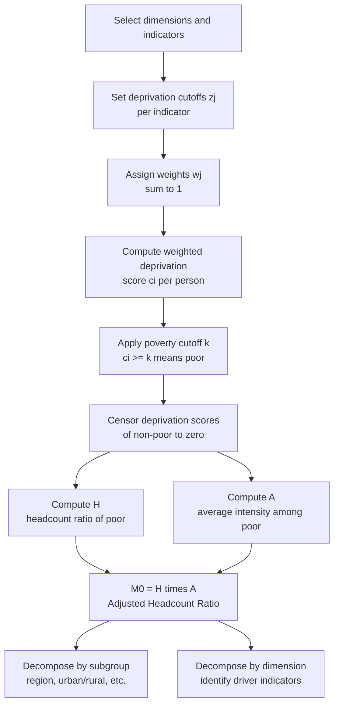

## Multidimensional Poverty Measurement Methods

### Overview

Multidimensional poverty measurement responds to the recognition that deprivation is not fully captured by income or consumption alone. A household can be non-poor by monetary standards yet lack access to clean water, education, healthcare, or adequate housing. Multidimensional approaches combine several indicators of well-being — spanning health, education, and living standards, among others — into a single framework for identifying who is poor and aggregating the extent of that poverty. The dominant methodology in this space is the **Alkire-Foster (AF) method**, which underlies the **Multidimensional Poverty Index (MPI)** used by the UNDP and Oxford Poverty and Human Development Initiative (OPHI).

### Conceptual Foundations

#### Capability Approach

The theoretical basis for multidimensional poverty measurement draws heavily on **Amartya Sen's capability approach**, which argues that well-being should be assessed in terms of a person's actual freedoms and capabilities to achieve valuable "functionings" (states of being and doing), rather than solely their command over economic resources. Income is an instrumental means to well-being, not well-being itself; two people with identical incomes may have very different capabilities depending on health, education, social context, and access to public goods.

#### Why Move Beyond Monetary Measures

- **Imperfect correlation**: Empirical studies consistently find substantial mismatch between the monetary poor and the multidimensionally poor — many households are poor in one sense but not the other.
- **Direct measurement of deprivation**: Multidimensional measures assess deprivations directly (e.g., "does this household have electricity?") rather than inferring welfare from expenditure, avoiding some of the data-quality and price-index problems inherent in constructing comparable monetary welfare aggregates across regions and time.
- **Policy relevance**: Sector ministries (health, education, water) can act directly on multidimensional indicators in ways that are harder to translate from an aggregate income poverty statistic.

### The Alkire-Foster (AF) Methodology

Developed by Sabina Alkire and James Foster (2007, published 2011), the AF method is a **dual-cutoff counting approach**: one cutoff identifies deprivation within each dimension, and a second cutoff (the poverty cutoff, $k$) identifies who counts as multidimensionally poor based on the *number* or *weighted share* of dimensions in which they are deprived.

#### Step 1: Select Dimensions and Indicators

Choose a set of $d$ dimensions (e.g., health, education, living standards), each represented by one or more indicators (e.g., "nutrition," "child mortality" under health).

#### Step 2: Set Deprivation Cutoffs

For each indicator $j$, define a deprivation cutoff $z_j$ such that a person/household is deprived in that indicator if their achievement falls below $z_j$ (e.g., "deprived in years of schooling if no household member has completed 6 years of schooling").

#### Step 3: Assign Weights

Assign a weight $w_j$ to each indicator, with weights summing to 1 (or to the number of dimensions, depending on normalization convention). Weighting can be **equal across dimensions** (with indicators within a dimension sharing that dimension's weight equally) or based on normative/expert judgment.

#### Step 4: Compute the Deprivation Score

For each person $i$, compute a weighted deprivation score:

$$c_i = \sum_{j=1}^{d} w_j \cdot \mathbb{1}(y_{ij} < z_j)$$

where $\mathbb{1}(\cdot)$ is an indicator function equal to 1 if person $i$ is deprived in indicator $j$, and $y_{ij}$ is person $i$'s achievement in indicator $j$.

#### Step 5: Apply the Poverty Cutoff ($k$)

A person is identified as **multidimensionally poor** if their deprivation score meets or exceeds a poverty cutoff $k$ (commonly expressed as a percentage, e.g., $k = 1/3$, meaning deprived in at least one-third of the weighted indicators):

$$\text{Person } i \text{ is MPI-poor if } c_i \geq k$$

This is the **dual cutoff**: the indicator-level cutoffs ($z_j$) determine deprivation in each dimension, while $k$ determines who counts as "poor overall."

#### Step 6: Censor Non-Poor Deprivations

Deprivation scores for the non-poor (those with $c_i < k$) are set to zero for aggregation purposes — a step called **censoring**. This ensures the final index reflects only the deprivations experienced by those identified as poor, consistent with a Focus-axiom-like principle.

The censored deprivation score is:

$$c_i(k) = c_i \text{ if } c_i \geq k, \text{ else } 0$$

### The Adjusted Headcount Ratio ($M_0$)

The primary AF summary measure is the **Adjusted Headcount Ratio**, $M_0$, computed as:

$$M_0 = H \times A$$

Where:

- $H$ = the **multidimensional headcount ratio** — the proportion of the population identified as poor:

  $$H = \frac{q}{n}$$

  ($q$ = number of multidimensionally poor persons, $n$ = total population)
- $A$ = the **intensity of poverty among the poor** — the average (weighted) share of dimensions in which poor persons are deprived:

  $$A = \frac{\sum_{i=1}^{q} c_i(k)}{q}$$

Equivalently:

$$M_0 = \frac{1}{n} \sum_{i=1}^{n} c_i(k)$$

$M_0$ thus simultaneously captures **how many** people are poor ($H$) and **how deprived** they are on average ($A$) — directly analogous in spirit to the $P_0 \times I$ decomposition of the FGT poverty gap index.

### Worked Example

Consider 5 households assessed on 3 dimensions (Health, Education, Living Standards), each with equal weight $w_j = 1/3$, and a poverty cutoff of $k = 1/3$:

| Household | Deprived in Health? | Deprived in Education? | Deprived in Living Standards? | Deprivation Score $c_i$ |
| --- | --- | --- | --- | --- |
| A | Yes | Yes | Yes | 1.00 |
| B | Yes | No | No | 0.33 |
| C | No | No | No | 0.00 |
| D | Yes | Yes | No | 0.67 |
| E | No | Yes | No | 0.33 |

Applying $k = 1/3$: Households A, B, D, and E have $c_i \geq 0.33$, so they are identified as poor. Household C is not poor.

- $q = 4$, $n = 5$ → $H = 4/5 = 0.80$
- Sum of censored scores for the poor: $1.00 + 0.33 + 0.67 + 0.33 = 2.33$
- $A = 2.33 / 4 = 0.5825$
- $M_0 = H \times A = 0.80 \times 0.5825 = 0.466$

**Cross-check**: $M_0 = \frac{1}{n}\sum c_i(k) = \frac{1.00+0.33+0.00+0.67+0.33}{5} = \frac{2.33}{5} = 0.466$ ✓

### The Global Multidimensional Poverty Index (Global MPI)

The UNDP and OPHI jointly publish the **Global MPI**, applying the AF method with a standardized structure across countries:

| Dimension | Weight | Indicators (each weighted equally within dimension) |
| --- | --- | --- |
| Health | 1/3 | Nutrition, Child mortality |
| Education | 1/3 | Years of schooling, School attendance |
| Living Standards | 1/3 | Cooking fuel, Sanitation, Drinking water, Electricity, Housing, Assets |

- Each of the three dimensions carries equal weight (1/3), and indicators within each dimension are equally weighted within that dimension's share.
- The global poverty cutoff is conventionally set at $k = 1/3$: a person deprived in at least one-third of the weighted indicators is considered MPI-poor.
- The Global MPI additionally reports **"destitution"** using more extreme deprivation cutoffs, identifying the poorest among the multidimensionally poor.

[Unverified: exact indicator definitions, cutoff thresholds, and dataset sources are revised periodically by OPHI/UNDP; specific values should be checked against the current-year Global MPI methodological note before being cited in applied or published work.]

### Decomposability and Dimensional Breakdown

Like the FGT class, $M_0$ is **subgroup decomposable**: the national $M_0$ equals the population-weighted sum of subgroup $M_0$ values, enabling breakdowns by region, rural/urban status, ethnicity, or other characteristics.

A further distinctive feature of $M_0$ is **decomposability by dimension after identification**: once the poor have been identified (using the *full* weighted deprivation profile), $M_0$ can be broken down into each dimension's/indicator's **percentage contribution to overall poverty**:

$$\text{Contribution of indicator } j = \frac{w_j \cdot H_j^{censored}}{M_0} \times 100\%$$

where $H_j^{censored}$ is the (censored) proportion of the population deprived in indicator $j$ among the identified poor. This decomposition tells policymakers which deprivations drive multidimensional poverty most in a given population — informing sectoral resource allocation (e.g., "sanitation deprivation accounts for 25% of national MPI; prioritize WASH investment").

### Axiomatic Properties of $M_0$

$M_0$ satisfies a range of desirable properties analogous to the univariate FGT axioms, extended to the multidimensional context:

- **Decomposability**: as described above.
- **Dimensional monotonicity**: if a poor person becomes newly deprived in an additional indicator, $M_0$ increases.
- **Symmetry**: unaffected by relabeling individuals.
- **Poverty focus**: unaffected by changes in the achievements of the non-poor.
- **Deprivation focus**: unaffected by changes in *non-deprived* indicators of a poor person (their poverty status is driven only by the indicators in which they are deprived).
- **Weak monotonicity in $k$**: $M_0$ is well-defined and consistent for the full range of possible poverty cutoffs, permitting robustness checks across a range of $k$ values.

Unlike the univariate FGT case, $M_0$ does not directly incorporate *depth* of deprivation within each binary indicator (a household is simply "deprived" or "not," not "how deprived"), an active area of methodological extension.

### Structural Process Diagram

### Alternative and Complementary Multidimensional Approaches

- **Fuzzy Set Approaches**: Instead of binary (deprived/not deprived) classification, fuzzy-set poverty measures assign a continuous degree of membership in the "poor" set, avoiding the sharp discontinuity introduced by cutoffs. [Inference: less common in official statistics than the AF method, largely due to greater complexity in interpretation and communication to policymakers, though it remains an active academic research area.]
- **Composite Indices via Statistical Aggregation** (e.g., Principal Component Analysis-based asset indices): Used especially in the DHS/MICS survey tradition to construct wealth indices, though these are typically continuous welfare rankings rather than poverty *identification* methods with clear poor/non-poor cutoffs.
- **Bourguignon-Chakravarty Multidimensional Indices**: A class of measures that, unlike the counting-based AF approach, use continuous achievement variables directly (not just deprivation indicators) combined via a CES-like aggregator function, offering an alternative treatment of substitutability/complementarity between dimensions.
- **Correlation-Sensitive Poverty Measures**: A broader theoretical literature examines how multidimensional measures should treat the *correlation* between deprivations — whether being deprived in multiple dimensions simultaneously (compounding disadvantage) should be weighted more heavily than the same total deprivation spread across different individuals (the "union" vs. "intersection" approach to poverty identification, of which AF's counting method is an intermediate case).

### Data Requirements

- **Household- and individual-level survey data** covering multiple domains simultaneously (a single survey instrument, since combining indicators from different surveys/years introduces comparability problems). Common sources: Demographic and Health Surveys (DHS), Multiple Indicator Cluster Surveys (MICS), and national censuses/household surveys with multi-topic modules.
- **Consistent unit of identification**: household-level indicators (e.g., sanitation, electricity) are typically applied uniformly to all household members, while individual-level indicators (e.g., school attendance, nutrition) vary within the household — requiring careful aggregation rules to assign a single deprivation profile per person.
- **Missing data handling**: since the AF method requires simultaneous observation of all indicators for a given unit, missing data on even one indicator can exclude that observation entirely unless imputation or adjusted weighting procedures are applied.

### Applications and Policy Uses

- **National MPIs**: Many countries construct their own national MPI (tailored dimensions/weights/cutoffs suited to local policy priorities) alongside or instead of the Global MPI, since national policymakers often want indicators reflecting country-specific deprivations (e.g., specific housing materials, local health programs).
- **Targeting and resource allocation**: Dimensional decomposition of $M_0$ directly informs which sectors (health, education, infrastructure) should receive priority investment in a given region.
- **Monitoring the Sustainable Development Goals (SDGs)**: SDG Target 1.2 explicitly calls for reducing "poverty in all its dimensions," making the MPI a natural monitoring tool alongside monetary poverty indicators.
- **Complementing, not replacing, monetary poverty measures**: Best practice treats multidimensional and monetary poverty as complementary lenses; a household can be tracked on both axes to identify the specific policy tools (cash transfers vs. in-kind service delivery) suited to its situation.

### Common Critiques and Methodological Debates

- **Weight selection is normative**: The choice of equal weighting across dimensions (used in the Global MPI) is a value judgment, not derived from data; alternative weighting schemes (e.g., based on survey respondents' stated priorities, or statistically-derived weights) can yield different poverty rankings.
- **Cutoff sensitivity**: Both the indicator-level cutoffs ($z_j$) and poverty cutoff ($k$) are somewhat arbitrary choices; robustness analysis across a range of $k$ values is recommended practice.
- **Loss of information via dichotomization**: Converting continuous achievements (e.g., years of schooling) into a binary deprived/non-deprived indicator discards information about the depth of deprivation within each dimension.
- **Comparability over time and across countries**: Changes in survey instruments, indicator definitions, or data availability can complicate longitudinal or cross-country MPI comparisons; the OPHI/UNDP maintain harmonization protocols to mitigate this, though users should verify comparability notes for the specific years/countries being compared. [Unverified: precise harmonization procedures and any known breaks in comparability for specific country-year combinations should be checked against OPHI's official documentation.]

**Next Steps**

- Alkire-Foster method: mathematical derivation and full axiom proofs
- Global MPI vs. national MPI construction: comparative case studies
- Sustainable Development Goals and multidimensional poverty monitoring frameworks
- Capability approach (Sen) and its philosophical underpinnings
- DHS/MICS survey methodology and multi-topic questionnaire design
- Robustness analysis: varying $k$ and dimensional weights in AF-based indices
- Correlation-sensitive poverty measures and the union/intersection approach
- Comparing monetary and multidimensional poverty profiles empirically (mismatch analysis)