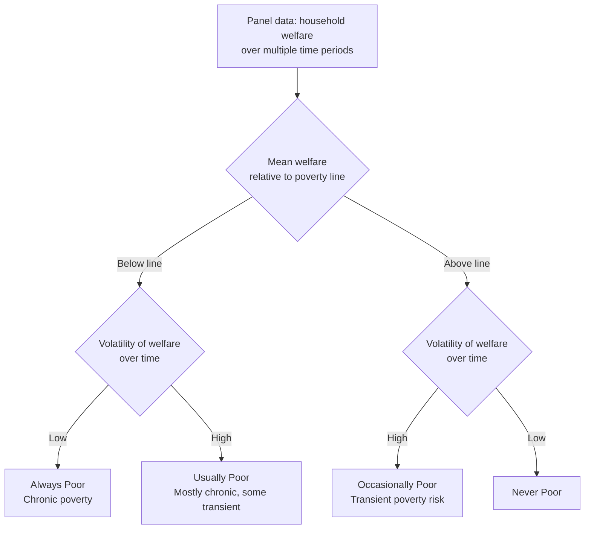

## Chronic versus Transient Poverty

### Overview

The chronic-transient poverty distinction addresses a dimension entirely invisible to single cross-sectional poverty snapshots: **time**. Two populations can have identical poverty headcount ratios in a given year yet differ fundamentally in composition — one might consist of the same households poor year after year, while the other churns constantly, with different households falling into and climbing out of poverty each period. This distinction has significant implications for policy design, since chronic and transient poverty typically require different intervention types (long-term structural support versus short-term safety nets/insurance mechanisms).

### Core Definitions

- **Chronic poverty**: Poverty that persists over an extended period — a household or individual remains below the poverty line across multiple time periods (or, in lifetime/intergenerational framings, across the life course or generations).
- **Transient (or transitory) poverty**: Poverty that is temporary — a household falls below the poverty line in some periods but not others, often due to shocks (illness, weather events, price fluctuations, job loss) rather than a persistent structural deficiency in earning capacity.

This distinction requires **panel (longitudinal) data** — repeated observations of the same households or individuals over time — since a single cross-sectional survey cannot distinguish a chronically poor household from a transiently poor one observed at an unlucky moment.

### Why the Distinction Matters

- **Policy targeting**: Chronic poverty often calls for structural interventions — investments in human capital (education, health), asset transfers, infrastructure, or social protection with a long time horizon. Transient poverty is often better addressed through insurance mechanisms, emergency safety nets, consumption-smoothing credit, or shock-responsive social protection.
- **Different causal mechanisms**: Chronic poverty is frequently associated with structural constraints — geographic isolation, lack of assets, discrimination, disability, or low human capital accumulated over the life course. Transient poverty is more often driven by **idiosyncratic shocks** (illness, death of a household earner, localized crop failure) or **covariate shocks** (droughts, price spikes, economic recessions affecting whole communities simultaneously).
- **Poverty dynamics reveal churn masked by static rates**: A stable aggregate headcount ratio over time can mask enormous underlying churn — many households exiting poverty being offset by roughly as many entering it. Ignoring this dynamic can lead to misdiagnosing the nature of the poverty problem and consequently misdesigning interventions.
- **Intergenerational transmission**: A key concern in chronic poverty research is the transmission of poverty across generations via inadequate nutrition, education, or asset inheritance — a phenomenon transient poverty analysis does not typically address.

### Measuring Chronic and Transient Poverty: Key Approaches

#### 1. The Spells Approach (Poverty Duration/Spell Analysis)

Defines poverty in terms of **spells** — continuous periods during which a household remains below the poverty line — and classifies households by the number and length of spells observed over the panel window.

- A household experiencing a single long, uninterrupted spell of poverty is more clearly "chronic."
- A household experiencing multiple short spells interspersed with periods above the line displays a more transient/churning pattern.
- Common metrics: **spell frequency**, **average spell duration**, and the **hazard rate of exiting poverty** (the probability of escaping poverty conditional on having been poor for a given duration) — often estimated via survival analysis / duration models.

#### 2. The Components (Decomposition) Approach

Decomposes total measured poverty over a panel period into a **chronic component** and a **transient component**, typically using the mean of household welfare over the panel window as the basis for identifying chronic poverty, and period-to-period fluctuations around that mean as the basis for transient poverty.

The most widely cited version, developed by **Jalan and Ravallion (1998)**, decomposes the average FGT poverty measure over $T$ time periods into:

$$\bar{P}_{\alpha} = P_{\alpha}(\bar{y}_i) + \text{Transient Component}$$

Where $\bar{y}_i$ is household $i$'s **mean welfare across the $T$ periods** observed. The **chronic component** is the poverty measure computed by comparing each household's *average* welfare over time to the poverty line — capturing poverty driven by persistently low average living standards. The **transient component** is the residual: the difference between the average of period-by-period poverty measures and the poverty measure computed on the mean welfare, capturing poverty attributable to variability/fluctuation around that (possibly non-poor) average.

For the squared poverty gap ($\alpha=2$) specifically, this decomposition has a particularly clean form because $P_2$'s squared-gap structure allows the transient component to be expressed using the **variance of household welfare over time**:

$$\bar{P}_2 = P_2(\bar{y}_i) + \frac{1}{n}\sum_i \left(\frac{\sigma_i}{z}\right)^2$$

where $\sigma_i$ is the standard deviation of household $i$'s welfare over the $T$ periods observed (restricted appropriately to periods relevant to the poverty comparison). This shows explicitly that the transient component is driven by within-household **income/consumption volatility**, and vanishes for a household with perfectly stable welfare over time (even if that stable welfare is below the poverty line — in which case all of that household's poverty is chronic, by construction).

#### 3. The Poverty Transition Matrix Approach

Uses panel data across (at minimum) two time periods to classify households into a **2x2 (or higher-order) transition matrix**:

|  | Poor in Period 2 | Non-Poor in Period 2 |
| --- | --- | --- |
| **Poor in Period 1** | Chronically Poor (Poor-Poor) | Exited Poverty (Poor-Nonpoor) |
| **Non-Poor in Period 1** | Entered Poverty (Nonpoor-Poor) | Never Poor (Nonpoor-Nonpoor) |

- **Poor-Poor**: The chronically poor (in the two-period, minimal sense — persistently poor across observed periods).
- **Poor-Nonpoor** and **Nonpoor-Poor**: Represent transient poverty — households moving across the poverty line in either direction.
- **Nonpoor-Nonpoor**: Never poor in the observed window.

With panels of more than two periods, this generalizes to counting the **number of periods in poverty out of $T$ total periods observed**, often with a threshold rule (e.g., "chronically poor" = poor in at least $T/2$ or all $T$ periods; "transiently poor" = poor in some but not all periods).

#### Illustrative Transition Matrix Example

Consider a panel of 100 households surveyed in two years:

|  | Poor Year 2 | Non-Poor Year 2 | Total |
| --- | --- | --- | --- |
| Poor Year 1 | 25 | 15 | 40 |
| Non-Poor Year 1 | 10 | 50 | 60 |
| Total | 35 | 65 | 100 |

- Chronically poor (Poor-Poor): 25 households (25% of sample)
- Exited poverty: 15 households
- Entered poverty (newly poor): 10 households
- Never poor: 50 households

**Total transient poverty movement**: 15 + 10 = 25 households experienced a poverty status change — equal in magnitude to the chronically poor group in this example, illustrating that a stable aggregate headcount ratio (35% poor in Year 1 vs. 35% poor in Year 2, if these numbers were designed to match) can mask substantial underlying churn.

#### 4. The Components Approach Using Total Expenditure/Income Volatility

Related to approach 2, some frameworks (e.g., Gaiha and Deolalikar; Baulch and Hoddinott) classify households based on **both** their mean welfare position relative to the poverty line **and** the coefficient of variation of their welfare over time, producing a four-way (or more granular) typology:

1. **Always poor**: Mean welfare below poverty line, low volatility.
2. **Usually poor**: Mean welfare below poverty line, higher volatility (occasionally crosses above the line).
3. **Occasionally poor**: Mean welfare above poverty line, but volatility is high enough to occasionally fall below it.
4. **Never poor**: Mean welfare comfortably above poverty line, low probability of falling below it given observed volatility.

### Structural Diagram: Poverty Dynamics Typology

### Vulnerability and Poverty Dynamics

Closely related to transient poverty is the concept of **vulnerability to poverty**: the ex-ante probability that a currently non-poor (or poor) household will fall into (or remain in) poverty in the future, given exposure to risk and limited capacity to cope with shocks. Vulnerability analysis often uses estimated variance of consumption/income (from panel or even cross-sectional data with assumptions) to project the probability of future poverty, complementing the backward-looking, realized-outcome focus of chronic/transient decompositions.

### Data Requirements

- **Panel data** with repeated observations of the same households/individuals is essential; pseudo-panels (repeated cross-sections tracking synthetic cohorts rather than the same individuals) can proxy some dynamics but cannot fully replicate individual-level transition analysis.
- **Panel attrition**: A major practical challenge — households that drop out of the sample between survey waves (due to migration, dissolution, refusal, or death) can bias chronic/transient poverty estimates if attrition is correlated with poverty status (e.g., if poorer households are more likely to migrate and be lost to follow-up).
- **Measurement error amplification**: Because transient poverty is measured using period-to-period *changes* or *volatility* in welfare, and change/volatility measures are especially sensitive to measurement error in the underlying welfare variable, transient poverty estimates can be more strongly affected by survey measurement error than static headcount estimates. Some fluctuation recorded in panel data may reflect **survey noise rather than genuine welfare volatility**, inflating apparent transient poverty.
- **Choice of accounting period and panel length**: Classifications of "chronic" versus "transient" are sensitive to how long a panel spans and how frequently households are observed; a household poor in a single bad year within a 10-year panel might be classified quite differently than the same household observed only over 2 years.

### Policy Implications by Poverty Type

| Poverty Type | Likely Drivers | Suited Policy Instruments |
| --- | --- | --- |
| Chronic | Low asset base, structural exclusion, disability, geographic isolation, low human capital | Long-term social assistance, asset transfers, education/health investment, structural infrastructure |
| Transient (idiosyncratic shock) | Illness, death of earner, job loss, localized crop failure | Health insurance, unemployment support, emergency cash transfers, informal risk-sharing networks |
| Transient (covariate shock) | Drought, flood, macroeconomic crisis, price shocks affecting whole communities | Weather-index insurance, shock-responsive/adaptive social protection, public works programs, price stabilization |

[Inference: the mapping from poverty type to policy instrument in the table above reflects common practice recommendations in the poverty-dynamics literature, but the appropriate mix in any specific context depends on local institutional capacity, fiscal space, and the specific nature of observed shocks — it is not a universal prescription.]

### Common Critiques and Methodological Debates

- **Sensitivity to the observation window**: Classifications of chronic versus transient can change substantially depending on the number and spacing of survey waves used; a household appearing "chronically poor" in a 2-wave panel might reveal transient patterns if additional waves were observed.
- **Arbitrary duration thresholds**: Many empirical studies define "chronic poverty" using an arbitrary threshold (e.g., "poor in all waves," or "poor for at least half of observed periods"); results can be sensitive to this choice.
- **Attrition bias**: As noted above, differential panel attrition by poverty status can bias chronic/transient decompositions if not addressed via appropriate weighting or bounding techniques.
- **Distinguishing measurement error from genuine volatility**: Statistical techniques (e.g., using multiple welfare indicators, or exploiting information on the nature of reported shocks) are sometimes used to net out spurious "poverty churn" driven by survey noise, though no technique fully eliminates this concern.

### Applications in Development Economics

- **Long-running panel studies**: Datasets such as the Indonesia Family Life Survey (IFLS), the Young Lives study, and various country-specific rural panel surveys (e.g., ICRISAT's Village Level Studies in India) have been foundational in empirically documenting the extent of chronic versus transient poverty in different contexts.
- **Social protection program design**: Increasingly, governments design **layered social protection systems** combining a permanent safety net for the chronically poor with **shock-responsive/adaptive components** (e.g., temporary scale-up of cash transfers during droughts) targeting the transiently poor — directly operationalizing the chronic/transient distinction in program architecture.
- **Chronic Poverty Research Centre (historical)**: A dedicated international research network (active in the 2000s-2010s) focused specifically on documenting and addressing chronic poverty, producing periodic "Chronic Poverty Reports" analyzing global patterns. [Unverified: current operational status of this specific research network should be checked, as institutional research initiatives in this space have evolved over time.]

**Related Topics**

- Foster-Greer-Thorbecke poverty measures (static poverty measurement building blocks)
- Vulnerability to poverty and ex-ante risk assessment
- Panel data methods and attrition bias correction techniques
- Poverty transition matrices and Markov chain models of poverty dynamics
- Shock-responsive and adaptive social protection systems
- Intergenerational transmission of poverty
- Consumption smoothing and informal risk-sharing mechanisms
- Weather-index insurance and covariate risk management