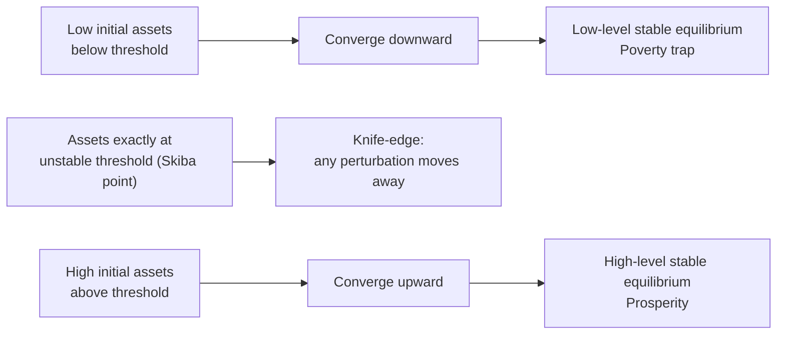

## Poverty Traps: Theory and Evidence

### Overview

A **poverty trap** is a self-reinforcing mechanism that causes poverty to persist: once an individual, household, or economy falls below a critical threshold of assets, income, or capability, internal dynamics keep them poor rather than allowing convergence toward higher living standards. This concept is central to development economics because it challenges the assumption (implicit in standard neoclassical growth models) that poor economies or households will naturally converge toward prosperity given time and modest initial investment. If poverty traps exist, targeted, threshold-crossing interventions ("big pushes") may be necessary — marginal or incremental aid may be ineffective or even wasted if it fails to move a household past the critical threshold.

### Theoretical Foundations

#### The Core Idea: Multiple Equilibria and S-Shaped Dynamics

The defining formal feature of a poverty trap model is **multiple stable equilibria** in the dynamic relationship between an individual's or economy's current state (assets, capital, income) and their state in the next period. This is typically represented via an **S-shaped (sigmoid) transition function**, where next-period wealth $k_{t+1}$ is plotted against current-period wealth $k_t$:

$$k_{t+1} = f(k_t)$$

When $f(\cdot)$ is S-shaped (concave at high $k_t$, convex at low $k_t$), it can intersect the 45-degree line ($k_{t+1} = k_t$) at **three points**:

1. A **low-level stable equilibrium** (the "poverty trap" — a low steady-state wealth level to which anyone starting below the middle threshold converges).
2. An **unstable middle equilibrium** (the "threshold" or "Skiba point" — anyone starting exactly here stays, but any small deviation pushes them toward one of the two stable equilibria).
3. A **high-level stable equilibrium** (a "prosperity" steady state to which anyone starting above the threshold converges).

Individuals or economies starting below the threshold converge downward to the low equilibrium regardless of effort; those starting above converge upward to the high equilibrium. This is the mathematical signature that distinguishes a genuine poverty trap from mere transient poverty or a single-equilibrium growth process where everyone eventually converges to the same steady state.

#### Diagrammatic Representation (S-Curve and Threshold)

### Mechanisms Generating Poverty Traps

Development economics identifies several distinct micro- and macro-level mechanisms that can generate the S-shaped dynamics described above:

#### 1. Nutrition-Based (Efficiency Wage) Traps

Proposed in early development economics (e.g., Leibenstein, Mirrlees, Dasgupta-Ray): if labor productivity depends on caloric/nutritional intake, and nutritional intake depends on income, a household with insufficient income cannot afford adequate nutrition, which lowers productivity and thus future income — a **vicious cycle**. Below a critical nutritional/income threshold, productivity may fall too low to escape the cycle without external assistance.

#### 2. Credit Market Failure / Missing Insurance Traps

Because poor households typically lack collateral, they face **credit constraints** that prevent them from making indivisible, high-return investments (e.g., a business start-up cost, a irrigation pump, secondary/tertiary education) even when the expected return exceeds the cost of capital. Without access to credit, poor households cannot bridge the gap between their current low-asset state and the fixed-cost investment needed to reach a higher-productivity technology or occupation — trapping them in low-return activities.

Similarly, **missing insurance markets** compel poor households to engage in excessive precautionary behavior (e.g., avoiding risky-but-higher-return crops or occupations, maintaining low-return liquid assets as a buffer against shocks) — a form of "poverty trap through risk aversion," since the poor cannot afford to take the risks needed to grow out of poverty.

#### 3. Occupational Choice / Indivisibility Traps

Related to credit constraints: if entering a high-return occupation or technology requires a fixed minimum capital outlay (e.g., purchasing a loom, a fishing boat, or enough land to justify mechanization), households below that asset threshold are relegated to low-return subsistence activities indefinitely, since they cannot save their way to the threshold quickly enough (especially if low-return activities barely cover subsistence needs, leaving little surplus for saving).

#### 4. Human Capital / Health Traps

Poor nutrition and health in early childhood can impair cognitive and physical development irreversibly, reducing lifetime earning capacity — creating **intergenerational poverty traps** where children born into poor households face structurally lower prospects regardless of their innate ability, perpetuating poverty across generations.

#### 5. Geographic and Environmental Traps

Some poverty trap theories emphasize location-specific factors: remoteness from markets, poor agroecological conditions, or environmental degradation (e.g., soil degradation, deforestation) can create localized poverty traps where the returns to any individual investment remain low due to structural geographic disadvantage, independent of individual household characteristics. Jeffrey Sachs and coauthors have argued for macro-level "poverty trap" dynamics at the country level, where insufficient domestic savings prevent the capital accumulation needed to escape low-income status without external aid ("big push" arguments).

#### 6. Behavioral / Psychological Traps

More recent literature (e.g., Mani, Mullainathan, Shafir, and Zhao's work on "scarcity") argues that the cognitive burden of poverty itself — constant financial stress and the mental "bandwidth tax" of managing scarcity — can impair decision-making and reduce productivity, creating a self-reinforcing psychological dimension to poverty traps distinct from purely material/asset-based mechanisms.

#### 7. Social and Institutional Traps

Discrimination, social exclusion (based on caste, ethnicity, gender), weak property rights, or extractive institutions can systematically prevent certain groups from accessing the same investment opportunities as others, generating group-level poverty traps that persist even when aggregate economic growth occurs.

### Formal Model Sketch: Asset-Threshold Poverty Trap

A simplified formalization (in the spirit of Banerjee-Newman/Galor-Zeira-type models with occupational choice):

Suppose an individual with assets $k_t$ can choose between:

- A **subsistence activity** requiring no capital, yielding low but certain income $y_L$.
- An **entrepreneurial activity** requiring a minimum capital investment $\bar{k}$, yielding higher income $y_H > y_L$, but only accessible if $k_t \geq \bar{k}$.

If credit markets are absent or imperfect, an individual with $k_t < \bar{k}$ cannot borrow to reach $\bar{k}$ and must remain in the subsistence activity, accumulating assets only through savings out of $y_L$. If $y_L$ is barely sufficient for subsistence consumption, savings may be negligible, and the individual remains indefinitely below $\bar{k}$ — a poverty trap. An individual starting with $k_t \geq \bar{k}$ can immediately access the high-return activity and accumulate wealth toward the high equilibrium.

[Inference: this is a stylized simplification for expository purposes; the specific functional forms, parameter restrictions, and equilibrium concepts used in published poverty-trap models (e.g., Galor-Zeira 1993, Banerjee-Newman 1993, Dasgupta-Ray 1986) are considerably more technical and vary in their specific mechanisms and predictions.]

### Empirical Evidence: Testing for Poverty Traps

Testing for the existence of poverty traps empirically is methodologically challenging, since it requires distinguishing genuine multiple equilibria (S-shaped dynamics) from a single-equilibrium convergence process with merely slow convergence. Key empirical approaches include:

#### 1. Nonparametric Estimation of Transition Functions

Researchers estimate the relationship between household assets/wealth at time $t$ and time $t+1$ (or later) using panel data, testing for **nonlinearity/S-shaped curvature** consistent with multiple equilibria, rather than assuming a linear or globally concave (single-equilibrium) functional form.

- **Lokshin and Ravallion (2004)**, using panel data from Russia and Hungary during economic transition, found evidence of nonlinear dynamics in household income consistent with poverty trap behavior for some sub-populations.
- **Barrett and colleagues** (multiple studies), particularly on **pastoralist livestock-holding households** in East Africa (e.g., southern Ethiopia, northern Kenya), found evidence of asset thresholds in livestock holdings, below which households experience declining herd sizes and above which herds tend to grow — a documented S-shaped dynamic specific to livestock-based wealth.

#### 2. Randomized Controlled Trials Testing "Big Push" Interventions

If poverty traps exist due to a threshold effect, a sufficiently large one-time transfer (pushing recipients above the threshold) should generate persistently higher income even after the transfer program ends, whereas a smaller transfer (insufficient to cross the threshold) should not have lasting effects.

- **Bandiera et al.** (Bangladesh, BRAC's "Targeting the Ultra-Poor" program) and similar "graduation model" programs bundling asset transfers, training, and consumption support to the extreme poor have found **persistent, multi-year increases in income and consumption** among recipients relative to control groups — interpreted by proponents as evidence consistent with a poverty-trap threshold being crossed.
- Similar "graduation" program evaluations across multiple countries (coordinated by organizations such as BRAC and evaluated by researchers including Banerjee, Duflo, and coauthors) have found broadly similar patterns of sustained impact well beyond the program's active intervention period, though the durability and universality of these effects — and whether they reflect a genuine trap-crossing dynamic versus simply a large enough income boost with normal (non-trap) diminishing but not disappearing returns — remains actively debated. [Inference: interpreting sustained RCT impacts as direct confirmation of the S-shaped multiple-equilibria model specifically (rather than simply strong positive returns to a large transfer under a conventional single-equilibrium production function) requires additional theoretical and empirical assumptions that not all researchers accept; the RCT evidence is consistent with, but does not uniquely prove, formal poverty-trap dynamics.]

#### 3. Studies on Specific Mechanisms

- **Credit constraints**: Studies estimating the marginal return to capital among microenterprises (e.g., de Mel, McKenzie, and Woodruff's work in Sri Lanka) have found high marginal returns to small capital injections among credit-constrained enterprises, consistent with credit-constraint-based trap mechanisms, though the return often diminishes for very small firms and does not always translate into sustained escape from poverty for all recipients.
- **Health/nutrition**: Long-term follow-up studies of early childhood nutrition interventions (e.g., studies linked to the INCAP nutrition supplementation trial in Guatemala) have found effects on adult wages and cognitive outcomes decades later, consistent with human-capital-based intergenerational trap mechanisms.
- **Psychological/cognitive**: Laboratory and field experiments (e.g., Mani et al. 2013, studying sugarcane farmers before and after harvest) have found that financial scarcity is associated with measurably reduced cognitive performance, offering support for a behavioral dimension to poverty persistence, though the broader claim that this constitutes a self-reinforcing "trap" (as opposed to a temporary scarcity effect) is a further interpretive step. [Inference: as with graduation-program evidence, the interpretation of scarcity-related cognitive findings as evidence of a poverty *trap* specifically (versus merely a contemporaneous cognitive cost of poverty) is a matter of ongoing academic debate.]

### Skepticism and Critiques of Poverty Trap Theory

- **Difficulty of definitive empirical identification**: Distinguishing a true S-shaped multiple-equilibria dynamic from a single-equilibrium model with slow convergence is econometrically difficult; critics (e.g., Kraay and McKenzie, 2014, "Do Poverty Traps Exist?") have argued that convincing empirical evidence for poverty traps at the macroeconomic (country) level is scarce, and that many purported micro-level poverty traps may instead reflect simple diminishing returns or measurement issues rather than genuine multiple equilibria.
- **Macro versus micro traps**: There is more empirical support in the literature for micro-level, mechanism-specific traps (e.g., livestock asset thresholds among pastoralists, health-nutrition cycles) than for aggregate country-level poverty traps of the type invoked in some "big push" foreign aid arguments.
- **Policy overreach risk**: If poverty trap dynamics are overstated or misdiagnosed in a specific context where they do not actually apply, "big push" interventions may be poorly justified relative to more incremental, market-based approaches, and could misallocate scarce development resources. [Inference: this is a cautionary point raised by trap skeptics in the literature, not a settled empirical conclusion about any specific program.]
- **Threshold heterogeneity**: Even where traps exist, the exact threshold level (e.g., minimum livestock herd size, minimum capital for a given technology) is likely to vary substantially by context, complicating the design of a "one-size-fits-all" transfer size for graduation-style programs.

### Policy Implications

| If Poverty Traps Exist | Implied Policy Approach |
| --- | --- |
| Asset/credit-constraint traps | Large, one-time asset transfers or matched grants sufficient to cross the threshold (rather than small, repeated transfers) |
| Nutrition-based traps | Nutritional supplementation sufficient to restore productive capacity, particularly for children (critical window interventions) |
| Health/human-capital traps | Early childhood health and education investment, given irreversibility of some developmental deficits |
| Geographic traps | Infrastructure investment (roads, market access) or, in extreme cases, facilitated migration/resettlement |
| Behavioral/scarcity traps | Simplifying program design to reduce cognitive burden on beneficiaries; timing support to reduce peak-scarcity decision-making costs |
| Social/institutional traps | Anti-discrimination policy, property rights reform, targeted inclusion programs for excluded groups |

If, conversely, no genuine poverty trap exists in a given context (i.e., dynamics are single-equilibrium with gradual convergence), then smaller, sustained interventions and general economic growth may be sufficient without requiring large threshold-crossing transfers — underscoring why correctly diagnosing trap existence and mechanism in a specific context matters for cost-effective policy design.

### Data and Methodological Requirements for Empirical Testing

- **Long panel data** tracking the same households/individuals over multiple periods, ideally spanning enough time to observe convergence dynamics (not just short-term fluctuations).
- **Asset/wealth measures appropriate to the hypothesized mechanism** (e.g., livestock counts for pastoralist studies, land/capital holdings for occupational-choice models, height-for-age or cognitive test scores for human-capital models).
- **Exogenous variation** (from natural experiments, RCTs, or instrumental variables) to identify causal effects of crossing (or failing to cross) a hypothesized threshold, since simple correlational panel analysis cannot rule out reverse causality or omitted confounders driving both initial assets and later outcomes.

**Related Topics**

- Chronic versus transient poverty (related but distinct concept: persistence without requiring multiple equilibria)
- Graduation model programs and "big push" development interventions
- Credit market failures and microfinance
- Scarcity, cognitive load, and behavioral economics of poverty
- Intergenerational transmission of poverty and human capital formation
- Occupational choice models with credit constraints (Galor-Zeira, Banerjee-Newman frameworks)
- Randomized controlled trials in development economics: design and interpretation
- Geographic poverty traps and spatial development economics