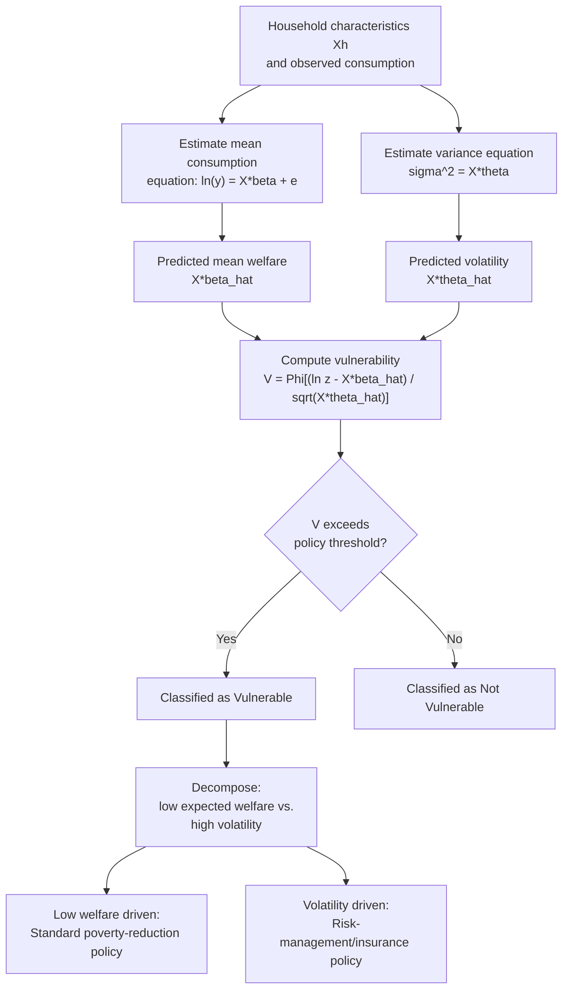

## Vulnerability and Risk in Poverty Dynamics

### Overview

Vulnerability is a **forward-looking** concept in poverty analysis: it measures the probability that a household or individual will experience poverty (or a decline in well-being) in the future, as opposed to standard poverty measures, which are **backward-looking** — describing whether a household is poor *right now*, based on observed welfare at a single point in time. A household can be currently non-poor yet highly vulnerable (facing a high probability of falling into poverty due to exposure to risk and weak coping capacity), while another currently poor household might have relatively low vulnerability to *remaining* poor if it has strong prospects for recovery. This distinction matters enormously for social protection design, since standard poverty targeting (based on current status) will miss vulnerable-but-currently-non-poor households who may need ex-ante risk-management support rather than ex-post poverty relief.

### Core Conceptual Framework

#### Vulnerability as Expected Poverty

The most common formalization, following **Chaudhuri, Jalan, and Suryahadi (2002)** and related work, defines vulnerability as the **probability that a household's consumption (or income) will fall below the poverty line at some future date**:

$$V_{ht} = \Pr(y_{h,t+1} < z)$$

Where $V_{ht}$ is household $h$'s vulnerability measured at time $t$, $y_{h,t+1}$ is projected future consumption/income, and $z$ is the poverty line. This is called **Vulnerability as Expected Poverty (VEP)**.

#### Components of Vulnerability

Vulnerability arises from the interaction of two broad factors:

1. **Exposure to risk**: The frequency, magnitude, and correlation structure of shocks a household faces — idiosyncratic (illness, job loss, death of an earner) or covariate (drought, flood, price shocks, macroeconomic crises affecting entire communities or regions simultaneously).
2. **Capacity to cope / resilience**: The household's ability to manage or absorb a shock without a large welfare decline — determined by asset holdings, access to credit and insurance (formal or informal), social networks, diversified income sources, and access to public safety nets.

A household with high exposure but strong coping capacity may have low vulnerability, while a household with modest exposure but weak coping capacity (e.g., no savings, no insurance, thin social networks) may be highly vulnerable even to relatively small shocks.

### Distinguishing Vulnerability from Related Concepts

| Concept | Temporal Orientation | What It Measures |
| --- | --- | --- |
| **Poverty (static, e.g., FGT)** | Backward/current | Whether welfare is below the line *now* |
| **Chronic poverty** | Backward, multi-period | Whether welfare has been persistently below the line *historically* |
| **Transient poverty** | Backward, multi-period | Whether welfare has fluctuated across the line *historically* |
| **Vulnerability** | Forward-looking | Probability of falling below the line *in the future* |
| **Risk** | Forward-looking, more general | The underlying uncertainty/shock exposure that generates vulnerability (a component of, not identical to, vulnerability) |

Vulnerability and chronic/transient poverty are related but distinct: a household that has been chronically poor in the past is not automatically classified as "vulnerable" in the technical VEP sense — vulnerability is specifically an ex-ante probabilistic statement about the future, estimated using a model, not simply an extrapolation of past status.

### Methodological Approaches to Estimating Vulnerability

#### 1. Vulnerability as Expected Poverty (VEP) — Variance-Based Approach

The most widely used empirical approach (Chaudhuri et al. 2002; Christiaensen and Subbarao 2005) estimates a model of household consumption as a function of observable household and community characteristics $X_h$:

$$\ln y_h = X_h \beta + e_h$$

where $e_h$ is a household-specific error term assumed to reflect idiosyncratic shocks. The variance of this error term, $\sigma_h^2$, is itself modeled as a function of household characteristics (allowing heteroskedasticity — some households face more volatile outcomes than others):

$$\sigma_h^2 = X_h \theta$$

Given estimated $\hat{\beta}$ and $\hat{\theta}$, and assuming a distributional form for $e_h$ (commonly log-normal), the probability that household $h$'s future consumption falls below the poverty line is estimated as:

$$\hat{V}_h = \Pr(\ln y_h < \ln z) = \Phi \left( \frac{\ln z - X_h \hat{\beta}}{\sqrt{X_h \hat{\theta}}} \right)$$

where $\Phi(\cdot)$ is the standard normal cumulative distribution function.

**Interpretation**: Households are then classified as vulnerable if $\hat{V}_h$ exceeds some threshold (e.g., $\hat{V}_h > 0.5$, meaning more likely than not to be poor next period, or a lower policy-relevant threshold depending on risk tolerance for targeting errors).

#### 2. Panel-Data-Based Approaches (Direct Estimation from Observed Transitions)

Where multi-period panel data is available, vulnerability can be estimated more directly by observing actual transitions into and out of poverty, modeling the probability of a poverty transition as a function of household characteristics using discrete choice models (e.g., probit/logit models of "becomes poor next period" as the dependent variable). This avoids some of the strong distributional assumptions of the cross-sectional VEP approach but requires panel data, which is often unavailable or limited in developing-country contexts.

#### 3. Asset-Based Vulnerability Approaches

Following the poverty-trap literature (see related topic), some approaches define vulnerability in terms of asset thresholds: a household is vulnerable if its asset holdings are below the level needed to sustain welfare above the poverty line in the face of anticipated shocks, drawing on estimated asset dynamics (transition functions) rather than income variance directly.

#### 4. Simulation-Based / Ex-Ante Microsimulation Approaches

Particularly for assessing vulnerability to *covariate* shocks (e.g., a drought or price shock affecting an entire region), researchers sometimes simulate the welfare impact of a specific hypothesized shock scenario (e.g., a 20% decline in agricultural income) directly on household survey data, computing the resulting change in poverty measures under the simulated shock relative to the observed baseline — an approach sometimes used in **climate vulnerability assessments** and disaster risk analysis.

### Decomposing Vulnerability: Risk versus Poverty Components

A useful decomposition separates a household's vulnerability into a component driven by its **current expected (mean) welfare position** relative to the poverty line and a component driven by the **volatility/uncertainty** around that expected position:

$$V_h = f(\underbrace{X_h\hat\beta - \ln z}_{\text{distance from poverty line}}, \underbrace{X_h \hat\theta}_{\text{exposure/volatility}})$$

This distinguishes:

- **Vulnerability due to low expected welfare** ("poverty-like" vulnerability — a household expected to be poor on average even absent unusual shocks).
- **Vulnerability due to high volatility** ("risk-like" vulnerability — a household with adequate expected welfare on average, but a high probability of a bad realization pushing it below the line).

This decomposition has direct policy relevance: the first type of vulnerability calls for standard poverty-reduction interventions (raising mean income/consumption), while the second calls for **risk-management instruments** (insurance, diversification support, buffer stock/savings mechanisms) rather than direct income transfers.

### Structural Diagram: Vulnerability Assessment Framework

### Worked Numerical Illustration

Suppose, for a household with characteristics $X_h$, the estimated model yields:

- Predicted mean log-consumption: $X_h \hat{\beta} = \ln(60)$ (i.e., predicted consumption of $60)
- Poverty line: $z = 50$, so $\ln z = \ln(50)$
- Predicted standard deviation of the log-consumption shock: $\sqrt{X_h\hat\theta} = 0.30$

Compute:

$$\hat{V}_h = \Phi\left(\frac{\ln(50) - \ln(60)}{0.30}\right) = \Phi\left(\frac{-0.182}{0.30}\right) = \Phi(-0.608)$$

Using the standard normal CDF, $\Phi(-0.608) \approx 0.272$.

**Interpretation**: Despite having a *predicted mean* consumption ($60) comfortably above the poverty line ($50), this household faces an estimated 27.2% probability of falling into poverty next period — illustrating precisely why a static, current-consumption-based poverty measure would misclassify this household as simply "non-poor," missing its substantial vulnerability. If a policy threshold for "vulnerable" is set at, say, $\hat{V}_h > 0.25$, this household would be classified as vulnerable despite being currently non-poor.

### Key Empirical Findings and Applications

- Vulnerability estimates in many developing-country studies (e.g., early applications in Indonesia by Chaudhuri, Jalan, and Suryahadi; various African and South Asian country applications) commonly find that a **substantial share of the population classified as vulnerable is not currently poor** — reinforcing the argument that targeting social protection solely on current poverty status leaves a meaningful vulnerable population uncovered.
- Vulnerability tends to be higher for households in areas exposed to **covariate risks** (drought-prone agricultural zones, flood plains) and for households with limited asset diversification, informal-sector employment, or lack of access to formal insurance/credit.
- **Climate change and vulnerability**: More recent literature increasingly integrates climate risk projections (rainfall variability, temperature shocks) into vulnerability assessments, given the covariate and potentially worsening nature of climate-related shocks in agriculture-dependent economies. [Inference: the specific magnitude of climate-driven vulnerability increases is highly context- and model-dependent, and estimates in the literature vary considerably by region, crop type, and climate scenario assumptions.]

### Policy and Programmatic Applications

- **Ex-ante versus ex-post social protection design**: Vulnerability analysis supports the case for **shock-responsive/adaptive social protection systems** that can identify and support at-risk households *before* a shock materializes (e.g., pre-registering vulnerable households for rapid payout upon a triggering event) rather than relying solely on ex-post relief after poverty has already occurred.
- **Weather-index and other parametric insurance**: Products that pay out based on an objective, verifiable trigger (e.g., rainfall below a threshold at a specific weather station) rather than individually assessed losses are designed specifically to address covariate-risk-driven vulnerability among smallholder farmers, reducing moral hazard and adverse selection problems that afflict traditional indemnity-based crop insurance.
- **Social safety net design and targeting**: Some cash transfer and safety net programs incorporate vulnerability indicators (e.g., proxy means test variables correlated with volatility, not just current consumption) into targeting formulas, though this is less common than simple current-poverty-based targeting due to the greater data and modeling requirements of vulnerability estimation.
- **Disaster risk financing**: At the national/sovereign level, instruments such as catastrophe bonds and sovereign risk pools (e.g., regional risk pooling facilities for climate-related disasters) represent macro-level analogs to household vulnerability management, pre-arranging financing for covariate shocks before they occur.

### Data Requirements and Methodological Challenges

- **Cross-sectional VEP approach**: Requires only a single well-designed household survey with a rich set of household and community covariates, but relies on strong distributional assumptions (commonly log-normality of consumption) and treats the *cross-sectional* variance in outcomes among similar households as a proxy for the *individual* household's *temporal* variance — an assumption that may not hold if some of the cross-sectional variation reflects unobserved fixed household characteristics rather than genuine shock exposure. [Inference: this "cross-section as proxy for time-series variance" assumption is a well-recognized methodological limitation of the standard VEP approach, though the extent of resulting bias is context-dependent and not always quantifiable without panel data for validation.]
- **Panel-based approaches**: More direct and less assumption-dependent, but require costly, logistically demanding panel data collection, and are still subject to attrition bias concerns (see chronic/transient poverty topic).
- **Threshold selection for "vulnerable" classification**: As with poverty cutoffs generally, the choice of probability threshold (e.g., 0.25, 0.5) used to classify a household as "vulnerable" is a policy/normative choice without a single universally correct value, and results (e.g., estimated share of population that is vulnerable) can be sensitive to this choice.
- **Validation difficulty**: Because vulnerability is inherently a *forward-looking probabilistic* prediction, rigorously validating vulnerability estimates ideally requires follow-up panel data to check whether predicted-vulnerable households actually did experience poverty in the subsequent period — a validation step not always feasible or conducted in applied studies using single-round survey data.

### Relationship to Poverty Traps and Risk-Coping Behavior

Vulnerability analysis connects closely to the **poverty trap literature**: households facing high vulnerability (due to weak coping capacity, thin asset buffers, or lack of insurance) may rationally adopt **risk-averse but low-return strategies** (e.g., planting low-yield but reliable crop varieties, avoiding profitable but risky investments, maintaining unproductive liquid asset buffers) precisely *because* they lack the insurance or savings needed to absorb a bad outcome — a behavioral mechanism sometimes cited as reinforcing poverty persistence independent of, but interacting with, asset-threshold-based poverty trap mechanisms.

**Related Topics**

- Chronic versus transient poverty (related but distinct backward-looking dynamic concepts)
- Poverty traps: theory and evidence (asset-threshold mechanisms interacting with vulnerability)
- Weather-index insurance and covariate risk instruments
- Shock-responsive and adaptive social protection system design
- Consumption smoothing, informal risk-sharing, and household coping strategies
- Proxy means testing and social protection targeting methods
- Climate change adaptation and disaster risk financing in development economics
- Panel data econometrics: heteroskedasticity modeling and probit/logit transition models