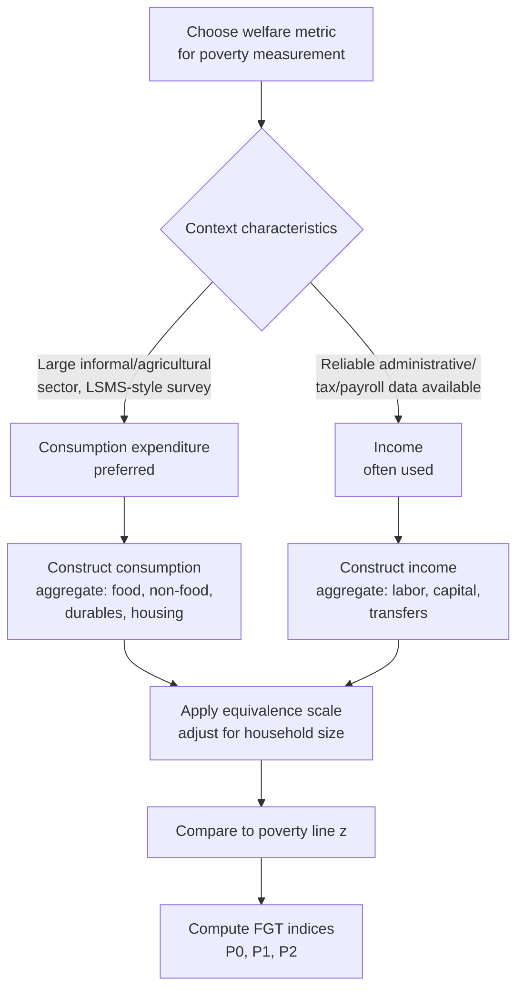

## Consumption versus Income-Based Poverty Measures

### Overview

A foundational methodological choice in poverty measurement is the selection of the **welfare metric** — the variable used to represent a household's or individual's material standard of living. The two dominant candidates are **consumption expenditure** and **income**. While theoretically related (income is, in principle, the source from which consumption is financed), the two variables diverge substantially in practice due to saving, borrowing, in-kind transfers, and measurement realities — and the choice between them can materially affect measured poverty rates, rankings of who is poor, and cross-country/cross-study comparability.

### Theoretical Justification for Consumption as the Preferred Metric

The mainstream position in development economics, particularly as practiced by the World Bank and most household survey-based poverty studies, favors **consumption expenditure** (or, more precisely, consumption expenditure adjusted for household size/composition) over income for several interconnected reasons:

#### 1. Consumption Smoothing and Permanent Income

Drawing on the **permanent income hypothesis** (Friedman) and **life-cycle hypothesis** (Modigliani), households are assumed to smooth consumption relative to transitory fluctuations in income, using savings, borrowing, and informal risk-sharing arrangements. Consumption is therefore theorized to better approximate a household's **permanent income** or longer-run standard of living, whereas current income can reflect **transitory shocks** (a bad harvest, temporary unemployment, an unusually large bonus) that do not represent the household's sustained welfare level.

#### 2. Direct Link to Material Well-Being

Consumption represents the actual goods and services a household consumes — food, housing, clothing, health, education — which is conceptually closer to material well-being itself than income, which is merely the *means* to acquire those goods. A household may have high income but low consumption (e.g., high savings rate, debt repayment obligations) or vice versa (dissaving, borrowing, or receiving in-kind support).

#### 3. Better Suited to Informal and Agricultural Economies

In many developing-country contexts — particularly among agricultural households, informal-sector workers, and the self-employed — income is extremely difficult to measure accurately:

- **Agricultural income** fluctuates seasonally and is subject to timing/recall issues (a farmer may not know their "annual income" as a single figure, especially where much production is for own consumption rather than sale).
- **Self-employment and informal income** often lack formal records, making direct income reporting unreliable.
- **In-kind income** (own-produced food, non-cash payments) requires the same valuation challenges whether captured via income or consumption modules, but consumption surveys are typically better designed to capture the value of home production directly through the consumption side.

#### 4. Underreporting Patterns

Empirical survey methodology research has generally found that **income tends to be underreported more severely than consumption**, particularly among self-employed and higher-income households (income from capital, informal business profits, and irregular sources is prone to significant underreporting), while consumption — especially detailed, itemized consumption modules — tends to produce more complete and consistent reporting, particularly for food consumption, which typically constitutes the largest expenditure share for poor households.

### Case for Income as an Alternative or Complementary Metric

Despite the consumption-based consensus in much of the development economics literature, income remains the standard welfare metric in many contexts, particularly:

#### 1. High-Income and OECD Country Poverty Statistics

Poverty and inequality statistics in most high-income countries (including official poverty measures in the United States and Eurostat-based EU poverty statistics) are predominantly **income-based**, reflecting both differing survey infrastructure (income tax records and payroll data provide relatively reliable income information in these contexts) and a longer-standing statistical tradition built around income measurement.

#### 2. Administrative Data Availability

Where administrative data (tax records, payroll systems, social security records) exists, income can often be measured with greater precision and lower survey cost than consumption, which requires detailed and burdensome expenditure recall modules.

#### 3. Capturing Economic Opportunity and Capacity

Some analysts argue income better reflects a household's **economic capacity or opportunity** at a point in time — relevant for certain policy questions (e.g., labor market analysis, wage inequality) where the object of interest is earnings capacity itself, not realized consumption.

#### 4. Inequality Measurement Considerations

For inequality analysis specifically (as opposed to poverty measurement), income-based inequality measures are often of direct interest because they reflect the *distribution of economic resources/power* more directly than consumption, which is smoothed and therefore may understate the true dispersion of underlying economic resources (e.g., a wealthy household with a temporarily low income year, financed via savings drawdown, may show consumption inequality much lower than income inequality).

### Comparative Summary Table

| Dimension | Consumption | Income |
| --- | --- | --- |
| Theoretical basis | Permanent income / life-cycle smoothing; direct welfare proxy | Direct measure of resources/economic capacity |
| Volatility | Lower (smoothed via saving/borrowing) | Higher (subject to transitory shocks) |
| Measurement in informal/agricultural economies | Generally more reliable | Prone to significant underreporting/recall error |
| Data collection burden | High (detailed, itemized recall modules; longer questionnaires) | Lower, if reliable administrative sources exist |
| Common context of use | Most developing-country and international (World Bank) poverty statistics | High-income country/OECD official poverty and inequality statistics |
| Sensitivity to underreporting | Less severe underreporting bias typically observed | More severe underreporting, especially at higher incomes and among self-employed |
| Captures inequality dispersion | May understate true dispersion (smoothing effect) | Captures fuller dispersion of economic resources |

### Practical and Technical Measurement Issues

#### Constructing the Consumption Aggregate

A standard household consumption aggregate, as used in Living Standards Measurement Study (LSMS)-type surveys, typically sums:

1. **Food consumption**: Both purchased and home-produced/own-consumed food, valued at appropriate market or imputed prices.
2. **Non-food consumption**: Regularly purchased non-food items (soap, transport, fuel).
3. **Durable goods**: Typically included via an imputed **use value** (a flow measure, such as an estimated rental-equivalent or depreciation-based value) rather than the full purchase price, since durables provide a stream of consumption services over multiple periods.
4. **Housing**: Actual or imputed rental value of housing (including for owner-occupiers, who do not pay cash rent but derive a consumption benefit from their dwelling).
5. **Health and education expenditure**: Sometimes included in full, sometimes excluded or treated separately, given debates over whether these represent "consumption" versus "investment" spending.

This aggregate is then typically adjusted using an **equivalence scale** (accounting for household size and composition, since a household of 6 needs more total consumption than a household of 2 to achieve the same per-person welfare, though not necessarily 3 times as much, due to economies of scale in shared consumption like housing) to produce a **per-adult-equivalent** or **per-capita** welfare measure comparable across households of different sizes.

#### Constructing the Income Aggregate

An income aggregate typically sums:

1. **Labor income**: Wages, salaries, and self-employment income/profits.
2. **Capital income**: Interest, dividends, rental income, imputed returns to owned assets.
3. **Transfer income**: Public transfers (pensions, social assistance) and private transfers (remittances, gifts).
4. **Imputed income from own production**: Similar valuation challenges as own-consumed food on the consumption side.

Income aggregates face particular difficulty in capturing **self-employment and informal-sector earnings** accurately, since net profit calculations require households to track revenues and costs separately — a more demanding recall task than direct consumption reporting.

### Divergence Between Consumption and Income Poverty Estimates

Empirical studies comparing income-based and consumption-based poverty measures **using the same underlying sample** consistently find:

- **Different poverty rates**: Income-based poverty rates are often (though not universally) higher and more volatile than consumption-based rates for the same population, consistent with the smoothing/permanent-income theoretical prediction — though the direction and magnitude of the gap varies by country and survey design.
- **Substantial reclassification of individual households**: Even when aggregate poverty rates are similar under both metrics, a considerable share of *individual* households are classified differently (poor under one metric, non-poor under the other) — meaning the two approaches can produce quite different targeting outcomes for anti-poverty programs even when aggregate headline statistics look comparable.
- **Different poverty profiles**: The demographic, occupational, and geographic profile of "the poor" can differ depending on which metric is used — for example, self-employed and agricultural households may appear poorer under income-based measures (due to income volatility/underreporting) than under consumption-based measures.

[Inference: the precise magnitude and direction of divergence between income- and consumption-based poverty estimates is highly context- and survey-specific; general patterns described above reflect common findings in the methodological literature but should not be treated as universal constants applicable to any specific country or dataset without direct empirical verification.]

### Structural Diagram: Welfare Metric Selection Framework

### Institutional Practice

- **World Bank's Poverty and Inequality Platform (PIP)**: Uses either consumption or income depending on data availability by country, but explicitly documents which welfare metric underlies each country's estimates, since the two are not directly comparable; cross-country poverty comparisons using the international poverty line attempt to harmonize methodology as much as possible, but underlying welfare aggregate construction (consumption vs. income, and specific aggregation choices within each) still varies by country/survey.
- **Living Standards Measurement Study (LSMS)** surveys, a major source of developing-country poverty data, are explicitly designed around detailed **consumption modules** as the primary welfare metric, reflecting the methodological consensus described above.
- **OECD and EU statistical agencies**: Predominantly report income-based poverty and inequality measures (e.g., the EU's at-risk-of-poverty rate, based on 60% of median equivalized disposable income), reflecting both administrative data availability and a distinct measurement tradition from World Bank/developing-country practice.
- **US Official Poverty Measure and Supplemental Poverty Measure**: Both are income-based (though differing in how income and needs are defined), again reflecting the income-measurement tradition common in high-income country statistics. [Unverified: specific current-year details of US poverty measure methodology should be checked against the U.S. Census Bureau's current published methodology, since measurement details are subject to periodic revision.]

### Methodological Debates and Ongoing Issues

- **Recall period length**: Consumption surveys must choose a recall period (e.g., 7-day, 14-day, or 30-day recall for food; longer recall for infrequently purchased items), and the choice of recall period has been shown in methodological research to affect measured consumption levels and thus poverty rates — shorter recall periods are generally associated with higher reported consumption (less recall decay) but at greater survey cost and respondent burden. [Inference: the specific magnitude of recall-period effects varies by country, survey design, and item category studied; researchers should consult survey methodology validation studies specific to their context rather than assuming a universal correction factor.]
- **Diary versus recall methods**: Some surveys use consumption diaries (respondents record purchases as they occur) rather than retrospective recall, generally considered more accurate for high-frequency items but more burdensome and prone to compliance/fatigue issues over extended diary periods.
- **Treatment of durable goods and housing**: The choice of valuation method for durables (full purchase price vs. depreciation-based use value) and housing (actual rent, imputed rent, or user cost) can materially affect the consumption aggregate and is not fully standardized across surveys or countries.
- **Comparability over time**: Changes in survey questionnaire design (e.g., a change in the food consumption recall period between survey rounds) can introduce artificial breaks in poverty trend comparability that are not driven by genuine changes in living standards — a well-documented issue in several countries' poverty trend series requiring careful methodological adjustment or "poverty line rebasing" to address. [Unverified: specific instances of such measurement breaks and the exact corrective techniques applied vary by country; analysts should consult country-specific technical notes before drawing trend conclusions across periods with known survey design changes.]

**Related Topics**

- Poverty line construction methods (cost-of-basic-needs, food-energy-intake, international poverty lines)
- Equivalence scales and household composition adjustments
- Living Standards Measurement Study (LSMS) survey methodology
- Foster-Greer-Thorbecke poverty measures (application to either welfare metric)
- Survey recall bias and measurement error in household surveys
- Purchasing Power Parity (PPP) and cross-country welfare comparisons
- Inequality measurement: Gini coefficient and Lorenz curves (income vs. consumption based)
- Informal sector income measurement challenges