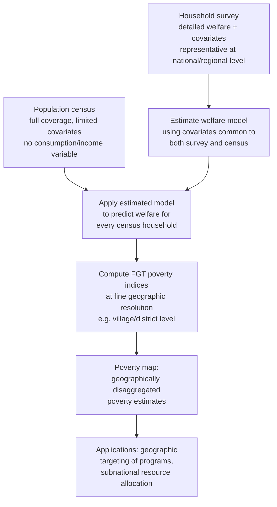

## Data Sources for Poverty Measurement

### Overview

Reliable poverty measurement depends fundamentally on the underlying data infrastructure used to collect information on household welfare. Different data sources vary substantially in their coverage, frequency, level of detail, cost, and suitability for different poverty-analysis purposes — from headline national poverty rate estimation to fine-grained targeting of social programs to real-time monitoring of shocks. Understanding the strengths, limitations, and appropriate use cases of each major data source is essential for sound poverty analysis.

### Household Sample Surveys

Household surveys collected via **probability sampling** from a nationally (or subnationally) representative sampling frame are the primary source of data for most official poverty statistics worldwide.

#### 1. Living Standards Measurement Study (LSMS) Surveys

Developed and supported by the World Bank beginning in the early 1980s, LSMS surveys are multi-topic household surveys explicitly designed to support welfare and poverty analysis, featuring:

- Detailed **consumption expenditure modules** (food and non-food, with careful attention to recall periods and own-production valuation).
- Modules on income, employment, education, health, housing, assets, and access to services.
- In many implementations, a **panel component** (repeated visits to the same households over time), enabling poverty dynamics analysis.
- The **LSMS-Integrated Surveys on Agriculture (LSMS-ISA)** variant adds detailed agricultural production modules, often geo-referenced and linked to plot-level data, supporting agricultural productivity and rural poverty analysis in Sub-Saharan Africa and other regions.

#### 2. Household Budget/Income and Expenditure Surveys

Many national statistical offices conduct their own **Household Budget Surveys (HBS)** or **Household Income and Expenditure Surveys (HIES)**, which serve purposes similar to LSMS surveys (consumption/income measurement for poverty and inequality analysis, and often also for national accounts and Consumer Price Index basket construction) but follow country-specific questionnaire designs, sampling frames, and periodicities rather than a standardized international template.

#### 3. Demographic and Health Surveys (DHS) and Multiple Indicator Cluster Surveys (MICS)

- **DHS** (supported by USAID) and **MICS** (supported by UNICEF) are large, internationally standardized household surveys focused primarily on health, nutrition, fertility, and child welfare indicators, but widely used as the primary data source for **multidimensional poverty measurement** (e.g., the Global MPI), since they collect the health, education, and living-standards indicators the Alkire-Foster methodology requires.
- These surveys typically do **not** collect detailed consumption or income data, so they are generally unsuitable for monetary poverty measurement but are the standard source for multidimensional and asset-based wealth index construction.

#### 4. Labor Force Surveys

Primarily designed to measure employment, unemployment, and labor market characteristics, labor force surveys sometimes include income modules that can support income-based poverty analysis, particularly in contexts (often middle- and high-income countries) where labor force surveys are conducted with high frequency (quarterly or more often), enabling more timely poverty/labor market monitoring than infrequent dedicated consumption surveys.

### Population Censuses

A **population and housing census** attempts to enumerate the entire population (not a sample), typically conducted every 10 years in most countries.

- **Strengths**: Complete coverage enables highly granular geographic disaggregation (down to small administrative units or even individual localities) impossible with sample surveys, which lack statistical power at very fine geographic levels. Census data underpins **small-area estimation** and **poverty mapping** methodologies (see below).
- **Limitations**: Censuses typically collect only a limited set of variables (housing characteristics, basic demographics, sometimes asset ownership) due to the cost and logistical burden of universal enumeration — they generally do **not** include detailed consumption or income modules, making them unsuitable for direct poverty measurement on their own.

### Administrative Data

Data generated as a byproduct of government service delivery, tax collection, or social program administration:

- **Tax and payroll records**: Used extensively for income-based poverty and inequality measurement in high-income countries with well-developed formal-sector tax administration, but of limited use in economies with large informal sectors, where the majority of the population may not appear in tax records at all.
- **Social registry / social protection program administrative data**: Records from cash transfer programs, social pension systems, and similar programs, often containing household-level information collected for program targeting (e.g., proxy means test scores) that can supplement or cross-validate survey-based poverty estimates for enrolled populations, though these are not nationally representative of the full population by construction.
- **Civil registration and vital statistics (CRVS) systems**: Primarily used for demographic rather than poverty analysis directly, but foundational for constructing accurate population denominators used in poverty rate calculations.

### Small-Area Estimation and Poverty Mapping

Because household surveys are typically only representative at relatively coarse geographic levels (national or major regional level) due to sample size constraints, a specialized statistical technique — **small-area estimation (SAE)**, often called **poverty mapping** in this context — combines detailed household survey data with more geographically comprehensive census (or large administrative dataset) data to produce estimated poverty rates at finer geographic resolution than either source could support alone.

#### Standard SAE Methodology (ELL Method)

The most widely used approach, developed by **Elbers, Lanjouw, and Lanjouw (2003)** — often called the "ELL method" — proceeds as follows:

1. Estimate a model of household consumption/income as a function of covariates **using the household survey**, restricted to covariates that are also available in the census (e.g., household size, education levels, housing characteristics, asset ownership — variables common to both survey and census questionnaires).
2. Apply the estimated model's coefficients to the **census data** (which has full population coverage but no consumption/income variable) to predict consumption/income for every household in the census.
3. Compute FGT poverty indices (or other welfare statistics) using the predicted values at whatever fine geographic level the census supports (e.g., village, district), incorporating both **model-based prediction error** and **idiosyncratic error** into standard error calculations for the small-area estimates.

#### Structural Diagram: Small-Area Estimation (Poverty Mapping) Workflow

#### Applications of Poverty Maps

- **Geographic targeting** of social programs, allowing resources to be directed to the poorest localities identified via the map rather than uniformly or via broader (and less precise) regional averages.
- **Subnational fiscal transfer formulas**, where some countries incorporate poverty map estimates into intergovernmental transfer allocation rules.
- **Combining with satellite/remote sensing data**: More recent methodological developments (discussed below) increasingly incorporate satellite-derived variables (nighttime lights, land cover) as additional covariates in the small-area estimation model, particularly useful where recent census data is unavailable or outdated.

### Emerging and Non-Traditional Data Sources

#### 1. Satellite Imagery and Remote Sensing

Researchers have developed methods to predict poverty and wealth indicators using satellite imagery, particularly:

- **Nighttime lights data**: Used as a proxy for economic activity, since areas with higher electrification and economic activity tend to show greater nighttime luminosity; correlated with (though an imperfect proxy for) local economic welfare.
- **High-resolution daytime satellite imagery combined with machine learning**: Studies (e.g., Jean et al. 2016, published in *Science*) have used convolutional neural networks trained on daytime satellite images (capturing features such as roof material, road density, and agricultural land use patterns) to predict village-level wealth/consumption, achieving meaningful predictive accuracy in several African countries where such methods were validated against household survey data. [Unverified: the specific predictive accuracy (e.g., R-squared values) reported in such studies is context- and country-specific; researchers should consult the original validation studies for figures relevant to a particular application rather than assuming universal applicability of any single reported accuracy figure.]

#### 2. Mobile Phone and Call Detail Records (CDR)

Mobile network operator data — call patterns, airtime purchase behavior, mobility patterns inferred from cell tower connections — has been explored as a proxy for household or individual welfare, particularly useful for near-real-time monitoring in contexts where traditional survey data is infrequent or delayed. Requires partnership with mobile network operators and raises data privacy considerations that must be carefully managed.

#### 3. Mobile Phone Surveys (High-Frequency Phone Surveys)

Distinct from CDR-based approaches, some poverty monitoring initiatives conduct **high-frequency phone surveys (HFPS)** — brief, repeated phone-based interviews (rather than passive data collection) — to track welfare indicators at higher frequency than traditional in-person surveys allow. This approach gained prominence during the COVID-19 pandemic, when in-person survey fieldwork was disrupted in many countries, and several national statistical offices and the World Bank implemented rapid phone-based monitoring of income loss, food security, and coping behaviors as a stopgap and complement to traditional surveys.

#### 4. Financial and Transaction Data

In contexts with meaningful **mobile money** or digital payment system penetration, transaction-level data (with appropriate privacy safeguards and often via partnership with financial service providers) has been explored as a source of high-frequency welfare proxies, particularly for monitoring short-term income shocks.

### Data Source Comparison Table

| Data Source | Coverage | Frequency | Welfare Detail | Primary Poverty Use Case |
| --- | --- | --- | --- | --- |
| LSMS/HBS/HIES surveys | Sample (nationally representative) | Periodic (often 3-5 year intervals) | High (detailed consumption/income) | Standard monetary poverty measurement |
| DHS/MICS | Sample (nationally representative) | Periodic (often 3-5 year intervals) | Low on monetary welfare; high on health/education/assets | Multidimensional poverty (MPI) |
| Population census | Full population | Infrequent (typically ~10 years) | Very limited (basic demographics/housing) | Denominators; covariates for small-area estimation |
| Administrative/tax records | Varies (often formal sector only) | Continuous/frequent | Income-focused, formal sector only | High-income country income poverty; program monitoring |
| Poverty maps (SAE) | Full population (via census) | Tied to census/survey availability | Derived/predicted, not directly observed | Geographic targeting, subnational allocation |
| Satellite imagery | Full geographic coverage | Frequent/near-real-time potential | Indirect proxy only | Poverty proxy where survey data is outdated/absent |
| High-frequency phone surveys | Sample (often smaller, sometimes non-probability) | High frequency (weekly/monthly) | Moderate (abbreviated modules) | Rapid shock monitoring |

### Key Challenges Across Data Sources

- **Survey timing and infrequency**: Many developing countries conduct detailed consumption surveys only once every 3-5 years (or less often), meaning official poverty estimates can be several years out of date at the time of publication, creating challenges for timely policy response to emerging shocks (e.g., a food price crisis or economic downturn occurring between survey rounds).
- **Comparability across survey rounds**: Changes in questionnaire design, recall periods, sampling frame updates, or price deflators between survey rounds can introduce breaks in poverty trend series not attributable to genuine welfare changes (see also the consumption-vs-income topic for recall-period-specific issues).
- **Sampling and non-sampling error**: All survey-based estimates are subject to sampling error (quantifiable via standard errors/confidence intervals) and non-sampling error (measurement error, non-response bias, interviewer effects), the latter of which is harder to quantify but can be substantial, particularly for sensitive questions (income, assets) or hard-to-reach populations.
- **Coverage gaps**: Certain populations are systematically harder to capture in standard household surveys — the homeless, nomadic/pastoralist populations, populations in conflict-affected or hard-to-access areas, and institutionalized populations (prisons, care facilities) — potentially biasing poverty estimates if these groups have systematically different (often higher) poverty rates than the general surveyed population.
- **Privacy and ethical considerations for novel data sources**: Satellite imagery, mobile phone, and financial transaction data all raise data privacy, consent, and potential surveillance concerns that must be addressed through appropriate governance frameworks, anonymization/aggregation protocols, and, where applicable, regulatory compliance, before such data can be ethically and legally used for welfare analysis. [Inference: specific regulatory requirements vary substantially by jurisdiction and data type; researchers using novel data sources should consult current data protection law and institutional review requirements applicable to their specific context rather than relying on general practice described here.]

### Institutional Data Infrastructure

- **World Bank's Poverty and Inequality Platform (PIP)**: Aggregates and harmonizes household survey microdata from participating countries to produce internationally comparable poverty estimates using the international poverty line(s), serving as the primary global poverty monitoring data infrastructure.
- **National statistical offices (NSOs)**: The primary institutional source of household survey data collection in most countries, often supported technically and financially by international organizations (World Bank, UN agencies, bilateral donors) for survey design, fieldwork, and data processing capacity.
- **International Household Survey Network (IHSN)** and similar data archiving/documentation initiatives: Support standardized metadata documentation and, where permitted, microdata access for researchers, improving transparency and replicability of poverty estimates across countries. [Unverified: current institutional structures, active status, and specific data access protocols for such initiatives should be verified against their current websites/documentation, as international data infrastructure arrangements evolve over time.]

**Related Topics**

- Consumption versus income-based poverty measures (welfare metric construction from survey data)
- Small-area estimation and poverty mapping methodology (ELL method technical details)
- Living Standards Measurement Study (LSMS) survey design and implementation
- Machine learning applications in development economics (satellite-based welfare prediction)
- Survey sampling methodology and standard error estimation for poverty statistics
- High-frequency monitoring and rapid shock assessment methods
- Purchasing Power Parity (PPP) and international poverty line construction
- Data privacy and ethics in development data collection