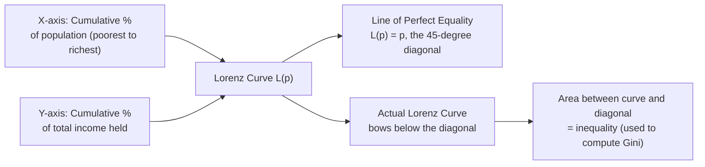

## Measuring Inequality: Gini Coefficient and Lorenz Curve

### Overview

The Lorenz curve and Gini coefficient are the most widely used tools for visualizing and summarizing the degree of inequality in the distribution of income, consumption, wealth, or any other measurable quantity across a population. The Lorenz curve provides a full graphical representation of the distribution's inequality, while the Gini coefficient condenses that information into a single summary statistic ranging from 0 (perfect equality) to 1 (perfect inequality).

### The Lorenz Curve

#### Definition and Construction

The **Lorenz curve** plots the **cumulative share of total income (or consumption/wealth)** held by the bottom $p\%$ of the population, against $p$ itself, with the population ranked from poorest to richest.

Formally, if $y_1 \leq y_2 \leq \ldots \leq y_n$ represents the ordered income distribution across $n$ individuals, the Lorenz curve $L(p)$ is defined as:

$$L(p) = \frac{\sum_{i=1}^{\lfloor pn \rfloor} y_i}{\sum_{i=1}^{n} y_i}, \quad p \in [0, 1]$$

That is, $L(p)$ gives the fraction of total income held by the poorest fraction $p$ of the population.

#### Key Properties

- $L(0) = 0$ and $L(1) = 1$ always (the poorest 0% hold 0% of income; the entire population holds 100% of income).
- $L(p)$ is **non-decreasing and convex** (since the population is ranked from poorest to richest, each additional percentile added contributes at least as much income as the previous one).
- The **line of perfect equality** is the 45-degree diagonal line $L(p) = p$: if every individual held exactly the same income, the poorest $p\%$ of the population would hold exactly $p\%$ of total income.
- The further the Lorenz curve **bows below** the line of perfect equality, the greater the degree of inequality in the distribution.

#### Diagrammatic Representation

#### Worked Numerical Example

Consider a population of 5 individuals with incomes: 10, 20, 30, 40, 100 (total = 200).

| Cumulative % of population | Cumulative income | Cumulative % of income |
| --- | --- | --- |
| 20% (1 person) | 10 | 5% |
| 40% (2 people) | 30 | 15% |
| 60% (3 people) | 60 | 30% |
| 80% (4 people) | 100 | 50% |
| 100% (5 people) | 200 | 100% |

This table defines the Lorenz curve for this population: at $p=0.20$, $L(p) = 0.05$; at $p=0.60$, $L(p)=0.30$; and so on. Note that the poorest 80% of the population holds only 50% of total income, while the richest 20% (a single individual with income 100) holds the other 50% — illustrating substantial inequality, since under perfect equality the poorest 80% would hold 80% of income.

### The Gini Coefficient

#### Definition

The **Gini coefficient** ($G$) is a single summary statistic derived from the Lorenz curve, defined as twice the area between the line of perfect equality and the actual Lorenz curve:

$$G = 2 \int_0^1 [p - L(p)] \, dp$$

Equivalently, if $A$ is the area between the line of equality and the Lorenz curve, and $B$ is the area below the Lorenz curve, then:

$$G = \frac{A}{A+B} = \frac{A}{0.5}= 2A$$

since the total area under the diagonal line (triangle $A+B$) is always $0.5$.

#### Range and Interpretation

- $G = 0$: **Perfect equality** — every individual has identical income (the Lorenz curve coincides with the diagonal).
- $G = 1$: **Perfect inequality** — a single individual holds all income while everyone else has zero (the theoretical maximum in a population of infinite size; in a finite population of $n$, the maximum achievable Gini is $\frac{n-1}{n}$, slightly less than 1).
- In practice, most countries' income Gini coefficients fall roughly between 0.25 (highly equal, e.g., some Nordic countries) and 0.60+ (highly unequal, common among some countries in Latin America and Southern Africa), though exact rankings and values change over time and should be verified against current data for any specific policy application.

#### Alternative Computational Formula (Discrete Data)

For discrete data (as typically encountered in survey datasets), the Gini coefficient is commonly computed using the following formula, which does not require constructing the full Lorenz curve integral directly:

$$G = \frac{\sum_{i=1}^{n}\sum_{j=1}^{n} |y_i - y_j|}{2n^2 \bar{y}}$$

where $\bar{y}$ is the mean income and the double sum computes the **mean absolute difference** between all pairs of individuals in the population, normalized by twice the mean. This formulation makes explicit that the Gini coefficient is fundamentally a measure of the **average pairwise income difference**, relative to the mean — the more dispersed the pairwise differences, the higher the Gini.

An equivalent and computationally more convenient formula, using incomes ranked in ascending order ($y_1 \leq y_2 \leq \ldots \leq y_n$), is:

$$G = \frac{2\sum_{i=1}^{n} i \cdot y_i}{n\sum_{i=1}^n y_i} - \frac{n+1}{n}$$

where $i$ is the rank of individual $i$ in the ordered distribution (rank 1 = poorest).

#### Worked Numerical Example (continued)

Using the same 5-person distribution (incomes: 10, 20, 30, 40, 100; already sorted ascending; $n=5$; total income $= 200$):

| Rank $i$ | Income $y_i$ | $i \cdot y_i$ |
| --- | --- | --- |
| 1 | 10 | 10 |
| 2 | 20 | 40 |
| 3 | 30 | 90 |
| 4 | 40 | 160 |
| 5 | 100 | 500 |

Sum of $i \cdot y_i = 10+40+90+160+500 = 800$

$$G = \frac{2 \times 800}{5 \times 200} - \frac{5+1}{5} = \frac{1600}{1000} - 1.2 = 1.6 - 1.2 = 0.40$$

This population has a Gini coefficient of **0.40**, indicating a moderate-to-high degree of inequality — consistent with the earlier observation that the poorest 80% of the population holds only 50% of total income.

### Trapezoidal Approximation from Lorenz Curve Data (Grouped/Bracket Data)

When data is available only in grouped form (e.g., income shares by quintile or decile, as commonly reported in published statistics rather than full microdata), the Gini coefficient can be approximated using the **trapezoidal rule** to estimate the area under the Lorenz curve:

$$G \approx 1 - \sum_{i=1}^{k} (p_i - p_{i-1})(L_i + L_{i-1})$$

where $p_i$ are the cumulative population shares (e.g., 0.2, 0.4, 0.6, 0.8, 1.0 for quintiles) and $L_i$ are the corresponding cumulative income shares. This approximation slightly **understates** the true Gini coefficient when computed from grouped rather than individual-level data, since the trapezoidal approximation assumes linear segments between data points, whereas the true Lorenz curve is convex — this understatement is more pronounced with fewer groups (e.g., quintiles) and diminishes with finer groupings (e.g., percentiles or full microdata).

### Key Properties and Axioms of the Gini Coefficient

- **Scale invariance**: Multiplying everyone's income by the same positive constant leaves $G$ unchanged (the Gini coefficient depends only on relative, not absolute, income differences).
- **Population invariance (replication invariance)**: Replicating the population (e.g., duplicating every individual) leaves $G$ unchanged, since relative shares are preserved.
- **Symmetry (anonymity)**: $G$ is unaffected by relabeling/reordering individuals with identical incomes.
- **Pigou-Dalton transfer principle**: A progressive transfer (from a richer to a poorer individual, without reversing their relative ranking) always **decreases** $G$; a regressive transfer always **increases** $G$. This is a key desirable property shared by most standard inequality measures.
- **Transfer sensitivity**: The Gini coefficient is more sensitive to transfers occurring near the **middle** of the income distribution than to transfers of equal absolute size occurring at the extremes (very top or very bottom) — a property sometimes criticized, since some analysts argue policy should weight transfers among the poorest most heavily (see the discussion of alternative inequality measures below).

### Decomposability

Unlike the FGT poverty measures, the Gini coefficient is **not perfectly additively decomposable** across population subgroups in the general case. If a population is split into subgroups (e.g., urban/rural), the national Gini coefficient can be decomposed into three components:

$$G = G_{within} + G_{between} + G_{overlap}$$

- $G_{within}$: A weighted average of each subgroup's own Gini coefficient.
- $G_{between}$: The inequality that would exist if every individual within a subgroup had the subgroup's mean income (capturing inequality *between* group means).
- $G_{overlap}$ (also called the residual term): A term arising specifically because the Gini coefficient depends on the *ranks* of individuals in the *overall* population, not just within-group ranks; this term is zero only if the subgroup income distributions do not overlap (e.g., every urban household is richer than every rural household) and is generally positive otherwise, complicating clean decomposition. This non-zero overlap term is a key technical limitation of the Gini coefficient relative to decomposable inequality measures like the **Theil index** or the **General Entropy class**, which decompose cleanly without a residual/overlap term.

### Comparison with Alternative Inequality Measures

| Measure | Range | Decomposable (no residual)? | Sensitivity Pattern |
| --- | --- | --- | --- |
| Gini coefficient | 0 to ~1 | No (overlap term) | Most sensitive to transfers near the middle of the distribution |
| Theil index (Generalized Entropy, $\alpha=1$) | 0 to $\ln(n)$ | Yes | More sensitive to transfers at the top |
| Mean Log Deviation (GE, $\alpha=0$) | 0 to $\infty$ | Yes | More sensitive to transfers at the bottom |
| Coefficient of variation (GE, $\alpha=2$) | 0 to $\infty$ | Yes | Most sensitive to transfers at the top |
| Atkinson index | 0 to 1 | Not additively, but has explicit welfare/inequality-aversion parameter | Sensitivity tunable via inequality aversion parameter $\epsilon$ |

The **Generalized Entropy (GE) class** (which includes the Theil index and mean log deviation as special cases) is often preferred in technical decomposition analysis specifically because it avoids the Gini's overlap-term problem, cleanly separating within-group and between-group inequality with no residual.

The **Atkinson index** offers an explicit **social welfare-theoretic foundation**, incorporating a parameter $\epsilon$ (inequality aversion) that allows the analyst to make explicit how much weight is placed on inequality at different parts of the distribution, and is often used when the analytical goal is directly linked to normative welfare comparisons rather than purely descriptive inequality measurement.

### Data Requirements and Estimation Considerations

- **Income vs. consumption basis**: As with poverty measurement, inequality can be computed using either income or consumption data, and — for the same reasons discussed in monetary poverty measurement (income volatility and underreporting) — consumption-based Gini coefficients are typically **lower** than income-based Gini coefficients for the same population, since consumption smoothing reduces measured dispersion relative to income.
- **Survey underreporting at the top of the distribution**: Household surveys often struggle to capture very high incomes/wealth accurately (due to under-sampling of wealthy households, non-response among the wealthy, and underreporting of capital income), which can lead standard survey-based Gini coefficients to **understate** true inequality, particularly where top income shares are of primary interest — a widely discussed limitation in the inequality-measurement literature, addressed in some studies by combining survey data with tax record data on top incomes ("distributional national accounts" approaches).
- **Equivalence scales**: As with poverty measurement, inequality calculations typically require converting household-level income/consumption to a per-capita or per-adult-equivalent basis before computing individual-level Gini coefficients, since household size varies systematically with income level in ways that can bias unadjusted household-level Gini estimates.
- **Sampling weights**: Survey-based Gini estimates must incorporate appropriate sampling weights to be nationally representative, since most household surveys use complex, non-self-weighting sample designs (stratification, clustering, unequal selection probabilities).

### Applications in Development Economics

- **Kuznets curve hypothesis**: Simon Kuznets's (1955) hypothesis that inequality (often proxied by the Gini coefficient) first rises and then falls over the course of economic development, generating an inverted-U relationship between income level and inequality — an influential but empirically contested hypothesis, with more recent literature finding mixed or country-specific support rather than a universal pattern. [Inference: the strength and universality of empirical support for the Kuznets curve varies substantially across studies, time periods, and country samples, and is not treated as a settled empirical law in the contemporary literature.]
- **Growth-inequality-poverty relationships**: The Gini coefficient is a standard input into decompositions of poverty change into growth and redistribution components (see the Datt-Ravallion decomposition), and into analyses of "pro-poor growth" (whether economic growth disproportionately benefits the poor relative to the population average).
- **Cross-country inequality comparisons**: Datasets such as the World Bank's PIP, the Standardized World Income Inequality Database (SWIID), and the World Inequality Database (WID) compile Gini coefficients (and other inequality measures) across countries and time, though users should note that underlying data sources, welfare metrics (income vs. consumption), and methodological adjustments vary across these databases, sometimes producing different Gini estimates for the same country-year. [Unverified: specific current-year comparative Gini values and database coverage should be checked directly against these databases' current documentation, since inequality statistics are revised periodically as new survey data becomes available.]

**Related Topics**

- Theil index and Generalized Entropy class of inequality measures
- Atkinson index and welfare-theoretic inequality measurement
- Top income shares and distributional national accounts methodology
- Kuznets curve hypothesis and empirical tests
- Datt-Ravallion decomposition of poverty change into growth and redistribution
- Pro-poor growth measurement
- Consumption versus income-based poverty measures (parallel welfare-metric issues for inequality)
- Equivalence scales and household composition adjustments