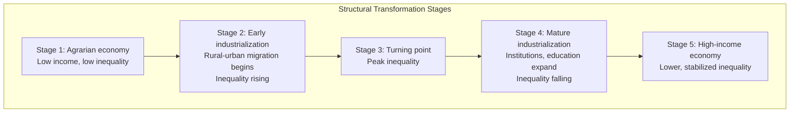

## Kuznets Curve Hypothesis

### Definition and Core Proposition

The Kuznets curve hypothesis, proposed by Simon Kuznets in his 1955 American Economic Review article "Economic Growth and Income Inequality," posits an **inverted-U relationship between income inequality and economic development**. As an economy develops from a low-income agrarian state to a high-income industrialized state, income inequality first rises, reaches a peak, and then declines.

The hypothesis is typically expressed as a relationship between a measure of inequality (commonly the Gini coefficient) and a measure of development (commonly per capita income), producing an inverted-U or "hump-shaped" curve when plotted.

$$\text{Inequality} = f(\text{Income per capita}), \quad f'(\cdot) > 0 \text{ initially, then } f'(\cdot) < 0$$

### Theoretical Mechanism

Kuznets grounded the hypothesis in a **structural transformation** story, primarily the migration of labor from a low-productivity, low-inequality traditional (agricultural) sector to a high-productivity, high-inequality modern (industrial/urban) sector.

**Stage 1 — Early development (rising inequality):**

- The economy is predominantly agrarian, with relatively low internal inequality within the rural sector.
- Industrialization begins, and a small share of the population moves into higher-paying urban/industrial jobs.
- Because only a minority initially benefits from industrial wages while the majority remains in lower-income agriculture, the gap between the two sectors widens aggregate measured inequality.
- Returns to capital and skilled labor rise disproportionately as new industries emerge, further widening the gap between capital owners/skilled workers and unskilled labor.

**Stage 2 — Turning point:**

- The share of the population in the modern sector grows large enough that further rural-to-urban migration starts to compress the wage gap between sectors (as rural labor supply tightens, pushing up agricultural wages, and urban labor supply grows, moderating urban wage premiums).

**Stage 3 — Later development (falling inequality):**

- As industrialization matures, a larger share of the population participates in the higher-productivity sector.
- Redistributive institutions typically mature alongside development: progressive taxation, public education expansion, social insurance, and labor market regulations (e.g., minimum wages, unionization) become more prevalent and administratively feasible.
- Human capital becomes more broadly distributed as education expands, narrowing wage dispersion.
- Aggregate inequality declines as these forces dominate.

### Formal Representation

A stylized two-sector decomposition (in the spirit of the Kuznets/Lewis dual-economy framework) illustrates the mechanism. Let the population be divided into a traditional sector (share $\lambda$, mean income $y_T$, low internal inequality) and a modern sector (share $1-\lambda$, mean income $y_M > y_T$, higher internal inequality). Total inequality can be decomposed (using a measure like Theil's index, which is exactly decomposable) into:

$$I_{total} = I_{within} + I_{between}$$

where:

$$I_{within} = \lambda I_T + (1-\lambda) I_M$$

$$I_{between} = \text{inequality arising from the income gap } (y_M - y_T) \text{ weighted by } \lambda(1-\lambda)$$

As $\lambda$ (the traditional sector's population share) falls from near 1 toward 0 over the course of development, the between-sector component $I_{between}$ first rises (as $\lambda(1-\lambda)$ increases when $\lambda$ moves away from 1) and then falls (as $\lambda(1-\lambda)$ decreases when $\lambda$ approaches 0), tracing out the inverted-U shape even under fairly mechanical assumptions about sectoral migration.

**Key Points**

- This within/between decomposition is a well-established technique in inequality accounting (used extensively in Theil-index-based analyses of dual economies) and is not itself a claim that the Kuznets hypothesis is empirically true — it demonstrates a plausible mechanism that *could* generate the inverted-U pattern under specific assumptions about sector migration and relative sector inequality.
- The mechanical result depends on the assumption that $I_M > I_T$ (modern sector is internally more unequal than traditional sector) and that $y_M > y_T$ persists throughout the transition.

### The Kuznets Curve Diagram

### Illustration: The Inverted-U Curve

<svg xmlns="http://www.w3.org/2000/svg" viewBox="0 0 700 400">
<text x="350" y="25" text-anchor="middle" font-size="16" font-weight="bold" fill="#1a1a1a">Kuznets Curve: Inequality vs. Development (svg_diagram)</text>
<line x1="70" y1="330" x2="650" y2="330" stroke="#333" stroke-width="2" />
<line x1="70" y1="330" x2="70" y2="50" stroke="#333" stroke-width="2" />
<text x="360" y="365" text-anchor="middle" font-size="13" fill="#333">Income per capita (development level)</text>
<text x="30" y="190" text-anchor="middle" font-size="13" fill="#333" transform="rotate(-90 30 190)">Inequality (e.g., Gini coefficient)</text>
<path d="M 90 300 Q 250 100 360 90 Q 470 100 630 280" fill="none" stroke="#2563eb" stroke-width="3" />
<line x1="360" y1="90" x2="360" y2="330" stroke="#dc2626" stroke-width="2" stroke-dasharray="6,4" />
<text x="360" y="75" text-anchor="middle" font-size="12" fill="#dc2626" font-weight="bold">Turning point</text>
<text x="150" y="270" text-anchor="middle" font-size="12" fill="#1e3a5f">Rising phase</text>
<text x="530" y="270" text-anchor="middle" font-size="12" fill="#1e3a5f">Falling phase</text>
<text x="95" y="315" text-anchor="middle" font-size="11" fill="#333">Low income</text>
<text x="610" y="315" text-anchor="middle" font-size="11" fill="#333">High income</text>
</svg>

### Empirical Evidence and Testing Approaches

Empirical testing of the Kuznets hypothesis has typically taken two forms:

1. **Cross-sectional studies**: Regressing a cross-country sample's inequality measures (usually Gini coefficients) on income per capita and its square, testing whether the coefficient on income is positive and the coefficient on income-squared is negative and significant:

$$Gini_i = \beta_0 + \beta_1 (\text{Income}_i) + \beta_2 (\text{Income}_i)^2 + \varepsilon_i$$

A finding of $\beta_1 > 0$ and $\beta_2 < 0$ (both statistically significant) is interpreted as support for the inverted-U shape.

2. **Panel/time-series studies**: Tracking inequality within individual countries over their own development trajectories, which addresses concerns that cross-sectional patterns may reflect fixed differences between countries (institutions, colonial history, geography) rather than a genuine within-country developmental process.

**Key Points**

- Early cross-sectional studies using data available through the 1970s–1980s (including Kuznets' own limited dataset of a small number of countries) found patterns broadly consistent with the inverted-U.
- Panel-data studies from the 1990s onward, using much larger and more reliable inequality datasets (e.g., the Deininger-Squire dataset and its successors), have found substantially weaker or non-existent support for a universal inverted-U pattern within individual countries over time. [Inference: the degree of support varies by dataset, time period, and estimation method used across the literature, and there is no single consensus empirical verdict.]
- A widely cited critique is that the original cross-sectional pattern may have been heavily influenced by a small number of Latin American countries with historically high inequality and middle-income status, rather than reflecting a general law of development.

### Major Critiques and Limitations

**Cross-sectional vs. time-series conflation**: The core methodological critique is that fitting a curve across countries at one point in time conflates genuine within-country developmental dynamics with cross-country structural differences (colonial legacy, land distribution history, political institutions, natural resource endowments). A country's position on a cross-sectional curve does not imply it will follow that path over time.

**The "new Kuznets facts" and reversal of inequality trends**: From the 1980s onward, many advanced economies (which had passed through and beyond the hypothesized turning point) experienced a **renewed rise in inequality** — often attributed to skill-biased technological change, globalization, declining unionization, and changes in tax policy. This pattern, sometimes discussed as generating a "Kuznets wave" or second upswing, is difficult to reconcile with a simple one-time inverted-U, since inequality was not supposed to rise again after the turning point.

**Omitted institutional and policy factors**: The original hypothesis is largely mechanical (driven by sectoral labor reallocation) and does not explicitly incorporate the role of political economy—specifically, that the eventual decline in inequality in currently high-income countries was substantially shaped by deliberate policy choices (progressive taxation, welfare states, mass public education, labor rights) rather than an automatic byproduct of structural transformation. Critics argue this makes the hypothesis at best a description of one historical episode (Western industrialization) rather than a universal economic law.

**East Asian counter-examples**: Several rapidly industrializing East Asian economies (e.g., South Korea, Taiwan during their high-growth periods) achieved rapid growth with relatively low and often improving inequality, an experience that does not fit a rising-then-falling pattern and is frequently cited as evidence that structural transformation does not mechanically generate the Kuznets dynamic — outcomes appear strongly mediated by initial asset distribution (particularly land reform) and education policy.

**Environmental Kuznets Curve (related but distinct concept)**: The Kuznets curve logic has been extended, by analogy, to the relationship between income and environmental degradation (the "Environmental Kuznets Curve," positing that pollution rises then falls with income). This is a separate hypothesis with its own distinct empirical literature and should not be conflated with the original income-inequality Kuznets curve, though it borrows the same inverted-U logic and is subject to similar methodological critiques regarding cross-sectional vs. time-series interpretation.

### Relevance to Contemporary Development Economics

Despite the empirical weaknesses of the strict inverted-U as a universal law, the Kuznets hypothesis remains historically significant for several reasons:

- It was among the first rigorous attempts to link structural transformation (sectoral labor reallocation) to the evolution of income distribution, establishing an analytical tradition still used in dual-economy and structural-transformation models (building on the earlier Lewis model of economic development with unlimited supplies of labor).
- It motivated the systematic construction of international inequality datasets, since testing the hypothesis required comparable Gini coefficients across countries and time.
- It remains a reference point in debates over whether growth is inherently distribution-neutral, inequality-increasing, or inequality-reducing at different stages of development, and it is frequently invoked (and challenged) in discussions of "pro-poor growth" and inclusive growth frameworks used by institutions such as the World Bank and UNDP.

**Next Steps**

- Structural transformation and dual-economy models (Lewis model of economic development)
- Gini coefficient and Lorenz curve construction and decomposition
- Theil index and other decomposable inequality measures (within/between-group decomposition)
- Environmental Kuznets Curve hypothesis and its empirical literature
- Skill-biased technological change and the "new" rise in inequality in advanced economies
- Land reform, asset distribution, and their role in shaping growth-inequality dynamics (East Asian development experience)
- Pro-poor growth and inclusive growth measurement frameworks
- Deininger-Squire and World Inequality Database as empirical sources for cross-country inequality research