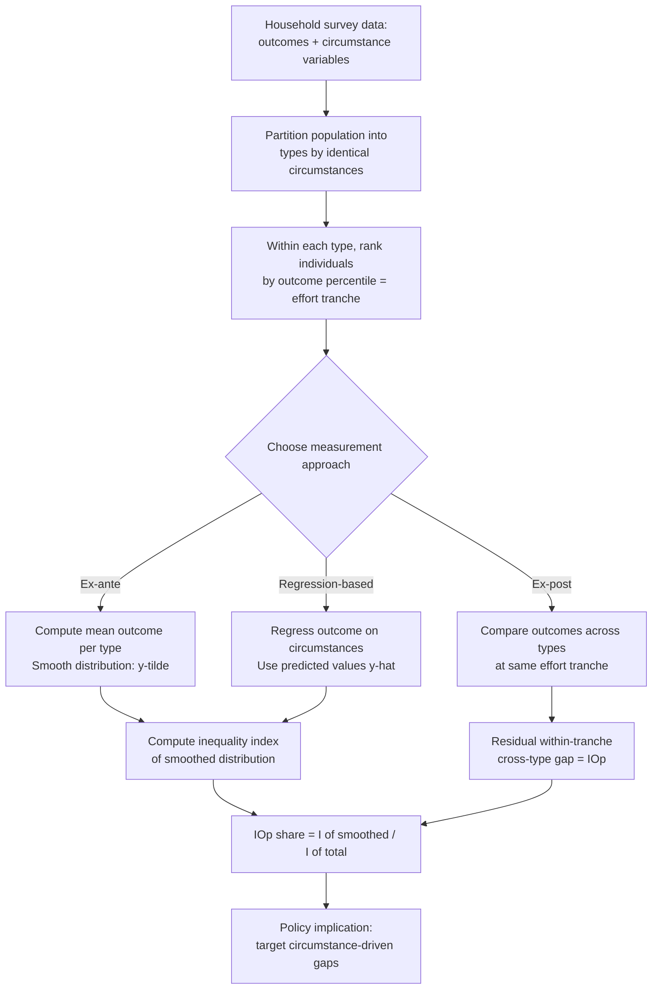

## Inequality of Opportunity Versus Outcome

### Conceptual Distinction

The distinction between inequality of opportunity and inequality of outcome is a normative and analytical framework used to separate the sources of observed disparities (in income, consumption, wealth, or other welfare measures) into two categories based on whether the underlying cause is something an individual controls or something imposed on them independent of their choices.

- **Inequality of outcome**: The total observed dispersion in a welfare variable (income, consumption, wealth, education attainment) across individuals in a population, measured without regard to *why* the dispersion exists. This is what standard inequality measures (Gini coefficient, Theil index, variance of log income) capture by default.
- **Inequality of opportunity**: The portion of outcome inequality attributable to **circumstances** — factors beyond an individual's control at the point of the relevant decision or life stage — as opposed to **effort**, which reflects choices the individual is considered responsible for.

This distinction draws on the philosophical framework of **luck egalitarianism** and the responsibility-sensitive egalitarianism literature (associated with philosophers such as John Roemer, Ronald Dworkin, and Richard Arneson), which argues that a just society should compensate individuals for disadvantages arising from circumstances but need not fully equalize outcomes that result from personal effort or choice.

### The Roemer Framework

The most widely used formal framework for measuring inequality of opportunity in economics is due to **John Roemer** (*Equality of Opportunity*, 1998). It decomposes outcomes as a function of circumstances, effort, and a policy/institutional environment:

$$y = f(C, E, \Phi)$$

where:

- $y$ is the outcome variable (e.g., income)
- $C$ is a vector of **circumstances**: characteristics beyond individual control, typically including parental education, parental occupation or income, place of birth, gender, race/ethnicity, and family structure during childhood
- $E$ is **effort**: choices and actions the individual is held responsible for (e.g., hours worked, educational investment decisions, occupational choice)
- $\Phi$ represents policy instruments or institutional parameters that can be adjusted

Roemer's key methodological device is the **"type-tranche" approach**:

1. The population is partitioned into **types**, defined by identical circumstance vectors $C$ (e.g., all individuals born to parents with primary education only, in a rural area, form one type).
2. Within each type, individuals are ranked by their **effort tranche** — typically operationalized as their percentile rank in the outcome distribution *within their own type*, on the assumption that relative effort within a type is not itself determined by circumstance (since everyone in the type shares the same circumstances).
3. **Equality of opportunity** is said to hold if the outcome distribution is identical across types *at each given effort tranche* — i.e., someone at the 70th percentile of effort within a disadvantaged type achieves the same outcome as someone at the 70th percentile of effort within an advantaged type.

### Decomposition and Measurement Approaches

Two principal empirical strategies are used to estimate the share of total inequality attributable to circumstances (the **Inequality of Opportunity, IOp**):

**1. Ex-ante (parametric/non-parametric type-based) approach**

Compute a smoothed outcome distribution in which each individual is assigned the **mean outcome of their type**:

$$\tilde{y}_i = \bar{y}_{type(i)}$$

Inequality of opportunity is then measured as the inequality (using a standard index such as the Gini or mean logarithmic deviation) of this smoothed distribution $\tilde{y}$:

$$IOp = I(\tilde{y})$$

The **relative inequality of opportunity share** is:

$$\theta = \frac{I(\tilde{y})}{I(y)}$$

This represents the share of total outcome inequality that can be attributed to between-type differences, i.e., to circumstances.

**2. Ex-post approach**

Rather than grouping by circumstance, this approach compares outcomes **within the same effort tranche across different types**, measuring how much inequality remains among individuals presumed to have exerted the same relative effort. This approach requires an explicit, often contestable, operationalization of what constitutes "the same effort tranche" across heterogeneous types.

**3. Regression-based (parametric) approach**

A common applied technique regresses the outcome on a set of observed circumstance variables:

$$\ln(y_i) = \alpha + \sum_{k} \beta_k C_{ki} + \varepsilon_i$$

The **predicted values** $\hat{y}_i$ from this regression (i.e., the outcome level "explained" by circumstances alone) are then used to compute inequality of opportunity, analogous to the type-based smoothed distribution above. This method is more flexible with continuous circumstance variables and larger circumstance sets but depends heavily on functional form assumptions and the correct specification of which variables constitute "circumstances."

**Key Points**

- All these measures produce a **lower-bound** estimate of true inequality of opportunity, since the circumstance variables observed in any dataset are necessarily incomplete (e.g., genetic endowments, unobserved parental characteristics, neighborhood effects, and social networks are rarely fully captured), meaning some effort-attributed inequality in these estimates is actually residual, unmeasured circumstance.
- The classification of any given variable as "circumstance" versus "effort" is itself a value-laden and contestable choice — for example, whether an individual's own educational choices during adolescence should be treated as effort (personal responsibility) or partly as circumstance (shaped by family environment and resources) is disputed in the literature.
- The type-tranche approach requires sufficiently large samples within each type cell to estimate reliable within-type distributions, which becomes a practical data constraint as the number of circumstance variables (and therefore types) grows.

### Illustration: Decomposing Total Inequality

<svg xmlns="http://www.w3.org/2000/svg" viewBox="0 0 700 380">
<text x="350" y="25" text-anchor="middle" font-size="16" font-weight="bold" fill="#1a1a1a">Decomposing Outcome Inequality (svg_diagram)</text>
<rect x="150" y="60" width="400" height="60" fill="#93c5fd" stroke="#1e3a8a" stroke-width="2" />
<text x="350" y="95" text-anchor="middle" font-size="14" fill="#1e3a8a" font-weight="bold">Total Inequality of Outcome (e.g., Gini)</text>
<line x1="350" y1="120" x2="350" y2="160" stroke="#333" stroke-width="2" />
<line x1="230" y1="160" x2="470" y2="160" stroke="#333" stroke-width="2" />
<line x1="230" y1="160" x2="230" y2="190" stroke="#333" stroke-width="2" />
<line x1="470" y1="160" x2="470" y2="190" stroke="#333" stroke-width="2" />
<rect x="80" y="190" width="300" height="90" fill="#fca5a5" stroke="#7f1d1d" stroke-width="2" />
<text x="230" y="220" text-anchor="middle" font-size="13" fill="#7f1d1d" font-weight="bold">Inequality of Opportunity</text>
<text x="230" y="240" text-anchor="middle" font-size="11" fill="#7f1d1d">Due to circumstances:</text>
<text x="230" y="256" text-anchor="middle" font-size="11" fill="#7f1d1d">parental background, gender,</text>
<text x="230" y="270" text-anchor="middle" font-size="11" fill="#7f1d1d">birthplace, ethnicity</text>
<rect x="400" y="190" width="260" height="90" fill="#86efac" stroke="#14532d" stroke-width="2" />
<text x="530" y="220" text-anchor="middle" font-size="13" fill="#14532d" font-weight="bold">Inequality of Effort</text>
<text x="530" y="240" text-anchor="middle" font-size="11" fill="#14532d">Due to choices:</text>
<text x="530" y="256" text-anchor="middle" font-size="11" fill="#14532d">education investment,</text>
<text x="530" y="270" text-anchor="middle" font-size="11" fill="#14532d">labor supply, occupation</text>
<text x="230" y="310" text-anchor="middle" font-size="11" fill="#333" font-style="italic">Normatively "unfair" —</text>
<text x="230" y="325" text-anchor="middle" font-size="11" fill="#333" font-style="italic">policy target for compensation</text>
<text x="530" y="310" text-anchor="middle" font-size="11" fill="#333" font-style="italic">Normatively "fair" —</text>
<text x="530" y="325" text-anchor="middle" font-size="11" fill="#333" font-style="italic">not a target for equalization</text>
</svg>

### Example: Simplified Numerical Illustration

Consider a stylized population with two circumstance types: Type A (advantaged parental background) and Type B (disadvantaged parental background), each with 4 individuals whose incomes vary due to differing effort levels.

| Individual | Type | Income |
| --- | --- | --- |
| A1 | A | 100 |
| A2 | A | 140 |
| A3 | A | 160 |
| A4 | A | 200 |
| B1 | B | 40 |
| B2 | B | 60 |
| B3 | B | 80 |
| B4 | B | 100 |

- Mean income, Type A: $(100+140+160+200)/4 = 150$
- Mean income, Type B: $(40+60+80+100)/4 = 70$
- Smoothed distribution $\tilde{y}$: {150, 150, 150, 150, 70, 70, 70, 70}

Inequality of the smoothed distribution $\tilde{y}$ reflects purely the between-type (circumstance-driven) gap, since all within-type variation (attributed to effort) has been averaged away. Comparing the Gini coefficient (or mean log deviation) of $\tilde{y}$ to the Gini coefficient of the original income vector $y$ gives the relative inequality-of-opportunity share $\theta$. In this stylized example, a large share of total dispersion is explained simply by which type an individual was born into, illustrating how the method isolates the circumstance-driven component. [Inference: this example is constructed for illustrative purposes; the actual $\theta$ value depends on the specific inequality index used and is not being computed here as a precise figure.]

### Empirical Applications and Findings

Inequality of opportunity measurement has become a substantial applied literature, particularly for developing and middle-income countries, often using the **World Bank's Human Opportunity Index (HOI)** and related tools.

- The **Human Opportunity Index**, developed by the World Bank primarily for Latin American applications, focuses on **opportunities for children** (access to basic services such as clean water, electricity, timely school enrollment, and completion) rather than adult income outcomes, and measures how unequally these opportunities are distributed according to circumstances such as parental education, household income, region, and gender.
- Cross-country applied studies (using both ex-ante and regression-based approaches) have generally found that **parental education and household socioeconomic background** are the most consistently large contributors to measured inequality of opportunity across a wide range of countries. [Inference: the *relative ranking* of specific circumstance variables (parental education vs. region vs. gender) varies substantially by country and dataset, so this should be read as a common finding rather than a universal law.]
- Studies applying this framework to Latin American, Sub-Saharan African, and transition economies have generally found sizable measured inequality-of-opportunity shares of total income inequality, though the exact magnitude is highly sensitive to the specific set of circumstance variables available in the underlying survey data. [Unverified: specific numerical shares from any single study should be sourced and verified directly rather than cited from memory, given wide variation across studies, countries, and time periods.]

### Diagram: Roemer Type-Tranche Methodology

### Policy Implications and Debates

**Targeting circumstances vs. redistributing outcomes**: The equality-of-opportunity framework provides a normative rationale for policies that intervene *early* and *specifically* on disadvantaging circumstances — expanding access to quality early childhood education, healthcare, and school resources in disadvantaged areas — as opposed to purely redistributive taxation of realized outcomes, which does not distinguish between earnings attributable to effort and earnings attributable to circumstance.

**Critiques of the framework**:

- **Effort is not fully exogenous of circumstance**: Even effort, as conventionally measured (e.g., hours worked, study time), is shaped by upbringing, parental encouragement, and neighborhood peer effects, undermining a clean separation between "circumstance" and "effort." Roemer's own framework partially addresses this by comparing individuals only *within* the same type (holding circumstance-shaped effort norms constant), but critics argue this does not fully resolve the conceptual entanglement.
- **Measurement sensitivity**: Because IOp estimates are mechanically bounded by the circumstance variables available in a given dataset, cross-country or cross-study comparisons of IOp shares can be misleading if the underlying surveys collect different sets and quality of circumstance variables.
- **Political feasibility**: While intellectually appealing, translating IOp diagnostics into concrete policy (e.g., which specific circumstance to prioritize for intervention, and how) requires additional political and administrative judgment beyond what the statistical decomposition itself provides.

**Relation to intergenerational mobility**: Inequality of opportunity is closely linked to, but conceptually distinct from, **intergenerational income mobility** (the correlation between parents' and children's economic outcomes). High intergenerational persistence is generally interpreted as evidence of substantial inequality of opportunity, and the two literatures share methodological tools, but mobility studies typically use longitudinal, multi-generational data, while opportunity studies often use single cross-sectional snapshots decomposed by reported family background.

**Next Steps**

- Human Opportunity Index (HOI) methodology and applications
- Intergenerational income and educational mobility measurement
- Gini coefficient, Theil index, and mean logarithmic deviation as decomposable inequality measures
- Luck egalitarianism and responsibility-sensitive theories of distributive justice
- Roemer's *Equality of Opportunity* — formal model and policy-instrument optimization
- Early childhood interventions and their role in reducing circumstance-driven disparities
- Data constraints in developing-country household surveys for circumstance variable collection
- Relationship between inequality of opportunity and social mobility indices across countries