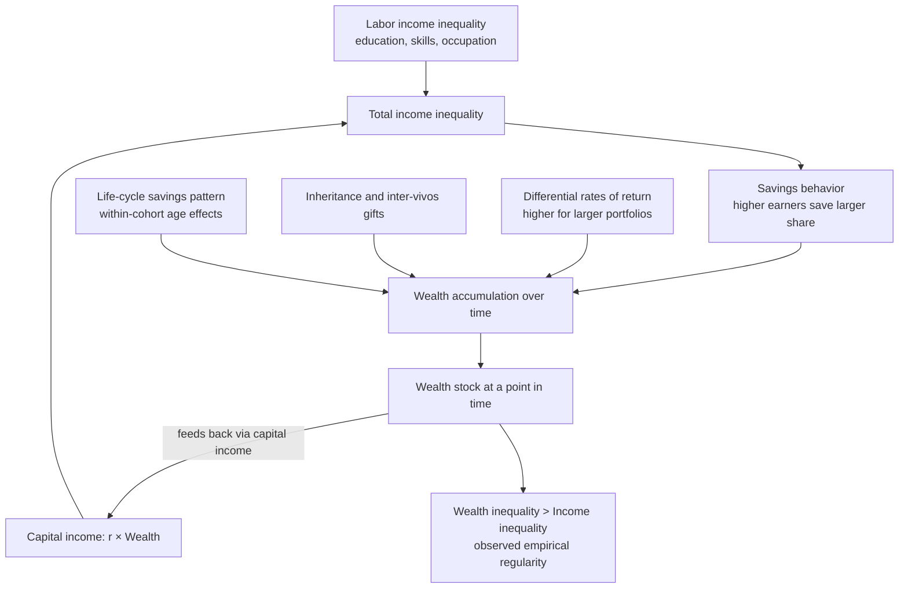

## Wealth Inequality Versus Income Inequality

### Conceptual Distinction

Income and wealth are distinct economic stock/flow concepts, and their respective inequality distributions, while related, are empirically and theoretically distinguishable.

- **Income** is a **flow** variable: the amount an individual or household receives over a defined period (typically annual), from labor earnings, capital returns (interest, dividends, rent, capital gains), transfers, and self-employment income.
- **Wealth** (or net worth) is a **stock** variable: the value of all assets owned (financial assets, real estate, business equity, durable goods) minus liabilities (debts), measured at a specific point in time.

$$\text{Wealth}_t = \text{Wealth}_{t-1} + \text{Savings}_t + \text{Capital gains}_t - \text{Depreciation}_t$$

Wealth is the accumulated result of past income flows (net of consumption), inheritance, capital gains/losses, and intergenerational transfers, compounded over time. This accumulation dynamic is central to why wealth inequality typically exceeds income inequality in virtually every country and time period for which data exists.

### Why Wealth Inequality Is Systematically Higher Than Income Inequality

Several structural mechanisms explain why measured wealth inequality (Gini coefficients typically in the 0.6–0.9 range) substantially exceeds measured income inequality (Gini coefficients typically in the 0.3–0.6 range) across most economies:

**1. Compounding and the "wealth begets wealth" dynamic**

Returns to wealth are not distributed independently of wealth itself. Empirical work (notably by Thomas Piketty and collaborators) has documented that **larger fortunes tend to earn higher average rates of return** than smaller ones, due to access to more sophisticated investment vehicles, lower relative transaction costs, greater risk tolerance, and access to private equity and alternative assets unavailable to smaller savers. If $r$ (rate of return) is increasing in wealth level $W$:

$$r = r(W), \quad r'(W) > 0$$

then wealth accumulation compounds inequality over time even absent any inequality in labor income.

**2. Zero and negative wealth holdings**

A substantial share of the population in most countries holds **zero or negative net worth** (i.e., debts exceed assets), which is structurally impossible for income (which is bounded below by zero for most measurement purposes, or by transfer income). This creates a long left tail in the wealth distribution that has no equivalent in typical income distributions, mechanically inflating wealth inequality indices.

**3. Inheritance and intergenerational transfers**

Wealth, unlike most labor income, can be directly transferred across generations through bequests and inter-vivos gifts, allowing wealth advantages (or disadvantages) to persist and compound across generations independent of the recipient's own income-generating effort or ability.

**4. Life-cycle savings accumulation**

Even absent any inequality in lifetime income, wealth inequality *within a cohort* would naturally exceed income inequality simply because of the **life-cycle savings pattern**: individuals accumulate assets during their working years and draw them down in retirement, meaning a cross-sectional snapshot of wealth reflects differences in age/career stage as well as differences in permanent income. [Inference: the exact magnitude of this life-cycle contribution relative to other factors (inheritance, differential returns) is debated and varies by country, cohort structure, and pension system design.]

**5. Underreporting and measurement asymmetries**

Wealth, especially at the top of the distribution, is more difficult to measure accurately than income: business equity, real estate, and offshore holdings are harder to value and more easily concealed than wage income, which is typically reported through employer withholding and tax records. This measurement asymmetry means **conventional wealth surveys likely understate top-end wealth inequality** more than income surveys understate top-end income inequality.

**Key Points**

- The higher observed inequality of wealth relative to income is a robust, well-documented empirical regularity across virtually all countries with adequate data, not a contested finding.
- The relative *importance* of each mechanism above (compounding differential returns vs. inheritance vs. life-cycle effects vs. measurement error) in explaining the gap is an active area of empirical research and varies by country and time period. [Inference: apportioning the wealth-inequality gap precisely among these channels requires country-specific structural modeling and is not resolved by a single universal decomposition.]

### Illustration: Income Flow vs. Wealth Stock

<svg xmlns="http://www.w3.org/2000/svg" viewBox="0 0 700 380">
<text x="350" y="25" text-anchor="middle" font-size="16" font-weight="bold" fill="#1a1a1a">Income (Flow) vs. Wealth (Stock) (svg_diagram)</text>
<rect x="60" y="70" width="220" height="90" fill="#93c5fd" stroke="#1e3a8a" stroke-width="2" rx="6" />
<text x="170" y="105" text-anchor="middle" font-size="14" font-weight="bold" fill="#1e3a8a">INCOME</text>
<text x="170" y="125" text-anchor="middle" font-size="11" fill="#1e3a8a">Flow — measured per period</text>
<text x="170" y="142" text-anchor="middle" font-size="11" fill="#1e3a8a">wages, interest, dividends, rent</text>
<path d="M 280 115 L 420 115" stroke="#333" stroke-width="2" marker-end="url(#arrow)" />
<text x="350" y="105" text-anchor="middle" font-size="10" fill="#333">savings (income − consumption)</text>
<rect x="420" y="70" width="220" height="90" fill="#fca5a5" stroke="#7f1d1d" stroke-width="2" rx="6" />
<text x="530" y="105" text-anchor="middle" font-size="14" font-weight="bold" fill="#7f1d1d">WEALTH</text>
<text x="530" y="125" text-anchor="middle" font-size="11" fill="#7f1d1d">Stock — measured at a point in time</text>
<text x="530" y="142" text-anchor="middle" font-size="11" fill="#7f1d1d">assets minus liabilities</text>
<path d="M 530 160 Q 530 200 400 220 Q 280 240 280 260" stroke="#333" stroke-width="2" fill="none" marker-end="url(#arrow)" />
<text x="420" y="215" text-anchor="middle" font-size="10" fill="#333">capital returns (r · W) feed back into income</text>
<path d="M 640 115 Q 680 190 530 280 Q 420 340 280 340" stroke="#059669" stroke-width="2" fill="none" stroke-dasharray="5,3" marker-end="url(#arrow)" />
<text x="500" y="300" text-anchor="middle" font-size="10" fill="#059669">inheritance / gifts transfer wealth across generations</text>
</svg>

### Measurement Methodologies

**Data sources**:

- **Income inequality** is most commonly measured using household survey data (income or consumption/expenditure modules) or, increasingly, administrative tax record data, which better captures top-income concentration than surveys (which suffer from top-coding and non-response bias among high earners).
- **Wealth inequality** is measured using dedicated wealth surveys (e.g., the U.S. Survey of Consumer Finances, the ECB's Household Finance and Consumption Survey), estate tax records (using the "estate multiplier method" to infer the wealth of the living population from mortality-weighted estate tax filings), or capitalization methods that infer wealth stocks from capital income reported in tax data by applying observed rates of return.

**The capitalization method**: A technique (used prominently in the work of Saez and Zucman) that infers wealth holdings by "capitalizing" reported capital income flows (interest, dividends, rents) using asset-class-specific rates of return:

$$\hat{W}_{i} = \sum_{a} \frac{Y_{i,a}}{r_a}$$

where $Y_{i,a}$ is individual $i$'s reported income from asset class $a$, and $r_a$ is the average observed rate of return on asset class $a$ in the broader economy. This method allows wealth estimation even in countries lacking direct wealth surveys or wealth taxes, but it assumes that rates of return do not vary systematically across individuals holding the same asset class — an assumption directly challenged by the differential-returns literature described above. [Inference: the reliability of capitalization-method estimates is sensitive to this assumption and to the quality of underlying capital income tax data, and is a subject of ongoing methodological debate among researchers using this approach.]

**Common inequality metrics applied to both concepts**:

- Gini coefficient
- Top-percentile wealth/income shares (top 1%, top 0.1%, top 0.01%)
- Palma ratio (share of top 10% relative to bottom 40%)
- Wealth-to-income ratios at the aggregate and distributional level

### Comparative Illustration

| Dimension | Income Inequality | Wealth Inequality |
| --- | --- | --- |
| Nature of variable | Flow (per period) | Stock (point in time) |
| Typical Gini range | ~0.3–0.6 | ~0.6–0.9 |
| Bounded below by zero? | Approximately, in practice | No — negative net worth is common |
| Primary data source | Household surveys, tax records | Wealth surveys, estate records, capitalization method |
| Key driver of top-end concentration | Labor earnings dispersion, capital income | Compounding returns, inheritance, business equity |
| Sensitivity to measurement error | Moderate | High, especially at top and bottom |
| Typical top 1% share (illustrative) | Lower than wealth share | Substantially higher share of total than income share |

### Relationship Between the Two Distributions

Income and wealth inequality are related but not mechanically identical, because:

$$Y_i = Y_i^{labor} + r \cdot W_i$$

An individual's total income includes a **capital income component** proportional to their wealth holdings (at some rate of return $r$, potentially individual-specific as discussed above), meaning wealth inequality feeds into income inequality through the capital-income channel. However, labor income inequality (driven by education, skills, occupational sorting, and labor market institutions) operates through an entirely separate channel unrelated to existing wealth holdings, meaning the two distributions are correlated but distinct, particularly at the middle and lower parts of the distribution where labor income dominates total income and wealth holdings are minimal or negative.

**Key Points**

- In most economies, wealth is far more concentrated at the very top than labor income, meaning a country can have moderate income inequality (driven mainly by wage dispersion) while simultaneously exhibiting very high wealth concentration.
- Policy tools that target income (progressive income taxation, earned income tax credits) do not directly address wealth concentration, which is why some policy debates distinguish between **income-based redistribution** and **wealth-based instruments** (inheritance/estate taxes, wealth taxes, capital gains taxation, and property taxation).

### Diagram: How Wealth Inequality Compounds Beyond Income Inequality

### Policy Implications

**Distinct policy levers required**: Because wealth and income inequality arise from partly distinct mechanisms, addressing one does not automatically resolve the other:

- **Income-focused tools**: Progressive income taxation, minimum wage policy, collective bargaining frameworks, earned income tax credits, active labor market policies, and education/skills investment primarily target the flow of earnings.
- **Wealth-focused tools**: Estate and inheritance taxation, recurrent wealth or property taxes, capital gains taxation (including taxation of unrealized gains, a contested policy proposal), financial transaction taxes, and policies expanding broad-based asset ownership (e.g., matched savings accounts, baby bonds, expanded homeownership access) target the stock of accumulated assets and its intergenerational transmission.

**Developing-economy considerations**: In many developing economies, wealth inequality measurement is further complicated by:

- Large informal sectors where asset ownership (particularly land and livestock) is poorly documented in formal records.
- Land tenure systems and customary/communal land rights that complicate individual-level wealth attribution.
- Limited administrative capacity for estate tax records or comprehensive wealth surveys, making capitalization-method or indirect estimation approaches more commonly relied upon than in high-income countries with mature tax administration systems. [Inference: the specific data infrastructure available varies substantially by country, and generalized claims about "developing economies" as a bloc should be treated as broad tendencies rather than uniform facts.]
- Historical factors (colonial land distribution, post-independence land reform or its absence) that shape the initial wealth distribution and its subsequent evolution in ways not captured by income-inequality metrics alone.

**Next Steps**

- Piketty's $r > g$ framework and capital accumulation dynamics (*Capital in the Twenty-First Century*)
- Estate multiplier method and capitalization method for wealth estimation
- Land tenure, customary land rights, and asset inequality in developing economies
- Wealth taxation design: recurrent wealth taxes vs. inheritance/estate taxes vs. capital gains reform
- Top income and wealth share estimation using tax record data (World Inequality Database methodology)
- Life-cycle savings models and their contribution to cross-sectional wealth dispersion
- Financial inclusion and asset-building policies as tools for wealth inequality reduction
- Gender and wealth inequality: differential asset ownership and inheritance rights