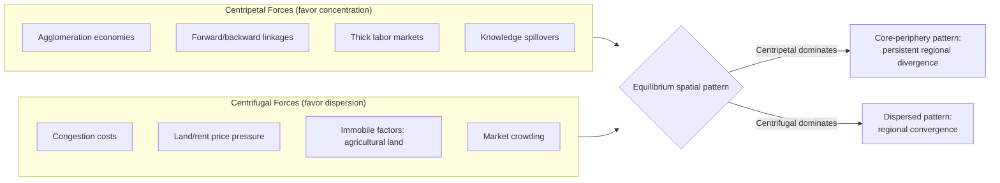

## Spatial and Regional Inequality

### Definition and Scope

Spatial (or regional) inequality refers to systematic disparities in economic welfare — income, consumption, access to services, infrastructure, and opportunity — across geographically defined units within a country, such as provinces, states, regions, districts, or the rural-urban divide. Unlike inequality measured across individuals or households irrespective of location, spatial inequality analysis explicitly treats **geography as the unit of disaggregation**, asking how much of total inequality is attributable to *where* people live rather than *who* they are.

Spatial inequality is a distinct analytical lens from the individual-level inequality measures (Gini coefficient, Theil index) covered elsewhere in inequality analysis, but it uses many of the same statistical tools applied to geographically grouped data.

### Core Dimensions of Spatial Inequality

**1. Rural-urban inequality**

The most persistent and widely documented dimension of spatial inequality in developing economies is the gap between rural and urban living standards, driven by:

- Sectoral productivity differences (agriculture typically has lower labor productivity than urban industry and services).
- Agglomeration economies concentrated in cities (denser labor markets, knowledge spillovers, infrastructure investment).
- Differential access to public services (education quality, healthcare facilities, electricity, piped water, paved roads).
- Selective migration, where higher-skilled or more entrepreneurial individuals migrate to urban areas, potentially widening measured rural-urban gaps through compositional effects as well as through place-based disadvantage itself.

**2. Interregional inequality**

Disparities between administrative or economic regions within a country (e.g., between a country's capital region and its peripheral provinces, or between a resource-rich region and a resource-poor one), driven by:

- Historical patterns of infrastructure investment, often concentrated around colonial-era administrative or extraction centers.
- Natural resource endowments and their spatial concentration (mining, oil, agricultural land quality).
- Agglomeration and "first-mover" advantages, where an initially favored region attracts further investment through cumulative causation (a core insight of **New Economic Geography**, associated with Paul Krugman).
- Political economy factors, including the concentration of public investment and civil service employment in capital regions.

**3. Core-periphery dynamics**

A recurring spatial pattern in which a dominant economic "core" (often the capital city or a coastal/port region) commands a disproportionate share of national output, infrastructure, and high-skilled employment, while "peripheral" regions remain comparatively underdeveloped. This pattern is theorized extensively in **New Economic Geography (NEG)** models, which formalize how transport costs, increasing returns to scale, and labor mobility interact to produce spatial concentration rather than convergence.

### Theoretical Frameworks

**New Economic Geography (NEG)**: Developed primarily by Paul Krugman and collaborators (Fujita, Venables), NEG models economic activity's spatial distribution as an equilibrium outcome of the tension between:

- **Centripetal forces**: agglomeration economies, forward and backward production linkages, thick labor markets, knowledge spillovers — all of which pull economic activity toward concentration.
- **Centrifugal forces**: congestion costs, land/rent price pressures, immobile resources or factors (e.g., agricultural land), and market crowding — all of which push economic activity toward dispersion.

The relative strength of these forces, combined with the level of **transport/trade costs**, determines whether an economy settles into a spatially concentrated (core-periphery) or dispersed equilibrium. A key and often counterintuitive NEG result is that *falling* transport costs (as occurs with infrastructure investment or trade liberalization) can, over a certain range, *increase* spatial concentration rather than reduce it, since lower transport costs make it easier to serve peripheral markets from a concentrated production base without needing to disperse production. [Inference: whether this "increasing concentration with falling transport costs" result dominates in any specific empirical setting depends on the underlying parameter values and is not a universal prediction for all cost ranges or all cases.]

**Neoclassical/convergence perspective**: In contrast to NEG's emphasis on possible persistent divergence, neoclassical growth theory (Solow-style) predicts **conditional convergence**: poorer regions, having lower capital-to-labor ratios, should exhibit faster capital returns and thus grow faster than richer regions, gradually narrowing regional gaps, absent persistent differences in savings rates, technology, or institutional quality across regions.

**Cumulative causation**: An older tradition (Gunnar Myrdal's concept of "circular and cumulative causation") argues that market forces alone tend to *widen* regional disparities rather than narrow them, since initial advantages (skilled labor, infrastructure, capital) attract further investment, draining resources (particularly skilled labor, in "brain drain" dynamics) from lagging regions and reinforcing the initial gap — a view broadly consistent with NEG's centripetal-force logic but predating its formal mathematical apparatus.

### Diagram: Forces Shaping Spatial Concentration vs. Dispersion

### Measurement Approaches

**1. Decomposable inequality indices applied to regional groups**

Total national inequality can be decomposed into **within-region** and **between-region** components using decomposable measures such as the Theil index or mean logarithmic deviation:

$$I_{total} = \underbrace{\sum_{r} w_r I_r}_{\text{within-region}} + \underbrace{I(\bar{y}_1, \bar{y}_2, \ldots, \bar{y}_R)}_{\text{between-region}}$$

where $w_r$ is region $r$'s population (or income) share, $I_r$ is inequality within region $r$, and the between-region term captures inequality that would remain if every individual within a region received that region's mean income. This decomposition directly answers the question: "how much of total inequality is explained by which region someone lives in, versus disparities within regions themselves?"

**2. Regional dispersion indices**

Applied directly to regional mean/median income or GDP-per-capita figures (treating each region as a single observation, often population-weighted):

- **Coefficient of variation** across regional per-capita incomes.
- **Weighted coefficient of variation**, adjusting for regional population size (commonly used in convergence studies following Barro and Sala-i-Martin).
- **Theil index across regions** (a special case of the between-group decomposition above, using only regional means).

**3. Convergence analysis**

Following the growth-econometrics tradition, researchers test for regional convergence using:

- **$\beta$-convergence**: Regressing regional growth rates on initial income levels; a negative and significant coefficient on initial income indicates that poorer regions are growing faster (converging).

$$\frac{1}{T}\ln\left(\frac{y_{i,T}}{y_{i,0}}\right) = \alpha + \beta \ln(y_{i,0}) + \varepsilon_i, \quad \beta < 0 \text{ indicates convergence}$$

- **$\sigma$-convergence**: Tracking whether the cross-regional dispersion (standard deviation or coefficient of variation of log income) declines over time; this is a distinct and stricter test than $\beta$-convergence, since $\beta$-convergence can hold even while $\sigma$-convergence does not (e.g., due to persistent regional-specific shocks).

**4. Spatial statistics**

- **Moran's I** and other spatial autocorrelation statistics test whether high- (or low-) income regions cluster geographically more than would occur under random spatial arrangement, revealing spatial spillovers or contagion effects between neighboring regions.
- **Geographically Weighted Regression (GWR)** allows relationships between variables (e.g., education and income) to vary continuously across space rather than assuming a single national coefficient.

### Illustration: Within- vs. Between-Region Decomposition

<svg xmlns="http://www.w3.org/2000/svg" viewBox="0 0 700 380">
<text x="350" y="25" text-anchor="middle" font-size="16" font-weight="bold" fill="#1a1a1a">Decomposing National Inequality by Region (svg_diagram)</text>
<rect x="150" y="55" width="400" height="55" fill="#93c5fd" stroke="#1e3a8a" stroke-width="2" />
<text x="350" y="87" text-anchor="middle" font-size="13" font-weight="bold" fill="#1e3a8a">Total National Inequality</text>
<line x1="350" y1="110" x2="350" y2="145" stroke="#333" stroke-width="2" />
<line x1="220" y1="145" x2="480" y2="145" stroke="#333" stroke-width="2" />
<line x1="220" y1="145" x2="220" y2="175" stroke="#333" stroke-width="2" />
<line x1="480" y1="145" x2="480" y2="175" stroke="#333" stroke-width="2" />
<rect x="70" y="175" width="300" height="70" fill="#fca5a5" stroke="#7f1d1d" stroke-width="2" />
<text x="220" y="200" text-anchor="middle" font-size="12" font-weight="bold" fill="#7f1d1d">Between-Region Component</text>
<text x="220" y="218" text-anchor="middle" font-size="10" fill="#7f1d1d">Gap between regional means:</text>
<text x="220" y="232" text-anchor="middle" font-size="10" fill="#7f1d1d">core vs. periphery, urban vs. rural</text>
<rect x="390" y="175" width="270" height="70" fill="#86efac" stroke="#14532d" stroke-width="2" />
<text x="525" y="200" text-anchor="middle" font-size="12" font-weight="bold" fill="#14532d">Within-Region Component</text>
<text x="525" y="218" text-anchor="middle" font-size="10" fill="#14532d">Dispersion among individuals</text>
<text x="525" y="232" text-anchor="middle" font-size="10" fill="#14532d">inside each region</text>
<text x="220" y="280" text-anchor="middle" font-size="10" fill="#333" font-style="italic">Reflects geographic/place-based disparity</text>
<text x="525" y="280" text-anchor="middle" font-size="10" fill="#333" font-style="italic">Reflects individual-level disparity</text>
<text x="350" y="330" text-anchor="middle" font-size="11" fill="#333">Empirically, within-region inequality often exceeds between-region</text>
<text x="350" y="348" text-anchor="middle" font-size="11" fill="#333">inequality in total magnitude, even where regional gaps are policy-salient</text>
</svg>

### Example: Simplified Decomposition Calculation

Consider a country with two regions of equal population share ($w_1 = w_2 = 0.5$):

- Region 1 (urban): mean income = 200, internal Theil index $T_1 = 0.25$
- Region 2 (rural): mean income = 80, internal Theil index $T_2 = 0.15$

**Within-region component**:

$$I_{within} = w_1 T_1 + w_2 T_2 = 0.5(0.25) + 0.5(0.15) = 0.20$$

**Between-region component** (using the Theil formula for grouped means, with overall mean $\bar{y} = 0.5(200) + 0.5(80) = 140$):

$$I_{between} = \sum_r w_r \frac{\bar{y}_r}{\bar{y}} \ln\left(\frac{\bar{y}_r}{\bar{y}}\right)$$

$$= 0.5 \cdot \frac{200}{140}\ln\left(\frac{200}{140}\right) + 0.5 \cdot \frac{80}{140}\ln\left(\frac{80}{140}\right)$$

$$= 0.5(1.4286)(0.3567) + 0.5(0.5714)(-0.5596) \approx 0.2548 - 0.1599 = 0.0949$$

**Total Theil index** $\approx 0.20 + 0.0949 = 0.2949$, meaning the between-region (urban-rural) gap accounts for roughly **32%** of total measured inequality in this stylized example ($0.0949/0.2949$), while within-region disparities account for the remaining **68%**. [Inference: this is a constructed numerical example for illustrative purposes; actual within/between shares vary substantially by country, region definition, and time period and must be estimated from real data.]

### Policy Responses to Spatial Inequality

**Place-based policies**: Interventions targeted at specific lagging regions rather than at individuals regardless of location:

- Regional infrastructure investment (transport corridors, electrification, connectivity).
- Special Economic Zones (SEZs) and targeted industrial policy aimed at attracting investment to lagging regions.
- Fiscal transfer/equalization systems that redistribute national revenue toward poorer subnational jurisdictions (common in federal systems).
- Decentralization of public administration and service delivery, intended to bring decision-making and resources closer to local needs.

**People-based (spatially blind) policies**: Interventions that target individuals or households regardless of location, implicitly allowing migration to be part of the adjustment mechanism:

- Portable social protection and human capital investment (education, health) that individuals can "take with them" if they migrate to more prosperous regions.
- National minimum standards for public services, funded centrally but implemented locally.

**The place-based vs. people-based debate**: A recurring policy tension exists between investing in lagging places (to bring jobs to people) versus investing in people directly and facilitating migration (to bring people to jobs). Advocates of place-based intervention argue that unmanaged out-migration from lagging regions can trigger further economic decline (reduced local demand, erosion of the local tax base, "brain drain" of the most mobile and skilled residents) reinforcing regional divergence rather than resolving it. Advocates of people-based approaches argue that place-based subsidies risk propping up fundamentally unviable locations and misallocating capital that would generate higher returns if invested where agglomeration economies are already strong. [Inference: which approach dominates in a given policy environment reflects political economy considerations and specific country circumstances rather than a resolved empirical consensus applicable universally.]

**Key Points**

- Spatial inequality is not merely a subset of income inequality measured with a geographic label — it interacts with distinct political economy dynamics (e.g., regional political representation, ethnic/regional grievance and conflict risk) not necessarily present in individual-level inequality analysis.
- In many developing economies, spatial inequality is compounded by uneven public service delivery capacity, meaning gaps in income are often mirrored or amplified by gaps in education quality, healthcare access, and infrastructure — creating potential poverty traps at the regional level distinct from individual-level poverty dynamics.
- Persistent severe regional inequality is empirically associated in the literature with elevated risk of social and political tension, particularly where regional divides overlap with ethnic, linguistic, or religious cleavages, though the causal pathways are debated and context-specific. [Inference: this association reflects a body of political-economy and conflict-studies literature rather than a deterministic or universally applicable causal law.]

**Next Steps**

- New Economic Geography (NEG): Krugman core-periphery model and formal treatment
- Theil index and mean logarithmic deviation decomposition techniques
- $\beta$-convergence and $\sigma$-convergence testing methodology (Barro-Sala-i-Martin tradition)
- Spatial econometrics: Moran's I, spatial autocorrelation, Geographically Weighted Regression
- Fiscal federalism and intergovernmental transfer/equalization systems
- Special Economic Zones and place-based industrial policy evaluation
- Rural-urban migration models (Harris-Todaro) and their link to spatial inequality
- Regional inequality, ethnic/regional grievance, and conflict risk in political economy literature