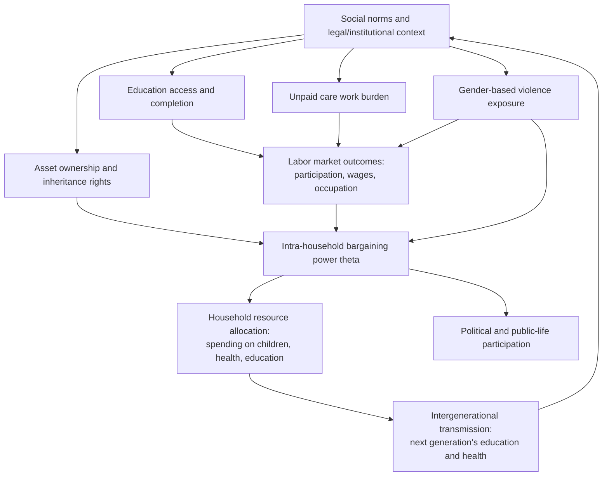

## Gender Inequality in Development Contexts

### Definition and Scope

Gender inequality in development economics refers to systematic disparities in economic outcomes, opportunities, resources, and agency between women/girls and men/boys, arising from social norms, legal structures, institutional practices, and intra-household dynamics rather than from differences in underlying productive capacity. Unlike income or wealth inequality, which is typically measured across an undifferentiated population, gender inequality analysis is explicitly concerned with **disparities correlated with a specific social category**, requiring distinct measurement tools, data structures (often intra-household rather than purely inter-household), and theoretical frameworks.

The field spans multiple interconnected domains: labor market outcomes, education, health, asset ownership and control, decision-making power (both within households and in public/political life), and exposure to violence — each of which interacts with and reinforces the others.

### Key Domains of Gender Inequality

**1. Labor market outcomes**

- **Labor force participation gap**: In most developing economies, female labor force participation rates remain substantially below male rates, though the size and trend of the gap vary considerably by region, income level, and over time. [Inference: citing exact current participation-rate figures by country or region requires up-to-date data verification rather than reliance on memorized statistics, since these rates shift with economic cycles and data revisions.]
- **Gender wage gap**: Even conditional on labor force participation, women in most economies earn less than men for comparable work, driven by a combination of occupational segregation (women concentrated in lower-paying sectors and informal employment), differences in hours worked (often linked to unpaid care responsibilities), and discrimination in hiring, promotion, and pay-setting.
- **Occupational segregation**: Women are frequently overrepresented in informal, unpaid, or low-productivity sectors (subsistence agriculture, informal trade, domestic work) and underrepresented in higher-paying formal sector employment, management, and STEM-related occupations.
- **Unpaid care and domestic work**: Women perform a disproportionate share of unpaid care work (childcare, eldercare, household maintenance) across virtually all countries and income levels, which constrains time available for paid employment, education, and leisure — a phenomenon central to **time-use survey** analysis in development economics.

**2. Education**

- **Enrollment and completion gaps**: While many countries have achieved or approached gender parity in primary school enrollment, gaps often widen at secondary and tertiary levels, particularly in lower-income and rural contexts, driven by factors including early marriage, safety concerns related to school commute distance, direct and opportunity costs of schooling, and gendered expectations about the returns to female education.
- **Skill and field-of-study segregation**: Gender gaps persist in STEM (science, technology, engineering, mathematics) field enrollment even where overall enrollment parity has been achieved, with implications for later labor market segregation and wage gaps.

**3. Health**

- **Maternal mortality and reproductive health access**: Maternal health outcomes remain a critical gender-specific dimension of human development, with substantial cross-country variation linked to healthcare system quality, access to skilled birth attendance, and family planning access.
- **"Missing women" phenomenon**: A demographic pattern (identified by Amartya Sen) in some regions, particularly parts of South and East Asia, of skewed sex ratios reflecting a combination of sex-selective practices, differential care and nutritional investment in infancy and childhood, and other systematic disadvantages affecting female survival relative to the biologically expected sex ratio at birth and across age cohorts. This remains an active empirical and policy research area with significant regional variation. [Unverified: specific "missing women" numerical estimates by country/region should be sourced from current demographic research rather than cited from memory, given ongoing methodological refinement and data updates in this literature.]

**4. Asset ownership and control**

- Women in many developing economies have more limited legal rights to own, inherit, and control land, property, and other productive assets, whether due to formal legal restrictions, customary law and inheritance practices, or informal social norms that persist even where formal legal equality exists.
- Limited asset ownership constrains women's collateral for credit access, bargaining power within households, and resilience to economic shocks (including the ability to leave harmful household situations).

**5. Decision-making power and agency**

- **Intra-household bargaining power**: Economic models of household behavior increasingly move beyond the "unitary household" assumption (treating households as single decision-making units) toward **collective household models**, which explicitly model bargaining between household members with potentially divergent preferences, and examine how control over income and assets shifts bargaining power and resulting resource allocation (e.g., spending on children's health and education).
- **Political representation**: Gender gaps in political representation and leadership positions are widely documented and studied both as an outcome of interest and as a potential lever for policy change (e.g., research on female political reservation and its effects on public goods provision).

**6. Gender-based violence**

- Intimate partner violence and other forms of gender-based violence carry direct welfare costs and also generate broader economic costs through impacts on labor productivity, health expenditure, and children's developmental outcomes, and are increasingly incorporated into development economics research and policy frameworks, though this domain also intersects closely with public health and legal/criminological literatures.

### Theoretical Frameworks

**Unitary vs. collective household models**: Early economic models of the household (Becker's unitary model) assumed households pool resources and act as if maximizing a single joint utility function, implying that the identity of the income recipient within a household should not affect spending patterns. Empirical work across many developing-country contexts has repeatedly found that **who controls income within a household** (mother vs. father) systematically affects expenditure patterns — commonly finding that income controlled by mothers is associated with a higher share of household spending on children's nutrition, health, and education. This finding motivated the shift toward **collective household models**, which explicitly parameterize bargaining power (often denoted $\theta$) between household members:

$$U_{household} = \theta \cdot U_{woman} + (1-\theta) \cdot U_{man}$$

where $\theta$ (the woman's bargaining weight) is itself a function of factors such as relative income contribution, asset ownership, outside options (e.g., labor market opportunities, social support networks), and legal/institutional context (e.g., divorce and inheritance law).

**Sen's capability approach and gender**: Amartya Sen's capability approach, applied to gender analysis, emphasizes that gender equality should be assessed not merely in terms of resources (income, consumption) but in terms of substantive **freedoms and capabilities** — the real opportunities individuals have to achieve valued functionings (being educated, being healthy, participating in public life), which can differ systematically by gender even holding resource levels constant, due to differential conversion factors (social norms, time constraints, mobility restrictions) that affect how resources translate into actual capabilities.

**Human capital and returns-to-education framework**: Standard human capital theory (Mincerian earnings framework) has been extended in gender-focused labor economics to examine why measured or predicted returns to female education do not always translate proportionally into labor market outcomes, implicating demand-side discrimination and supply-side constraints (time burdens, mobility restrictions, social norms about acceptable occupations) as compounding factors beyond simple human capital accumulation.

### Diagram: Interconnected Domains of Gender Inequality

### Measurement Approaches and Indices

**1. Composite indices**

- **Gender Development Index (GDI)** and **Gender Inequality Index (GII)** (UNDP): The GII combines indicators across reproductive health (maternal mortality, adolescent birth rate), empowerment (educational attainment, parliamentary representation), and labor market participation into a single composite measure, allowing cross-country comparison and ranking. The GDI compares the Human Development Index computed separately for women and men.
- **Global Gender Gap Index** (World Economic Forum): Measures gaps (rather than absolute levels) across four sub-indices: economic participation and opportunity, educational attainment, health and survival, and political empowerment, deliberately designed to be independent of a country's overall development level so as to isolate the *relative* gender gap.

**Key Points**

- Composite indices necessarily involve normative choices about which indicators to include and how to weight them, meaning cross-country rankings can shift depending on index methodology even when underlying raw data is identical — a well-documented feature of composite index construction generally, not unique to gender indices.
- These indices are useful for tracking trends and cross-country benchmarking but mask within-country heterogeneity (e.g., rural-urban, ethnic, or regional variation in gender gaps).

**2. Direct measurement techniques**

- **Time-use surveys**: Directly measure how individuals within a household allocate time across paid work, unpaid care work, and leisure, providing the empirical foundation for unpaid care work valuation and gender time-burden analysis.
- **Intra-household resource allocation studies**: Use variation in the source or recipient of income/transfers (e.g., conditional cash transfer program design that pays mothers vs. fathers) as a natural or designed experiment to identify bargaining-power effects on household spending.
- **Decomposition methods for wage gaps**: The **Oaxaca-Blinder decomposition** is the standard technique for separating the gender wage gap into a portion "explained" by observable characteristics (education, experience, sector) and an "unexplained" residual often interpreted (with appropriate caveats about omitted variables) as a proxy for discrimination:

$$\Delta \bar{w} = \underbrace{(\bar{X}_M - \bar{X}_F)'\hat{\beta}_M}_{\text{explained (endowment) component}} + \underbrace{\bar{X}_F'(\hat{\beta}_M - \hat{\beta}_F)}_{\text{unexplained (coefficient) component}}$$

where $\bar{X}_M, \bar{X}_F$ are mean characteristic vectors for men and women, and $\hat{\beta}_M, \hat{\beta}_F$ are the estimated returns to those characteristics for each group. The unexplained component is frequently used as an upper-bound proxy for discrimination, though it also absorbs any relevant unobserved characteristics not captured in $X$, meaning it should be interpreted cautiously rather than treated as a precise discrimination estimate.

### Example: Stylized Oaxaca-Blinder Decomposition

Suppose average log wages are $\bar{w}_M = 2.30$ for men and $\bar{w}_F = 2.00$ for women (a raw gap of 0.30 log points, roughly 35% in percentage terms). Suppose a Mincerian wage regression run separately by gender finds that if women had men's average education and experience levels but were paid according to the *female* wage-setting structure ($\hat{\beta}_F$), their predicted average log wage would rise only to 2.10.

- **Explained (endowment) component**: $2.10 - 2.00 = 0.10$ (attributable to differences in observable characteristics such as education or experience)
- **Unexplained (coefficient) component**: $2.30 - 2.10 = 0.20$ (attributable to differing returns to the same characteristics between genders, often interpreted as an upper-bound discrimination proxy)

In this stylized illustration, roughly two-thirds of the raw wage gap ($0.20/0.30$) is "unexplained" by observable characteristics. [Inference: this is a constructed numerical example for illustrative purposes only; actual explained/unexplained shares vary enormously by country, sector, dataset, and model specification, and must be estimated from real data rather than assumed.]

### Policy Interventions and Evidence

**Conditional cash transfer (CCT) programs**: Many CCT programs (e.g., long-running programs in Latin America) are deliberately designed to disburse transfers to mothers rather than fathers, based partly on evidence that maternal control over household income is associated with greater investment in children's welfare; program evaluations have examined both the direct poverty-reduction effects and these intra-household bargaining effects.

**Girls' education interventions**: A substantial randomized controlled trial (RCT) literature has evaluated interventions such as conditional scholarships, safe transportation, school-based health interventions (e.g., addressing menstrual health management), and information campaigns about returns to female education, generally as part of the broader development economics RCT movement associated with researchers such as Esther Duflo and Abhijit Banerjee.

**Land and asset rights reform**: Legal reforms strengthening women's inheritance and land ownership rights have been studied for their effects on female bargaining power, agricultural productivity (since secure tenure affects investment incentives), and downstream outcomes such as children's education and health.

**Political quotas**: Research on mandated political representation quotas for women (e.g., panchayat/local council reservation studies in South Asia) has examined effects on public goods provision, policy priorities, and subsequent female political participation and aspirations, contributing to the broader literature on descriptive versus substantive representation.

**Key Points**

- Development economics increasingly relies on RCTs and quasi-experimental methods (regression discontinuity around quota thresholds, difference-in-differences around policy reforms) to identify causal effects of gender-targeted interventions, given the difficulty of disentangling correlation from causation in gender-outcome relationships using observational data alone.
- Effect sizes and even the direction of some findings (e.g., effects of female political representation on specific policy outcomes) vary by context, and generalizing from a single country study to a universal policy prescription is a well-recognized external-validity concern in this literature. [Inference: the applicability of any specific study's findings to a new context requires explicit consideration of contextual similarity and is not automatic.]

### Illustration: The Oaxaca-Blinder Decomposition

<svg xmlns="http://www.w3.org/2000/svg" viewBox="0 0 700 320">
<text x="350" y="25" text-anchor="middle" font-size="16" font-weight="bold" fill="#1a1a1a">Oaxaca-Blinder Wage Gap Decomposition (svg_diagram)</text>
<line x1="80" y1="270" x2="80" y2="60" stroke="#333" stroke-width="2" />
<line x1="80" y1="270" x2="620" y2="270" stroke="#333" stroke-width="2" />
<text x="30" y="170" text-anchor="middle" font-size="12" fill="#333" transform="rotate(-90 30 170)">Log wage</text>
<rect x="150" y="90" width="60" height="180" fill="#2563eb" />
<text x="180" y="285" text-anchor="middle" font-size="11" fill="#333">Male mean</text>
<text x="180" y="80" text-anchor="middle" font-size="11" fill="#333">2.30</text>
<rect x="330" y="130" width="60" height="140" fill="#f59e0b" />
<text x="360" y="285" text-anchor="middle" font-size="11" fill="#333">Counterfactual</text>
<text x="360" y="300" text-anchor="middle" font-size="10" fill="#333">(female traits,</text>
<text x="360" y="313" text-anchor="middle" font-size="10" fill="#333">male returns)</text>
<text x="360" y="120" text-anchor="middle" font-size="11" fill="#333">2.10</text>
<rect x="500" y="150" width="60" height="120" fill="#dc2626" />
<text x="530" y="285" text-anchor="middle" font-size="11" fill="#333">Female mean</text>
<text x="530" y="140" text-anchor="middle" font-size="11" fill="#333">2.00</text>
<line x1="210" y1="130" x2="330" y2="130" stroke="#000" stroke-width="1.5" stroke-dasharray="4,3" />
<text x="270" y="115" text-anchor="middle" font-size="10" fill="#000">Unexplained gap (0.20)</text>
<line x1="390" y1="150" x2="500" y2="150" stroke="#000" stroke-width="1.5" stroke-dasharray="4,3" />
<text x="445" y="185" text-anchor="middle" font-size="10" fill="#000">Explained gap (0.10)</text>
</svg>

### Regional and Contextual Variation

Gender inequality patterns vary substantially by region, income level, and cultural context, and development economics research emphasizes that:

- The **magnitude and even direction** of certain gender gaps (e.g., in education) can differ sharply by region — some regions show larger male disadvantage in secondary/tertiary education completion, while others show persistent large female disadvantage, meaning "gender inequality in development" cannot be treated as a uniform single-direction phenomenon across all contexts. [Inference: specific regional patterns require verification against current data given how rapidly education gaps have shifted in some regions over recent decades.]
- Intersectionality matters substantially: gender gaps often compound with other axes of disadvantage (rural residence, ethnic minority status, low household wealth), meaning average national gender gap statistics can mask much larger gaps for specific subpopulations (e.g., rural, low-income, or minority-ethnicity women).
- Legal and formal institutional equality (e.g., constitutional gender equality provisions) does not automatically translate into de facto equality, given the persistence of informal social norms, customary practices, and enforcement gaps — a recurring theme in the "law versus practice" literature within development economics and law-and-development studies.

**Next Steps**

- Collective household bargaining models and identification strategies for bargaining power ($\theta$)
- Oaxaca-Blinder decomposition methodology and its extensions (e.g., quantile decompositions)
- Sen's capability approach and its application to gender-specific development indicators
- "Missing women" demographic literature and sex-ratio analysis methodology
- Conditional cash transfer program design and intra-household targeting evidence
- Land rights, inheritance law reform, and female asset ownership studies
- Political quota systems and descriptive vs. substantive representation research
- Time-use survey methodology and unpaid care work valuation techniques
- Randomized controlled trials in gender and development economics (methodology and notable studies)