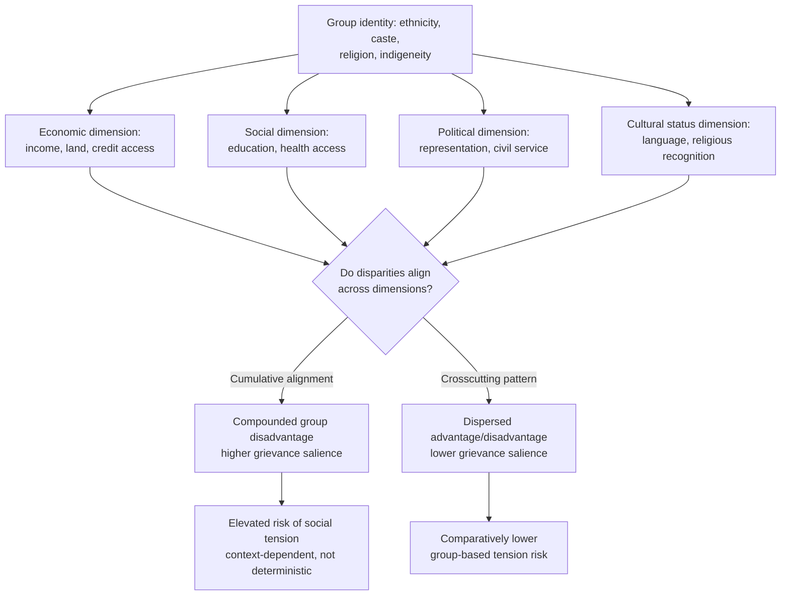

## Ethnic and Social Group Inequality

### Definition and Scope

Ethnic and social group inequality refers to systematic disparities in economic welfare, opportunities, and outcomes between groups defined by ethnicity, race, caste, religion, indigeneity, or other socially salient group identities, as distinct from inequality measured across individuals without reference to group membership. This is often termed **horizontal inequality** (a term developed extensively by Frances Stewart), in contrast to **vertical inequality**, which measures dispersion across individuals or households regardless of group identity.

$$\text{Vertical inequality: measures dispersion across individuals/households (e.g., Gini)}$$

$$\text{Horizontal inequality: measures dispersion } \textit{between} \text{ socially defined groups}$$

The distinction matters both analytically and normatively: two countries can have identical Gini coefficients (identical vertical inequality) while differing enormously in horizontal inequality, with correspondingly different implications for social cohesion, political stability, and policy design.

### Horizontal Inequality Framework

Frances Stewart's horizontal inequality framework identifies **multiple dimensions** across which group disparities can be assessed, arguing that group-based grievance and conflict risk depend not on any single dimension alone but on the cumulative pattern across dimensions:

- **Economic dimension**: Group differences in income, employment, asset ownership, and access to productive resources (land, credit, capital).
- **Social dimension**: Group differences in access to education, healthcare, and other social services.
- **Political dimension**: Group differences in access to political power, representation in government, civil service employment, and influence over policy-making.
- **Cultural status dimension**: Group differences in recognition of cultural practices, language rights, and religious freedoms.

**Key Points**

- Stewart's central empirical and theoretical argument is that severe and persistent horizontal inequality — particularly when multiple dimensions (economic, political, social) align and reinforce rather than crosscut one another — is associated with elevated risk of group-based grievance, social tension, and in extreme cases violent conflict. [Inference: this represents a substantial body of political-economy and conflict-studies research rather than a deterministic causal law; the pathway from horizontal inequality to conflict is mediated by numerous other factors including political mobilization, institutional context, and historical grievance narratives, and outcomes vary considerably across cases.]
- Horizontal inequality can persist or even widen despite declining vertical (individual-level) inequality, since aggregate measures can mask which specific groups are gaining or losing ground.

### Measurement Approaches

**1. Group-based decomposition of standard inequality indices**

Analogous to spatial inequality decomposition, total inequality can be decomposed into within-group and between-group components using decomposable indices (Theil index, mean logarithmic deviation):

$$I_{total} = \underbrace{\sum_{g} w_g I_g}_{\text{within-group}} + \underbrace{I(\bar{y}_1, \bar{y}_2, \ldots, \bar{y}_G)}_{\text{between-group}}$$

where $g$ indexes ethnic/social groups, $w_g$ is group $g$'s population or income share, and $I_g$ is inequality within group $g$. The between-group term isolates the portion of total inequality attributable purely to group-mean differences.

**2. Group-specific outcome gaps**

Direct comparison of mean or median outcomes across groups on specific indicators:

- Income and consumption gaps
- Poverty headcount ratio gaps (share of each group below the poverty line)
- Educational attainment and literacy gaps
- Health outcome gaps (child mortality, stunting, life expectancy)
- Access-to-services gaps (electrification, piped water, formal financial inclusion)

**3. Multidimensional horizontal inequality indices**

Composite indices that aggregate group gaps across the economic, social, political, and cultural-status dimensions simultaneously (as in Stewart's framework), allowing researchers to characterize whether a country exhibits "cumulative" horizontal inequality (group disadvantage compounds across all dimensions) versus "crosscutting" horizontal inequality (a group disadvantaged on one dimension may be relatively advantaged on another, potentially reducing overall grievance salience).

**4. Oaxaca-Blinder-style decomposition of group gaps**

As with gender wage gap analysis, the standard Oaxaca-Blinder decomposition technique is widely applied to ethnic/racial/caste-based outcome gaps, separating the raw gap into an "explained" component (attributable to differences in observable characteristics such as education, region, or occupation) and an "unexplained" component (often interpreted, with appropriate caveats, as a proxy for discrimination or unequal returns to the same characteristics):

$$\Delta \bar{y} = \underbrace{(\bar{X}_A - \bar{X}_B)'\hat{\beta}_A}_{\text{explained component}} + \underbrace{\bar{X}_B'(\hat{\beta}_A - \hat{\beta}_B)}_{\text{unexplained component}}$$

where groups $A$ and $B$ denote the advantaged and disadvantaged social groups respectively.

### Diagram: Horizontal Inequality Dimensions and Outcomes

### Illustration: Vertical vs. Horizontal Inequality

<svg xmlns="http://www.w3.org/2000/svg" viewBox="0 0 700 360">
<text x="350" y="25" text-anchor="middle" font-size="16" font-weight="bold" fill="#1a1a1a">Vertical vs. Horizontal Inequality (svg_diagram)</text>
<text x="180" y="55" text-anchor="middle" font-size="13" font-weight="bold" fill="#1e3a8a">Country A</text>
<text x="180" y="72" text-anchor="middle" font-size="11" fill="#333">Same Gini as Country B</text>
<rect x="60" y="90" width="30" height="200" fill="#93c5fd" />
<rect x="100" y="140" width="30" height="150" fill="#93c5fd" />
<rect x="140" y="100" width="30" height="190" fill="#93c5fd" />
<rect x="180" y="160" width="30" height="130" fill="#93c5fd" />
<rect x="220" y="120" width="30" height="170" fill="#93c5fd" />
<rect x="260" y="150" width="30" height="140" fill="#93c5fd" />
<text x="175" y="310" text-anchor="middle" font-size="10" fill="#333">Individuals mixed across groups —</text>
<text x="175" y="323" text-anchor="middle" font-size="10" fill="#333">low horizontal inequality</text>
<text x="530" y="55" text-anchor="middle" font-size="13" font-weight="bold" fill="#7f1d1d">Country B</text>
<text x="530" y="72" text-anchor="middle" font-size="11" fill="#333">Same Gini as Country A</text>
<rect x="410" y="270" width="30" height="20" fill="#fca5a5" />
<rect x="450" y="260" width="30" height="30" fill="#fca5a5" />
<rect x="490" y="265" width="30" height="25" fill="#fca5a5" />
<rect x="530" y="100" width="30" height="190" fill="#86efac" />
<rect x="570" y="110" width="30" height="180" fill="#86efac" />
<rect x="610" y="95" width="30" height="195" fill="#86efac" />
<text x="450" y="310" text-anchor="middle" font-size="10" fill="#7f1d1d">Group 1: consistently low</text>
<text x="570" y="310" text-anchor="middle" font-size="10" fill="#14532d">Group 2: consistently high</text>
<text x="530" y="330" text-anchor="middle" font-size="10" fill="#333" font-style="italic">Stark group separation —</text>
<text x="530" y="343" text-anchor="middle" font-size="10" fill="#333" font-style="italic">high horizontal inequality</text>
</svg>

### Example: Group Decomposition Calculation

Consider a country with two ethnic groups of differing population shares: Group 1 ($w_1 = 0.7$, mean income = 120) and Group 2 ($w_2 = 0.3$, mean income = 60), with internal Theil indices $T_1 = 0.20$ and $T_2 = 0.18$.

**Within-group component**:

$$I_{within} = 0.7(0.20) + 0.3(0.18) = 0.14 + 0.054 = 0.194$$

**Between-group component** (overall mean $\bar{y} = 0.7(120) + 0.3(60) = 102$):

$$I_{between} = 0.7 \cdot \frac{120}{102}\ln\left(\frac{120}{102}\right) + 0.3 \cdot \frac{60}{102}\ln\left(\frac{60}{102}\right)$$

$$= 0.7(1.1765)(0.1625) + 0.3(0.5882)(-0.5306) \approx 0.1339 - 0.0937 = 0.0402$$

**Total Theil index** $\approx 0.194 + 0.0402 = 0.2342$, so the between-group (ethnic) component accounts for roughly **17%** of total measured inequality in this stylized case ($0.0402/0.2342$). [Inference: this is a constructed illustrative example; real-world between-group shares vary substantially by country, the specific groups compared, and the outcome variable used, and must be estimated empirically.]

### Structural Mechanisms Generating Ethnic/Social Group Inequality

**Historical and colonial legacies**: In many developing economies, current patterns of ethnic or regional group inequality trace back to colonial-era administrative structures, which frequently favored certain groups for administrative, educational, or economic roles (sometimes deliberately, as a strategy of indirect rule), with effects persisting well beyond formal independence through inherited institutional structures, land distribution patterns, and human capital accumulation gaps.

**Caste systems**: In South Asian contexts particularly, caste-based social stratification (a hierarchical social ordering historically linked to occupation and ritual status) has been extensively studied as a driver of persistent economic disadvantage for historically marginalized castes (e.g., Scheduled Castes and Scheduled Tribes in India), operating through mechanisms including restricted occupational choice, land ownership patterns, educational access, and social/labor market discrimination that can persist even after legal abolition of caste-based restrictions.

**Discrimination in labor and credit markets**: Both **taste-based discrimination** (Becker's model, where employers, co-workers, or customers have a preference against interacting with a particular group, which in competitive markets should theoretically be costly and erode over time, though empirically often persists) and **statistical discrimination** (where employers use group membership as a low-cost proxy for unobserved individual productivity, given imperfect information, potentially creating self-fulfilling equilibria where limited investment in a group's human capital by the group itself, anticipating discrimination, reinforces the very statistical pattern used to justify continued discrimination) are used as competing (and non-mutually-exclusive) theoretical explanations for observed labor market gaps.

**Land and asset distribution**: Historical patterns of land allocation — including colonial-era land alienation, indigenous land dispossession, and post-independence land reform (or its absence or incomplete implementation) — remain a significant driver of ethnic and social group wealth gaps in many contexts, given land's centrality to agricultural livelihoods and its role as collateral for credit access.

**Spatial concentration and interaction with regional inequality**: Ethnic and social groups are frequently spatially concentrated (in specific regions, urban neighborhoods, or rural areas), meaning ethnic/social group inequality often substantially overlaps with — and can be difficult to statistically disentangle from — regional/spatial inequality, requiring careful econometric specification to distinguish "place effects" from "group effects" when both dimensions correlate strongly.

**Key Points**

- The distinction between taste-based and statistical discrimination has different policy implications: taste-based discrimination models suggest competitive market pressure and enforcement of anti-discrimination law can erode disparities over time, while statistical discrimination models suggest that improving information (e.g., through credentialing, standardized testing, or transparency requirements) or breaking self-fulfilling equilibria (e.g., through affirmative action policies) may be needed even absent employer animus.
- Both frameworks are supported by different strands of empirical evidence in different contexts, and the relative importance of each mechanism in explaining any specific observed gap is an empirical question requiring context-specific investigation rather than a settled universal finding.

### Policy Responses

**Affirmative action and reservation policies**: Many countries have implemented quota or preference systems in education, public employment, or political representation for historically disadvantaged groups (e.g., India's caste-based reservation system in education and government employment, various countries' indigenous rights and representation frameworks). Evaluation of these policies in the economics literature examines effects on targeted group outcomes, potential efficiency costs, and effects on social cohesion and inter-group attitudes, with findings varying by policy design and context. [Inference: aggregate conclusions about affirmative action effectiveness are highly dependent on specific policy design, implementation quality, and country context, and should not be generalized from any single study or country experience.]

**Targeted service delivery and conditional transfers**: Programs explicitly designed to reach historically underserved ethnic or social groups (e.g., targeted scholarship programs, targeted health interventions, land titling programs for indigenous communities) aim to directly narrow specific outcome gaps.

**Anti-discrimination legal frameworks**: Legal prohibitions on discrimination in employment, housing, and credit access, combined with enforcement mechanisms, aim to address taste-based discrimination directly, though enforcement capacity and social norm change often lag formal legal reform in practice.

**Decentralization and power-sharing arrangements**: In politically salient multi-ethnic contexts, institutional arrangements for power-sharing, regional autonomy, or proportional political representation are sometimes adopted explicitly to address the political dimension of horizontal inequality and reduce conflict risk, though the design and effectiveness of such arrangements is highly context-specific and contested in the comparative politics and political economy literature.

**Data and measurement infrastructure**: A persistent practical challenge in this field is that many national household surveys and censuses do not consistently collect or report ethnicity/caste/group identity variables (sometimes due to political sensitivity around group-based data collection), constraining researchers' and policymakers' ability to systematically monitor horizontal inequality trends over time. [Inference: the extent and reasons for this data limitation vary considerably by country and are shaped by specific national political histories around group-based classification.]

**Next Steps**

- Frances Stewart's horizontal inequality framework and its empirical applications
- Theil index and mean logarithmic deviation decomposition by social group
- Caste-based stratification and reservation policy evaluation (South Asian context)
- Taste-based (Becker) vs. statistical discrimination models in labor economics
- Horizontal inequality and conflict risk in political economy and conflict-studies literature
- Land reform, indigenous land rights, and historical asset dispossession
- Affirmative action and quota policy design and evaluation methodologies
- Oaxaca-Blinder decomposition applied to ethnic/racial/caste outcome gaps
- Data collection challenges and politics of ethnic/group classification in national statistics