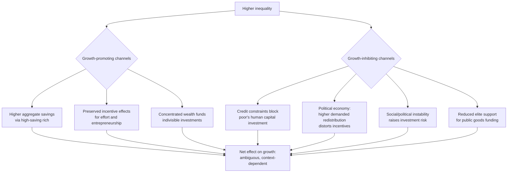

## Inequality and Growth Relationship

### Overview of the Debate

The relationship between inequality and economic growth is one of the most extensively studied and contested questions in development economics, with theoretical models and empirical evidence pointing in multiple, sometimes contradictory, directions. The literature has evolved through several distinct phases: early growth models treating inequality as potentially growth-enhancing, followed by a substantial body of theoretical and empirical work identifying channels through which inequality can be growth-*inhibiting*, and more recent work emphasizing that the relationship is likely **non-linear, context-dependent, and channel-specific** rather than following a single universal sign.

### Channels Through Which Inequality May Promote Growth

**1. Savings-based classical argument**

An early argument, associated with classical and neoclassical growth theory, holds that since higher-income individuals and households save a larger share of their income (a higher marginal propensity to save), greater inequality — by concentrating income among high savers — could raise the aggregate national savings rate, financing more investment and capital accumulation:

$$S_{aggregate} = \sum_i s_i \cdot Y_i, \quad s_i \text{ increasing in } Y_i$$

If a redistribution moves income from a low-saving poor household to a high-saving rich household, aggregate savings $S$ rises given this framework, potentially financing more investment and thus faster capital accumulation and growth.

**2. Incentive effects**

A second argument holds that a degree of inequality reflects and preserves incentives for effort, entrepreneurship, and risk-taking. If redistributive taxation to reduce inequality lowers the after-tax return to productive effort and innovation, it may reduce the incentive to undertake growth-generating activities (Mirrlees-style optimal taxation trade-offs), implying a potential efficiency-equity trade-off in which more egalitarian outcomes are achieved partly at the cost of aggregate growth.

**3. Investment indivisibilities**

In economies with credit market imperfections, certain high-return investments (e.g., starting a firm, or in some historical contexts, indivisible investments requiring large fixed capital outlays) may require a minimum threshold of individual wealth to undertake, given that not everyone can access external finance to cover the gap. Some early models suggested that if the wealthy have wealth concentrated enough to make such indivisible high-return investments, and this exceeds what would happen under a more equal but still credit-constrained distribution, inequality could in principle raise aggregate investment in such indivisible projects. [Inference: this channel is theoretically constructed under specific assumptions about credit market imperfections and investment indivisibility, and its empirical relevance versus the opposing credit-constraint channel described below is a subject of ongoing debate rather than settled.]

### Channels Through Which Inequality May Inhibit Growth

**1. Credit market imperfections and underinvestment in human capital**

This is the most extensively developed theoretical channel in the modern literature (associated notably with Galor and Zeira, and Banerjee and Newman). Under imperfect credit markets — where individuals cannot borrow freely against future income to finance current investment (in education, or in starting a business) due to information asymmetries, lack of collateral, or weak contract enforcement — **initial wealth distribution** determines who can access profitable investment opportunities, independent of underlying ability or talent.

In the Galor-Zeira framework, individuals face a fixed investment cost in human capital (e.g., the cost of education) that exceeds what poor households can self-finance, and if they cannot borrow the difference due to credit constraints, they remain trapped in low-productivity occupations regardless of their innate ability:

$$\text{Human capital investment feasible if: } W_i \geq \bar{W}^* \text{ (either from own wealth or accessible credit)}$$

Under high inequality combined with severe credit constraints, a larger share of talented but poor individuals are excluded from productive human capital investment, resulting in **lower aggregate human capital accumulation and lower long-run growth** than would occur under a more equal initial wealth distribution with the same aggregate resources. This channel directly reverses the classical savings-based argument's conclusion by emphasizing that unrealized investment opportunities among the poor — not just the savings behavior of the rich — determine aggregate growth outcomes.

**2. Political economy and redistributive taxation channel**

The **median voter model** applied to inequality and growth (associated with Alesina and Rodrik, Persson and Tabellini) argues that higher inequality in a democracy leads the median voter (whose income lies below the mean in a right-skewed income distribution) to demand higher redistributive taxation, since the gap between mean and median income is larger under greater inequality:

$$\text{Demanded tax rate} = f(\bar{y} - y_{median}), \quad f'(\cdot) > 0$$

Higher taxation, in this framework, distorts investment and effort incentives (as in the incentive-effects channel above, but now derived endogenously from the inequality level itself via the political process), generating a **negative** inequality-growth relationship mediated through the political economy of taxation. This represents a notable case where the same underlying incentive-effects mechanism can generate opposing net predictions for the inequality-growth relationship depending on whether inequality or redistribution is treated as exogenous.

**3. Social and political instability**

High inequality, particularly when perceived as unjust or when overlapping with ethnic/regional cleavages (linking to horizontal inequality, discussed separately), is associated in the literature with elevated risk of social unrest, crime, and political instability, each of which can raise the cost of doing business, discourage investment (both domestic and foreign direct investment), and divert public and private resources toward security and conflict management rather than productive activity. [Inference: the empirical magnitude of this channel and its relative importance compared to other inequality-growth channels vary substantially across studies and country contexts.]

**4. Underinvestment in public goods**

Where the wealthy can opt out of public service provision (e.g., through private schooling, private healthcare, private security), high inequality may reduce political support among elites for adequately funding public goods and infrastructure that would otherwise benefit the broader population and raise aggregate productivity — a mechanism sometimes termed the "exit" or "opt-out" effect on public goods provision.

**5. Aggregate demand and underconsumption channels**

Some post-Keynesian and structuralist perspectives argue that because lower-income households have a higher marginal propensity to *consume* (the flip side of the savings argument above), high inequality can suppress aggregate demand, particularly relevant in demand-constrained (rather than purely supply/investment-constrained) growth episodes. This channel is more prominent in heterodox and some macroeconomic literature than in the mainstream micro-founded growth-theory tradition described above, and its empirical relevance is contested and highly dependent on the specific macroeconomic regime under consideration.

### Diagram: Competing Channels — Inequality's Effect on Growth

### Empirical Evidence

**Cross-country regression evidence**: Early empirical work in the 1990s (Alesina and Rodrik, 1994; Persson and Tabellini, 1994) using cross-country panel regressions of growth on inequality measures generally found a **negative** relationship between inequality and subsequent growth, particularly in democracies (consistent with the political economy/median-voter channel). This body of work was influential in shifting mainstream development economics away from the earlier "inequality is necessary for growth" view associated with some readings of the Kuznets tradition.

**Robustness concerns and data quality**: Subsequent research raised significant concerns about the quality and comparability of the cross-country inequality datasets used in these early studies (varying survey methodologies, income vs. consumption basis, gross vs. net income measurement across countries), leading some researchers to question whether the negative relationship was a robust finding or partly an artifact of measurement inconsistency. The **Deininger-Squire dataset** and its successors were developed partly in response to these data quality concerns, aiming to construct a more comparable cross-country panel.

**Non-linear and threshold effects**: More recent empirical work has increasingly emphasized that the inequality-growth relationship may be **non-monotonic** — potentially positive at low levels of inequality (consistent with incentive-effects arguments) and negative beyond some threshold (consistent with credit-constraint and political-economy arguments) — rather than following a single consistent linear sign across the full range of observed inequality levels. [Inference: the existence, location, and robustness of any such threshold is actively debated in the empirical literature and is sensitive to specification, sample, and time period, rather than being an established universal parameter.]

**IMF and cross-institutional research (2014 onward)**: Research from the International Monetary Fund and other multilateral institutions in the 2010s contributed influential empirical findings suggesting that **net redistribution** (the policy response to inequality, as opposed to market inequality itself) does not appear to systematically harm growth except at very high levels of redistribution, and that higher net inequality is associated with lower and less durable growth spells. [Unverified: specific quantitative findings and their current status should be verified against the primary IMF research (e.g., Ostry, Berg, and Tsangarides work on inequality and redistribution) directly, as this remains an active and evolving research area subject to revision and debate.]

**Key Points**

- There is no single settled empirical consensus on the *sign or magnitude* of the inequality-growth relationship applicable universally across all countries, time periods, and inequality ranges — findings are sensitive to data source, country sample, time period, and econometric specification.
- There is broader consensus that the specific *channels* (credit constraints, political economy, social instability, public goods provision) are theoretically well-established and empirically documented individually, even where the *net* aggregate relationship across all channels remains context-dependent.
- The distinction between market (pre-tax, pre-transfer) inequality and net (post-tax, post-transfer) inequality is analytically important, since redistributive policy can be a growth-relevant variable in its own right, separate from underlying market inequality.

### Illustration: The Credit-Constraint Channel (Galor-Zeira Logic)

<svg xmlns="http://www.w3.org/2000/svg" viewBox="0 0 700 380">
<text x="350" y="25" text-anchor="middle" font-size="16" font-weight="bold" fill="#1a1a1a">Credit Constraints, Inequality, and Human Capital (svg_diagram)</text>
<text x="175" y="55" text-anchor="middle" font-size="13" font-weight="bold" fill="#1e3a8a">High Inequality Scenario</text>
<rect x="60" y="80" width="60" height="180" fill="#93c5fd" stroke="#1e3a8a" stroke-width="2" />
<text x="90" y="270" text-anchor="middle" font-size="10" fill="#333">Wealthy: W ≥ W*</text>
<text x="90" y="285" text-anchor="middle" font-size="10" fill="#1e3a8a" font-weight="bold">Invests in education</text>
<rect x="150" y="200" width="60" height="60" fill="#fca5a5" stroke="#7f1d1d" stroke-width="2" />
<text x="180" y="275" text-anchor="middle" font-size="10" fill="#333">Poor: W &lt; W*</text>
<text x="180" y="290" text-anchor="middle" font-size="10" fill="#7f1d1d" font-weight="bold">Excluded, despite talent</text>
<line x1="130" y1="170" x2="130" y2="170" stroke="none" />
<line x1="60" y1="170" x2="230" y2="170" stroke="#dc2626" stroke-width="1.5" stroke-dasharray="5,3" />
<text x="230" y="165" text-anchor="start" font-size="10" fill="#dc2626">W* threshold</text>
<text x="525" y="55" text-anchor="middle" font-size="13" font-weight="bold" fill="#14532d">Lower Inequality Scenario</text>
<rect x="430" y="120" width="60" height="140" fill="#86efac" stroke="#14532d" stroke-width="2" />
<text x="460" y="270" text-anchor="middle" font-size="10" fill="#333">Group A: W ≥ W*</text>
<rect x="520" y="130" width="60" height="130" fill="#86efac" stroke="#14532d" stroke-width="2" />
<text x="550" y="270" text-anchor="middle" font-size="10" fill="#333">Group B: W ≥ W*</text>
<text x="505" y="290" text-anchor="middle" font-size="10" fill="#14532d" font-weight="bold">Both invest in education</text>
<line x1="430" y1="170" x2="600" y2="170" stroke="#dc2626" stroke-width="1.5" stroke-dasharray="5,3" />
<text x="605" y="165" text-anchor="start" font-size="10" fill="#dc2626">W* threshold</text>
<text x="350" y="330" text-anchor="middle" font-size="12" fill="#333" font-style="italic">Same aggregate wealth, different distribution:</text>
<text x="350" y="348" text-anchor="middle" font-size="12" fill="#333" font-style="italic">more equal distribution → more talented individuals cross W* → higher aggregate human capital</text>
</svg>

### Example: Stylized Illustration of the Credit-Constraint Mechanism

Consider a population of 10 individuals, each with talent sufficient to benefit from a fixed education investment costing 50 (in some unit), which cannot be financed through borrowing due to credit market imperfections — each individual can only invest if their own wealth $W_i \geq 50$.

- **Scenario A (unequal distribution)**: Wealth is $\{10, 10, 10, 10, 10, 10, 10, 10, 10, 460\}$ — total wealth = 550, but only 1 individual has $W_i \geq 50$. Only 1 person invests in education.
- **Scenario B (equal distribution)**: Wealth is $\{55, 55, 55, 55, 55, 55, 55, 55, 55, 55\}$ — total wealth = 550 (identical aggregate), and all 10 individuals have $W_i \geq 50$. All 10 people invest in education.

Despite **identical aggregate wealth** in both scenarios, Scenario B generates ten times as much human capital investment as Scenario A, illustrating the core Galor-Zeira insight: under binding credit constraints, the *distribution* of wealth — not merely its aggregate level — determines aggregate investment and, by extension, long-run growth. [Inference: this is a deliberately stark stylized numerical example designed to illustrate the mechanism transparently; real-world credit constraints are typically partial rather than absolute, and real-world wealth distributions do not take such extreme discrete forms, so actual quantitative effects in any real economy would need to be estimated empirically rather than read directly off this illustration.]

### Synthesis: Why the Relationship Is Context-Dependent

The mainstream contemporary view in development economics treats the inequality-growth relationship as depending on which channel dominates in a given context, shaped by factors including:

- **Depth of financial market development**: In economies with well-functioning credit and insurance markets, the credit-constraint channel is weaker (since talented poor individuals can borrow against future earnings), making the classical savings/incentive channels relatively more influential; in economies with severe credit market imperfections, the credit-constraint channel is likely to dominate. [Inference: this is a theoretically motivated expectation about channel dominance rather than a precisely quantified empirical threshold applicable to all economies.]
- **Quality of political institutions**: The political economy/median-voter channel's strength depends on the extent to which political institutions actually translate inequality into redistributive pressure (functioning democratic accountability, versus captured or authoritarian institutions where elite preferences may dominate policy regardless of underlying inequality levels).
- **Initial level of inequality**: Consistent with non-linear/threshold findings, the sign of the marginal effect of additional inequality may differ between low-inequality and high-inequality starting points.
- **Type of inequality**: Wealth/asset inequality (directly relevant to the credit-constraint channel, since collateral typically derives from assets) may have different growth implications than income inequality driven primarily by returns to skill in a well-functioning labor market.

**Key Points**

- Contemporary development economics generally treats "does inequality help or hurt growth" as a question requiring specification of *which type* of inequality, in *which institutional context*, operating through *which channel*, rather than a question with a single universal answer.
- This shift away from seeking one aggregate sign toward channel-specific and context-specific analysis is itself a significant conclusion of several decades of theoretical refinement and empirical testing in this literature.

**Next Steps**

- Galor-Zeira model and credit-constraint-based theories of inequality and development
- Median voter model and political economy of redistribution (Alesina-Rodrik, Persson-Tabellini)
- Kuznets curve hypothesis and its relationship to growth-inequality dynamics
- Deininger-Squire dataset and cross-country inequality data quality issues
- IMF research on redistribution, net inequality, and growth durability
- Horizontal inequality, social instability, and investment climate effects
- Human capital accumulation models and credit market imperfections in developing economies
- Optimal taxation theory (Mirrlees) and the equity-efficiency trade-off