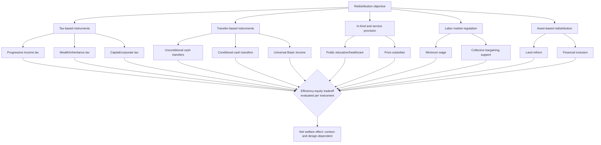

## Redistribution Policies and Their Tradeoffs

### Definition and Scope

Redistribution policies encompass the set of fiscal and regulatory instruments through which governments alter the market-generated (pre-tax, pre-transfer) distribution of income and wealth to achieve a more equal or otherwise socially preferred post-tax, post-transfer distribution. These instruments span taxation, direct cash and in-kind transfers, public service provision, labor market regulation, and asset-based interventions, each carrying distinct efficiency, administrative, and political-economy tradeoffs.

$$\text{Post-redistribution distribution} = \text{Market distribution} + \text{Taxes (negative)} + \text{Transfers (positive)} + \text{In-kind benefits}$$

The central analytical tension running through this topic is the **equity-efficiency tradeoff**: most redistributive instruments that reduce measured inequality also, to varying degrees depending on design, alter incentives for work, saving, investment, and risk-taking in ways that can reduce aggregate output, at least in simple theoretical models. A major focus of applied public economics and development policy is determining how large this tradeoff actually is in practice, and how to design instruments that minimize the efficiency cost per unit of redistribution achieved.

### The Core Equity-Efficiency Tradeoff Framework

**The optimal taxation framework** (originating with Mirrlees, 1971) formalizes the tradeoff explicitly. A government seeking to maximize a social welfare function that weights the utility of poorer individuals more heavily faces a constraint: it cannot directly observe individuals' underlying ability/productivity, only their realized income, which is a function of both ability and effort. Taxing income to redistribute therefore necessarily also taxes effort, since the government cannot distinguish high income earned through high ability at low effort from high income earned through high effort.

$$\max_{T(y)} \int_0^\infty W(u_i) \, dF(y_i) \quad \text{subject to} \quad \int_0^\infty T(y_i) \, dF(y_i) \geq R$$

where $T(y)$ is the tax/transfer schedule as a function of income $y$, $W(\cdot)$ is a concave social welfare weighting function, and $R$ is the government's revenue requirement. The **optimal marginal tax rate** at any income level in this framework balances the welfare gain from redistribution against the behavioral (labor supply) response elasticity at that income level:

$$\tau^*(y) = f(\text{social welfare weight on } y, \text{ labor supply elasticity at } y, \text{ shape of income distribution})$$

**Key Points**

- Higher labor supply elasticities (greater behavioral responsiveness to tax rates) imply lower optimal marginal tax rates at a given point in the distribution, since the efficiency cost of taxation there is higher.
- This framework provides the theoretical foundation for the widely cited (though debated in magnitude) result that optimal marginal tax rates need not be monotonically increasing with income, and that very high top marginal rates can, under some elasticity assumptions, be efficient rather than purely redistributive-motivated. [Inference: the specific numerical optimal tax rates implied by this framework are highly sensitive to the assumed labor supply elasticity and social welfare weights, which are contested empirical and normative parameters respectively, so no single "optimal rate" can be stated as a settled fact.]

### Categories of Redistributive Instruments

**1. Progressive income and wealth taxation**

- **Progressive income taxation**: Marginal tax rates rising with income level, directly reducing post-tax income inequality. Tradeoffs include potential labor supply disincentives (particularly at the margin for secondary earners and high-skill workers with more elastic labor supply), incentives for tax avoidance/evasion (especially significant in economies with large informal sectors and weak tax administration), and potential effects on entrepreneurship and risk-taking.
- **Wealth and inheritance/estate taxation**: Taxes on asset stocks or intergenerational transfers rather than income flows, aimed particularly at addressing wealth concentration and its self-reinforcing compounding dynamics (discussed in wealth vs. income inequality). Tradeoffs include valuation difficulties for illiquid assets (private business equity, real estate), capital flight risk in the absence of international coordination, and potential disincentives for savings and bequest behavior.
- **Corporate and capital income taxation**: Taxes on business profits and capital returns (dividends, capital gains, interest), which affect the distribution of capital income disproportionately accruing to wealthier households, but carry tradeoffs regarding capital mobility (particularly salient for smaller open economies competing for investment) and potential effects on aggregate investment and capital formation.

**2. Direct transfers**

- **Unconditional cash transfers (UCTs)**: Direct cash payments to eligible households without behavioral conditions attached. Advantages include administrative simplicity, respect for recipient autonomy in allocating resources according to their own priorities, and avoidance of the compliance costs (for both recipients and administrators) associated with monitoring conditions. Tradeoffs debated in the literature include concerns (not always empirically borne out) about potential negative labor supply effects and disagreement about whether unconditional transfers achieve specific developmental objectives (e.g., child education/health investment) as reliably as conditional alternatives.
- **Conditional cash transfers (CCTs)**: Transfers contingent on recipient behaviors, typically school attendance and health check-up compliance for children (e.g., long-running large-scale programs in Latin America and elsewhere). Advantages include directly incentivizing human capital investment where market or informational failures might otherwise lead households to under-invest even with additional unconditional income. Tradeoffs include higher administrative and monitoring costs, potential exclusion errors for households unable to comply with conditions due to service supply constraints (e.g., no nearby school or clinic) rather than behavioral choice, and debates about whether conditionality is paternalistic relative to households' own capacity to make welfare-improving decisions.
- **Universal Basic Income (UBI)**: A specific unconditional transfer design providing a regular, unconditional cash payment to all individuals or households regardless of income level. Advantages cited include administrative simplicity (no means-testing required, reducing both administrative cost and stigma), elimination of "welfare traps" or high effective marginal tax rates that can arise when means-tested benefits are withdrawn as income rises. Tradeoffs include substantial fiscal cost if set at a meaningful benefit level (since transfers go to all individuals including the non-poor, unlike targeted programs), and ongoing debate about labor supply effects, which existing pilot and experimental evidence has examined but which remains an active area of study with context-dependent findings. [Unverified: specific quantitative labor-supply-effect findings from UBI pilots should be sourced from the primary studies directly, as results vary across the different pilots and experimental designs that have been conducted, and this remains an evolving evidence base.]

**3. In-kind transfers and public service provision**

- **Public education and healthcare provision**: Direct government provision (or heavily subsidized access) to core services, redistributing in-kind rather than through cash. Advantages include addressing specific market failures (positive externalities of education, information asymmetries in healthcare) that pure cash transfers might not resolve as effectively, and reduced risk of funds being diverted from the intended developmental purpose. Tradeoffs include potential quality and efficiency issues in public provision relative to market alternatives (subject to substantial debate depending on institutional context and public sector capacity), and reduced recipient choice relative to cash-based approaches.
- **Subsidies (food, fuel, agricultural inputs)**: Price subsidies reducing the cost of specific goods, often justified on both redistributive and food-security/political-stability grounds. Tradeoffs are extensively documented: **universal subsidies** (available to all consumers regardless of income) are typically regressive in absolute fiscal terms (wealthier households often consume more of the subsidized good in absolute terms, e.g., fuel), create significant fiscal burden, can generate substantial market distortions (encouraging overconsumption, smuggling across borders where price differentials exist, black markets), and are notoriously difficult to reform politically once established due to concentrated beneficiary interest groups and diffuse cost-bearing taxpayers.

**4. Labor market regulation**

- **Minimum wage policy**: Legally mandated wage floors intended to raise earnings for low-wage workers. The standard competitive labor market model predicts a tradeoff between raising wages for employed low-wage workers and potential employment losses (as firms substitute away from labor or reduce hiring), though empirical labor economics has produced a substantial and actively debated literature (including monopsony-based models where employers hold wage-setting power, potentially allowing minimum wage increases with smaller or negligible employment effects than the competitive model predicts) regarding the actual magnitude of employment effects in specific contexts. [Inference: the empirical minimum wage employment-effect literature includes findings across a wide range of magnitudes and even signs depending on context, method, and specific minimum wage level relative to the local wage distribution, and should not be summarized as having a single settled universal finding.]
- **Collective bargaining and unionization support**: Policies strengthening worker bargaining power directly (rather than through a legislated wage floor), with tradeoffs including potential effects on labor market flexibility and, in some models, insider-outsider dynamics where unionized/formal-sector workers gain at the expense of non-unionized/informal-sector workers, a particularly salient concern in developing economies with large informal sectors.

**5. Asset-based and access-oriented redistribution**

- **Land reform**: Redistribution of land ownership, historically pursued in many developing economies partly for redistributive/social-justice reasons and partly on productivity grounds (given evidence in some contexts of an inverse relationship between farm size and land productivity, associated with the "inverse farm size-productivity" literature). Tradeoffs include implementation costs, potential short-run productivity disruption during transition, compensation questions for prior landholders, and historically mixed records of program design and execution across different country experiences. [Inference: land reform outcomes are highly context- and design-dependent, with the literature documenting both successful and unsuccessful implementations, so no single generalized outcome should be assumed.]
- **Financial inclusion policies**: Expanding access to formal credit, savings, and insurance products for previously excluded populations, aimed at addressing the credit-constraint channel through which inequality can inhibit growth (discussed in the inequality-growth relationship). Tradeoffs include the risk of over-indebtedness if expanded credit access is not accompanied by adequate consumer protection and financial literacy support.

### Diagram: The Redistribution Policy Landscape

### Illustration: The Equity-Efficiency Tradeoff Curve

<svg xmlns="http://www.w3.org/2000/svg" viewBox="0 0 700 380">
<text x="350" y="25" text-anchor="middle" font-size="16" font-weight="bold" fill="#1a1a1a">Equity-Efficiency Tradeoff (svg_diagram)</text>
<line x1="80" y1="330" x2="620" y2="330" stroke="#333" stroke-width="2" />
<line x1="80" y1="330" x2="80" y2="60" stroke="#333" stroke-width="2" />
<text x="350" y="365" text-anchor="middle" font-size="13" fill="#333">Equity (reduction in inequality)</text>
<text x="35" y="200" text-anchor="middle" font-size="13" fill="#333" transform="rotate(-90 35 200)">Aggregate output/efficiency</text>
<path d="M 100 90 Q 250 100 380 150 Q 500 200 590 300" fill="none" stroke="#2563eb" stroke-width="3" />
<text x="150" y="80" text-anchor="middle" font-size="11" fill="#1e3a8a">Well-designed instruments</text>
<text x="150" y="95" text-anchor="middle" font-size="11" fill="#1e3a8a">(low efficiency cost per unit equity)</text>
<path d="M 100 90 Q 200 180 300 260 Q 420 330 590 330" fill="none" stroke="#dc2626" stroke-width="3" stroke-dasharray="6,4" />
<text x="480" y="290" text-anchor="middle" font-size="11" fill="#7f1d1d">Poorly designed instruments</text>
<text x="480" y="305" text-anchor="middle" font-size="11" fill="#7f1d1d">(high efficiency cost per unit equity)</text>
<circle cx="100" cy="90" r="5" fill="#059669" />
<text x="100" y="70" text-anchor="middle" font-size="10" fill="#059669">No redistribution</text>
</svg>

### Empirical Evidence on Magnitude of Tradeoffs

**IMF and cross-institutional findings**: Research from multilateral institutions, notably influential IMF work in the 2010s (Ostry, Berg, Tsangarides and related studies), has argued that in most observed cases, the *net redistribution actually undertaken* by governments does not appear to significantly harm growth, except at unusually high levels of redistribution, suggesting that in practice many countries operate well within a region where the equity-efficiency tradeoff is modest rather than severe. [Unverified: specific quantitative thresholds and findings from this research stream should be verified against the primary publications directly, as this remains an active and periodically revised area of applied research.]

**Conditional cash transfer evidence**: A substantial randomized and quasi-experimental evaluation literature on CCT programs has generally found positive effects on targeted human capital outcomes (school enrollment, health check-up utilization) without strong evidence of the negative labor supply effects sometimes anticipated in theory, though effect sizes and specific findings vary by program design and country context. [Inference: summarizing this large and heterogeneous literature as uniformly positive would overstate the consistency of findings across the many different CCT program evaluations conducted; specific program evaluations should be consulted for context-specific conclusions.]

**Minimum wage evidence**: The empirical minimum wage literature, both in high-income and developing-country contexts, has produced findings ranging from negligible to modestly negative employment effects depending on the specific study, country, time period, and the level of the minimum wage relative to the local median wage, with monopsony-based theoretical models providing one explanation for why standard competitive-market predictions of large employment losses are not always empirically observed. [Unverified: given the size, methodological diversity, and ongoing evolution of this literature, specific quantitative employment-elasticity estimates should be drawn from current primary research rather than treated as settled figures.]

**Universal Basic Income pilot evidence**: A growing but still limited number of UBI and unconditional cash transfer pilots (conducted in various high-income and developing-country settings) have generally found limited or modest labor supply reductions in most studied contexts, though pilot programs typically differ from a permanent universal national policy in scale, duration, and general-equilibrium effects, limiting direct extrapolation. [Unverified: specific pilot findings and their generalizability should be verified against the primary evaluation literature, since this remains an actively expanding evidence base with programs still being studied and new results being published.]

### Administrative and Political Economy Considerations

**Targeting mechanisms and errors**: Redistributive programs intended for specific populations (the poor, particular demographic groups) require a targeting mechanism, each with distinct tradeoffs:

- **Means-testing**: Directly verifying income/asset levels, precise but administratively costly and prone to both **inclusion errors** (non-poor households incorrectly qualifying) and **exclusion errors** (eligible poor households failing to qualify, often due to informal income that is difficult to verify).
- **Proxy means-testing**: Using observable correlates of poverty (housing characteristics, asset ownership, household composition) as a low-cost proxy for income, reducing verification costs at the expense of targeting precision.
- **Geographic targeting**: Directing resources to poorer regions/areas, administratively simple but subject to substantial within-region targeting error given that poverty exists within even relatively wealthy regions (linking to the within/between decomposition discussed in spatial inequality).
- **Self-targeting/universal provision**: Designing benefits (e.g., work requirements paid at a low wage in public employment schemes) that are unattractive to non-poor households, causing self-selection into the program primarily by those who need it, avoiding the administrative costs of means-testing at the expense of requiring recipients to bear the cost of complying with the self-targeting mechanism (e.g., forgoing other employment opportunities).

**Political sustainability**: Redistributive policies require ongoing political support to be sustained and effectively implemented; program design that creates broad-based (rather than narrowly targeted) constituencies of support can enhance political durability, though this can come at the cost of higher fiscal expense (since broader eligibility typically means higher total program cost) — a tension directly relevant to the universal-versus-targeted transfer design debate.

**Fiscal capacity constraints**: In many developing economies, redistributive policy design is significantly constrained by limited tax administration capacity (particularly for direct/progressive taxation, which requires income verification infrastructure that is harder to implement given large informal sectors) relative to higher-income countries, often leading to greater relative reliance on indirect taxation (which tends to be less progressive) and in-kind or subsidy-based redistribution mechanisms that are administratively simpler to implement even if less precisely targeted. [Inference: the specific fiscal capacity constraints and resulting policy mix vary substantially by country and are shaped by country-specific institutional history, so this represents a general tendency rather than a universal rule.]

**Key Points**

- No redistributive instrument is free of tradeoffs; policy design (targeting mechanism, conditionality, administrative delivery channel, tax base) substantially determines where any given instrument falls on the efficiency-equity tradeoff curve, meaning the *design* of a policy is often as consequential as the *choice* of instrument category.
- The empirical literature increasingly suggests that well-designed redistribution operating within observed historical ranges carries a more modest efficiency cost than earlier theoretical models might suggest, though this finding should not be read as implying redistribution is costless at any scale or under any design, since the underlying incentive-distortion mechanisms remain theoretically and empirically real at sufficiently high levels or under poor implementation.

**Next Steps**

- Mirrlees optimal taxation theory and its extensions
- Conditional vs. unconditional cash transfer program evaluation literature
- Universal Basic Income pilot studies and labor supply effect evidence
- Proxy means-testing and targeting mechanism design in social protection programs
- Minimum wage and monopsony models in developing-country labor markets
- Land reform and the inverse farm size-productivity relationship
- Tax administration capacity and informality in developing-economy fiscal systems
- IMF and multilateral institution research on redistribution and growth durability
- Universal vs. targeted subsidy reform (fuel and food subsidy political economy)