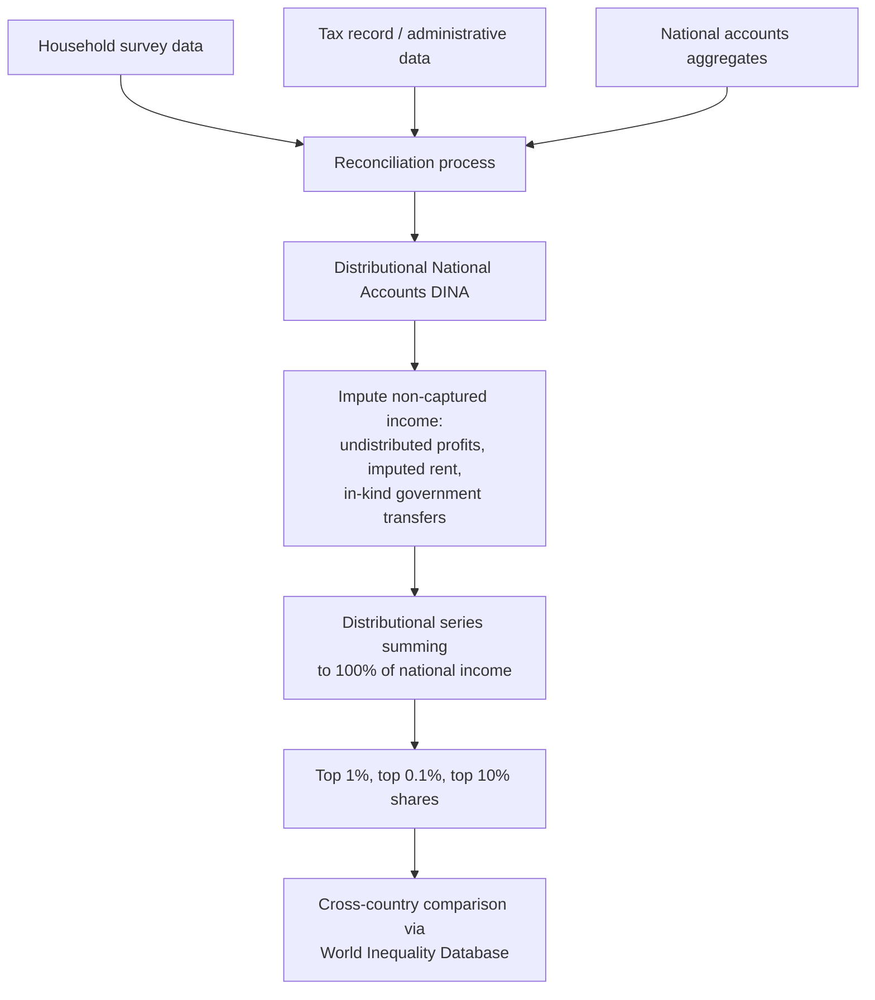

## Top Income Shares in Developing Countries

### Definition and Methodological Approach

Top income shares measure the proportion of total national income (or, in some studies, wealth) accruing to a specific upper percentile of the population — most commonly the top 1%, top 0.1%, or top 10% — providing a granular view of distributional concentration at the upper tail that standard summary measures like the Gini coefficient can obscure.

$$\text{Top } p\% \text{ income share} = \frac{\text{Total income of top } p\% \text{ of income earners}}{\text{Total national income}}$$

The dominant methodological approach for constructing long-run, historically comparable top income share series is the use of **income tax record data**, pioneered by Thomas Piketty for France and subsequently extended to dozens of countries through the collaborative **World Inequality Database (WID)** project (co-directed by Piketty, Saez, Zucman, and a global network of country researchers).

### Why Tax Record Data Rather Than Household Surveys

**Survey limitations at the top of the distribution**: Standard household consumption or income surveys — the primary data source for most inequality and poverty measurement discussed elsewhere in this chapter — suffer from well-documented limitations specifically affecting top-income measurement:

- **Top-coding**: Many surveys cap reported income values at a maximum threshold for confidentiality or data-quality reasons, mechanically truncating the observed distribution's right tail.
- **Differential non-response**: Wealthy households are frequently underrepresented in survey samples, whether through explicit refusal to participate, sampling frame limitations (surveys typically sample dwellings, which underrepresents highly mobile or multiple-property-owning wealthy individuals), or survey design not adequately capturing complex income sources such as business income, capital gains, and diverse asset returns.
- **Underreporting**: Even when wealthy respondents participate, self-reported income among top earners in surveys is frequently understated relative to administrative benchmarks, particularly for capital income sources.

**Tax record advantages**: Administrative tax data, by contrast, is collected specifically to accurately capture taxable income (particularly at the top, where tax revenue collection is a first-order government priority), and generally spans much longer historical periods in countries with established income tax systems, enabling long-run trend analysis.

**Tax record limitations**: Tax data also carries important limitations directly relevant to interpreting top income share estimates for developing countries specifically:

- **Coverage gaps in economies with large informal sectors**: Where a substantial share of economic activity occurs outside the formal, tax-registered economy, tax records systematically miss informal-sector income, which can bias top-share estimates in ambiguous directions depending on whether informality is more prevalent among top or bottom income groups in a given context. [Inference: the net directional bias from informal-sector coverage gaps depends on country-specific informality patterns and cannot be assumed uniform across developing economies.]
- **Tax avoidance and evasion**: Top earners, having greater access to tax planning resources and often more diverse and internationally mobile income sources, may have stronger incentives and greater capacity for legal tax avoidance and illegal evasion, potentially causing tax-based top-share estimates to understate true top concentration. Cross-referencing with third-party reported data (e.g., dividend and interest withholding records) is sometimes used to partially correct for this, but is not available in all country contexts.
- **Filing threshold and exemption effects**: In many developing countries, a smaller share of the population is required to file income tax returns (due to high exemption thresholds or lower average incomes overall), meaning the population "covered" by tax data may itself be a select, higher-income subset, complicating extrapolation to the full population and requiring careful methodological adjustment (typically combining tax data with national accounts and, where available, household survey data for the non-filing population).
- **Underdeveloped tax administration infrastructure**: Some developing countries have shorter historical runs of usable tax record data, or tax systems that have undergone frequent structural changes, complicating the construction of long, methodologically consistent time series comparable to the multi-decade series available for some higher-income countries.

### The Distributional National Accounts (DINA) Methodology

A key methodological advance used by the World Inequality Database is the **Distributional National Accounts (DINA)** framework, which addresses a fundamental limitation of raw tax-based top-share estimates: tax data alone typically captures only a fraction of total national income as measured in a country's macroeconomic national accounts (due to non-filers, non-taxable income categories, and tax base narrowness).

DINA methodology reconciles survey data, tax record data, and national accounts aggregates to produce distributional estimates that, by construction, **sum to 100% of national income** as measured in the national accounts, rather than only the income captured within tax records:

$$\sum_i y_i^{DINA} = Y_{national\ accounts}$$

This involves imputing income categories not well captured in either surveys or tax data (e.g., imputed rent on owner-occupied housing, undistributed corporate profits, government-provided in-kind benefits) and allocating them across the population using auxiliary data and assumptions, producing what the WID terms "national income" distributional series intended to be more comprehensive and cross-country comparable than either raw survey-based or raw tax-based series alone.

**Key Points**

- DINA estimates require numerous imputation and allocation assumptions (e.g., how to distribute undistributed corporate profits across shareholders, how to value and allocate in-kind government transfers), each of which is a methodological choice that can affect resulting top-share estimates; the WID methodology documents these choices explicitly and different research teams sometimes make different assumptions for the same country, which can produce somewhat different estimates depending on the vintage of methodology applied.
- This represents a substantial improvement in cross-country comparability over earlier tax-record-only approaches, but does not eliminate all measurement uncertainty, particularly for developing countries with less-developed statistical and tax administration infrastructure underlying the raw inputs to the DINA reconciliation process.

### Diagram: Constructing Top Income Share Estimates

### Patterns Observed in Developing-Country Top Income Share Research

**General findings from the WID and related research**: Top income share estimation has been extended to a growing number of developing and emerging economies (including various countries across Latin America, Sub-Saharan Africa, South Asia, and the Middle East), generally finding that top income concentration in many of these economies is comparable to, and in some documented cases exceeds, levels observed in high-income economies, though findings vary substantially by country and the specific period studied. [Unverified: specific top 1% or top 10% share percentages for particular countries or regions should be sourced directly from the current World Inequality Database given that these estimates are periodically revised and updated as new data and methodological refinements become available.]

**Regional research themes**:

- **Latin America**: Historically documented as a region with persistently high income concentration, with research using tax record data (where available) generally corroborating the high inequality levels long suggested by household survey-based Gini coefficients, though tax record coverage and historical depth vary considerably by country in the region.
- **Sub-Saharan Africa**: A more limited but growing body of tax-record-based top income share research exists for the region, constrained by data availability, with researchers often needing to rely more heavily on combining limited tax data with household survey and national accounts information.
- **South and Southeast Asia**: Notable individual-country studies (e.g., research using Indian tax record data) have documented long-run trends in top income concentration, often finding periods of declining concentration during more redistributive-era economic policy regimes followed by rising concentration during periods of liberalization, though the precise timing and magnitude are country- and study-specific. [Inference: characterizing a general regional pattern across all South and Southeast Asian countries would overstate the consistency of findings across quite heterogeneous national policy histories and data quality.]
- **China**: Substantial documented research (within the WID and broader literature) on rising top income and wealth concentration accompanying China's economic transition and rapid growth since market-oriented reforms began, a widely studied case of a specific historical growth-inequality trajectory. [Unverified: specific quantitative trend figures should be verified against current primary sources given the scale of change and ongoing data revisions in this specific literature.]

**Key Points**

- A recurring finding across much of this literature is that top income shares estimated using tax-record or DINA methodology are frequently **higher** than top shares estimated from the same country's household surveys alone, consistent with the survey limitations (top-coding, underreporting, non-response) discussed above — meaning reliance on survey-only data likely understates true top-end concentration in many developing-country contexts. [Inference: while this directional pattern (tax-based estimates exceeding survey-based estimates) is widely documented, the specific magnitude of the gap is country-specific and depends on the quality of both the survey and the tax data being compared.]
- Data availability itself is highly uneven across developing countries: some have participated extensively in WID data construction with multi-decade tax record series, while others have little or no tax-record-based top income share research due to data access constraints, meaning cross-country comparisons in this specific literature should be read with an awareness of significant sample/coverage gaps rather than treated as a fully comprehensive global picture.

### Illustration: Survey-Based vs. Tax-Record-Based Top Share Estimates

<svg xmlns="http://www.w3.org/2000/svg" viewBox="0 0 700 360">
<text x="350" y="25" text-anchor="middle" font-size="16" font-weight="bold" fill="#1a1a1a">Survey vs. Tax-Record Top Share Estimates (svg_diagram)</text>
<line x1="80" y1="300" x2="620" y2="300" stroke="#333" stroke-width="2" />
<line x1="80" y1="300" x2="80" y2="60" stroke="#333" stroke-width="2" />
<text x="30" y="180" text-anchor="middle" font-size="12" fill="#333" transform="rotate(-90 30 180)">Top 1% income share</text>
<rect x="140" y="220" width="70" height="80" fill="#93c5fd" stroke="#1e3a8a" stroke-width="2" />
<text x="175" y="320" text-anchor="middle" font-size="11" fill="#333">Survey-based</text>
<text x="175" y="210" text-anchor="middle" font-size="11" fill="#1e3a8a">Understated</text>
<text x="175" y="335" text-anchor="middle" font-size="10" fill="#333" font-style="italic">(top-coding, underreporting,</text>
<text x="175" y="348" text-anchor="middle" font-size="10" fill="#333" font-style="italic">non-response bias)</text>
<rect x="450" y="110" width="70" height="190" fill="#fca5a5" stroke="#7f1d1d" stroke-width="2" />
<text x="485" y="320" text-anchor="middle" font-size="11" fill="#333">Tax-record/DINA-based</text>
<text x="485" y="100" text-anchor="middle" font-size="11" fill="#7f1d1d">Higher estimate</text>
<line x1="210" y1="220" x2="450" y2="110" stroke="#333" stroke-width="1.5" stroke-dasharray="5,3" marker-end="url(#arrow2)" />
<text x="330" y="150" text-anchor="middle" font-size="10" fill="#333">Gap reflects survey</text>
<text x="330" y="163" text-anchor="middle" font-size="10" fill="#333">limitations at top tail</text>
</svg>

### Example: Illustrative Gap Between Survey and Tax-Based Estimates

Suppose a household consumption survey in a hypothetical developing country estimates the top 1% income share at 12% of total income, while a subsequent DINA-based reconciliation using tax records and national accounts data for the same country and year estimates the top 1% share at 22%.

- **Survey-based estimate**: 12% — likely reflects substantial undercapture of capital income, business income, and other income sources concentrated among top earners and poorly captured in household consumption modules.
- **Tax/DINA-based estimate**: 22% — incorporates income sources (dividends, business profits, imputed returns to wealth) more fully captured through administrative records and national accounts reconciliation.
- **Implied gap**: 10 percentage points, illustrating how the choice of data source and methodology can lead to materially different conclusions about the degree of top-end income concentration in the same economy at the same point in time.

[Inference: this is a constructed hypothetical numerical example designed to illustrate the typical *direction* and *plausible order of magnitude* of the survey-versus-tax-record gap documented in the literature; actual gaps for any specific country and year must be obtained from the relevant published estimates rather than assumed from this illustration.]

### Drivers of Top Income Concentration in Developing-Country Contexts

Research in this area has examined several country- and region-specific drivers of top-end income concentration, including:

- **Natural resource rents**: In resource-rich developing economies, ownership or control of extractive industry rents (oil, gas, mining) can generate substantial concentration of income and wealth among a relatively narrow set of owners, state-linked elites, or foreign investors, a dynamic studied extensively in the "resource curse" and political economy of natural resources literature.
- **Trade and financial liberalization episodes**: Structural economic reforms opening economies to international trade and capital flows have, in several studied country cases, coincided with periods of rising top income concentration, plausibly linked to increased returns to internationally mobile capital and skilled entrepreneurship, though the causal relationship and its generalizability across different liberalization episodes is a subject of ongoing research rather than a settled universal finding.
- **Privatization processes**: In economies that underwent large-scale privatization of state-owned enterprises (notably in transition economies moving from centrally planned to market-based systems), the process and terms of privatization have been studied as a specific mechanism generating rapid wealth and income concentration among those positioned to acquire privatized assets.
- **Political connections and rent-seeking**: A body of political economy research examines the extent to which top income and wealth concentration in various developing-country contexts reflects politically connected rent-seeking (preferential access to licenses, contracts, or regulatory advantages) rather than purely market-driven returns to capital or entrepreneurship, though empirically distinguishing these channels requires context-specific institutional analysis rather than being inferable from income data alone.

**Key Points**

- These drivers are not mutually exclusive and often interact in specific country cases (e.g., natural resource rents captured through politically connected privatization processes), meaning attributing top income concentration to a single dominant cause in any specific country typically requires detailed country-specific institutional and historical analysis beyond what aggregate income share statistics alone can reveal.

### Relevance to Broader Inequality Analysis in Developing Economies

Top income share research complements, rather than substitutes for, the household-survey-based Gini coefficient and poverty measurement approaches used elsewhere in inequality analysis:

- Household surveys remain generally more reliable for characterizing the **bottom and middle** of the income distribution (relevant for poverty measurement) than tax records, which in many developing countries have limited coverage of lower-income, informal-sector populations.
- Tax-record and DINA-based approaches provide superior characterization of the **top tail**, which survey-based Gini coefficients can substantially understate given the survey limitations discussed above.
- A complete distributional picture in development economics research increasingly draws on **combining both approaches** — using survey data for the bulk of the distribution and tax/DINA-adjusted data for the top tail — rather than relying exclusively on either single data source, reflecting the broader DINA methodological philosophy of reconciling multiple data sources into a single coherent account.

**Next Steps**

- World Inequality Database (WID) methodology and country coverage
- Distributional National Accounts (DINA) framework — construction and imputation methods
- Piketty-Saez top income share methodology (originating with the France/US studies)
- Resource curse and natural resource rent capture in developing economies
- Privatization processes and wealth concentration in transition economies
- Tax administration capacity and informality's effect on distributional data quality
- Combining survey and tax-record data for comprehensive distributional analysis
- Political economy of rent-seeking and its relationship to top income concentration