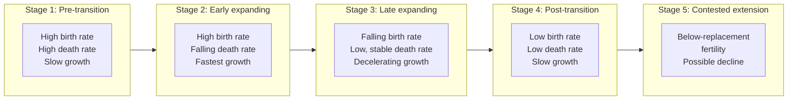
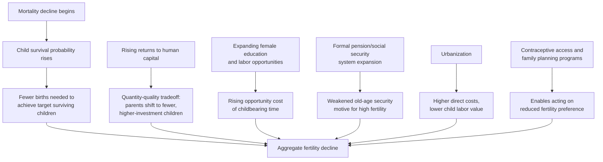

## Demographic Transition Theory

### Definition and Core Framework

Demographic transition theory describes a historically observed pattern in which populations move from a state of high birth rates and high death rates (resulting in slow or stagnant population growth) to a state of low birth rates and low death rates (resulting again in slow population growth), passing through an intermediate period in which death rates fall faster than birth rates, producing rapid population growth. The theory, originating in the observational work of demographers including Warren Thompson (1929) and later formalized by Frank Notestein (1945), remains the foundational organizing framework in population economics and demography for understanding the relationship between economic development and population dynamics.

$$\text{Rate of natural increase} = \text{Crude Birth Rate (CBR)} - \text{Crude Death Rate (CDR)}$$

where CBR and CDR are typically expressed as the number of births/deaths per 1,000 population per year.

### The Four (or Five) Stage Model

**Stage 1 — Pre-transition (high stationary)**

Both birth rates and death rates are high, and roughly balanced, resulting in slow or negligible population growth. Historically associated with pre-industrial, agrarian societies. High death rates reflect limited medical knowledge, poor sanitation, famine vulnerability, and high infant/child mortality; high birth rates reflect the absence of the mortality decline that would otherwise make sustained high fertility unnecessary for family labor and old-age security needs, alongside limited access to contraception and social/religious norms favoring large families.

**Stage 2 — Early transition (early expanding)**

Death rates begin to fall, often rapidly, due to improvements in food supply, sanitation, basic public health measures (clean water, vaccination), and gradually improving medical care, while birth rates remain high (fertility norms and behaviors adjust with a lag relative to mortality decline). The gap between the still-high birth rate and the falling death rate produces the fastest phase of population growth in the entire transition.

**Stage 3 — Late transition (late expanding)**

Birth rates begin to fall, driven by a combination of factors discussed in detail below (rising costs of child-rearing, declining infant mortality reducing the need for "replacement" births, expanding female education and labor force participation, urbanization, and increasing access to contraception). Death rates continue to fall but at a slower rate than in Stage 2, since they are approaching a lower biological/practical floor. Population growth continues but at a decelerating rate.

**Stage 4 — Post-transition (low stationary)**

Both birth rates and death rates stabilize at low levels, again roughly balanced, resulting in slow population growth. Associated with mature industrialized/high-income economies with low child mortality, widespread contraceptive access, and fertility norms centered on smaller family sizes.

**Stage 5 (proposed extension)**: Some demographers identify a further stage in certain very low-fertility, aging societies where birth rates fall *below* replacement level (typically defined as a total fertility rate of approximately 2.1 children per woman in low-mortality settings) for a sustained period, potentially leading to population decline absent net immigration. This extension is more contested and country-specific than the core four-stage model, and its applicability, timing, and reversibility are subjects of ongoing demographic research and debate. [Inference: whether any specific below-replacement fertility episode represents a durable structural "Stage 5" versus a temporary or reversible fluctuation is not something that can be asserted definitively without country-specific longitudinal analysis.]

### Diagram: The Demographic Transition Model

### Illustration: Birth Rate and Death Rate Curves Across Stages

<svg xmlns="http://www.w3.org/2000/svg" viewBox="0 0 700 400">
<text x="350" y="25" text-anchor="middle" font-size="16" font-weight="bold" fill="#1a1a1a">Demographic Transition Model (svg_diagram)</text>
<line x1="70" y1="340" x2="650" y2="340" stroke="#333" stroke-width="2" />
<line x1="70" y1="340" x2="70" y2="50" stroke="#333" stroke-width="2" />
<text x="360" y="375" text-anchor="middle" font-size="13" fill="#333">Time / stage of transition</text>
<text x="30" y="195" text-anchor="middle" font-size="13" fill="#333" transform="rotate(-90 30 195)">Rate per 1,000 population</text>
<path d="M 90 90 L 220 88 Q 320 200 420 280 Q 520 320 630 325" fill="none" stroke="#dc2626" stroke-width="3" />
<text x="150" y="75" text-anchor="middle" font-size="11" fill="#dc2626" font-weight="bold">Birth rate</text>
<path d="M 90 110 Q 150 200 250 290 Q 350 320 450 325 Q 550 328 630 330" fill="none" stroke="#2563eb" stroke-width="3" />
<text x="150" y="215" text-anchor="middle" font-size="11" fill="#2563eb" font-weight="bold">Death rate</text>
<path d="M 220 88 Q 320 200 420 280 L 420 325 Q 320 240 220 130 Z" fill="#fca5a5" fill-opacity="0.4" stroke="none" />
<text x="300" y="180" text-anchor="middle" font-size="11" fill="#7f1d1d">Natural increase</text>
<text x="300" y="195" text-anchor="middle" font-size="11" fill="#7f1d1d">(population growth)</text>
<line x1="145" y1="345" x2="145" y2="355" stroke="#333" />
<text x="145" y="365" text-anchor="middle" font-size="10" fill="#333">Stage 1</text>
<line x1="290" y1="345" x2="290" y2="355" stroke="#333" />
<text x="290" y="365" text-anchor="middle" font-size="10" fill="#333">Stage 2</text>
<line x1="450" y1="345" x2="450" y2="355" stroke="#333" />
<text x="450" y="365" text-anchor="middle" font-size="10" fill="#333">Stage 3</text>
<line x1="590" y1="345" x2="590" y2="355" stroke="#333" />
<text x="590" y="365" text-anchor="middle" font-size="10" fill="#333">Stage 4</text>
</svg>

### Drivers of the Mortality Decline (Stage 1 → Stage 2)

- **Public health infrastructure**: Clean water provision, sanitation systems, and vector control substantially reduce infectious disease burden without requiring individual behavior change or advanced medical technology, historically among the earliest and most impactful mortality-reducing interventions.
- **Nutrition and food security improvements**: Agricultural productivity gains and improved food distribution reduce famine vulnerability and malnutrition-related mortality, strengthening broader disease resistance.
- **Medical advances**: Vaccination, antibiotics, and improved obstetric care progressively reduce mortality from infectious disease and childbirth-related complications, with these interventions becoming more widely diffused over the course of the transition.
- **Rising income and living standards**: Improved housing quality, income sufficient for adequate nutrition, and reduced occupational hazards contribute to mortality decline alongside more targeted public health interventions.

### Theoretical Explanations for the Fertility Decline (Stage 2 → Stage 3)

Multiple, non-mutually-exclusive theoretical frameworks have been developed to explain why fertility eventually falls following the initial mortality decline, each emphasizing different causal mechanisms:

**1. The quantity-quality tradeoff (Becker-Lewis framework)**

A cornerstone of modern economic demography, this framework models parents as choosing both the **number** of children (quantity) and the level of investment per child (quality, e.g., education, health), subject to a budget constraint. As the economic returns to human capital investment rise (e.g., due to skill-biased technological change or expanding labor market opportunities requiring education), parents rationally substitute toward fewer children with higher investment per child:

$$U(n, q, c) \quad \text{subject to} \quad p_n n + p_q q \cdot n + p_c c \leq I$$

where $n$ is the number of children, $q$ is quality/investment per child, $c$ is other consumption, $p_n, p_q, p_c$ are respective prices, and $I$ is household income. A distinctive feature of this framework is the **interaction term** between quantity and quality prices ($p_q \cdot n$): raising quality investment per child raises the effective cost of each additional child, creating a mechanism through which rising returns to child quality can generate a substantial fertility decline, potentially even amid rising household income (in contrast to a simple income effect, which alone might predict rising fertility if children are treated as a normal good).

**2. Declining child mortality and reduced "hoarding" motive**

As child mortality falls (part of the broader mortality decline in Stage 2), parents require fewer births to achieve a targeted number of *surviving* children, particularly relevant where fertility decisions are partly motivated by old-age security or family labor needs requiring a minimum number of surviving offspring. This mechanism operates with a lag, since fertility behavior takes time to adjust to a new, lower mortality environment, contributing to the characteristic gap between the initial mortality decline and the subsequent fertility decline that defines Stage 2's rapid population growth.

**3. Rising opportunity cost of women's time**

As female education and labor market opportunities expand, the opportunity cost of time spent in childbearing and child-rearing rises, incentivizing smaller family sizes. This channel is extensively documented in the labor economics and gender-and-development literature, and interacts closely with women's education and labor force participation trends discussed under gender inequality in development contexts.

**4. Old-age security transition**

In agrarian societies, children (particularly sons in many historical and contemporary contexts) often serve as a primary source of old-age economic security in the absence of formal pension systems, capital markets, or insurance mechanisms. As formal social security systems, pension provision, and financial market access expand with development, this economic motive for high fertility weakens, contributing to fertility decline independent of the quantity-quality tradeoff mechanism.

**5. Urbanization**

Urban living generally raises the direct costs of raising children (housing space constraints, reduced scope for children's agricultural labor contribution) while reducing some of the economic benefits associated with large families in rural/agricultural settings (where children can contribute productive farm labor from a relatively young age), contributing to the broadly documented lower fertility rates observed in urban relative to rural populations within the same country.

**6. Contraceptive access and family planning programs**

The availability of effective, affordable contraception is a necessary (though not necessarily sufficient on its own) condition for couples to act on a preference for smaller families; a substantial applied literature examines the effects of family planning program availability and quality on fertility outcomes, generally as a complement to, rather than substitute for, the underlying demand-side shifts in desired fertility described above. [Inference: the relative contribution of "supply-side" contraceptive access versus "demand-side" preference shifts to any specific country's fertility decline is a matter of ongoing empirical debate and is likely to vary by context.]

### Diagram: Fertility Decline — Competing and Complementary Mechanisms

### The Demographic Dividend

A central applied concept linked to demographic transition theory is the **demographic dividend**: the potential for accelerated economic growth arising from a temporary, favorable shift in a country's age structure during the transition, specifically the period when the **working-age population share rises relative to dependents** (children and elderly).

$$\text{Dependency ratio} = \frac{\text{Population aged 0-14 and 65+}}{\text{Population aged 15-64}}$$

As fertility declines (Stage 2 to Stage 3), the youth dependency ratio falls (fewer children per working-age adult), while the elderly dependency ratio has not yet risen substantially (since population aging occurs with a further lag), producing a temporary "window" of a historically low overall dependency ratio. This favorable age structure can support faster per-capita income growth through several channels:

- **Labor supply effects**: A larger working-age share, all else equal, mechanically raises the labor force relative to total population, supporting higher per-capita output.
- **Savings effects**: Working-age individuals, particularly in mid-career, typically have higher savings rates than dependents, potentially raising the aggregate national savings rate and available investment financing during the dividend window.
- **Human capital investment effects**: With fewer children per family (as fertility declines), households and governments can invest more resources per child in education and health, potentially raising human capital accumulation — directly linking the demographic dividend concept to the quantity-quality tradeoff mechanism described above.

**Key Points**

- The demographic dividend is widely characterized in the literature as a **potential** opportunity rather than an automatic outcome: realizing the growth benefits requires complementary conditions, particularly sufficient job creation to productively employ the enlarged working-age cohort, adequate education and health system capacity to build human capital during the dividend window, and sound economic and governance institutions. Where these complementary conditions are absent, a large working-age cohort can instead manifest as high youth unemployment and associated social/political strains rather than accelerated growth. [Inference: the empirical evidence on when and where the demographic dividend has been successfully realized versus not realized is context- and policy-dependent, and specific case comparisons should be consulted directly rather than assuming automatic dividend realization from favorable demographics alone.]
- The dividend window is inherently temporary: as the transition proceeds further, population aging (rising elderly dependency ratio) eventually raises the overall dependency ratio again, meaning the growth-favorable demographic window must be economically capitalized upon during a bounded period rather than treated as a permanent structural advantage.

### Illustration: The Demographic Dividend Window

<svg xmlns="http://www.w3.org/2000/svg" viewBox="0 0 700 380">
<text x="350" y="25" text-anchor="middle" font-size="16" font-weight="bold" fill="#1a1a1a">Dependency Ratio Over the Transition (svg_diagram)</text>
<line x1="70" y1="320" x2="650" y2="320" stroke="#333" stroke-width="2" />
<line x1="70" y1="320" x2="70" y2="50" stroke="#333" stroke-width="2" />
<text x="360" y="355" text-anchor="middle" font-size="13" fill="#333">Time (progression through transition)</text>
<text x="30" y="185" text-anchor="middle" font-size="13" fill="#333" transform="rotate(-90 30 185)">Total dependency ratio</text>
<path d="M 90 100 Q 200 130 280 220 Q 380 280 480 250 Q 580 210 630 130" fill="none" stroke="#7c3aed" stroke-width="3" />
<rect x="280" y="60" width="200" height="240" fill="#86efac" fill-opacity="0.3" stroke="#14532d" stroke-width="1.5" stroke-dasharray="4,3" />
<text x="380" y="80" text-anchor="middle" font-size="12" fill="#14532d" font-weight="bold">Demographic dividend window</text>
<text x="380" y="98" text-anchor="middle" font-size="10" fill="#14532d">low dependency ratio —</text>
<text x="380" y="112" text-anchor="middle" font-size="10" fill="#14532d">favorable working-age share</text>
<text x="130" y="90" text-anchor="middle" font-size="10" fill="#333">High youth</text>
<text x="130" y="103" text-anchor="middle" font-size="10" fill="#333">dependency</text>
<text x="590" y="115" text-anchor="middle" font-size="10" fill="#333">Rising elderly</text>
<text x="590" y="128" text-anchor="middle" font-size="10" fill="#333">dependency</text>
</svg>

### Critiques and Limitations of the Theory

**Historical/Eurocentric origin**: The original model was derived primarily from the observed historical experience of European and North American industrializing societies; whether developing countries today necessarily follow the same sequence, timing, and causal structure is a subject of ongoing debate, given substantial differences in initial mortality/fertility levels, available medical technology (allowing much faster mortality decline than was historically possible), international migration patterns, and the role of deliberate family planning policy (largely absent during the historical European transition but a significant deliberate policy lever in many contemporary developing-country transitions).

**Variation in transition speed**: A well-documented empirical pattern is that many contemporary developing-country transitions have proceeded considerably faster than the historical European transition, reflecting the diffusion of already-existing medical and contraceptive technology (rather than needing to be developed indigenously) and, in some cases, active government family planning policy — meaning the multi-generational timescale of the original historical model does not necessarily describe the pace of transition in all contemporary contexts. [Inference: while faster transition speeds in some contemporary cases relative to the historical European experience is a well-documented pattern, specific quantitative pace comparisons for particular countries should be verified against current demographic data given ongoing transitions in real time.]

**Non-linear and reversible elements**: The theory's stylized four/five-stage sequence implies a broadly monotonic, one-directional progression, but some countries have experienced fertility trend reversals, stalls in fertility decline at levels above replacement, or other deviations from the smooth stylized curve, suggesting the model is better understood as a useful stylized generalization than a strict deterministic law applicable without exception to every national case. [Inference: the specific causes of fertility decline stalls documented in various country studies are actively debated and are likely to be context-specific rather than following a single universal explanation.]

**Policy endogeneity**: Unlike the original historical European transition (where fertility decline is generally understood as emerging primarily from decentralized household decisions responding to changing economic incentives), many developing-country fertility transitions have been directly and deliberately shaped by government population policy (ranging from voluntary family planning program investment to, in some historical cases, more coercive population control measures), meaning the transition mechanism in these cases reflects an additional policy-driven causal channel not present in the theory's original formulation.

**Next Steps**

- Becker-Lewis quantity-quality tradeoff model — formal treatment and empirical tests
- Demographic dividend realization conditions and comparative country case studies
- Population aging and its long-run fiscal and economic implications
- Family planning program evaluation methodology and evidence
- Population policy history: voluntary versus coercive approaches in different country contexts
- Migration's role in modifying dependency ratios and population age structure
- Total fertility rate measurement and below-replacement fertility dynamics
- Urbanization's relationship to fertility decline and demographic transition timing
- Old-age social security systems and their interaction with fertility incentives