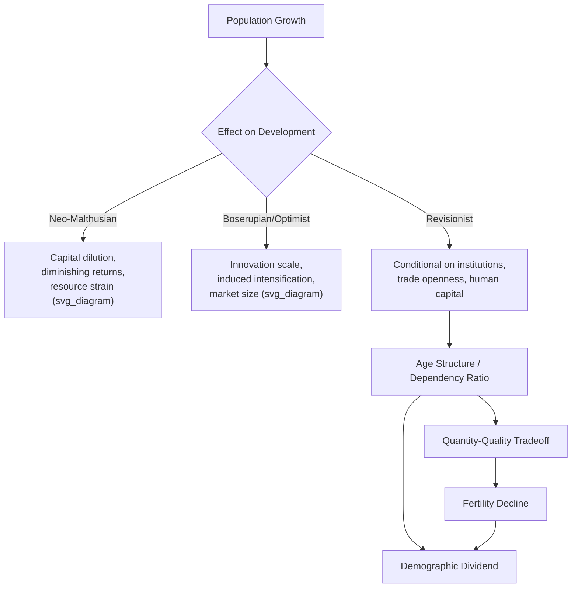

## Population Growth and Economic Development Debates

### Overview

The relationship between population growth and economic development has been debated since Malthus, with positions ranging from strict pessimism (population growth undermines development) to optimism (population growth drives innovation and growth) to revisionist neutrality (effects are context-dependent, mediated by institutions and policy). This debate structures how demographic transition, fertility decline, age structure, and human capital investment are analyzed in development economics.

### Historical Foundations

#### Malthusian Theory

Thomas Malthus (1798, *An Essay on the Principle of Population*) argued that population grows geometrically ($1, 2, 4, 8, ...$) while food supply grows arithmetically ($1, 2, 3, 4, ...$), producing an inevitable tendency for population to outstrip subsistence.

**Key Points**

- Positive checks: famine, disease, war reduce population when it exceeds subsistence
- Preventive checks: delayed marriage, moral restraint reduce fertility
- Implication: any income gain above subsistence triggers population growth that erodes per-capita gains, trapping societies in a "Malthusian trap" of stagnant living standards
- The model treats diminishing returns to land as fixed and technology as static

**Limitations [Inference]:** Malthus did not anticipate sustained technological change (Industrial Revolution) or the demographic transition, both of which broke the predicted trap in currently high-income countries.

#### Boserupian Response

Ester Boserup (1965, *The Conditions of Agricultural Growth*) inverted the causality: population growth is the *driver* of agricultural intensification and technological innovation, not merely a consequence of it.

**Key Points**

- Population pressure induces shifts from extensive to intensive farming techniques (e.g., shortened fallow periods, irrigation, multi-cropping)
- Necessity induces innovation — labor abundance makes previously unprofitable intensification worthwhile
- Reverses Malthus's fixed-technology assumption

### Theoretical Positions in the Modern Debate

#### 1. Population Pessimism (Neo-Malthusian)

Associated with the "population bomb" literature (Ehrlich, 1968) and formal growth models incorporating diminishing returns.

**Key Points**

- Rapid population growth dilutes capital per worker (capital-shallowing), reducing capital-labor ratios and per-capita output growth
- In Solow-type frameworks, higher population growth rate $n$ lowers steady-state capital per effective worker $k^*$:

$$k^* = \left(\frac{s}{n + g + \delta}\right)^{\frac{1}{1-\alpha}}$$

where $s$ is the savings rate, $g$ is technology growth, and $\delta$ is depreciation. A higher $n$ mechanically lowers $k^*$, holding $s$, $g$, $\delta$ fixed.

- High fertility strains public services (education, health) via "quantity-quality" tradeoffs at the household and national level
- High dependency ratios (many children relative to working-age adults) reduce national savings capacity
- Environmental and resource-depletion concerns: pressure on land, water, and non-renewable resources

**Policy implications:** Justified aggressive family planning programs in the 1960s–1980s (e.g., India's sterilization campaigns, China's One-Child Policy)

#### 2. Population Optimism (Revisionist/Boserupian-Simonian)

Associated with Julian Simon (*The Ultimate Resource*, 1981) and later revisionist World Bank/NRC reports.

**Key Points**

- Population is not merely a mouth to feed but a mind that can innovate — more people means more potential inventors, entrepreneurs, and scientists
- Human capital and ideas are non-rival; larger populations can support larger markets, enabling scale economies, specialization (per Adam Smith), and higher returns to innovation
- Historical evidence: global population grew roughly sevenfold since 1800 while average living standards rose far more, contradicting simple Malthusian prediction
- Endogenous growth models (Kremer, 1993, "Population Growth and Technological Change: One Million B.C. to 1990") formalize population size as a driver of the stock of ideas, showing long-run correlation between population scale and innovation rate across human history

**Kremer's model (simplified):**

$$\dot{A} = \delta L A$$

where $\dot{A}$ is the rate of technological change, $L$ is population (as proxy for number of researchers/innovators), and $A$ is the existing technology stock. Larger $L$ mechanically raises the innovation rate in this specification.

#### 3. Revisionist/Neutralist Position (Consensus View, c. 1980s–present)

Associated with the National Research Council (1986) report *Population Growth and Economic Development: Policy Questions*, and subsequent World Bank analyses.

**Key Points**

- Net effect of population growth on per-capita growth is neither strongly positive nor strongly negative on average across countries — effects are heterogeneous and mediated by:
  - Quality of institutions (property rights, governance)
  - Openness to trade and capital markets (relaxes fixed-resource constraints)
  - Human capital investment policy (education, health systems)
  - Initial resource endowments and land availability
- Shifted debate from "does population growth matter" toward "under what conditions, and through which channels, does it matter"
- Emphasizes age structure and dependency ratios over raw population growth rate as the more policy-relevant variable

### Channels of Transmission

#### Quantity-Quality Tradeoff (Becker-Lewis Model)

At the household level, parents face a tradeoff between the number of children (quantity) and investment per child (quality — education, health).

$$U = U(n, q, c)$$

where $n$ = number of children, $q$ = quality per child (typically operationalized as education spending), $c$ = other consumption. The household budget constraint is:

$$Y = n \cdot p_n + n \cdot q \cdot p_q + c$$

**Key Points**

- Because quality expenditure is multiplied by quantity ($n \cdot q$), a "quality" increase raises the effective (shadow) price of an additional child — this cross-price effect helps explain why fertility falls as income and education rise, rather than rising mechanically with income
- Falling child mortality reduces the need for "insurance" births, allowing parents to shift toward the quality margin
- This microfoundation underlies why fertility decline (not just population level) is central to modern development economics, rather than population size alone

#### Demographic Dividend

A "demographic dividend" refers to the growth-accelerating effect of a favorable age structure during the demographic transition, distinct from population size or growth rate per se.

**Key Points**

- As fertility falls following mortality decline, the ratio of working-age population (15–64) to dependents (children + elderly) rises temporarily
- This raises potential labor supply, savings, and per-capita output — but the dividend is *conditional*: it requires sufficient job creation, education systems, and health infrastructure to productively absorb the larger working-age cohort ("dividend" vs. "disaster" framing)
- East Asian "miracle" economies (South Korea, Taiwan, Singapore, 1965–1990) are frequently cited as having captured a large share of growth from favorable age-structure shifts combined with complementary policy (Bloom & Williamson, 1998)
- Sub-Saharan Africa is frequently analyzed as a region positioned to receive a future demographic dividend, contingent on continued fertility decline and adequate human capital investment [Inference: contingent framing reflects the conditional nature of dividend realization, not a guaranteed outcome]

**Dependency ratio formula:**

$$\text{Dependency Ratio} = \frac{\text{Population}_{0-14} + \text{Population}_{65+}}{\text{Population}_{15-64}} \times 100$$

#### Capital Dilution and Savings

**Key Points**

- Rapid population growth increases the number of new labor-market entrants requiring capital equipment, education, and infrastructure just to maintain existing per-capita capital stock ("capital widening" vs. "capital deepening")
- Higher youth dependency reduces the share of income available for savings and investment at the household and national level, per lifecycle savings theory

#### Land, Resources, and Environment

**Key Points**

- In agrarian economies with fixed land, population growth can drive down farm size (land fragmentation) and marginal product of labor — a modern echo of Malthusian dynamics, historically observed in parts of South Asia and highland East Africa [Unverified: magnitude varies substantially by region, land tenure system, and market integration, and is contested in the literature]
- Boserupian intensification and market integration (enabling food imports and non-farm employment) are the primary counteracting forces
- Broader "population-environment" debates concern deforestation, water stress, and carbon emissions, with effects depending heavily on consumption patterns and technology, not population size alone

### Empirical Evidence Assessment

**Key Points**

- Cross-country regressions of population growth on GDP per capita growth (1960s–1980s vintage) generally found weak, inconsistent, or insignificant relationships once other variables were controlled — a key empirical basis for the revisionist consensus
- Country case comparisons are frequently invoked in either direction:
  - Cited as supporting the dividend view: East Asia's fertility decline coincided with rapid growth
  - Cited as counter-evidence to a simple negative link: some high population-growth economies (e.g., historical U.S. 19th century) also grew rapidly
- [Inference] The weak aggregate cross-country correlation is generally interpreted as evidence that population growth's effect is *conditional* on complementary factors (institutions, trade openness, human capital policy) rather than *absent* — most of the profession has moved away from unconditional claims in either direction

### Diagram: Debate Structure

### Diagram: Demographic Transition and Dependency Ratio (svg_diagram)

<svg xmlns="http://www.w3.org/2000/svg" viewBox="0 0 720 420">
\<style\>
.lbl{font-family:Arial,sans-serif;font-size:12px;fill:#222;}
.title{font-family:Arial,sans-serif;font-size:14px;font-weight:bold;fill:#111;}
.axis{stroke:#333;stroke-width:1.5;}
\</style\>
<text x="360" y="20" text-anchor="middle" class="title">Demographic Transition Stages and Dependency Ratio (svg_diagram)</text>
<line x1="60" y1="360" x2="680" y2="360" class="axis" />
<line x1="60" y1="50" x2="60" y2="360" class="axis" />
<text x="360" y="395" text-anchor="middle" class="lbl">Time / Development Stage</text>
<text x="25" y="205" text-anchor="middle" class="lbl" transform="rotate(-90 25 205)">Rate</text>
<path d="M 90 80 C 200 80, 300 90, 400 200 C 500 300, 600 330, 650 335" stroke="#c0392b" stroke-width="2.5" fill="none" />
<text x="95" y="72" class="lbl" fill="#c0392b">Birth Rate</text>
<path d="M 90 120 C 180 140, 250 250, 350 300 C 450 330, 550 335, 650 335" stroke="#2980b9" stroke-width="2.5" fill="none" />
<text x="95" y="112" class="lbl" fill="#2980b9">Death Rate</text>
<path d="M 90 340 C 200 200, 320 130, 420 130 C 520 130, 600 250, 650 335" stroke="#27ae60" stroke-width="2.5" stroke-dasharray="5,3" fill="none" />
<text x="420" y="115" class="lbl" fill="#27ae60">Working-Age Share (Dividend Window)</text>
<line x1="150" y1="50" x2="150" y2="360" stroke="#999" stroke-width="1" stroke-dasharray="3,3" />
<text x="150" y="45" text-anchor="middle" class="lbl">Stage 1</text>
<line x1="300" y1="50" x2="300" y2="360" stroke="#999" stroke-width="1" stroke-dasharray="3,3" />
<text x="300" y="45" text-anchor="middle" class="lbl">Stage 2</text>
<line x1="450" y1="50" x2="450" y2="360" stroke="#999" stroke-width="1" stroke-dasharray="3,3" />
<text x="450" y="45" text-anchor="middle" class="lbl">Stage 3</text>
<line x1="580" y1="50" x2="580" y2="360" stroke="#999" stroke-width="1" stroke-dasharray="3,3" />
<text x="580" y="45" text-anchor="middle" class="lbl">Stage 4</text>

<text x="150" y="375" text-anchor="middle" class="lbl">High birth/death</text>

<text x="300" y="375" text-anchor="middle" class="lbl">Death falls first</text>

<text x="450" y="375" text-anchor="middle" class="lbl">Birth falls</text>

<text x="580" y="375" text-anchor="middle" class="lbl">Low birth/death</text>

</svg>

### Policy Implications by Theoretical Position

**Key Points**

- **Neo-Malthusian policy prescription:** direct fertility-reduction programs — family planning access, contraception subsidies, sometimes coercive measures (historically controversial, e.g., China's One-Child Policy, India's Emergency-era sterilization drive)
- **Optimist policy prescription:** minimal population intervention; focus on market liberalization, property rights, and innovation-friendly institutions to let scale effects operate
- **Revisionist/consensus policy prescription:** indirect fertility reduction through female education, child health improvements (lowering the "insurance" motive for births),女性 labor force participation, and voluntary family planning access — treating fertility decline as an outcome of development investment rather than population control as a precondition for development
- Contemporary international consensus (post-1994 Cairo ICPD) emphasizes reproductive rights and health-system access rather than demographic targets, reflecting the shift away from top-down population control frameworks [Unverified: exact policy stances vary by country and international body, and remain politically contested]

### Related Topics

- Demographic transition theory (stages, drivers, historical timing across regions)
- Fertility determinants: Becker-Lewis quantity-quality model in full derivation
- Demographic dividend: East Asian Miracle case study (Bloom & Williamson, 1998)
- Age structure and dependency ratio measurement and projection methods
- Human capital theory and returns to education (Mincer equation)
- Malthusian trap and unified growth theory (Galor & Weil)
- Kremer's (1993) long-run population-technology model in full derivation
- Family planning program evaluation methodology (RCTs in fertility economics)
- Urbanization and rural-urban migration as population redistribution channels
- Population aging and dependency ratio reversal in high-income and middle-income countries
- Sub-Saharan Africa's fertility transition and dividend prospects