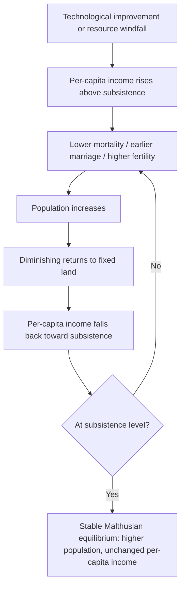

## Malthusian Theory and Its Critiques

### Overview

Malthusian theory, formulated by Thomas Robert Malthus in *An Essay on the Principle of Population* (1798), posits a structural tendency for population growth to outpace subsistence resources, driving societies toward a low-level equilibrium of stagnant per-capita income. It remains foundational to development economics both as a historical model of pre-industrial stagnation and as a recurring reference point in debates about resource constraints, agricultural productivity, and long-run growth.

### Core Assumptions and Mechanics

#### The Two Postulates

Malthus based his theory on two premises he treated as fixed:

1. Food is necessary for human survival
2. The passion between the sexes is a constant, producing a persistent drive to reproduce

#### The Growth Mismatch

**Key Points**

- Population grows geometrically (exponentially): $1, 2, 4, 8, 16, ...$
- Food supply (subsistence) grows arithmetically (linearly), due to diminishing returns to a fixed factor — land
- Because exponential growth eventually exceeds any linear growth path, population is mathematically driven to outstrip food supply unless checked

$$P_t = P_0 (1+n)^t \quad \text{(population, geometric)}$$

$$F_t = F_0 + \gamma t \quad \text{(food supply, arithmetic)}$$

where $n$ is the population growth rate and $\gamma$ is a constant increment to food output per period. For any $n > 0$, $P_t$ eventually exceeds $F_t$ regardless of the initial gap, since exponential functions asymptotically dominate linear functions.

#### The Checks

Malthus argued that the gap between population growth and subsistence growth is closed by "checks" that keep population from exceeding what the land can support:

**Positive checks** (raise the death rate):

- Famine
- Disease and epidemics
- War
- General deprivation and malnutrition-linked mortality

**Preventive checks** (lower the birth rate):

- Delayed marriage
- Moral restraint (celibacy before marriage)
- Contraception (added emphasis in Malthus's later "neo-Malthusian" interpreters, though Malthus himself, writing as a clergyman, emphasized moral restraint over contraception)

#### The Malthusian Trap (Low-Level Equilibrium)

**Key Points**

- Any technological improvement or resource windfall that temporarily raises income above subsistence triggers population growth (via lower mortality, earlier marriage, higher fertility)
- Population growth continues until per-capita income is driven back down to the subsistence level, at which point population growth stabilizes
- The result is a self-correcting equilibrium in which technological gains are absorbed into a larger population rather than translating into sustained higher living standards — real wages and per-capita output remain near a subsistence floor over the long run
- This is formalized in modern growth theory as the "Malthusian trap" or "Malthusian equilibrium," a foundational reference point in unified growth theory (Galor & Weil)

### Formal Model (Modern Reconstruction)

A simplified Malthusian model treats output as a function of land ($T$, fixed) and labor ($L$, population), with diminishing returns to labor:

$$Y = A \cdot T^{1-\alpha} L^{\alpha}, \quad 0 < \alpha < 1$$

Per-capita output:

$$y = \frac{Y}{L} = A \cdot \left(\frac{T}{L}\right)^{1-\alpha}$$

Population growth is assumed to respond positively to per-capita income relative to subsistence $\bar{y}$:

$$\frac{\dot{L}}{L} = \beta (y - \bar{y})$$

**Key Points**

- If $y > \bar{y}$, population grows, raising $L$, which (holding $T$ fixed) lowers $y$ via diminishing returns until $y = \bar{y}$
- The steady state is stable: $y^* = \bar{y}$, regardless of $A$ — a one-time increase in productivity $A$ raises $y$ temporarily, but the resulting population growth erodes the gain, leaving per-capita income unchanged in the new steady state and land-per-worker permanently lower
- This produces the sharp Malthusian prediction: **technological progress raises population size, not living standards**, in the long run

### Diagram: The Malthusian Trap Dynamic

### Diagram: Malthusian Equilibrium (svg_diagram)

<svg xmlns="http://www.w3.org/2000/svg" viewBox="0 0 700 420">
\<style\>
.lbl{font-family:Arial,sans-serif;font-size:12px;fill:#222;}
.title{font-family:Arial,sans-serif;font-size:14px;font-weight:bold;fill:#111;}
.axis{stroke:#333;stroke-width:1.5;}
\</style\>
<text x="350" y="20" text-anchor="middle" class="title">Malthusian Equilibrium: Population and Subsistence Line (svg_diagram)</text>
<line x1="70" y1="370" x2="650" y2="370" class="axis" />
<line x1="70" y1="40" x2="70" y2="370" class="axis" />
<text x="360" y="400" text-anchor="middle" class="lbl">Population (L)</text>
<text x="30" y="205" text-anchor="middle" class="lbl" transform="rotate(-90 30 205)">Income per capita (y)</text>
<line x1="70" y1="260" x2="650" y2="260" stroke="#c0392b" stroke-width="2" stroke-dasharray="6,3" />
<text x="560" y="252" class="lbl" fill="#c0392b">Subsistence level (ȳ)</text>
<path d="M 90 60 C 200 100, 300 200, 400 260 C 500 300, 580 320, 630 330" stroke="#2980b9" stroke-width="2.5" fill="none" />
<text x="420" y="140" class="lbl" fill="#2980b9">Output per worker (diminishing returns to fixed land)</text>
<circle cx="400" cy="260" r="5" fill="#111" />
<text x="405" y="285" class="lbl">Equilibrium point</text>
<text x="405" y="300" class="lbl">(population settles where y = ȳ)</text>
<line x1="250" y1="150" x2="250" y2="370" stroke="#27ae60" stroke-width="1.5" stroke-dasharray="3,3" />
<text x="255" y="160" class="lbl" fill="#27ae60">Tech shock shifts curve up temporarily</text>
</svg>

### Critiques of Malthusian Theory

#### 1. Empirical Failure: The Great Escape

**Key Points**

- Global population grew roughly eightfold since 1800, yet average per-capita income and living standards rose far more dramatically over the same period in most regions — the opposite of the Malthusian prediction
- This divergence, especially post-1800 in Western Europe and later globally, is termed the "escape from the Malthusian trap" and is a central subject of unified growth theory (Galor, *Unified Growth Theory*, 2011)
- The empirical break coincides with the Industrial Revolution and, crucially, with the onset of the demographic transition (sustained fertility decline), which Malthus's static framework did not anticipate

#### 2. Boserupian Critique: Endogenous Technology

Ester Boserup (1965) directly challenged Malthus's assumption of fixed technology.

**Key Points**

- Population pressure itself induces agricultural intensification (shorter fallow cycles, irrigation, double-cropping, tool innovation) rather than simply outstripping a fixed food supply
- Reverses the causal arrow: population growth can be a *cause* of technological and institutional innovation, not merely a consequence bounded by it
- Historical evidence from land-use intensification in pre-industrial Asia and Africa is frequently cited in support [Inference: the empirical strength of Boserup's mechanism varies by context and is debated relative to market-integration and institutional explanations]

#### 3. Demographic Transition Theory

**Key Points**

- Malthus's model has no mechanism for fertility to fall *independently* of income constraints — it assumes fertility responds mechanically to available subsistence
- Empirically, virtually all currently high-income countries experienced a demographic transition: mortality decline followed by a lag, then fertility decline, driven by rising female education, falling child mortality (reducing the "insurance" motive for high fertility), urbanization, and rising opportunity cost of women's time
- This transition breaks the Malthusian linkage between income and fertility — fertility falls even as, or especially as, income rises, the opposite of the mechanical positive relationship Malthus assumed

#### 4. Endogenous Growth and Human Capital Critiques

**Key Points**

- Malthus modeled land as the binding fixed factor; modern growth theory emphasizes human capital and ideas as non-rival inputs that do not face the same diminishing-returns constraint
- Kremer (1993) and related endogenous technological-change models argue larger populations, far from causing stagnation, can *accelerate* long-run technological progress by increasing the number of potential innovators — the opposite mechanism to Malthus's prediction
- The quantity-quality tradeoff (Becker-Lewis) provides a microfounded reason fertility falls with income and education, rather than being sustained by any income gain as Malthus assumed

#### 5. Trade and Market Integration Critique

**Key Points**

- Malthus's model implicitly assumes a closed economy where food supply is locally, agriculturally fixed
- International trade allows food-importing regions to escape local land constraints entirely, decoupling local population size from local agricultural capacity — a channel absent from the original model
- Historical famines (e.g., 19th-century Ireland) are frequently reinterpreted in the development literature as failures of markets, trade policy, and entitlements (per Amartya Sen's entitlement approach) rather than as simple Malthusian food-availability shortfalls [Unverified: the relative weight of market failure versus absolute food scarcity in specific historical famines remains debated among economic historians]

#### 6. Sen's Entitlement Critique

Amartya Sen (*Poverty and Famines*, 1981) offered a structurally distinct critique relevant to the Malthusian food-availability framework.

**Key Points**

- Famines often occur without an aggregate decline in food availability — the 1943 Bengal famine is Sen's central case study, where food output did not fall sufficiently to explain mass starvation
- Famine results from a collapse in "entitlements" (the set of goods a person can command through production, exchange, or transfer), not necessarily from insufficient aggregate food supply
- This reframes the mechanism of positive checks: mortality crises are driven by distributional and institutional failures (wage collapse, unemployment, breakdown of exchange entitlements) rather than by an aggregate Malthusian food-population imbalance

### Neo-Malthusian Revival (20th Century)

**Key Points**

- Paul Ehrlich's *The Population Bomb* (1968) revived Malthusian-style pessimism, predicting mass famine from population growth outstripping resources by the 1970s–1980s
- These predictions did not materialize at the scale forecast, in substantial part due to the Green Revolution — a wave of agricultural technological change (high-yield crop varieties, synthetic fertilizer, irrigation expansion) that shifted the food-supply curve upward faster than population growth, illustrating the Boserupian/technology critique in practice
- The failure of mid-20th-century neo-Malthusian predictions is widely cited in development economics as empirical evidence against treating technology as exogenously fixed, as the original Malthusian model does

### Where Malthusian Logic Still Applies

**Key Points**

- Unified growth theory treats the Malthusian regime as an accurate description of *most of human history* (pre-1800), not as universally false — the critique is about the model's inapplicability *after* the fertility transition and sustained technological change, not about its historical fit
- In localized, land-constrained agrarian settings with weak market integration and limited technology adoption, Malthusian-style dynamics (population pressure on fixed land, diminishing returns) are still observed at a micro/regional level in some studies [Unverified: contested and highly context-dependent; results vary substantially with land tenure institutions and access to non-farm income]
- Some environmental-economics arguments about long-run planetary resource constraints (climate, freshwater, biodiversity) are sometimes framed as applying Malthusian logic to global commons rather than to food/land specifically, though this application remains a live theoretical dispute rather than a settled empirical claim

### Related Topics

- Unified growth theory (Galor & Weil) — formal integration of Malthusian, Post-Malthusian, and Modern Growth regimes
- Demographic transition theory (stages and mechanisms)
- Boserup's theory of agricultural intensification, full model
- Amartya Sen's entitlement approach to famine analysis
- Green Revolution: technology adoption and agricultural productivity growth
- Quantity-quality tradeoff (Becker-Lewis model)
- Kremer (1993) population-technology model
- Historical demography and pre-industrial living standards measurement
- Neo-Malthusian environmental economics and planetary boundary debates