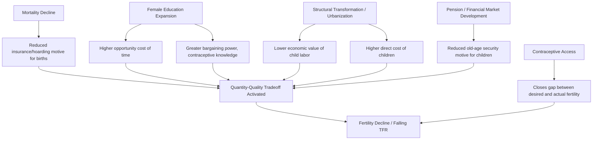

## Fertility Decline Determinants

### Overview

Fertility decline — the sustained fall in total fertility rate (TFR) that occurs during the second stage of the demographic transition — is one of the most robust empirical regularities in development economics. Understanding its determinants requires integrating microeconomic household models (why individual families choose fewer children) with macro-level structural changes (mortality decline, education expansion, urbanization) that shift the incentives underlying those household decisions.

### Measuring Fertility

**Key Points**

- **Total Fertility Rate (TFR):** the average number of children a woman would bear if she experienced current age-specific fertility rates throughout her reproductive life (ages 15–49)
- **Replacement-level fertility:** approximately TFR = 2.1 in low-mortality settings (2 to replace parents, +0.1 to offset child mortality and sex-ratio effects); higher in high-mortality settings
- **Crude Birth Rate (CBR):** births per 1,000 population per year — sensitive to age structure, less precise than TFR for cross-country comparison
- **Age-specific fertility rate (ASFR):** births per 1,000 women in a specific age band, used to construct TFR:

$$TFR = 5 \times \sum_{i} ASFR_i$$

(the factor of 5 applies when using standard 5-year age bands, converting the sum of per-year rates within each band)

### Microeconomic Framework: The Quantity-Quality Model

The dominant theoretical framework is the Becker-Lewis (1973) quantity-quality (Q-Q) model, extended by Becker & Tomes and others.

#### Household Optimization Problem

Parents maximize utility over number of children ($n$), quality per child ($q$), and other consumption ($c$):

$$\max_{n,q,c} U(n, q, c)$$

subject to the budget constraint:

$$Y = \pi_n n + \pi_q q n + p_c c$$

where $\pi_n$ is the fixed ("goods") cost per child, $\pi_q$ is the cost of quality per child, and the quality-quantity interaction term $\pi_q q \, n$ is the key structural feature.

**Key Points**

- Because the quality cost is multiplied by quantity, quality and quantity have a **cross-price effect**: an exogenous increase in the price or desired level of child quality (e.g., school fees rising, compulsory schooling laws, higher returns to education) raises the effective shadow price of an additional child, inducing a substitution toward fewer, higher-quality children
- This generates a testable prediction different from a simple income effect: rising income *combined with* rising returns to child quality can *reduce* fertility, even though a pure income effect alone (holding quality price constant) would be expected to raise the number of children under normal-good assumptions
- The model is central to explaining why, historically, richer households and richer countries eventually have *fewer* children, not more — a pattern inconsistent with treating children as an ordinary normal good

#### Opportunity Cost of Time (Value of Time Model)

**Key Points**

- Child-rearing is time-intensive; the shadow price of children rises with the value of parental (particularly maternal) time
- As female wages and labor market opportunities rise, the opportunity cost of time spent on childbearing and child-rearing rises, raising the effective price of children and inducing substitution toward fewer children
- This is a central mechanism linking female education and labor force participation to fertility decline, distinct from but complementary to the Q-Q tradeoff

$$\pi_n \approx w_f \cdot t_n$$

where $w_f$ is the mother's wage and $t_n$ is time required per child — a rise in $w_f$ mechanically raises the cost of children in this formulation.

### Structural and Institutional Determinants

#### 1. Mortality Decline (Child Survival)

**Key Points**

- Falling infant and child mortality is widely treated in the literature as a leading driver of fertility decline, typically operating with a lag
- Two distinct mechanisms are proposed:
  - **Insurance/hoarding motive:** parents in high-mortality environments have "extra" births to insure against child death, targeting a desired number of *surviving* children rather than births; as survival probability rises, fewer births are needed to reach the same target
  - **Replacement effect:** a child's death directly induces a subsequent birth to "replace" the loss
- The lag between mortality decline and fertility decline (visible in Stage 2 of the demographic transition, where death rates fall before birth rates) is a defining feature of the transition and a source of the transitional population growth surge

#### 2. Female Education

**Key Points**

- Female schooling is one of the most consistently identified correlates of fertility decline across countries and time periods
- Channels include: raising the opportunity cost of time (per above), increasing bargaining power within the household, raising awareness and effective use of contraception, delaying age at marriage and first birth, and shifting preferences toward child quality
- Distinguishing correlation from causal effect is a major empirical challenge, since education, income, and fertility preferences are jointly determined by unobserved factors — much of the applied literature relies on natural experiments (e.g., compulsory schooling law changes, school construction programs) to identify a causal effect [Inference: the direction of the education-fertility relationship is well established; the precise causal magnitude varies substantially across identification strategies and contexts]

#### 3. Child Labor and the Economic Value of Children

**Key Points**

- In agrarian settings, children can provide labor value (farm work, household tasks) from a relatively young age, lowering the net cost of children (or even making children a net economic asset in extreme cases)
- Urbanization and the shift from agricultural to industrial/service economies reduce the economic value of child labor while formal schooling and child labor regulation raise its cost (via foregone labor plus direct schooling costs), altering the quantity-quality tradeoff in favor of fewer children
- This mechanism links structural transformation (the sectoral shift of an economy) directly to fertility transition timing

#### 4. Old-Age Security Motive

**Key Points**

- In the absence of formal pension systems, financial markets, or insurance, children (particularly sons in many traditional contexts) serve as an old-age security mechanism for parents
- Expansion of formal pension systems, financial inclusion, and capital markets is hypothesized to reduce the "demand for children" as an old-age insurance substitute, though empirical identification of this specific channel (isolated from correlated changes like income and urbanization) is difficult [Unverified: the magnitude of this specific channel, net of confounding factors, is contested in the empirical literature]

#### 5. Urbanization

**Key Points**

- Urban environments raise the direct cost of housing and child-rearing space, reduce the economic value of child labor, increase access to schooling and family planning services, and are associated with greater female labor force participation
- Urban TFR is empirically lower than rural TFR in virtually all developing countries during the transition, though the direction of causality (urbanization causing lower fertility vs. selection of lower-fertility households into urban migration) requires care in interpretation [Inference: likely reflects both direct causal effects and selection, with relative weights varying by context]

#### 6. Contraceptive Access and Family Planning Programs

**Key Points**

- Access to modern contraception is a necessary (though not always sufficient) condition for translating reduced fertility *desires* into reduced fertility *outcomes* — the gap between desired and actual fertility ("unmet need for family planning") is a standard survey-based indicator (from Demographic and Health Surveys, DHS) used to assess this
- The debate over whether family planning programs *cause* fertility decline (supply-side view) or merely *accommodate* an already-declining demand driven by the structural factors above (demand-side view) is a long-running methodological and policy dispute
- Randomized and quasi-experimental evaluations (e.g., Matlab, Bangladesh family planning experiment) provide some of the more credible evidence that improved contraceptive access can independently accelerate fertility decline beyond what demand-side factors alone would predict [Inference: findings from specific program evaluations are context-dependent and should not be over-generalized to all settings without qualification]

#### 7. Social Norms, Religion, and Cultural Preferences

**Key Points**

- Preferences for son (or, less commonly, daughter) presence, extended family/lineage norms, and religious teachings on contraception and family size are widely documented as influencing fertility, though they are difficult to model with the same formal precision as the price-based mechanisms above
- Social interaction and diffusion models suggest fertility norms can spread through social networks somewhat independently of underlying economic conditions, contributing to the phenomenon of fertility decline occurring at a similar pace across communities with differing income levels within the same country/region [Unverified: the relative explanatory power of diffusion/network models versus economic fundamentals remains an active area of demographic research]

### Diagram: Determinants of Fertility Decline

### Diagram: Quantity-Quality Tradeoff Indifference Curve (svg_diagram)

<svg xmlns="http://www.w3.org/2000/svg" viewBox="0 0 680 420">
\<style\>
.lbl{font-family:Arial,sans-serif;font-size:12px;fill:#222;}
.title{font-family:Arial,sans-serif;font-size:14px;font-weight:bold;fill:#111;}
.axis{stroke:#333;stroke-width:1.5;}
\</style\>
<text x="340" y="20" text-anchor="middle" class="title">Quantity-Quality Tradeoff: Budget Line Shift (svg_diagram)</text>
<line x1="70" y1="370" x2="620" y2="370" class="axis" />
<line x1="70" y1="40" x2="70" y2="370" class="axis" />
<text x="345" y="400" text-anchor="middle" class="lbl">Number of children (n)</text>
<text x="30" y="205" text-anchor="middle" class="lbl" transform="rotate(-90 30 205)">Quality per child (q)</text>
<path d="M 100 350 L 560 90" stroke="#2980b9" stroke-width="2" />
<text x="500" y="80" class="lbl" fill="#2980b9">Original budget line</text>
<path d="M 100 350 Q 300 200, 460 100" stroke="#333" stroke-width="1" fill="none" stroke-dasharray="2,2" />
<text x="150" y="260" class="lbl">Original indifference curve</text>
<path d="M 100 350 L 350 60" stroke="#c0392b" stroke-width="2" />
<text x="360" y="55" class="lbl" fill="#c0392b">New budget line (rising π_q — price of quality)</text>
<path d="M 100 350 Q 200 150, 340 90" stroke="#27ae60" stroke-width="1" fill="none" stroke-dasharray="2,2" />
<text x="150" y="140" class="lbl" fill="#27ae60">New indifference curve</text>
<circle cx="330" cy="180" r="5" fill="#111" />
<text x="340" y="175" class="lbl">Original choice: more n, less q</text>
<circle cx="230" cy="110" r="5" fill="#111" />
<text x="240" y="105" class="lbl">New choice: fewer n, more q</text>
</svg>

### Empirical Regularities

**Key Points**

- The fertility transition in Western Europe (18th–20th century) took roughly 100–150 years; more recent transitions in East Asia and parts of Latin America compressed the same decline into 30–40 years, generally attributed to faster diffusion of education, health technology, and contraceptive access relative to the historical pace
- The Princeton European Fertility Project (Coale et al.) found fertility decline across European provinces occurred at broadly similar timing regardless of substantial variation in economic development levels at the time of decline, a finding often cited as evidence for the importance of cultural/linguistic diffusion alongside economic determinants [Unverified: this finding and its interpretation remain debated relative to more recent re-analyses emphasizing economic factors]
- Sub-Saharan Africa exhibits the slowest and most heterogeneous fertility transition among major world regions as of recent Demographic and Health Survey rounds, with substantial cross-country variation attributed to differing pace of female education expansion, contraceptive access, and child mortality decline [Inference: reflects general consensus in recent demographic literature rather than a single definitive study]

### Policy Levers Summary

**Key Points**

- **Direct/supply-side:** subsidized or free contraception, family planning service delivery, information campaigns
- **Indirect/demand-side:** female education expansion (including secondary schooling), child health investment (reducing child mortality), compulsory schooling and child labor laws (raising the effective price of child quantity), pension system development
- Consensus in modern development economics (post-Cairo 1994 ICPD) favors demand-side, rights-based approaches — treating fertility decline as an outcome of broader human development investment — over historical top-down demographic-target approaches

### Related Topics

- Demographic transition theory (full stage model)
- Malthusian theory and its critiques
- Demographic dividend and age-structure effects on growth
- Becker-Tomes intergenerational human capital transmission model
- Sen's capability approach and gender/fertility linkages
- Randomized evaluations in family planning (Matlab, Bangladesh; Population and Family Planning studies)
- Female labor force participation and structural transformation
- Child mortality determinants and health system development
- Demographic and Health Surveys (DHS) methodology and data use