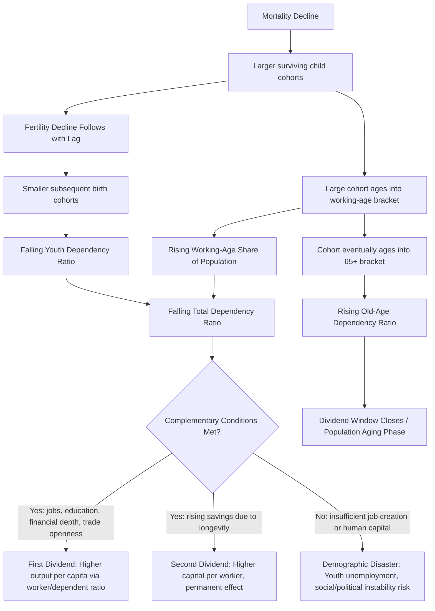

## Demographic Dividend Concept

### Overview

The demographic dividend refers to the potential acceleration of economic growth that can result from a favorable shift in a population's age structure during the demographic transition. As fertility declines following an earlier decline in mortality, the share of the working-age population temporarily rises relative to dependents (children and the elderly), creating a window in which, under the right policy conditions, per-capita output growth can accelerate. The concept, formalized primarily by Bloom and Williamson (1998) and Bloom, Canning, and Sevilla (2003), reframes the population-growth debate around *age structure* rather than population size or growth rate alone.

### Conceptual Foundation

#### From Population Growth Rate to Age Structure

**Key Points**

- Earlier development economics debates (Malthusian vs. Boserupian/optimist) focused on whether population *size* or *growth rate* helps or harms development
- The demographic dividend literature shifts the analytical focus to the *distribution of population across age groups* at a given point in time, arguing that the same total population size or growth rate can have very different growth implications depending on the underlying age structure
- This reframing followed empirical work explaining the East Asian "economic miracle" (1965–1990), where standard growth accounting could not fully explain observed growth rates using capital and total labor input alone — age-structure shifts were identified as a significant additional contributing factor [Inference: "significant additional contributing factor" reflects the standard characterization in the literature rather than a single precise, universally agreed magnitude]

#### The Dependency Ratio Mechanism

The total dependency ratio is defined as:

$$\text{Total Dependency Ratio} = \frac{\text{Population}_{0-14} + \text{Population}_{65+}}{\text{Population}_{15-64}} \times 100$$

This decomposes into:

$$\text{Youth Dependency Ratio} = \frac{\text{Population}_{0-14}}{\text{Population}_{15-64}} \times 100$$

$$\text{Old-Age Dependency Ratio} = \frac{\text{Population}_{65+}}{\text{Population}_{15-64}} \times 100$$

**Key Points**

- During Stage 2 of the demographic transition, mortality (especially child mortality) falls first, temporarily increasing the number of surviving children and *raising* youth dependency
- As fertility subsequently falls (Stage 3), smaller birth cohorts move through childhood, and the youth dependency ratio declines while the large earlier cohorts move into working age — total dependency falls, marking the onset of the dividend window
- The dividend window closes as those large cohorts eventually age into the 65+ bracket, raising old-age dependency and reversing the favorable ratio — this is the "aging" phase following the dividend

### The Two Dividends Framework (Mason & Lee)

Mason and Lee (2006) extended the original single-dividend concept into a two-dividend framework.

#### First Dividend

**Key Points**

- Arises mechanically from the *ratio* effect: more workers per dependent directly raises output per capita, holding output per worker constant
- This is inherently **transitional** — it is a level effect on the growth *rate* during the window, not a permanent structural change, and reverses as the population ages
- Its magnitude depends on the size and duration of the "bulge" cohort moving through working age

#### Second Dividend

**Key Points**

- Arises from behavioral responses to anticipated longer lifespans and smaller family sizes: individuals facing longer expected retirement periods relative to working years have an incentive to increase savings for old age
- This higher savings rate can translate into a larger capital stock per worker, a **permanent** (not merely transitional) increase in the level of output per capita if realized and channeled into productive domestic investment
- The second dividend is theoretically distinct from the first because it can persist even after the age-structure "window" itself closes, depending on how effectively the resulting savings pool is intermediated into investment (financial sector development is a key conditioning factor)

### Conditions for Dividend Realization ("Dividend" vs. "Disaster")

The demographic dividend is explicitly **not automatic** — the literature emphasizes it is a *potential* or *window of opportunity*, contingent on complementary policies and conditions.

**Key Points**

- **Labor market absorption:** the economy must generate sufficient jobs for the enlarged working-age cohort; without adequate employment growth, a large working-age population produces high unemployment/underemployment rather than a dividend ("demographic disaster" or "youth bulge" risk scenario)
- **Human capital investment:** the working-age cohort's productivity depends on prior investment in education and health during their childhood — a large but poorly educated working-age population yields a much smaller dividend
- **Female labor force participation:** realizing the full potential labor supply gain requires enabling conditions (childcare, anti-discrimination policy, social norms) for women's economic participation
- **Financial sector development:** channels increased savings (the second dividend mechanism) into productive investment rather than unproductive holding or capital flight
- **Openness to trade:** allows the economy to specialize according to its (temporarily) labor-abundant comparative advantage, as in the export-oriented industrialization strategies pursued by East Asian economies during their dividend period
- **Governance and macroeconomic stability:** political instability, weak property rights, or macroeconomic mismanagement can prevent translation of favorable demographics into investment and growth

### Diagram: Demographic Dividend Mechanism

### Diagram: Dividend Window Over the Demographic Transition (svg_diagram)

<svg xmlns="http://www.w3.org/2000/svg" viewBox="0 0 720 420">
\<style\>
.lbl{font-family:Arial,sans-serif;font-size:12px;fill:#222;}
.title{font-family:Arial,sans-serif;font-size:14px;font-weight:bold;fill:#111;}
.axis{stroke:#333;stroke-width:1.5;}
\</style\>
<text x="360" y="20" text-anchor="middle" class="title">Total Dependency Ratio Over Time: The Dividend Window (svg_diagram)</text>
<line x1="70" y1="360" x2="680" y2="360" class="axis" />
<line x1="70" y1="40" x2="70" y2="360" class="axis" />
<text x="375" y="390" text-anchor="middle" class="lbl">Time</text>
<text x="30" y="200" text-anchor="middle" class="lbl" transform="rotate(-90 30 200)">Total Dependency Ratio</text>

<path d="M 90 100 C 180 90, 250 130, 320 200 C 400 280, 480 300, 550 260 C 610 230, 650 180, 670 130" stroke="`#2980b9`" stroke-width="2.5" fill="none" />

<rect x="320" y="40" width="230" height="320" fill="#27ae60" opacity="0.12" />
<text x="435" y="55" text-anchor="middle" class="lbl" fill="#1e7e34">Dividend Window (low dependency ratio)</text>
<line x1="320" y1="40" x2="320" y2="360" stroke="#27ae60" stroke-width="1.5" stroke-dasharray="4,3" />
<line x1="550" y1="40" x2="550" y2="360" stroke="#27ae60" stroke-width="1.5" stroke-dasharray="4,3" />

<text x="130" y="90" class="lbl">Stage 2:</text>

<text x="130" y="105" class="lbl">Youth dependency rises</text>

<text x="330" y="330" class="lbl">Stage 3:</text>

<text x="330" y="345" class="lbl">Fertility falls, working-age share peaks</text>

<text x="590" y="150" class="lbl">Stage 4/5:</text>

<text x="590" y="165" class="lbl">Population aging,</text>

<text x="590" y="180" class="lbl">old-age dependency rises</text>

</svg>

### Empirical Evidence

**Key Points**

- Bloom and Williamson (1998) estimated that favorable demographic change accounted for a substantial share — commonly cited as roughly one-quarter to one-third — of the per-capita GDP growth "miracle" in East Asian economies (South Korea, Taiwan, Singapore, Hong Kong) between 1965 and 1990 [Inference: figures reflect the widely cited original estimate range; subsequent replications and methodologies produce varying point estimates]
- Cross-country panel regressions generally find a statistically significant positive relationship between working-age share (or its growth) and per-capita GDP growth, though the magnitude and robustness vary by specification, sample period, and control variables used
- Latin America and South Asia are frequently cited as regions that experienced similar age-structure shifts but realized a smaller dividend, generally attributed to weaker labor market absorption, lower human capital investment, and less trade openness during their respective transition windows relative to East Asia [Unverified: causal attribution across regions is contested and subject to alternative explanations involving institutional quality and macroeconomic policy independent of demographics]
- Sub-Saharan Africa is the region most frequently analyzed as having a still-open or upcoming dividend opportunity, given its later-stage fertility transition, with substantial academic and policy literature (e.g., African Development Bank, UNFPA reports) focused on the policy conditions needed to realize it

### Policy Applications

**Key Points**

- The concept has become a central justification in international development policy (World Bank, UNFPA, African Union) for bundling family planning, girls' education, health system strengthening, and labor market/industrial policy as a coordinated package rather than pursuing fertility reduction or job creation in isolation
- "Demographic dividend readiness" assessments are used by some multilateral organizations to evaluate whether a country's current policy environment (education quality, health systems, labor market flexibility, governance) is positioned to convert an anticipated age-structure shift into growth
- Critics note the framework can be used to justify a wide range of policy prescriptions somewhat loosely connected to the core demographic mechanism, and caution against treating the dividend as a guaranteed growth outcome rather than a conditional opportunity [Inference: this caveat reflects a common methodological criticism raised within the development economics literature rather than a rejection of the core mechanism]

### Related Topics

- Demographic transition theory (full stage model and timing)
- Fertility decline determinants (quantity-quality tradeoff, mortality decline, education)
- East Asian Miracle: growth accounting and industrial policy
- Population aging and old-age dependency in high-income and middle-income economies
- Bloom-Canning-Sevilla (2003) formal growth-accounting methodology
- Life-cycle savings theory and the second demographic dividend
- Female labor force participation and structural transformation
- Sub-Saharan Africa's fertility transition and dividend readiness assessments
- Youth bulge theory and political instability risk (contrasting "disaster" scenario)