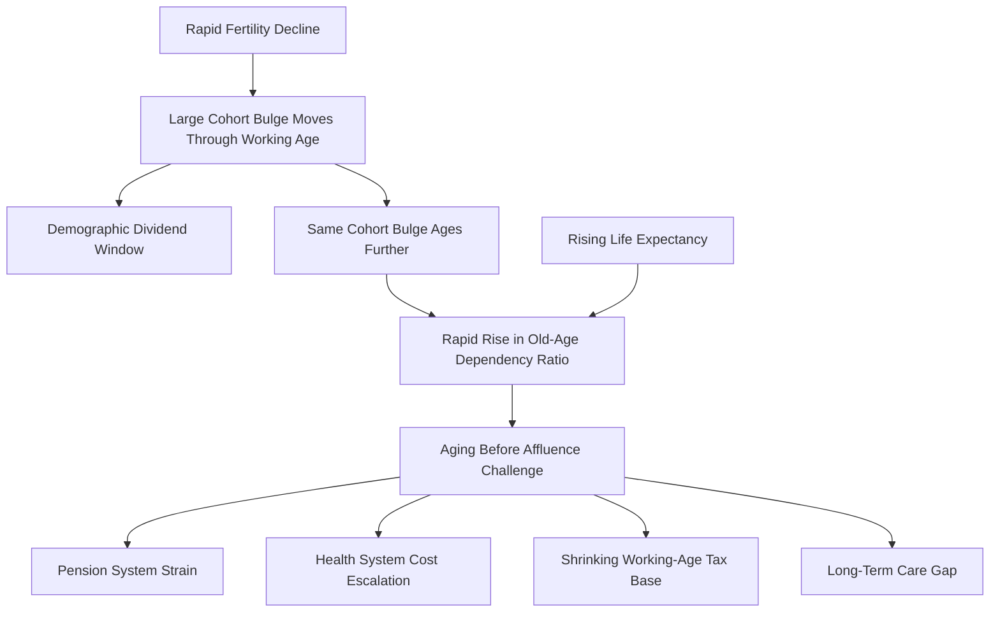

## Population Aging in Developing Economies

### Overview

Population aging — the rising share of elderly individuals (typically defined as 65+) relative to the total population — was historically associated with high-income countries that completed their demographic transitions decades ago. A distinguishing feature of the current era is that many developing economies are now aging at income levels far below those of high-income countries when they aged, and are doing so far more rapidly. This "aging before affluence" pattern raises distinct development-economics challenges around fiscal capacity, health systems, labor markets, and social protection.

### Measuring Population Aging

**Key Points**

- **Old-age dependency ratio:** population aged 65+ divided by population aged 15–64, times 100
- **Median age:** the age at which half the population is older and half younger — a summary indicator of overall population age structure
- **Aging speed:** commonly measured as the number of years required for the share of population aged 65+ to rise from 7% to 14% (the conventional threshold from "aging society" to "aged society")

$$\text{Old-Age Dependency Ratio} = \frac{\text{Population}_{65+}}{\text{Population}_{15-64}} \times 100$$

### The "Aging Before Affluence" Pattern

**Key Points**

- France took roughly 115 years to move from an "aging" (7% aged 65+) to an "aged" (14%) society; the United States took about 70 years
- China, by contrast, is undergoing this same transition in roughly 25 years [Unverified: precise figures vary by source and by exact threshold-crossing dates used, but the broad relative-speed comparison is well established in the demographic literature]; several other middle-income economies (Thailand, Vietnam, Brazil) are experiencing similarly compressed aging timelines
- The key development-economics concern is that historical high-income "aged" societies reached advanced elderly-population shares only *after* achieving high per-capita income, allowing them to finance pension systems, healthcare infrastructure, and long-term care from an already-wealthy fiscal and institutional base
- Many current middle-income countries are approaching "aged society" status at GDP per capita levels substantially below where today's high-income countries stood at comparable stages of aging — described in the literature as "growing old before growing rich"

### Causal Mechanism: From Dividend to Aging

Population aging in developing economies is the natural continuation of the same demographic transition dynamics that produce the demographic dividend.

**Key Points**

- The large working-age cohorts that generate the demographic dividend (elevated worker-to-dependent ratio) inevitably age into the 65+ bracket as the transition completes
- Because the fertility decline driving the earlier dividend was typically rapid (compressed transitions, as in East Asia), the subsequent aging is correspondingly rapid and compressed — the same speed that produced a favorable dividend window later produces a fast reversal into high old-age dependency
- Rising life expectancy compounds the effect: as child and adult mortality fall throughout the transition, further gains increasingly manifest as extended survival at older ages rather than reduced mortality earlier in life, extending the population share in the 65+ bracket

### Diagram: From Dividend to Aging Transition

### Core Development Challenges

#### 1. Pension System Design and Fiscal Sustainability

**Key Points**

- Many developing economies have limited formal pension coverage, with large informal-sector workforces excluded from contributory pension schemes — a structural gap absent in most high-income countries at comparable aging stages
- Pay-as-you-go (PAYG) pension systems, common in many middle-income countries, depend on a sufficiently large contributing working-age base relative to beneficiaries; rapid aging compresses this ratio faster than in historical high-income transitions, straining fiscal sustainability
- Policy responses under discussion in the literature include: raising retirement ages, transitioning toward funded/defined-contribution systems, expanding non-contributory ("social") pensions for informal-sector workers, and parametric reforms (contribution rates, benefit formulas) [Inference: specific reform prescriptions are context-dependent and contested; no single approach is universally recommended]

#### 2. Health System and Long-Term Care Capacity

**Key Points**

- Aging populations shift disease burden toward non-communicable and chronic conditions (cardiovascular disease, diabetes, dementia) that require sustained, higher-cost care relative to the infectious-disease burden many developing-country health systems were originally built to address
- Long-term care infrastructure (formal elder care facilities, home care services) is typically underdeveloped in middle- and low-income countries relative to demand, with informal family caregiving remaining the dominant model — itself under strain from urbanization and smaller family sizes reducing the number of adult children available for caregiving
- Health financing systems built primarily around maternal/child health and infectious disease control require structural adaptation to address a shifting burden toward chronic, higher-cost, longer-duration care [Inference: characterization reflects general public-health-financing literature on epidemiological transition]

#### 3. Shrinking Working-Age Population and Labor Supply

**Key Points**

- As the dividend window closes, working-age population growth slows or turns negative in the most advanced aging cases (e.g., China's working-age population has been declining since approximately 2012, per Chinese census data), reducing the pure labor-supply contribution to growth
- This creates pressure to raise labor force participation among underutilized groups (women, older workers via delayed retirement) and to shift growth strategy from labor-intensive to capital- and productivity-intensive models
- Some economies (China, Thailand) are explicitly discussed in development policy circles as needing to "get rich before getting old" via accelerated productivity growth, or risk a "middle-income trap" compounded by adverse demographics [Unverified: the causal link between aging and middle-income trap risk is one hypothesis among several in the middle-income trap literature, not a settled consensus]

#### 4. Savings, Capital Markets, and the Second Dividend Realized or Foregone

**Key Points**

- The "second demographic dividend" (Mason & Lee) framework predicts that anticipated longevity should induce higher individual savings for retirement, potentially offsetting some of the negative growth effects of aging if that savings pool is channeled into productive domestic investment via well-functioning financial markets
- Underdeveloped financial sectors, capital account restrictions, or weak institutional trust in developing economies can prevent this savings response from translating into productive investment, meaning the potential offsetting "second dividend" is not automatically realized
- Some middle-income economies (notably China) have exhibited unusually high household savings rates alongside rapid aging, generating extensive research and policy debate over precautionary savings motives, the adequacy of the social safety net, and current account/investment implications [Unverified: the precise causal weight of aging-driven precautionary savings versus other factors — such as underdeveloped consumer credit markets or the one-child policy's effect on old-age security — remains actively debated in the literature]

#### 5. Intergenerational Transfers and Family Structures

**Key Points**

- In many developing economies, informal intergenerational family transfers (adult children supporting elderly parents) substitute for formal pension and long-term care systems
- Urbanization, rural-to-urban migration of working-age adults, and declining fertility (fewer adult children per elderly parent) are jointly eroding the traditional family-based old-age support model, creating a gap not yet filled by formal institutions in many contexts — sometimes termed the "4-2-1 problem" in the Chinese context (four grandparents and two parents potentially dependent on one adult child, resulting from sustained sub-replacement fertility)

### Diagram: Aging Speed Comparison (svg_diagram)

<svg xmlns="http://www.w3.org/2000/svg" viewBox="0 0 700 400">
\<style\>
.lbl{font-family:Arial,sans-serif;font-size:12px;fill:#222;}
.title{font-family:Arial,sans-serif;font-size:14px;font-weight:bold;fill:#111;}
.axis{stroke:#333;stroke-width:1.5;}
\</style\>
<text x="350" y="20" text-anchor="middle" class="title">Years to Transition from 7% to 14% Population Aged 65+ (svg_diagram)</text>
<line x1="180" y1="60" x2="180" y2="340" class="axis" />
<line x1="180" y1="340" x2="640" y2="340" class="axis" />
<text x="410" y="370" text-anchor="middle" class="lbl">Years</text>

<text x="170" y="90" text-anchor="end" class="lbl">France</text>

<rect x="180" y="75" width="400" height="25" fill="`#2980b9`" />

<text x="590" y="93" class="lbl">~115 yrs</text>

<text x="170" y="135" text-anchor="end" class="lbl">United States</text>

<rect x="180" y="120" width="245" height="25" fill="`#2980b9`" />

<text x="435" y="138" class="lbl">~70 yrs</text>

<text x="170" y="180" text-anchor="end" class="lbl">United Kingdom</text>

<rect x="180" y="165" width="330" height="25" fill="`#2980b9`" />

<text x="520" y="183" class="lbl">~95 yrs</text>

<text x="170" y="225" text-anchor="end" class="lbl">Thailand</text>

<rect x="180" y="210" width="80" height="25" fill="`#c0392b`" />

<text x="270" y="228" class="lbl">~22 yrs [approx.]</text>

<text x="170" y="270" text-anchor="end" class="lbl">China</text>

<rect x="180" y="255" width="87" height="25" fill="`#c0392b`" />

<text x="277" y="273" class="lbl">~25 yrs [approx.]</text>

<text x="170" y="315" text-anchor="end" class="lbl">South Korea</text>

<rect x="180" y="300" width="60" height="25" fill="`#c0392b`" />

<text x="250" y="318" class="lbl">~17-18 yrs [approx.]</text>

<text x="180" y="355" class="lbl" fill="`#2980b9`">■ Historical high-income economies</text>

<text x="420" y="355" class="lbl" fill="`#c0392b`">■ Recent middle-income economies</text>

</svg>

### Regional Patterns

**Key Points**

- **East Asia (China, South Korea, Thailand, Vietnam):** most advanced developing-economy aging cohort, generally combining rapid historical fertility decline (in some cases policy-driven, e.g., China's One-Child Policy) with rising life expectancy; frequently cited as the leading case of "aging before affluence"
- **Latin America (Brazil, Chile):** intermediate aging pace, generally later fertility transition onset than East Asia but proceeding steadily
- **South Asia (India, Bangladesh):** more heterogeneous; India's aging is gradual at the national level due to regional fertility variation (southern Indian states are demographically much further advanced in aging than northern states), a pattern of significant sub-national divergence
- **Sub-Saharan Africa:** youngest regional age structure globally and the least advanced in the aging transition, with the demographic dividend window still largely ahead rather than closing — the aging challenge for this region is a longer-term (multi-decade) rather than current policy concern [Inference: regional characterization reflects standard UN Population Division age-structure data patterns]

### Policy Responses Under Discussion

**Key Points**

- **Pension reform:** parametric adjustments (retirement age, contribution rates), expansion of non-contributory social pensions to cover informal-sector and rural elderly populations
- **Health system reorientation:** integrating chronic disease management and geriatric care into primary health systems originally built around infectious disease and maternal/child health priorities
- **Labor market policy:** raising female labor force participation, phased/flexible retirement options, productivity-enhancing investment (automation, skills upgrading) to offset shrinking labor supply
- **Long-term care system development:** building formal elder-care infrastructure and workforce (a nascent sector in most developing economies) to supplement or substitute for eroding informal family-based care
- **Fertility-supportive policy (in some contexts):** several rapidly aging middle-income countries (China, South Korea) have shifted from historical fertility-reduction policy stances to pro-natalist measures (childcare subsidies, parental leave expansion) aimed at slowing further fertility decline, with limited demonstrated effectiveness to date [Unverified: pro-natalist policy effectiveness is a live and largely unresolved empirical question across the countries that have attempted it]

### Related Topics

- Demographic dividend concept (the preceding phase of the same transition)
- Fertility decline determinants and the demographic transition
- Pension system design: PAYG versus funded models
- Middle-income trap theory and its demographic dimensions
- Epidemiological transition and non-communicable disease burden
- China's One-Child Policy: design, enforcement, and demographic legacy
- Long-term care economics and elder-care labor markets
- Intergenerational transfer models and family-based old-age support systems
- Sub-national demographic divergence (India's regional fertility variation)