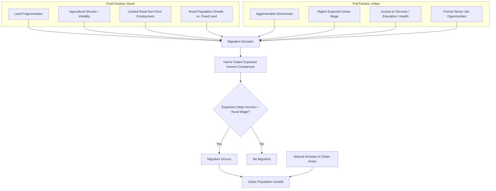

## Urbanization Patterns and Drivers

### Overview

Urbanization — the rising share of a population living in urban areas — is one of the most consistent structural correlates of economic development, historically tracking closely with rising per-capita income and structural transformation out of agriculture. Development economics analyzes both the *patterns* (pace, form, and regional variation of urbanization) and the *drivers* (the economic mechanisms pushing populations from rural to urban areas and pulling them into cities).

### Measuring Urbanization

**Key Points**

- **Urbanization rate/level:** share of total population classified as urban, using country-specific definitions (typically based on locality population thresholds, administrative status, or population density) — cross-country comparability is limited by inconsistent national definitions
- **Urban growth rate:** annual percentage change in the urban population, driven by natural increase (births minus deaths within urban areas), rural-urban migration, and reclassification of areas from rural to urban status
- **Urban primacy:** the degree to which a country's urban population is concentrated in a single dominant city (commonly measured via the primacy index, the ratio of the largest city's population to the sum of the next $n$ largest cities)

$$\text{Primacy Index} = \frac{P_1}{P_2 + P_3 + P_4}$$

where $P_1$ is the population of the largest city and $P_2, P_3, P_4$ are the next three largest.

### Historical and Global Patterns

**Key Points**

- Global urban population share crossed 50% around 2007, marking the first point in human history that more people lived in urban than rural areas
- Urbanization in currently high-income countries occurred alongside industrialization over roughly 100–150 years (late 18th to mid-20th century in Western Europe); urbanization in many developing economies is proceeding at a faster pace and, in a number of cases, at lower per-capita income levels than the historical high-income pattern — echoing the "premature" pattern seen in premature deindustrialization debates
- Sub-Saharan Africa and parts of South Asia are projected to account for the large majority of global urban population growth in coming decades (per UN-Habitat and UN Population Division projections), while urbanization in Latin America and East Asia is comparatively more advanced already
- Latin America is a notable outlier: it urbanized to a high degree (comparable to high-income countries) at middle-income levels, generating extensive literature on "urbanization without industrialization" in the region [Inference: characterization reflects a recurring theme in Latin American development economics literature]

### Core Theoretical Drivers

#### 1. The Harris-Todaro Model (Expected Income Migration)

The Harris-Todaro (1970) model is the foundational formal framework for rural-urban migration in development economics, explaining migration even in the presence of urban unemployment.

**Key Points**

- Migrants are modeled as responding to the *expected* urban wage, not the actual urban wage — expected wage is the formal-sector urban wage weighted by the probability of obtaining formal urban employment
- This resolves the apparent paradox of continued rural-to-urban migration despite high, visible urban unemployment: migration continues as long as expected urban income exceeds rural income, even if actual urban employment is uncertain

$$W_u^e = W_u \times \left(\frac{L_f}{L_u}\right)$$

where $W_u^e$ is the expected urban wage, $W_u$ is the fixed formal-sector urban wage (often held above market-clearing due to minimum wage laws or union bargaining), $L_f$ is formal urban employment, and $L_u$ is the total urban labor force (formal plus informal/unemployed job seekers).

**Key Points**

- Migration equilibrium condition: migration continues until expected urban income equals the rural wage $W_r$:

$$W_u^e = W_r$$

- A key policy implication (the "Todaro paradox"): policies that create urban formal-sector jobs without addressing the underlying wage gap can *increase* urban unemployment, because the resulting rise in expected income induces migration in excess of the new jobs created — job creation alone, without wage-gap correction, can worsen visible urban unemployment
- The model formally explains the persistence of a large urban informal sector as an equilibrium outcome (a "waiting room" for formal employment) rather than a market failure to be eliminated

#### 2. Structural Transformation and Sectoral Reallocation

**Key Points**

- As agricultural productivity rises (releasing labor from the sector needed to produce a given food supply) and non-agricultural sectors expand, labor structurally reallocates from rural agriculture to urban industry and services — a core mechanism in structural transformation models (Lewis, 1954)
- The Lewis dual-economy model treats rural areas as having a "surplus labor" pool with near-zero or low marginal product, which can be reallocated to the urban/industrial sector at a roughly constant institutional wage without reducing agricultural output — providing a low-cost labor supply that fuels early industrialization and urban growth
- Urbanization in this framework is a *consequence* of structural transformation rather than an independent driver — though in practice the two processes interact and reinforce each other

#### 3. Agglomeration Economies (Urban Pull Factors)

**Key Points**

- Cities generate productivity advantages through agglomeration economies: knowledge spillovers, labor market pooling (matching efficiency between workers and firms), and input-output linkages (access to specialized suppliers and larger markets)
- These effects generate increasing returns to urban scale, providing an economic "pull" factor independent of any specific rural push — firms locate in cities to access agglomeration benefits, and workers follow to access higher urban productivity and wages
- Agglomeration theory is central to New Economic Geography (Krugman, 1991), which formalizes how transport costs, scale economies, and factor mobility jointly determine the degree of spatial concentration versus dispersion of economic activity

#### 4. Rural Push Factors

**Key Points**

- Land fragmentation, limited rural non-farm employment opportunities, and vulnerability to agricultural shocks (drought, price volatility) push labor out of rural areas independent of any specific urban pull
- Rural population growth exceeding agricultural land or employment capacity generates surplus labor with an incentive to migrate, particularly where land tenure systems restrict subdivision or non-farm rural livelihoods are limited
- Conflict, environmental degradation, and climate-related displacement are increasingly discussed in the literature as rural push factors, particularly in fragile and climate-vulnerable regions [Inference: characterization reflects a growing but still-developing area of migration and climate economics literature]

#### 5. Natural Increase Within Urban Areas

**Key Points**

- A substantial share of urban population growth in many developing countries results from natural increase (births exceeding deaths among the existing urban population) rather than net in-migration — a distinction often underappreciated in popular discussion of urbanization, which tends to focus solely on migration flows
- The relative contribution of natural increase versus migration to urban growth varies substantially by country and time period, with some UN-Habitat analyses attributing over half of urban growth in certain developing regions to natural increase rather than migration [Unverified: precise decomposition estimates vary by country, methodology, and time period, and should not be treated as a universal fixed ratio]

### Diagram: Rural-Urban Migration Drivers (Push-Pull Framework)

### Diagram: Harris-Todaro Migration Equilibrium (svg_diagram)

<svg xmlns="http://www.w3.org/2000/svg" viewBox="0 0 700 420">
\<style\>
.lbl{font-family:Arial,sans-serif;font-size:12px;fill:#222;}
.title{font-family:Arial,sans-serif;font-size:14px;font-weight:bold;fill:#111;}
.axis{stroke:#333;stroke-width:1.5;}
\</style\>
<text x="350" y="20" text-anchor="middle" class="title">Harris-Todaro Migration Equilibrium (svg_diagram)</text>
<line x1="70" y1="360" x2="650" y2="360" class="axis" />
<line x1="70" y1="40" x2="70" y2="360" class="axis" />
<text x="360" y="390" text-anchor="middle" class="lbl">Urban Labor Force / Migration</text>
<text x="30" y="200" text-anchor="middle" class="lbl" transform="rotate(-90 30 200)">Wage / Expected Income</text>
<line x1="70" y1="200" x2="650" y2="200" stroke="#27ae60" stroke-width="2" stroke-dasharray="6,3" />
<text x="560" y="192" class="lbl" fill="#27ae60">Rural wage (W_r)</text>
<line x1="70" y1="90" x2="650" y2="90" stroke="#c0392b" stroke-width="2" />
<text x="560" y="82" class="lbl" fill="#c0392b">Fixed formal urban wage (W_u)</text>
<path d="M 100 90 C 250 130, 400 170, 550 200" stroke="#2980b9" stroke-width="2.5" fill="none" />
<text x="200" y="115" class="lbl" fill="#2980b9">Expected urban wage (W_u^e = W_u × L_f/L_u)</text>
<circle cx="550" cy="200" r="5" fill="#111" />
<text x="500" y="225" class="lbl">Equilibrium: W_u^e = W_r</text>
<text x="500" y="240" class="lbl">(migration stops here)</text>
<line x1="300" y1="90" x2="300" y2="360" stroke="#999" stroke-width="1" stroke-dasharray="3,3" />
<text x="310" y="350" class="lbl">Formal employment (L_f)</text>
<line x1="550" y1="90" x2="550" y2="360" stroke="#999" stroke-width="1" stroke-dasharray="3,3" />
<text x="555" y="350" class="lbl">Total urban labor force (L_u)</text>
<rect x="300" y="90" width="250" height="15" fill="#e67e22" opacity="0.4" />
<text x="310" y="102" class="lbl" fill="#8a4b0f">Informal sector / unemployment gap</text>
</svg>

### Patterns of Urban Form

#### Urban Primacy

**Key Points**

- Many developing economies, particularly smaller ones and those with a colonial administrative history centered on a single port or capital city, exhibit high urban primacy — a dominant single city vastly larger than any other urban center (e.g., Bangkok in Thailand, Buenos Aires in Argentina historically)
- High primacy is sometimes associated with over-concentration of infrastructure investment, political power, and economic activity in a single city, potentially at the expense of balanced regional development, though the causal welfare implications of primacy itself remain debated in the urban economics literature [Unverified: whether high primacy is inherently welfare-reducing, versus reflecting efficient agglomeration given a country's geography and market size, is an active theoretical and empirical debate]

#### Slum Formation and Informal Settlement

**Key Points**

- Rapid urbanization frequently outpaces formal housing supply and municipal service provision (water, sanitation, land titling), resulting in informal settlement growth ("slums" per UN-Habitat's operational definition, based on lack of durable housing, sufficient living area, access to safe water/sanitation, or secure tenure)
- UN-Habitat estimates roughly one billion people globally live in slum or slum-like conditions, concentrated disproportionately in Sub-Saharan Africa and South Asia [Unverified: exact figures vary by data vintage and definitional choices across sources]
- Land tenure informality is frequently identified in the literature (notably de Soto's work on informal property rights) as a specific constraint limiting slum residents' access to formal credit markets, since unregistered property cannot serve as loan collateral — though the empirical magnitude of this specific credit-access channel, isolated from other poverty determinants, is debated

#### Secondary City Growth

**Key Points**

- Some development policy literature (World Bank, Cities Alliance) advocates for deliberate investment in secondary cities (mid-sized urban centers below the primate city) as a strategy to capture agglomeration benefits while reducing over-concentration pressure on a single dominant metropolis
- Evidence on the relative growth and welfare effects of secondary-city-focused versus primate-city-focused urban investment strategies remains an active area of applied urban economics research, without a clear universal consensus recommendation [Inference: characterization reflects the current state of applied policy debate rather than a settled empirical finding]

### Urbanization and Economic Development Correlation

**Key Points**

- Cross-country data consistently show a strong positive correlation between urbanization level and per-capita GDP, one of the most robust cross-sectional relationships in development economics
- Direction of causality runs plausibly in both directions: rising productivity/income drives structural transformation and urbanization (per Lewis-type models), while urban agglomeration economies independently raise productivity and income (per New Economic Geography)
- A distinct literature on "urbanization without growth" or "urbanization without industrialization" documents cases (particularly in parts of Africa and Latin America) where urban population share rose without a commensurate rise in formal industrial employment or per-capita income growth, attributed variously to resource-driven urban migration, weak agricultural productivity growth pushing labor out of rural areas absent strong urban pull, and political economy factors concentrating investment in capital cities [Inference: this characterization synthesizes a recognized strand of the literature rather than a single unified finding]

### Related Topics

- Harris-Todaro model: full derivation and policy implications
- Lewis dual-economy model and structural transformation
- New Economic Geography (Krugman) and agglomeration economics
- Informal sector economics and slum housing markets
- Urban primacy and regional development policy
- Demographic dividend and urban age-structure effects
- Land tenure informality and credit market access (de Soto)
- Premature deindustrialization and its urbanization parallels
- Climate migration and rural push factors