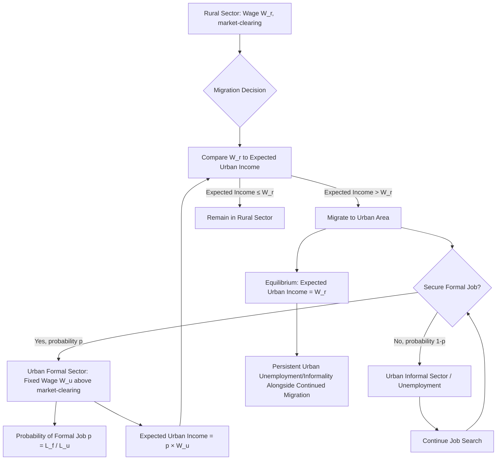
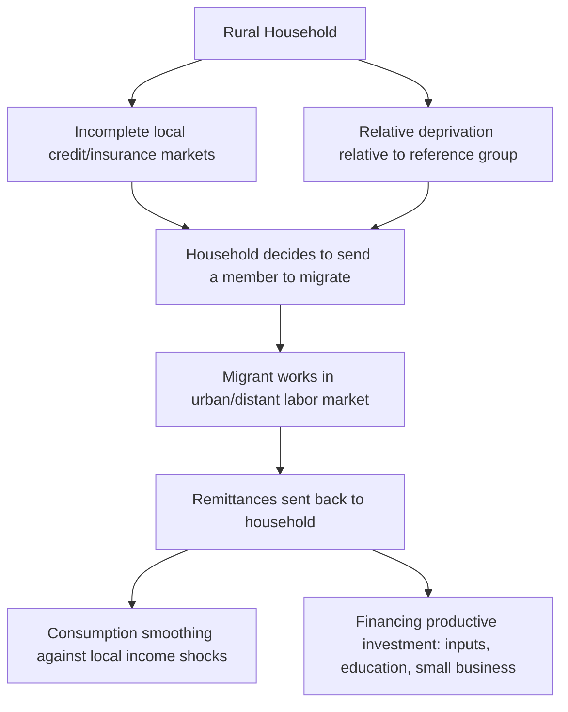

## Rural-Urban Migration Models

### Overview

Rural-urban migration models formalize the economic mechanisms driving labor movement from agricultural/rural to industrial/urban sectors during structural transformation. Development economics has produced a sequence of models addressing different puzzles: why migration occurs at all (Lewis), why it continues despite high urban unemployment (Harris-Todaro), and how household risk-sharing and information frictions shape migration decisions (the New Economics of Labor Migration and search-theoretic extensions).

### The Lewis Dual-Economy Model (1954)

W. Arthur Lewis's "Economic Development with Unlimited Supplies of Labour" is the foundational structural model motivating rural-urban labor reallocation, though it is not a migration model per se — it models the *conditions* under which migration is costless to aggregate output.

#### Core Structure

**Key Points**

- The economy is divided into two sectors: a traditional/subsistence rural (agricultural) sector and a modern/capitalist urban (industrial) sector
- The rural sector is assumed to have "surplus labor" — labor whose marginal product is at or near zero (or below the institutional/subsistence wage), meaning labor can be withdrawn from agriculture without reducing total agricultural output
- The urban sector pays an institutional wage set above the rural subsistence wage by a constant premium (commonly modeled as 30% above rural income, to compensate for urban cost of living and psychological cost of migration), and this wage remains roughly constant as long as rural surplus labor persists
- Because the urban wage is fixed and above the marginal cost of drawing labor from the countryside, urban capitalists can hire additional workers at a constant wage and reinvest the resulting profits, financing continued industrial expansion — this reinvested-profit-driven expansion is the engine of growth in the model

#### The Turning Point

**Key Points**

- As urban demand for labor progressively absorbs the rural surplus, the rural labor supply curve eventually turns upward — the "Lewis turning point" — at which point further labor withdrawal begins to reduce agricultural output, and rural wages begin rising to reflect actual marginal product
- Beyond the turning point, urban wages must rise to continue attracting labor, ending the era of low, roughly-constant urban wages that fueled early-stage capital accumulation
- China's post-2004 (approximately) rural wage increases have been widely discussed in development economics as a possible real-world Lewis turning point, generating substantial applied debate over whether China's growth model needed to shift from labor-cost-based competitiveness toward productivity-based competitiveness [Unverified: whether China had definitively passed a Lewis turning point, versus experiencing more localized/temporary rural labor tightness, remains debated among China-focused development economists]

#### Critiques of the Lewis Model

**Key Points**

- The zero/near-zero marginal product of rural labor assumption has been empirically challenged; some studies find rural labor markets clear at a positive marginal product even in labor-abundant agrarian economies, undermining the "costless withdrawal" assumption
- The model does not explain urban unemployment — it implicitly assumes urban labor demand always matches migration inflow at the institutional wage, a gap directly addressed by the subsequent Harris-Todaro model
- The model treats migration as a pure function of the rural-urban wage gap, without modeling job-search frictions, risk, or the probability of actually securing urban employment

### The Harris-Todaro Model (1970)

Harris and Todaro directly addressed the puzzle the Lewis model could not: persistent rural-urban migration in the presence of substantial, visible urban unemployment.

#### Core Mechanism

**Key Points**

- Migrants respond to the *expected* urban income, not the actual urban wage — expected income equals the urban formal wage multiplied by the probability of securing formal urban employment
- The urban formal wage is held above the market-clearing level (via minimum wage legislation, union bargaining, or public-sector wage-setting), creating persistent excess labor supply (unemployment or informal-sector employment) in urban areas
- Migration continues as long as expected urban income exceeds the rural wage, generating an equilibrium with both continued migration *and* persistent urban unemployment — resolving the empirical puzzle the Lewis model could not address

#### Formal Structure

$$W_u^e = p \times W_u = \left(\frac{L_f}{L_u}\right) \times W_u$$

where $p = L_f / L_u$ is the probability of obtaining formal employment (approximated as the ratio of formal jobs to total urban job-seekers), $W_u$ is the fixed formal urban wage, and $W_u^e$ is expected urban income.

**Migration equilibrium condition:**

$$W_u^e = W_r \quad \Rightarrow \quad \left(\frac{L_f}{L_u}\right) W_u = W_r$$

**Key Points**

- This condition determines the equilibrium size of the urban labor force (and, by extension, urban unemployment/informal employment) as a function of the wage gap and formal job availability
- A central and counterintuitive policy implication (the "Todaro paradox"): urban job-creation programs, by raising $L_f$, raise expected income $W_u^e$ above equilibrium, inducing additional migration that can result in a net *increase* in urban unemployment — the migration response can outpace the direct job-creation effect
- This implies that policies addressing only urban labor demand, without also addressing the underlying rural-urban wage gap (e.g., via rural income support, land reform, or removing urban wage distortions), can be self-defeating from an unemployment-reduction standpoint

#### Extensions

**Key Points**

- The model has been extended to incorporate an explicit informal urban sector as a distinct third sector (rather than treating "unemployment" as literal idleness) — migrants who do not secure formal employment enter informal urban activity while continuing to search, better matching observed developing-country labor markets where visible open unemployment is often lower than the model's baseline framework would suggest, with underemployment in low-productivity informal work substituting for open unemployment
- Efficiency wage theory provides one microfoundation for why the formal urban wage remains above market-clearing (beyond simple institutional wage-setting), as firms may pay above-market wages to elicit effort, reduce turnover, or attract higher-quality workers

### Diagram: Harris-Todaro Model Structure

### New Economics of Labor Migration (NELM)

The New Economics of Labor Migration (Stark and Bloom, 1985) shifts the unit of analysis from the individual migrant to the household, and introduces risk and information considerations absent from Harris-Todaro.

**Key Points**

- Migration is modeled as a household risk-diversification strategy: households send members to geographically distinct labor markets (urban areas, sometimes international) to diversify income sources against local (rural, agricultural) income shocks — analogous to portfolio diversification
- In the absence of well-functioning rural credit and insurance markets (a common feature of developing agrarian economies), migrant remittances serve as an informal insurance mechanism, smoothing household consumption against local shocks like crop failure
- **Relative deprivation** is introduced as an additional migration motive: households may migrate not purely to raise absolute income but to improve their income *position relative to a reference group* within their community, a mechanism absent from purely individual-wage-maximizing frameworks like Harris-Todaro
- Remittances are also modeled as financing productive investment (agricultural inputs, education, small business capital) that credit-constrained rural households could not otherwise finance, creating a potential productivity-enhancing feedback loop from migration back to the rural sending economy [Inference: the strength of this remittance-investment channel is empirically variable and depends on financial infrastructure and remittance use patterns, which differ substantially across contexts]

### Diagram: NELM Household Risk-Diversification Framework

### Comparative Summary of Migration Models

**Key Points**

- **Lewis (1954):** structural model of costless labor reallocation given rural surplus labor; explains capital accumulation dynamics but not migration decision-making or urban unemployment
- **Harris-Todaro (1970):** individual expected-income-maximization model; explains persistent migration alongside urban unemployment via job-search probability, but treats migration as an individual decision under a simplified risk-neutral framework
- **NELM (Stark & Bloom, 1985):** household-level model incorporating risk diversification, remittances, and relative deprivation; addresses limitations of Harris-Todaro's individualistic framing but is comparatively less formalized into a single tractable equilibrium condition
- Contemporary applied migration research often draws on elements of multiple frameworks simultaneously — using Harris-Todaro-style expected-income comparisons alongside NELM-style household risk and remittance considerations, rather than treating the models as strictly competing alternatives [Inference: reflects general practice in applied labor migration economics literature]

### Empirical Considerations

**Key Points**

- Empirical migration studies generally find wage/income differentials to be significant but incomplete predictors of migration flows; distance, existing migrant networks (reducing information and job-search costs at the destination), and household demographic composition are consistently found to be additional significant determinants
- Migrant network effects — the tendency for migration to cities/countries where earlier migrants from the same community have already settled — are widely documented and are sometimes modeled as reducing the effective cost/risk of migration for subsequent migrants, a self-reinforcing dynamic distinct from the pure wage-gap mechanisms of Lewis or Harris-Todaro
- Distinguishing the causal wage/income effect on migration decisions from confounding factors (unobserved ability, risk tolerance, family ties) remains a significant empirical identification challenge, with quasi-experimental and natural-experiment approaches (e.g., using distance to transport infrastructure, or policy-driven wage variation) commonly used in the applied literature to address this [Inference: characterization reflects standard methodological practice in labor and migration economics]

### Related Topics

- Urbanization patterns and drivers
- Structural transformation and the Lewis turning point in practice (China case study)
- Informal sector economics and urban labor market segmentation
- Remittance economics and international migration
- Rural credit and insurance market failures
- Efficiency wage theory
- Migrant networks and social capital in migration decisions
- Demographic dividend and labor supply implications of migration