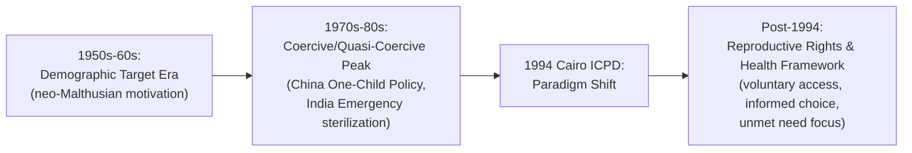

## Family Planning Policy Interventions

### Overview

Family planning policy interventions comprise the range of government and international programs designed to expand access to contraception and reproductive health services, historically motivated by demographic and economic development objectives, and more recently reframed around reproductive rights and health outcomes. Development economics evaluates these interventions along two related but distinct questions: whether they causally reduce fertility, and what welfare and human capital effects they produce independent of any demographic target.

### Historical Evolution of Policy Framing

**Key Points**

- **1950s–1960s (demographic-target era):** family planning programs were framed primarily as instruments of national population control, motivated by neo-Malthusian concerns that rapid population growth would undermine per-capita income growth and strain resources
- **1970s–1980s (coercive/quasi-coercive peak):** several countries implemented programs with strong government targets and, in some cases, coercive elements (incentive/disincentive schemes, sterilization campaigns, and in China, legally mandated birth limits)
- **1994 International Conference on Population and Development (Cairo, ICPD):** marked a widely recognized paradigm shift in the international policy consensus, away from demographic targets and toward a reproductive rights and health framework — emphasizing voluntary access, informed choice, and women's health and empowerment as ends in themselves rather than instruments toward a population target
- **Post-Cairo era (1994–present):** most bilateral and multilateral family planning programs (USAID, UNFPA, Gates Foundation-funded initiatives) are now framed around unmet need, informed choice, and health system strengthening rather than fertility-reduction targets, though country-level implementation varies [Inference: characterization of the post-Cairo consensus reflects standard framing in the international population policy literature; specific national program design still varies]

### Types of Policy Interventions

#### 1. Supply-Side Interventions

**Key Points**

- **Contraceptive subsidization/free provision:** reducing or eliminating the direct financial cost of modern contraceptive methods (pills, IUDs, implants, sterilization, condoms) through public health system provision
- **Service delivery expansion:** community health worker programs, mobile clinics, and integration of family planning into primary health care and maternal/child health services to reduce access costs (travel, time, information barriers)
- **Method mix diversification:** expanding the range of available methods (short-acting vs. long-acting reversible contraceptives) to better match heterogeneous user preferences and reduce discontinuation
- **Social marketing:** subsidized private-sector distribution of contraceptives through existing retail channels, used in several large-scale programs (e.g., Population Services International-style models) to extend reach beyond public health infrastructure

#### 2. Demand-Side Interventions

**Key Points**

- **Information, education, and communication (IEC) campaigns:** mass media and community-based messaging aimed at increasing knowledge of contraceptive methods and addressing misinformation or social stigma
- **Conditional cash transfers and incentive schemes:** direct payments or eligibility conditions linked to contraceptive uptake or spacing behavior, more common in earlier-generation programs and some contemporary targeted pilots [Unverified: incentive-based approaches carry documented ethical concerns around informed consent and are less emphasized in the post-Cairo policy consensus, though isolated program examples persist]
- **Addressing indirect demand determinants:** female education expansion, child health improvement (reducing insurance-motive fertility), and old-age security/pension development are increasingly treated as indirect family planning levers, per the demand-side determinants discussed in fertility decline literature, even though they are not "family planning programs" in the narrow sense

#### 3. Coercive and Quasi-Coercive Historical Interventions

**Key Points**

- **China's One-Child Policy (1980–2015):** a legally mandated fertility limit (with regional and ethnic exceptions) enforced through a combination of administrative quotas, financial penalties, and in documented cases, forced sterilization and abortion; formally ended in 2015 (transitioning to a two-child, later three-child policy) amid concerns over population aging and workforce decline
- **India's Emergency-era sterilization program (1975–1977):** a period of mass sterilization campaigns, in some cases involving coercion and targets imposed on local officials, widely regarded in the subsequent literature as a policy failure that generated lasting public distrust of government family planning programs in parts of India [Unverified: the precise causal link between this historical episode and subsequent contraceptive uptake patterns is debated, though the qualitative characterization of the episode as coercive and controversial is well documented]
- These historical episodes are commonly cited in the development economics and policy literature as cautionary cases informing the post-Cairo shift toward voluntary, rights-based program design

### Diagram: Evolution of Family Planning Policy Framing

### Empirical Evaluation Frameworks

#### The Supply vs. Demand Debate

**Key Points**

- A long-running methodological debate concerns whether family planning program access *independently* reduces fertility (supply-side effectiveness), or whether fertility decline is primarily driven by underlying demand-side structural change (education, mortality decline, urbanization) with programs merely accommodating an already-shifting demand for fewer children
- Credible identification of the supply-side causal effect requires isolating program access from confounding structural factors that jointly drive both program placement and fertility decline (e.g., programs are often placed in areas already undergoing broader development change), making simple correlational program evaluations unreliable

#### Key Empirical Studies

**Key Points**

- **The Matlab, Bangladesh Family Planning and Health Services Project (from 1977):** one of the most widely cited quasi-experimental family planning evaluations in development economics; randomly assigned intensive family planning and maternal/child health services to a subset of village areas versus standard government services in comparison areas, finding a substantial fertility-reducing effect attributable to the intervention itself, alongside longer-run effects on child health, schooling, and household wealth documented in follow-up studies over subsequent decades
- **Indonesia's family planning program (1970s–1990s):** frequently cited as a large-scale, relatively successful voluntary program associated with a rapid national fertility decline, though isolating the program's independent causal contribution from concurrent economic development and education expansion is methodologically difficult and debated [Unverified: precise causal attribution in large-scale non-experimental national programs remains contested relative to the more credibly identified Matlab results]
- Subsequent applied work has used variation in family planning program rollout timing, distance to clinics, and policy discontinuities as identification strategies in other country contexts, generally finding a positive but context-dependent supply-side effect on contraceptive uptake and, to a lesser and more variable degree, on fertility itself [Inference: this summary characterization reflects the general pattern across the applied family planning evaluation literature rather than a single definitive study]

#### Unmet Need as a Policy Metric

**Key Points**

- "Unmet need for family planning" — the share of women who want to avoid or delay pregnancy but are not using a modern contraceptive method — is the standard survey-based metric (from Demographic and Health Surveys, DHS) used to size the potential population reachable by supply-side interventions
- High unmet need in a given context is generally interpreted as indicating room for supply-side intervention to be effective (closing an access gap); low unmet need combined with continued high fertility instead points toward demand-side (structural/preference-driven) factors as the more relevant policy lever

### Broader Welfare Effects Beyond Fertility

**Key Points**

- Contemporary program evaluation increasingly emphasizes outcomes beyond aggregate fertility reduction: maternal health and mortality reduction, birth spacing (associated with improved child health outcomes), reduced unintended pregnancy and associated unsafe abortion risk, and women's educational and labor market outcomes following delayed or spaced childbearing
- Long-run follow-up studies of programs like Matlab have documented effects extending into the next generation — improved schooling and economic outcomes for children born into smaller, more spaced families — providing an additional human-capital-based rationale for family planning investment distinct from the original demographic-target motivation
- This shift in evaluation focus parallels the broader post-Cairo reframing: family planning access is increasingly justified in the economics literature on health, human capital, and welfare grounds rather than primarily as a macro-demographic growth lever [Inference: reflects a synthesis of the direction of the applied literature rather than a single source's explicit claim]

### Policy Design Considerations

**Key Points**

- **Method choice and quality of care:** programs emphasizing informed choice across a range of methods, with attention to counseling quality and addressing side-effect concerns, are associated with higher continuation rates than programs narrowly promoting a single method or relying on incentive-driven uptake
- **Integration with broader health systems:** embedding family planning within maternal and child health service delivery is widely viewed as improving both efficiency (shared infrastructure) and uptake (reduced stigma, more natural point-of-contact)
- **Male engagement and household decision-making:** some program evaluations find that engaging male partners in family planning counseling improves uptake and continuation in contexts where male household decision-making authority over fertility choices is significant, though the generalizability of specific program models across cultural contexts is not established [Unverified: effectiveness of male-engagement components is context-specific and not uniformly demonstrated across all settings studied]
- **Avoiding target-driven implementation:** the historical coercive episodes are widely cited in program design guidance as cautionary evidence against administrative fertility targets imposed on service providers, given documented incentives for rights violations under target-based accountability systems

### Related Topics

- Fertility decline determinants (demand-side structural drivers)
- China's One-Child Policy: design, enforcement, and demographic legacy
- Demographic dividend concept and its dependence on fertility transition
- Matlab, Bangladesh randomized family planning evaluation: full study design
- Demographic and Health Surveys (DHS) methodology
- Maternal and child health economics
- Women's empowerment and household bargaining models
- International Conference on Population and Development (Cairo, 1994): full policy framework