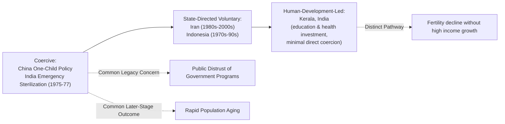

## Population Policy Case Studies

### Overview

Case studies of national population policy provide the empirical grounding for theoretical debates over fertility decline, demographic dividends, and coercive versus voluntary policy design. This survey covers the most frequently cited cases in development economics — China, India, Indonesia, Iran, and Kerala (India) — spanning the full spectrum from coercive state control to voluntary, structurally-driven fertility transition, allowing comparative analysis of policy design and outcome.

### China: One-Child Policy (1980–2015)

#### Design and Enforcement

**Key Points**

- Introduced in 1980 as a response to concerns that continued rapid population growth would undermine per-capita economic development goals under the post-Mao reform agenda; formally restricted most urban couples to one child, with documented regional and ethnic exceptions (notably for rural families whose first child was a daughter in many provinces, and for ethnic minority populations)
- Enforcement mechanisms included administrative birth quotas assigned to local officials (creating strong incentives for aggressive local enforcement), financial penalties ("social maintenance fees") for unauthorized births, and in documented cases, coerced sterilization and abortion
- The policy was formally relaxed to a universal two-child policy in 2016 and further to a three-child policy in 2021, explicitly motivated by concerns over accelerating population aging and a shrinking working-age population

#### Demographic and Economic Effects

**Key Points**

- China's total fertility rate fell from approximately 2.8 in 1979 (already declining from a much higher pre-1970s level due to an earlier, less coercive "later, longer, fewer" campaign) to below replacement level by the 1990s, though the policy's independent causal contribution relative to the concurrent structural transformation (urbanization, female education, rising income) already underway is debated in the literature [Unverified: several economic-demographic studies attribute a meaningful share of China's fertility decline to pre-existing structural trends predating and independent of the One-Child Policy specifically]
- The policy is widely cited as a contributing factor to China's skewed sex ratio at birth (reflecting son preference interacting with restricted family size and sex-selective abortion enabled by ultrasound technology), with sex ratios reaching notably male-skewed levels in the 1990s–2000s before moderating in more recent cohorts
- Longer-run consequences include the accelerated population aging and shrinking working-age population discussed extensively in the population aging literature, and the "4-2-1" family structure problem (a shrinking base of working-age adults supporting a growing elderly population)
- The policy is a central case study in critiques of coercive population policy, cited alongside India's Emergency-era sterilization campaign as cautionary evidence informing the post-1994 Cairo shift toward voluntary, rights-based program design

### India: Emergency-Era Sterilization Campaign (1975–1977)

**Key Points**

- During the 1975–1977Indian political Emergency (a period of suspended civil liberties), the national family planning program shifted toward aggressive, quota-driven sterilization targets imposed on state and local officials, with documented cases of coercion, including sterilization required as a condition for accessing certain government services or employment in some regions
- The program generated substantial and lasting public backlash, widely credited in subsequent Indian political and demographic literature with damaging public trust in government family planning programs for an extended period following the Emergency's end in 1977
- India's subsequent family planning policy shifted toward a more decentralized, less target-driven model, though sterilization (particularly female tubal ligation) remains historically the dominant contraceptive method used in India relative to other methods, a pattern some analysts trace partly to the enduring institutional and health-system legacy of the earlier campaign-style approach [Unverified: causal attribution of current method-mix patterns to the specific historical episode, versus other health system and cultural factors, is not firmly established in the literature]
- India's national fertility transition has been markedly slower and more regionally heterogeneous than China's, a pattern frequently attributed in comparative literature to differences in female education trajectories, decentralized federal governance, and the absence (post-Emergency) of a comparably centralized coercive policy instrument

### Kerala, India: Sub-National Fertility Transition Without Coercion or High Income

Kerala is one of the most frequently cited sub-national case studies demonstrating fertility decline achieved primarily through social investment rather than coercion or high income growth.

**Key Points**

- Kerala achieved near-replacement-level fertility by the early 1990s and continued fertility decline since, at income per capita levels well below the Indian national average at comparable points in time, and far below the income levels associated with fertility transition in most cross-country comparisons
- The "Kerala model" is widely attributed in development economics literature (notably work associated with Amartya Sen) to sustained public investment in female education and public health infrastructure, achieving demographic outcomes more typically associated with much higher-income economies through a human-development-led rather than income-led pathway
- This case is frequently used as evidence supporting the demand-side, structural determinants of fertility decline (female education, child health) over income growth or coercive population control as the primary driver — directly relevant to the debate over supply-side versus demand-side explanations of fertility transition
- Critics note Kerala's specific historical, political, and matrilineal-tradition context (in parts of the state) may limit the generalizability of the model to other regions with different social and institutional starting conditions [Inference: this caveat reflects a standard qualification raised in comparative development literature regarding single-region "success story" cases]

### Indonesia: Voluntary Program-Driven Fertility Transition (1970s–1990s)

**Key Points**

- Indonesia's national family planning program (established under the Suharto government from the early 1970s) is frequently cited as a large-scale, predominantly voluntary program associated with one of the more rapid fertility transitions among developing economies of its era, with total fertility rate falling from roughly 5.6 in the early 1970s to around 2.6-2.8 by the late 1990s [Unverified: precise TFR figures vary modestly by data source and survey round]
- The program combined community-based distribution networks, village-level social mobilization, and integration with broader rural development programming, distinguishing it from more centrally coercive models
- As with the broader supply-side versus demand-side debate, isolating the program's independent causal contribution from Indonesia's concurrent economic growth, female education expansion, and urbanization over the same period is methodologically difficult, and the literature does not offer a single consensus decomposition of relative contributions [Inference: reflects the general applied-evaluation challenge common to large-scale non-experimental national program assessments]

### Iran: Rapid Voluntary Fertility Decline (1980s–2000s)

**Key Points**

- Iran experienced one of the most rapid fertility transitions recorded globally, with total fertility rate falling from approximately 6.5 in the mid-1980s to below replacement level (around 2.0 or lower) by the early 2000s, occurring within roughly two decades
- This transition followed a notable policy reversal: the Iranian government had initially pursued pro-natalist policy in the years immediately following the 1979 revolution, then shifted decisively toward active family planning promotion (including a widely cited pre-marital contraceptive counseling requirement and expanded rural health network access) from the late 1980s
- The Iranian case is frequently cited as evidence that rapid fertility decline can occur through a combination of strong state-supported voluntary program delivery, expanding female education, and rising urbanization, without the coercive elements present in the Chinese case [Unverified: the relative contribution of the specific family planning program versus concurrent female education and urbanization trends is debated in the demographic literature, similar to the Indonesia case]
- More recent Iranian policy has shifted back toward pro-natalist measures amid concerns over below-replacement fertility and future population aging, mirroring the policy reversal pattern seen in China and other rapidly-aged transition economies

### Diagram: Comparative Case Study Policy Spectrum

### Diagram: TFR Trajectories Compared (svg_diagram)

<svg xmlns="http://www.w3.org/2000/svg" viewBox="0 0 700 420">
\<style\>
.lbl{font-family:Arial,sans-serif;font-size:11px;fill:#222;}
.title{font-family:Arial,sans-serif;font-size:14px;font-weight:bold;fill:#111;}
.axis{stroke:#333;stroke-width:1.5;}
\</style\>
<text x="350" y="20" text-anchor="middle" class="title">Approximate Total Fertility Rate Trajectories by Case (svg_diagram)</text>
<line x1="70" y1="360" x2="650" y2="360" class="axis" />
<line x1="70" y1="40" x2="70" y2="360" class="axis" />
<text x="360" y="390" text-anchor="middle" class="lbl">Year (approx. 1970-2010)</text>
<text x="30" y="200" text-anchor="middle" class="lbl" transform="rotate(-90 30 200)">Total Fertility Rate</text>

<text x="75" y="55" class="lbl">6</text>

<text x="75" y="130" class="lbl">5</text>

<text x="75" y="205" class="lbl">4</text>

<text x="75" y="280" class="lbl">3</text>

<text x="75" y="355" class="lbl">2</text>

<path d="M 100 130 C 200 200, 300 280, 400 320 C 500 340, 600 345, 630 348" stroke="#c0392b" stroke-width="2.5" fill="none" />
<text x="450" y="300" class="lbl" fill="#c0392b">China (One-Child Policy, 1980)</text>
<path d="M 100 60 C 220 130, 350 250, 450 310 C 550 335, 600 340, 630 342" stroke="#2980b9" stroke-width="2.5" fill="none" />
<text x="440" y="200" class="lbl" fill="#2980b9">Iran (voluntary, rapid, from ~1985)</text>
<path d="M 100 100 C 250 170, 380 260, 500 300 C 580 315, 620 318, 630 320" stroke="#27ae60" stroke-width="2.5" fill="none" />
<text x="200" y="150" class="lbl" fill="#27ae60">Indonesia (voluntary program-driven)</text>
<path d="M 100 180 C 220 250, 320 310, 420 340 C 500 350, 580 355, 630 356" stroke="#8e44ad" stroke-width="2.5" fill="none" />
<text x="150" y="260" class="lbl" fill="#8e44ad">Kerala, India (human-development-led)</text>
<path d="M 100 90 C 250 150, 400 230, 550 300 C 600 320, 620 330, 630 335" stroke="#e67e22" stroke-width="2" stroke-dasharray="4,3" fill="none" />
<text x="480" y="120" class="lbl" fill="#e67e22">India (national average, slower/heterogeneous)</text>
</svg>

### Comparative Analysis

**Key Points**

- All five cases achieved substantial fertility decline, but through markedly different policy mechanisms — from legally mandated coercion (China) to social-investment-led voluntary decline (Kerala) — demonstrating that a single fertility outcome trajectory is consistent with widely varying policy approaches and raising the central empirical challenge of attributing causal weight to any specific instrument
- Coercive approaches (China, India's Emergency period) generated documented human rights costs and, in China's case, significant longer-run demographic imbalances (sex ratio distortion, accelerated aging) not observed to the same degree in the voluntary comparison cases
- Cases combining strong government program delivery with structural investment (Iran, Indonesia) achieved rapid fertility decline without the most severe coercive elements of the Chinese case, suggesting program design (voluntary vs. coercive) can be varied somewhat independently of transition speed [Inference: this comparative inference is drawn from the pattern across these specific cases rather than a formal cross-national causal study isolating program design from speed of decline]
- Kerala's case is distinct in demonstrating that fertility transition does not require either coercion or high income growth, but instead can be achieved through sustained investment in female education and health — directly supporting the demand-side determinants framework over pure income- or program-based explanations

### Related Topics

- Fertility decline determinants (demand-side and supply-side mechanisms)
- Family planning policy interventions (program design and evaluation methodology)
- Demographic dividend concept and dependence on fertility transition speed
- Population aging in developing economies (China's post-transition trajectory)
- Amartya Sen's capability approach and the Kerala development model
- Sex ratio imbalance and son preference economics
- Matlab, Bangladesh family planning evaluation (comparative program design reference)
- Cairo 1994 ICPD and the shift to rights-based population policy