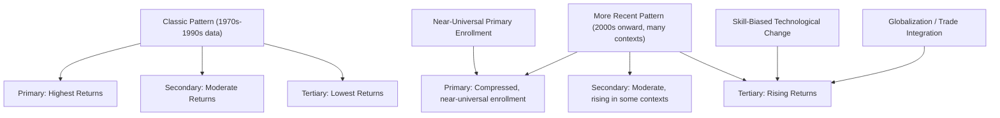
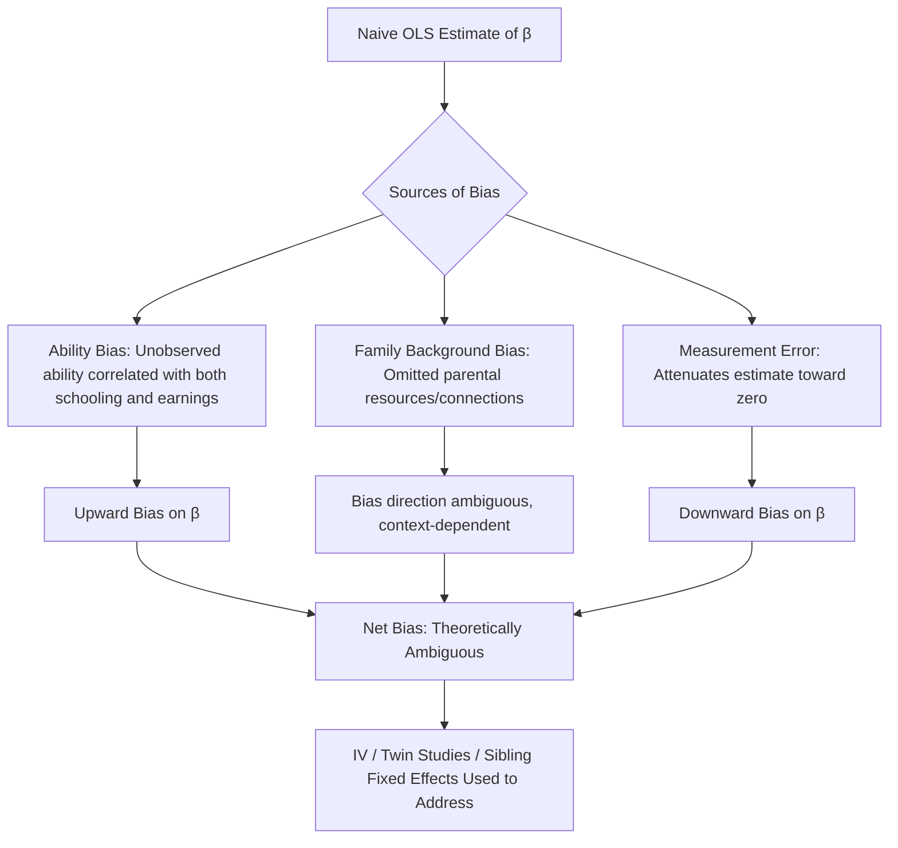

## Returns to Education in Developing Countries

### Overview

Returns to education measure the increase in earnings (or other welfare outcomes) associated with an additional unit of schooling, typically expressed as the percentage increase in wages per additional year of education. This concept is a cornerstone of human capital theory and a central empirical input for education policy in developing economies, where returns often differ substantially from high-income-country patterns due to differences in labor market structure, school quality, and the relative scarcity of skilled labor.

### Theoretical Foundation: The Mincer Equation

The standard empirical framework for estimating returns to education is the Mincerian earnings function (Mincer, 1974).

$$\ln(w_i) = \alpha + \beta S_i + \gamma_1 EX_i + \gamma_2 EX_i^2 + \epsilon_i$$

where $\ln(w_i)$ is the log of individual $i$'s wage, $S_i$ is years of schooling, $EX_i$ is years of labor market experience, and $EX_i^2$ captures the typically concave experience-earnings profile.

**Key Points**

- The coefficient $\beta$ is interpreted as the private rate of return to an additional year of schooling, holding experience constant — approximately the percentage wage increase per additional year of education
- The log-linear specification derives from a human capital investment model in which individuals forgo earnings during schooling years in exchange for a permanently higher earnings stream, with $\beta$ representing the internal rate of return that equates the present value of costs (foregone earnings, direct costs) to the present value of the resulting earnings gain
- The quadratic experience term reflects human capital theory's prediction that on-the-job learning and skill accumulation raise earnings at a decreasing rate over the career, eventually flattening or declining near retirement

### Private vs. Social Returns

**Key Points**

- **Private returns** measure the return accruing to the individual (or household) making the schooling investment decision — the relevant metric for individual/household schooling choices
- **Social returns** account for externalities and costs not captured in the individual's wage, including: positive externalities (spillovers to co-workers' productivity, aggregate growth effects, reduced crime and improved civic participation), and public subsidy costs (since much schooling, especially primary/secondary, is publicly financed)
- Social returns are conceptually distinct from and generally more difficult to estimate credibly than private returns, since social returns require identifying externalities that are not directly observed in individual wage data
- A standard finding across the literature is that both private and social returns to primary education tend to exceed returns to higher levels of schooling in many developing-country contexts, though this pattern is not universal and has evolved over time as discussed below

### Empirical Patterns: Returns by Schooling Level

**Key Points**

- **Classic Psacharopoulos findings (multiple editions, 1970s–2000s):** an influential and widely cited series of cross-country meta-analyses found that returns to primary education were generally highest, followed by secondary, then tertiary, in developing countries — attributed to diminishing marginal returns as schooling levels rose in economies with a still-small skilled-labor-demanding sector
- **More recent evidence (2000s onward):** subsequent research, including revised estimates and updated meta-analyses, has found in many contexts a shift toward higher, sometimes convex (rising) returns at the tertiary level relative to primary/secondary, attributed to skill-biased technological change, globalization-driven demand for skilled labor, and the compression of primary/secondary returns as basic schooling has become nearly universal in many middle-income countries [Unverified: the extent and universality of this "convexification" pattern is debated and varies substantially by country, time period, and data source used]
- Returns to education in developing countries are, on average across many studies, estimated to be somewhat higher than analogous estimates in high-income countries, consistent with a standard scarcity-based explanation (skilled labor is relatively scarcer in lower-income economies, raising its marginal return), though heterogeneity across countries is substantial and the gap has narrowed over time in various contexts [Inference: this synthesis reflects broad patterns documented across multiple meta-analytic studies rather than a single precise, universally agreed estimate]

### Diagram: Returns to Education by Schooling Level Over Time

### Identification Challenges: Ability Bias and Endogeneity

**Key Points**

- The core empirical challenge in estimating $\beta$ is that schooling is not randomly assigned — individuals with higher unobserved ability, family resources, or motivation both obtain more schooling *and* would likely earn more even absent that additional schooling, biasing naive OLS estimates of $\beta$ upward ("ability bias")
- Omitted family background variables (parental education, income, connections) similarly confound simple OLS estimates, potentially biasing $\beta$ in either direction depending on correlation patterns between family background, schooling access, and labor market outcomes
- Measurement error in self-reported schooling years tends to attenuate (bias toward zero) OLS estimates, working in the opposite direction from ability bias — the net bias direction in any given naive OLS estimate is therefore theoretically ambiguous and must be assessed empirically

#### Instrumental Variables Approaches

**Key Points**

- **School construction/proximity instruments:** using distance to the nearest school, or exploiting school-building program rollouts (e.g., Duflo's 2001 study of Indonesia's INPRES school construction program) as a source of schooling variation plausibly uncorrelated with individual ability, conditional on other controls
- **Compulsory schooling law changes:** using discontinuities in minimum schooling requirements across birth cohorts or regions as an instrument for completed schooling
- **Quarter-of-birth instruments (Angrist & Krueger, 1991, originally in a U.S. context but replicated elsewhere):** exploiting compulsory schooling age cutoffs interacting with birth timing to generate quasi-random variation in years of completed schooling
- IV estimates of returns to schooling in many studies are found to be similar to or, in some cases, larger than corresponding OLS estimates — a finding that has generated extensive methodological discussion, since simple ability-bias theory alone would predict IV estimates should be smaller than OLS; explanations proposed in the literature include heterogeneous treatment effects (IV estimates a "local average treatment effect" specific to the compliant sub-population affected by the instrument, which may have systematically higher marginal returns than the average population) [Inference: this explanation for the OLS-IV comparison pattern reflects a standard interpretation offered in the applied econometrics literature, among other competing explanations]

#### Twin Studies and Sibling Fixed Effects

**Key Points**

- Comparing schooling and earnings differences between monozygotic twins (who share genetic endowment and much of family background) is used in some studies to control for unobserved ability and family background simultaneously, though such studies are logistically difficult and less common in developing-country contexts specifically relative to high-income-country twin registries
- Sibling fixed-effects models provide a more feasible alternative in developing-country data, controlling for shared family background (though not full ability equivalence) by comparing schooling and earnings outcomes across siblings within the same household

### School Quality and Its Interaction with Returns

**Key Points**

- The basic Mincer framework measures returns to *years* of schooling, implicitly treating a year of schooling as a homogeneous unit — a strong assumption given substantial documented variation in school quality (teacher quality, learning materials, class size, curriculum) across and within developing countries
- A growing literature distinguishes returns to school *quantity* (years completed) from returns to actual *learning* or skills acquired, using direct test-score or literacy/numeracy measures rather than years of schooling as the human capital measure — motivated by findings that school enrollment expansion in many developing countries has substantially outpaced measured learning gains (the "learning crisis" documented extensively by the World Bank's *World Development Report 2018*)
- Studies incorporating cognitive skill measures (rather than years of schooling alone) generally find that skills, not schooling years per se, are the more direct determinant of earnings — implying that returns-to-schooling estimates based on years alone may substantially understate the importance of school quality and effectively taught skills relative to mere time-in-school [Inference: this synthesis reflects a recognized and influential strand of the literature (e.g., work associated with Eric Hanushek and co-authors) rather than a single universally quantified finding]

### Gender Differences in Returns

**Key Points**

- Empirical estimates of returns to education by gender vary substantially across countries and studies; some contexts show higher female returns (attributed to a lower female baseline labor force participation rate, meaning schooling has a larger marginal effect on whether/how a woman participates in wage employment at all, in addition to the wage-conditional-on-employment effect), while others show lower measured returns for women due to labor market discrimination, occupational segregation into lower-paying sectors, or selection effects in observed wage samples (since only working women's wages are observed, and labor force participation itself is endogenous to schooling) [Unverified: the direction and magnitude of gender differences in returns is highly context-specific and not resolved into a single universal pattern across the developing-country literature]
- Female education additionally generates well-documented non-wage returns not captured in standard Mincerian wage regressions — including the fertility, child health, and intergenerational human capital effects discussed extensively in the population/demography literature — meaning wage-based return estimates likely understate the full social return to female schooling specifically

### Diagram: Sources of Bias in OLS Returns Estimates

### Policy Implications

**Key Points**

- Persistently high estimated returns to primary/basic education in many developing-country contexts have historically been used to justify prioritizing universal primary education expansion in public investment allocation, particularly during the era when the classic Psacharopoulos-style declining-returns-by-level pattern was the dominant empirical finding
- The shift toward emphasizing learning outcomes over mere enrollment (reflecting the "learning crisis" literature) has redirected substantial policy attention toward school quality interventions — teacher training, pedagogy reform, structured curricula — rather than schooling-years expansion alone, since quantity expansion without quality improvement yields smaller-than-expected returns
- Rising or convexifying returns to tertiary education in several middle-income-country contexts have informed increased public and private investment in higher education access, though this must be weighed against the typically higher public subsidy cost per student at the tertiary level relative to primary/secondary, raising distinct social-return and equity considerations regarding whether public subsidy is efficiently targeted [Inference: this policy-tradeoff framing reflects standard public economics considerations applied to the education-return literature rather than a specific empirical finding]

### Related Topics

- Mincer equation: full derivation and functional form assumptions
- Human capital theory (Becker, Schultz foundational framework)
- School quality and the "learning crisis" (World Development Report 2018)
- Quantity-quality tradeoff in fertility and intergenerational human capital transmission
- Instrumental variables methodology in labor economics (school construction, compulsory schooling instruments)
- Gender gaps in education and labor market outcomes
- Skill-biased technological change and wage inequality
- Public finance of education: subsidy incidence and social return considerations