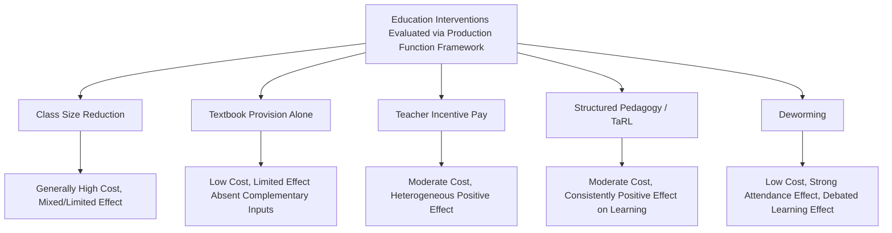

## Education Production Functions

### Overview

The education production function frames student learning outcomes as the output of a production process combining school inputs (teachers, materials, infrastructure), student and household characteristics, and peer/community factors. Originating in the U.S. context with the Coleman Report (1966) and subsequently central to development economics evaluations of school inputs, this framework structures the empirical literature on which interventions actually raise learning outcomes in low- and middle-income countries.

### Basic Functional Form

The canonical education production function specifies a learning outcome (test score, cognitive achievement) as a function of cumulative inputs:

$$A_{it} = f(F_{i,0:t}, S_{i,0:t}, P_{i,0:t}, \mu_i, \epsilon_{it})$$

where $A_{it}$ is achievement for student $i$ at time $t$, $F$ represents family inputs (parental education, home resources) from birth to time $t$, $S$ represents school inputs (teacher quality, school resources), $P$ represents peer inputs, $\mu_i$ is unobserved individual ability/endowment, and $\epsilon_{it}$ is an error term.

**Key Points**

- The "cumulative" specification reflects the recognition that current achievement depends on the entire history of inputs received, not just current-period inputs — a child's test score today reflects years of prior schooling, health, and family investment
- A simplifying and empirically common assumption is the **value-added specification**, which conditions on a lagged achievement measure $A_{i,t-1}$ to proxy for the cumulative effect of all past inputs, allowing the equation to focus on the *current-period* input's marginal contribution:

$$A_{it} = \beta A_{i,t-1} + \gamma S_{it} + \delta F_{it} + \mu_i + \epsilon_{it}$$

- This value-added approach substantially reduces (though does not fully eliminate) omitted-variable bias from unobserved cumulative history, and is the dominant specification in contemporary teacher-effectiveness and school-input evaluation studies

### Categories of Inputs

#### School Inputs

**Key Points**

- **Physical infrastructure:** classrooms, desks, textbooks, libraries, sanitation facilities (particularly relevant for girls' attendance in many developing-country contexts)
- **Teacher characteristics:** years of teacher education, years of experience, subject-matter knowledge, teacher attendance/effort
- **Class size / pupil-teacher ratio:** the number of students per teacher, a frequently studied and policy-relevant input given its direct cost implications
- **Pedagogical inputs:** curriculum design, instructional materials, use of structured pedagogy programs, language of instruction

#### Household/Family Inputs

**Key Points**

- Parental education (itself often measured as a key input, given documented intergenerational human capital transmission), household income and wealth, time and resources devoted to the child (help with homework, early childhood stimulation), and nutrition/health inputs during critical developmental windows
- Household inputs are frequently found in the literature to explain a larger share of variation in learning outcomes than school inputs alone, particularly in preschool and early primary years, though the relative explanatory weight varies by study and context [Inference: this general pattern reflects a recurring finding across multiple education production function studies rather than a single precise, universally applicable share]

#### Peer and Community Inputs

**Key Points**

- Peer academic ability and behavior within a classroom or school are documented in several studies to affect individual achievement independent of one's own characteristics — a mechanism with direct implications for school assignment, tracking, and desegregation policy
- Community-level factors (local labor market returns to education, social norms around schooling, availability of complementary health/nutrition programs) also enter as inputs at a level above the individual household

#### Health and Nutrition Inputs

**Key Points**

- Child health status (nutrition, presence of parasitic infection, vision/hearing impairment) is increasingly incorporated into education production function frameworks as a direct input affecting cognitive capacity to learn, distinct from school-based inputs
- This has motivated a substantial applied literature on "health-for-education" interventions (deworming, school feeding, micronutrient supplementation, vision correction) evaluated using education production function frameworks, discussed further below

### Diagram: Education Production Function Input Structure

```mermaid
flowchart TD
    A[School Inputs] --> A1[Physical Infrastructure]
    A --> A2[Teacher Characteristics]
    A --> A3[Class Size / Pupil-Teacher Ratio]
    A --> A4[Pedagogical Inputs / Curriculum]

    B[Household Inputs] --> B1[Parental Education]
    B --> B2[Household Income/Wealth]
    B --> B3[Time and Home Resources]

    C[Peer/Community Inputs] --> C1[Classroom Peer Ability]
    C --> C2[Community Norms and Returns]

    D[Health/Nutrition Inputs] --> D1[Nutritional Status]
    D --> D2[Parasitic Infection / Deworming Status]
    D --> D3[Sensory Impairment]

    E[Unobserved Ability/Endowment]

    A --> F[Learning Outcome / Test Score / Achievement]
    B --> F
    C --> F
    D --> F
    E --> F
    G[Lagged Achievement A_t-1] --> F
```

### Key Empirical Findings on Specific Inputs

#### Class Size Reduction

**Key Points**

- Class size reduction is one of the most extensively studied and most costly school inputs, given its direct implication for teacher hiring
- Findings on class-size effects in developing-country contexts are notably mixed and generally smaller in magnitude than popular policy discourse often assumes; several rigorous studies find limited or no statistically significant effect on learning outcomes from moderate class-size reductions, particularly when not accompanied by complementary pedagogical changes [Unverified: results vary substantially by country, baseline class size level, and study design, and this remains an actively debated area]
- This finding has motivated a shift in some policy and research attention toward pedagogy and teacher-student interaction quality as potentially more cost-effective levers than pure class-size reduction alone

#### Teacher Quality and Incentives

**Key Points**

- Teacher effectiveness is consistently found across studies (using value-added methodology) to be one of the largest single school-level determinants of student learning, though *directly observable* teacher credentials (formal education level, years of experience beyond an initial threshold, certification) are frequently found to be weak predictors of actual teacher effectiveness — a puzzle sometimes termed the "credentials paradox" in the teacher-quality literature
- **Teacher absenteeism** is documented as a substantial and often underappreciated input shortfall in several developing-country contexts, with nationally representative unannounced school visits in some studies finding teacher absence rates in a range frequently cited around 15-25% on a given day in certain country contexts [Unverified: absenteeism rates vary substantially by country, region, and survey methodology, and should not be treated as a universal fixed figure]
- Performance-based teacher incentive programs (linking pay or continued employment to measured student learning gains) have been evaluated in several randomized studies with generally positive but heterogeneous effects, alongside documented concerns about "teaching to the test" and other unintended behavioral responses to narrow incentive metrics [Inference: this balanced characterization reflects the general pattern of mixed-but-generally-positive findings alongside documented concerns in the applied teacher incentive literature]

#### Textbooks and Instructional Materials

**Key Points**

- Providing textbooks alone, absent complementary teacher training or curriculum alignment, has in several studies shown limited average effect on learning outcomes — attributed in some analyses to textbooks being poorly matched to students' actual starting skill level (a curriculum that is too advanced for students significantly behind grade-level expectations), rather than textbooks being an ineffective input in principle
- This finding has contributed to the broader "teaching at the right level" (TaRL) literature discussed below, emphasizing that matching instructional content to actual student skill level matters more than simply providing standard-curriculum-aligned materials

#### Structured Pedagogy and "Teaching at the Right Level" (TaRL)

**Key Points**

- The TaRL approach, developed and extensively evaluated by the NGO Pratham in India, groups students by demonstrated skill level (rather than strictly by grade/age) for targeted instruction sessions, and has been evaluated in multiple randomized controlled trials showing substantial learning gains, particularly for students who have fallen behind grade-level expectations
- This approach directly addresses a core issue identified across the "learning crisis" literature: many students in developing-country school systems progress through grade levels without acquiring the foundational literacy/numeracy skills nominally associated with earlier grades, meaning grade-level-targeted standard curricula fail to meet students where they actually are
- Structured pedagogy programs more broadly (detailed lesson plans, scripted teaching guides, ongoing coaching support for teachers) have shown some of the more consistently positive effect sizes among school-input interventions studied via randomized evaluation, per multiple systematic reviews [Inference: this comparative characterization reflects a synthesis commonly presented in education RCT systematic reviews rather than a single specific study's claim]

#### Health-for-Education Interventions

**Key Points**

- **Deworming:** the Miguel and Kremer (2004) Kenya school-based deworming study is among the most widely cited education-adjacent randomized evaluations in development economics; the original study found substantial effects on school attendance (via reduced illness and, notably, through externality effects reducing transmission to non-treated students in the same and nearby schools) and, more debated, longer-run follow-up effects on adult labor market outcomes documented in subsequent follow-up work
- Effects on direct test-score/learning outcomes specifically (as opposed to attendance) from deworming interventions have been found to be smaller and less consistent across replications and other contexts, generating ongoing academic debate over the generalizability and precise decomposition of the original Kenya findings [Unverified: the deworming replication debate, including a well-known published reanalysis controversy, remains a live methodological discussion in the applied economics literature]
- School feeding programs and micronutrient supplementation have shown generally positive effects on attendance and some cognitive/health outcomes in various studies, with effect magnitudes varying by baseline nutritional deficiency prevalence in the study population

### Diagram: Cost-Effectiveness Comparison Framework (Conceptual)

### Methodological Challenges

**Key Points**

- **Endogenous input allocation:** school and household inputs are rarely randomly assigned in observational data — better-resourced households may select into better-resourced schools, or education systems may compensatorily allocate more resources to disadvantaged schools, biasing naive cross-sectional estimates in either direction depending on the allocation mechanism
- **Measurement of learning outcomes:** standardized test scores are an imperfect proxy for the full range of valued educational outcomes (critical thinking, socio-emotional skills, later-life labor market success), and cross-study comparability is limited by differing test instruments, scaling methods, and subject coverage
- **Attrition and sample selection:** longitudinal education studies in developing-country contexts often face substantial sample attrition (migration, dropout), which can bias estimated input effects if attrition is correlated with both the input and the outcome of interest
- Randomized controlled trials have become the dominant methodological standard for credibly identifying specific input effects in the contemporary literature, given the difficulty of resolving endogenous input allocation through observational methods alone, though RCTs carry their own limitations regarding external validity and general equilibrium effects when interventions are scaled beyond the original study context [Inference: this methodological characterization reflects the well-documented shift toward RCT methodology in applied development/education economics over the past two decades]

### Related Topics

- Returns to education in developing countries
- The "learning crisis" and World Development Report 2018 framework
- Teacher labor markets and performance incentive design
- Teaching at the Right Level (TaRL) / Pratham program evaluations
- Miguel and Kremer (2004) deworming study and subsequent replication debate
- Value-added modeling methodology in education research
- Randomized controlled trials in development economics: methodology and external validity
- Early childhood development and nutrition's role in cognitive formation
- Quantity-quality tradeoff and intergenerational human capital transmission