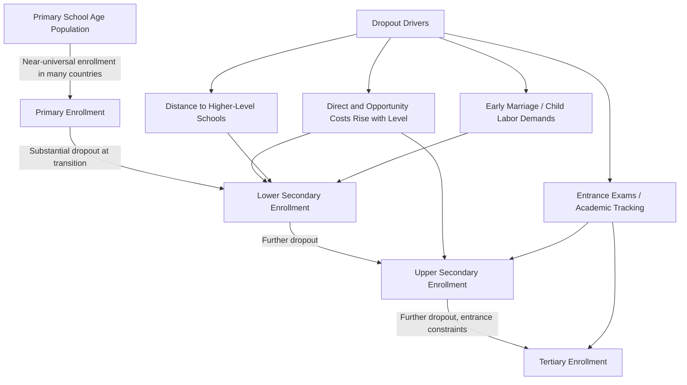

## School Enrollment and Attainment Trends

### Overview

School enrollment and attainment trends track the quantitative expansion of education systems in developing countries over recent decades — how many children enter school, how far they progress, and how these patterns vary by gender, region, and income level. This descriptive foundation underlies the "learning crisis" literature and returns-to-education debates, since enrollment expansion has substantially outpaced measured learning gains in many contexts, motivating a shift in policy focus from access to quality.

### Key Enrollment and Attainment Metrics

**Key Points**

- **Gross enrollment ratio (GER):** total enrollment in a given schooling level, regardless of age, divided by the population of the official age group for that level — can exceed 100% due to over-age and under-age enrollment (grade repetition, late entry)
- **Net enrollment ratio (NER):** enrollment of the official age group in a given schooling level divided by the total population of that age group — bounded at 100%, providing a cleaner measure of age-appropriate participation
- **Completion rate:** the share of a relevant age cohort that completes a given schooling level (primary, lower secondary, upper secondary), distinct from enrollment since it accounts for dropout
- **Mean years of schooling / educational attainment:** average completed years of education among a population (typically adults 25+), the standard cross-country comparative measure of accumulated human capital stock, as used in Barro-Lee educational attainment datasets

$$\text{NER} = \frac{\text{Enrolled students of official age group}}{\text{Total population of official age group}} \times 100$$

### Global and Regional Enrollment Trends

**Key Points**

- Global primary net enrollment has risen substantially since the mid-20th century, with the most rapid gains concentrated in the period following the 2000 Millennium Development Goals (MDG) and subsequent Education for All (EFA) and Sustainable Development Goal (SDG 4) initiatives, which set explicit universal primary education targets
- Sub-Saharan Africa and South Asia recorded the largest relative gains in primary enrollment over this period, moving from comparatively low baseline enrollment rates in the mid-20th century toward near-universal or substantially higher primary enrollment by the 2010s-2020s, though Sub-Saharan Africa continues to have the largest number of out-of-school children globally in absolute terms among major world regions [Unverified: precise regional enrollment figures vary by data source, year, and whether GER or NER is used, and should be verified against current UNESCO Institute for Statistics data for any specific figure]
- A well-documented pattern across regions is a substantial "enrollment funnel": near-universal primary enrollment in many developing countries coexists with markedly lower secondary enrollment, and lower still tertiary enrollment — reflecting compounding dropout at each transition point (primary-to-secondary, secondary-to-tertiary)

### Diagram: The Enrollment Funnel

### Gender Gaps in Enrollment and Attainment

**Key Points**

- Historically, most developing regions exhibited substantial gender gaps favoring male enrollment, particularly at secondary and tertiary levels; this gap has narrowed substantially in most regions over recent decades, with several regions (Latin America, parts of East Asia, and increasingly the Middle East and North Africa) now showing gender parity or a reversed gap with higher female than male enrollment at secondary and tertiary levels
- Sub-Saharan Africa and South Asia (particularly Afghanistan and parts of Pakistan) retain some of the largest remaining gender gaps in enrollment and attainment among major world regions, though substantial country-level heterogeneity exists within both regions [Unverified: specific country rankings and gap magnitudes shift over time and should be checked against current UNESCO/World Bank gender parity index data for precision]
- The Gender Parity Index (GPI), defined as the ratio of female to male enrollment/attainment at a given level, is the standard summary metric used to track this convergence, with a GPI of 1.0 indicating full parity

$$\text{GPI} = \frac{\text{Female Enrollment Ratio}}{\text{Male Enrollment Ratio}}$$

### Attainment Trends: Mean Years of Schooling

**Key Points**

- Global mean years of schooling among adults has risen substantially over the past half-century, with the Barro-Lee dataset and subsequent Human Development Index-linked education indices serving as the standard cross-country comparative sources
- Attainment growth has been most rapid in East Asia (particularly China and South Korea, moving from low mid-20th-century baselines to attainment levels approaching high-income-country averages) and comparatively slower in Sub-Saharan Africa, though Sub-Saharan Africa has also seen meaningful absolute gains from a lower starting base
- A persistent finding is that attainment gains (years completed) have substantially outpaced learning gains (skills acquired per year), a divergence central to the "learning crisis" framing in the *World Development Report 2018* and subsequent literature — more years in school have not translated proportionally into more measured learning, particularly in lower-income contexts with weaker school quality

### Diagram: Attainment Growth vs. Learning Growth (Illustrative Divergence) (svg_diagram)

<svg xmlns="http://www.w3.org/2000/svg" viewBox="0 0 700 400">
\<style\>
.lbl{font-family:Arial,sans-serif;font-size:12px;fill:#222;}
.title{font-family:Arial,sans-serif;font-size:14px;font-weight:bold;fill:#111;}
.axis{stroke:#333;stroke-width:1.5;}
\</style\>
<text x="350" y="20" text-anchor="middle" class="title">Illustrative Divergence: Schooling Attainment vs. Learning Outcomes (svg_diagram)</text>
<line x1="70" y1="350" x2="640" y2="350" class="axis" />
<line x1="70" y1="40" x2="70" y2="350" class="axis" />
<text x="355" y="380" text-anchor="middle" class="lbl">Time (illustrative, 1990-2020)</text>
<text x="30" y="200" text-anchor="middle" class="lbl" transform="rotate(-90 30 200)">Index (1990 = 100)</text>
<path d="M 100 320 C 200 260, 320 180, 450 100 C 520 70, 580 55, 610 48" stroke="#2980b9" stroke-width="2.5" fill="none" />
<text x="450" y="90" class="lbl" fill="#2980b9">Mean Years of Schooling (rising steadily)</text>
<path d="M 100 320 C 200 300, 320 270, 450 240 C 520 225, 580 215, 610 210" stroke="#c0392b" stroke-width="2.5" fill="none" />
<text x="440" y="260" class="lbl" fill="#c0392b">Learning-Adjusted Years of Schooling (rising more slowly)</text>
<line x1="610" y1="48" x2="610" y2="210" stroke="#999" stroke-width="1" stroke-dasharray="4,3" />
<text x="500" y="140" class="lbl">Widening gap = "learning crisis"</text>
</svg>

### The Learning-Adjusted Years of Schooling Metric

**Key Points**

- In response to the divergence between attainment and learning, the World Bank introduced "Learning-Adjusted Years of Schooling" (LAYS), which discounts expected years of schooling by a measure of learning quality (based on standardized international/regional test score benchmarking), producing a metric intended to better reflect effective human capital accumulation than raw enrollment or attainment figures alone
- This metric underlies the World Bank's Human Capital Index, which combines LAYS with health-related survival and stunting measures into a composite human capital measure used for cross-country comparison and policy benchmarking

### Drivers of Enrollment Expansion

**Key Points**

- **Fee elimination:** the abolition of primary school fees in several Sub-Saharan African countries in the 1990s-2000s (e.g., Uganda 1997, Kenya 2003, Tanzania 2001) is well documented in the literature as producing large, immediate enrollment surges, illustrating high price-sensitivity of enrollment decisions among low-income households
- **Conditional cash transfer programs:** programs conditioning cash transfers on school attendance (e.g., Mexico's Progresa/Oportunidades, Brazil's Bolsa Família) have been evaluated via randomized and quasi-experimental designs and generally found to produce meaningful enrollment and attendance gains, particularly at the secondary level where opportunity costs of schooling (via foregone child labor/income) are higher
- **School construction programs:** as discussed in the education production function literature, proximity-focused school construction (reducing distance/travel cost) has been shown in several studies (e.g., Indonesia's INPRES program) to raise enrollment and completed schooling
- **Demand-side structural factors:** rising returns to education (discussed in the returns-to-education literature), declining child mortality (reducing the need for large family labor pools), and urbanization all interact to raise household demand for schooling independent of supply-side policy interventions

### Persistent Disparities

**Key Points**

- Enrollment and attainment gaps by household wealth quintile remain substantial in most developing countries even where national average enrollment is high, with the gap typically widening at higher schooling levels (secondary, tertiary) where direct costs and opportunity costs are higher
- Rural-urban enrollment and attainment gaps persist in most developing-country contexts, generally attributed to a combination of school proximity/infrastructure differences and demand-side factors (rural economic reliance on child labor, lower perceived returns to schooling in agriculture-dominant local labor markets)
- Disability status is an increasingly documented and historically under-measured dimension of enrollment disparity, with children with disabilities substantially less likely to be enrolled across most developing-country data where disability-disaggregated enrollment statistics are available [Unverified: data availability itself is limited in many countries, meaning documented gaps may understate the true disparity where disability identification and reporting are incomplete]
- Conflict and fragile-state settings show markedly lower enrollment and attainment relative to non-conflict-affected countries at comparable income levels, with school closures, infrastructure destruction, and displacement cited as primary mechanisms

### Related Topics

- Returns to education in developing countries
- Education production functions and the learning crisis
- World Bank Human Capital Index and Learning-Adjusted Years of Schooling methodology
- Conditional cash transfer program design and evaluation (Progresa/Oportunidades)
- Gender gaps in education and labor market outcomes
- Fertility decline determinants (female education as a driver)
- Sustainable Development Goal 4 (quality education) targets and monitoring framework
- Barro-Lee educational attainment dataset methodology
- Conflict, fragility, and education system disruption