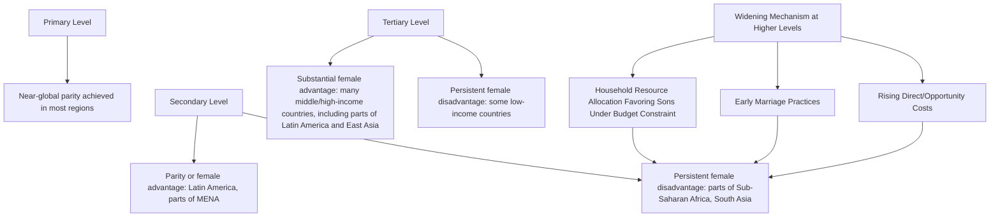

## Gender Gaps in Education

### Overview

Gender gaps in education refer to systematic differences in enrollment, attainment, learning outcomes, and returns to schooling between males and females. Development economics analyzes both the causes of these gaps (demand-side household decisions, supply-side barriers, social norms) and their downstream consequences for fertility, health, labor markets, and intergenerational human capital transmission — making gender gaps in education a connective topic linking human capital and demographic literatures.

### Measuring the Gap

**Key Points**

- **Gender Parity Index (GPI):** ratio of female to male values for a given education indicator (enrollment, attainment, literacy); a GPI of 1.0 indicates parity, below 1.0 indicates a female disadvantage, above 1.0 indicates a female advantage

$$\text{GPI} = \frac{\text{Female Indicator Value}}{\text{Male Indicator Value}}$$

- Gaps are tracked separately at each schooling level (primary, secondary, tertiary) since the gap magnitude and even direction can differ substantially by level within the same country
- Learning-outcome gaps (test scores in literacy, numeracy, specific subjects such as mathematics and science) are tracked separately from enrollment/attainment gaps, since a country can show enrollment parity while retaining substantial learning-outcome gaps by gender, or vice versa

### Historical and Global Patterns

**Key Points**

- Historically, most developing regions exhibited a female disadvantage in enrollment and attainment at all levels, with the gap generally widening at higher schooling levels (secondary and tertiary) due to compounding direct and opportunity costs, early marriage practices, and household resource allocation favoring sons where household budget constraints bind
- Global primary enrollment gender parity has been achieved or nearly achieved in most regions as of recent data, reflecting substantial convergence over the past several decades under Millennium Development Goal and Sustainable Development Goal (SDG 4/5) monitoring frameworks
- At secondary and tertiary levels, a striking pattern has emerged in several regions (Latin America and the Caribbean, parts of the Middle East and North Africa, and increasingly parts of East Asia): a **reversal** of the historical gap, with female enrollment now exceeding male enrollment — attributed in various studies to relatively higher labor market returns to male schooling being partly offset by lower male school engagement, and to rising female educational aspirations amid declining fertility and changing labor market opportunities [Unverified: the precise causal explanation for the reversal pattern is actively debated and likely varies by region]
- Sub-Saharan Africa and South Asia (particularly Afghanistan, and historically Pakistan in some regions) retain the largest remaining female disadvantage in enrollment and attainment among major world regions, though substantial within-region and within-country heterogeneity exists

### Diagram: Gender Gap Pattern by Region and Schooling Level (Illustrative)

### Demand-Side Determinants of the Gap

#### Household Resource Allocation and Son Preference

**Key Points**

- In contexts with binding household budget constraints and documented son preference, education investment is one channel through which unequal intra-household resource allocation manifests — parents facing a tradeoff between children's schooling may prioritize sons, particularly where anticipated labor market returns or old-age support expectations differ by child gender
- Unitary household models (treating the household as a single utility-maximizing decision unit) struggle to explain gender-differentiated investment patterns without an explicit preference parameter; collective/bargaining household models (in which mothers' and fathers' relative bargaining power affects allocation) are more commonly used in the literature to explain observed patterns, particularly findings that resources controlled by mothers are more likely to be allocated toward daughters' schooling in various studies [Inference: this pattern reflects a recurring finding across multiple household bargaining studies, with magnitude varying by context]

#### Opportunity Cost of Girls' Time

**Key Points**

- In many agrarian and low-income household contexts, girls face higher relative opportunity costs of schooling due to household responsibilities (domestic labor, childcare of younger siblings, water/fuel collection) disproportionately assigned to girls relative to boys
- This channel interacts with distance-to-school: since domestic responsibilities and safety concerns both scale with time away from home, school proximity (or lack thereof) tends to have a disproportionately larger negative effect on girls' enrollment than boys' in several studies, motivating school-construction and school-proximity policy as a gender-targeted (even when not explicitly gender-labeled) intervention

#### Early Marriage and Childbearing

**Key Points**

- Early marriage is documented across multiple studies as a leading direct cause of female secondary school dropout in regions with high child marriage prevalence (South Asia, parts of Sub-Saharan Africa and the Middle East), operating both through direct withdrawal from school at marriage and through anticipatory effects (households limiting investment in girls' schooling anticipating early marriage regardless of exact timing)
- The causal relationship runs in both directions in the literature: early marriage curtails schooling, while conversely, each additional year of schooling is associated with delayed marriage age in multiple studies — creating a two-way reinforcing relationship that motivates both education-focused and marriage-age-focused policy interventions targeting the same underlying gap

#### Safety and Social Norms

**Key Points**

- Concerns about girls' safety in transit to school (particularly where schools are distant, requiring travel through unsafe areas) and social norms regarding appropriate female behavior/mobility outside the household are documented determinants of female school access and continuation in various contexts, though quantifying the independent causal weight of this channel separate from distance and opportunity-cost channels is methodologically difficult
- Menstrual hygiene management (access to sanitation facilities, privacy, and hygiene products at school) has been increasingly studied as a specific barrier to girls' continued secondary school attendance, with some but not conclusive evidence of enrollment/attendance effects from sanitation and hygiene product provision interventions [Unverified: evidence on the magnitude of menstrual-hygiene-focused interventions is mixed across the small number of rigorous studies conducted to date]

### Supply-Side and Institutional Determinants

**Key Points**

- Gender-segregated schooling availability (or lack thereof) affects enrollment in contexts where social norms restrict co-educational schooling, particularly at the secondary level as students reach puberty
- Female teacher representation is documented in several studies as positively associated with female student enrollment and retention, hypothesized to operate through role-model effects and parental comfort with female teachers supervising girls, though rigorous causal identification of this specific channel is limited relative to the correlational evidence [Unverified: causal magnitude of the female-teacher-representation channel, isolated from confounding school-quality factors, is not firmly established]
- Curriculum content and gender stereotyping within instructional materials have been studied as potential contributors to gender gaps in specific subject areas (mathematics, science) even where overall enrollment gaps have closed, an area of growing but still-developing research attention [Inference: characterization reflects an emerging rather than fully mature area of the literature]

### Policy Interventions and Evidence

#### Conditional Cash Transfers Targeted at Girls

**Key Points**

- Several conditional cash transfer programs have included girl-specific components or higher transfer amounts for girls (recognizing higher relative dropout risk and opportunity cost), with randomized evaluations generally finding positive effects on female enrollment and delayed marriage age, though effect sizes vary substantially by program design and context
- Examples frequently cited in the literature include Bangladesh's Female Secondary School Stipend Program and various components of Latin American conditional cash transfer programs (Progresa/Oportunidades in Mexico) that included differential incentives by gender

#### School Construction and Proximity Interventions

**Key Points**

- Given the disproportionate effect of distance on girls' enrollment discussed above, school construction programs are frequently evaluated with attention to differential gender effects, with several studies finding larger enrollment gains for girls than boys from proximity-focused school construction, consistent with the higher baseline sensitivity of girls' enrollment to distance/safety costs

#### Information and Role-Model Interventions

**Key Points**

- Information interventions providing evidence on actual labor market returns to female schooling (correcting potentially pessimistic parental beliefs about returns to educating daughters) have been evaluated in some studies with positive effects on parental investment intentions and subsequent measured schooling outcomes, though the durability and scalability of information-based interventions specifically is less established than for direct cost-reduction interventions [Unverified: information-intervention effect sizes and persistence over time remain less thoroughly studied than cost-based interventions like CCTs]

### Downstream Consequences of Closing the Gap

**Key Points**

- Female education is consistently linked in the literature to lower fertility (via the mechanisms discussed extensively in the fertility decline determinants and quantity-quality tradeoff literature), improved child health outcomes, and higher intergenerational human capital transmission to children
- Cross-country growth accounting exercises attribute a meaningful, though variably estimated, share of aggregate output loss in gender-gap-affected economies to the underutilization of female human capital, motivating gender gap closure as a growth policy priority independent of any direct welfare or rights-based rationale [Inference: the specific magnitude of estimated growth losses varies substantially across studies and methodologies and should not be treated as a single precise consensus figure]
- The Kerala, India case study (discussed in the population policy literature) is frequently cited as a demonstration of the compounding development benefits of closing female education gaps specifically, given Kerala's markedly better health, fertility, and human development outcomes relative to its income level, attributed substantially to sustained investment in female education

### Related Topics

- Returns to education in developing countries (gender differences in measured returns)
- Fertility decline determinants (female education as a primary driver)
- School enrollment and attainment trends (gender parity index trends)
- Household bargaining models and intra-household resource allocation
- Population policy case studies (Kerala model)
- Child marriage economics and its bidirectional relationship with schooling
- Conditional cash transfer program design (Progresa/Oportunidades, Female Secondary School Stipend Program)
- Women's empowerment and labor force participation