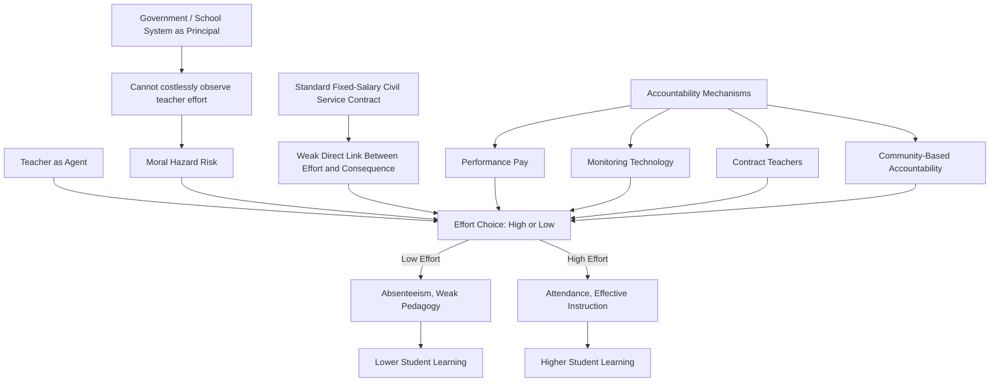
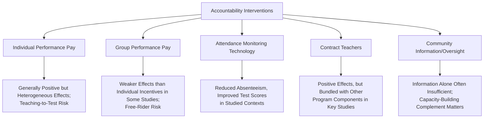

## Teacher Incentives and Accountability

### Overview

Teacher incentives and accountability systems are policy mechanisms designed to address the "credentials paradox" documented in education production function research: observable teacher characteristics (education level, certification, experience) are weak predictors of actual classroom effectiveness, while teacher effort, attendance, and pedagogical practice are strong predictors but difficult to observe and contract on directly. This has motivated a substantial applied literature evaluating performance pay, monitoring technology, contract structure, and community-based accountability as levers to improve teacher effort and, ultimately, student learning.

### The Underlying Problem: Teacher Effort as a Principal-Agent Problem

**Key Points**

- The teacher-student-government relationship is commonly modeled in the literature as a principal-agent problem: the government (or school system) as principal cannot costlessly observe teacher effort (the agent's action), creating scope for moral hazard — teachers may exert less effort than socially optimal when compensation is not linked to observable performance or effort proxies
- Standard civil-service teacher employment contracts in many developing-country public education systems feature fixed salaries with limited performance differentiation and, in many contexts, strong job security protections, which several studies argue weakens the direct incentive linkage between teacher effort and consequences, contributing to the documented teacher absenteeism and effort gaps discussed in the education production function literature [Inference: this principal-agent framing is a standard economic lens applied in the literature rather than a claim that fixed contracts are the sole cause of low effort]
- Community and parental oversight capacity is often limited by information asymmetry (parents, especially in low-literacy contexts, may have limited ability to directly assess teaching quality) and by weak institutional channels for translating parental concern into consequences for teacher performance

### Diagram: Teacher Accountability Principal-Agent Structure

### Performance-Based Pay (Merit Pay)

#### Design Variants

**Key Points**

- **Individual teacher-level incentives:** bonuses or salary adjustments tied to a specific teacher's students' measured learning gains, typically via value-added test score measures
- **Group/school-level incentives:** bonuses tied to aggregate school-level performance, intended to encourage collaborative effort and reduce incentives for narrow individual gaming, at the cost of potential free-riding among teachers within the rewarded group
- **Input-based incentives:** bonuses tied to observable behaviors correlated with effort (attendance, lesson plan completion) rather than output (test scores) directly, used where output measurement is unreliable or contested

#### Empirical Evidence

**Key Points**

- Muralidharan and Sundararaman's (2011) randomized evaluation of a teacher performance pay program in Andhra Pradesh, India, is among the most widely cited studies in this literature, finding that individual teacher incentives tied to student test score gains produced statistically significant improvements in both math and language test scores, with individual incentives outperforming group incentives in the specific design tested
- Findings across the broader performance pay literature are more mixed than this single influential study might suggest in isolation — several other randomized evaluations in different country contexts have found smaller, null, or more contested effects, and systematic reviews generally characterize the evidence as positive on average but heterogeneous in magnitude across specific program designs and contexts [Unverified: aggregate meta-analytic effect size estimates vary by review and inclusion criteria, and no single point estimate should be treated as definitive across all contexts]
- A recurring concern documented across multiple studies is **teaching to the test** — narrowing instructional focus to tested content/format at the expense of broader curriculum coverage or genuine skill development — representing a form of unintended behavioral response (a documented risk in principal-agent settings more generally when the measured proxy imperfectly captures the true desired outcome)
- Multitasking concerns (Holmström and Milgrom's classic multitask agency framework) are frequently invoked in this literature: teachers have multiple valued objectives (test scores, broader student development, classroom management, extracurricular support), and incentivizing only the most easily measured dimension (test scores) risks distorting effort away from harder-to-measure but still valuable dimensions

### Teacher Attendance Monitoring

**Key Points**

- Duflo, Hanna, and Ryan's (2012) study of a camera-based monitoring program in India (using timestamped photographs to verify teacher attendance, linked to pay) is a widely cited example of technology-based monitoring, finding substantial reductions in teacher absenteeism and corresponding improvements in student test scores in the treated schools
- This study is frequently cited in the literature as evidence that simple, low-cost monitoring technology can meaningfully improve teacher accountability where baseline monitoring infrastructure is weak, though scaling such interventions system-wide raises distinct implementation, political economy, and potential teacher-relations challenges not fully captured in a smaller-scale randomized pilot [Inference: this scaling caveat reflects a standard external-validity concern raised across the broader RCT-to-policy literature, not a specific finding about this study]
- Unannounced school visit surveys (used in several country-level Service Delivery Indicator surveys conducted by the World Bank) provide complementary descriptive evidence on baseline teacher absenteeism rates across countries, informing the broader case for accountability interventions independent of any specific program evaluation

### Contract Teachers and Alternative Employment Models

**Key Points**

- Several developing countries have expanded the use of locally-hired "contract teachers" employed on fixed-term, lower-job-security contracts (often at lower pay than civil-service teachers) as a policy response intended to increase effort accountability and reduce the fiscal cost of rapid enrollment-driven teacher hiring needs
- Randomized evaluations, including a large-scale study in Kenya (Duflo, Dupas, and Kremer, 2015) evaluating contract teachers combined with class-size reduction (tracking students by ability into smaller classes with contract teachers), found positive learning effects from contract teacher employment, generating debate over whether the effect derives from the weaker-job-security/stronger-accountability contract structure itself, the reduced class size, or the ability-tracking component, since these were often bundled in specific program designs [Unverified: precise decomposition of effects across bundled program components varies by study design and is not resolved into a single universal attribution]
- Contract teacher policies raise distinct equity and labor-rights considerations (lower pay, weaker job security, potential exclusion from civil-service benefits) that are discussed in the broader teacher labor market and public-sector employment literature alongside the learning-outcome evidence

### Community-Based Accountability

**Key Points**

- Community-based monitoring interventions — providing parents/School Management Committees with information on school performance (e.g., report cards on teacher attendance, test scores) and/or formal oversight authority — have been evaluated with mixed results across different country contexts
- Banerjee et al.'s studies of community monitoring interventions in India generally found limited effects from information provision alone absent complementary changes to actual community authority or capacity to act on that information, suggesting information deficits are not always the binding constraint on community accountability [Unverified: this finding is drawn from a specific set of studies and may not generalize to all community accountability program designs or contexts]
- More successful community accountability interventions in the literature tend to combine information provision with direct capacity-building or facilitation (structured meeting formats, specific action-planning tools) rather than information disclosure alone, suggesting the binding constraint in many contexts is less about information availability and more about translating information into coordinated community action [Inference: this comparative characterization synthesizes patterns across multiple community-accountability studies rather than a single specific finding]

### Diagram: Summary of Accountability Intervention Evidence

### Teacher Motivation Beyond Financial Incentives

**Key Points**

- Some studies and policy discussions emphasize non-financial dimensions of teacher motivation — professional respect, meaningful career progression, working conditions, and intrinsic motivation — cautioning against a purely extrinsic-incentive framing of the teacher effort problem
- There is a documented concern in the broader incentive-design literature (drawing on psychological and behavioral economics research, not specific to education) that strong extrinsic financial incentives can, in some circumstances, crowd out intrinsic motivation for tasks with an inherently prosocial or vocational character such as teaching, though the empirical evidence specifically within the education-incentive literature on crowd-out effects is more limited and contested than the general behavioral economics literature on the topic [Unverified: whether crowd-out is empirically significant specifically in teacher performance-pay contexts, as opposed to being a more general behavioral economics concern, remains an open and debated question]

### Policy Design Considerations

**Key Points**

- Measurement validity is a first-order design concern: performance metrics narrow enough to be gameable (raw test scores without value-added adjustment, single-subject focus) create stronger teaching-to-test and gaming risk than broader or value-added-adjusted metrics
- Political economy and teacher union dynamics substantially shape the feasibility of implementing individual performance-based pay or reduced job security at national scale, even where pilot evidence is favorable — several countries with positive small-scale pilot results have faced substantial implementation barriers scaling programs system-wide [Inference: this characterization reflects a commonly noted implementation gap between pilot evidence and national policy adoption discussed in the broader education policy literature]
- A combined approach — pairing accountability/incentive mechanisms with complementary investment in teacher training, pedagogical support, and instructional materials (as in the structured pedagogy literature) — is generally favored in more recent policy synthesis work over accountability mechanisms applied in isolation, on the reasoning that incentives alone cannot substitute for teachers lacking the skills or tools to improve performance even when motivated to do so

### Related Topics

- Education production functions (teacher quality as an input)
- Quality of education versus access (the learning crisis context motivating accountability reform)
- Teaching at the Right Level (TaRL) and structured pedagogy as complementary interventions
- Principal-agent theory and multitask incentive design (Holmström-Milgrom framework)
- Public-sector labor economics and civil service employment structures
- Randomized controlled trials in development economics: methodology
- Behavioral economics of intrinsic versus extrinsic motivation
- School enrollment and attainment trends (rapid hiring needs from enrollment expansion)