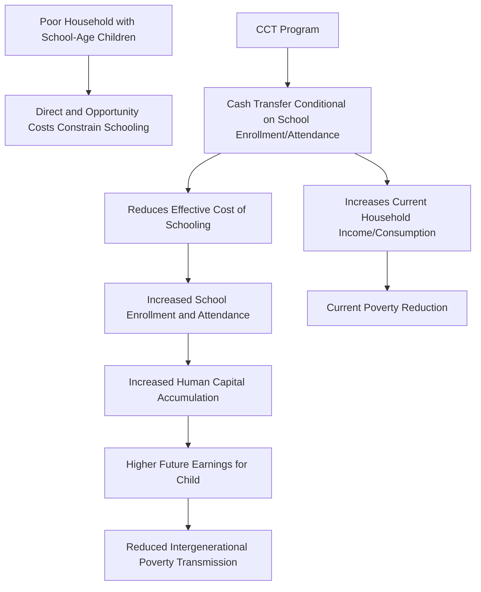
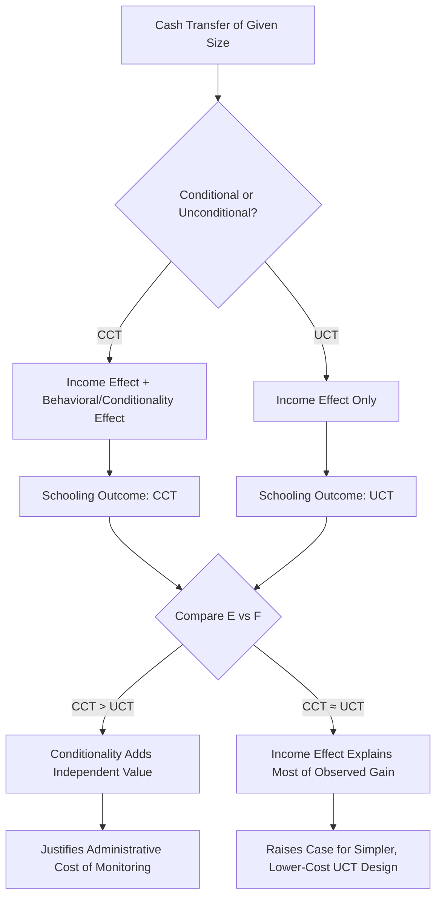

## Conditional Cash Transfers for Education

### Overview

Conditional cash transfer (CCT) programs provide cash payments to households contingent on specified behaviors, most commonly school enrollment and attendance for children. Originating with Mexico's Progresa (later Oportunidades, now Prospera) in 1997, CCTs became one of the most widely adopted and rigorously evaluated social policy instruments in development economics, generating a large evidence base on demand-side education interventions and influencing similar program design across dozens of countries.

### Theoretical Rationale

**Key Points**

- CCTs address the demand-side determinants of low school enrollment discussed in the education access literature: direct costs (fees, materials, uniforms) and opportunity costs (foregone child labor income) that constrain poor households' schooling investment even where returns to education are positive
- The conditionality feature (versus an unconditional transfer of equivalent size) is theoretically motivated by two distinct arguments: (1) a paternalistic/behavioral rationale that households may under-invest in children's schooling relative to the child's or society's welfare-maximizing level, due to intra-household allocation frictions or myopic decision-making, and (2) a political-economy rationale that conditionality increases public and legislative support for transfers to the poor by linking payments to a broadly valued behavior, rather than reflecting a claim that unconditional transfers would necessarily be less effective at raising school enrollment specifically
- CCTs are frequently framed in the literature as pursuing a dual objective — addressing current poverty (via the cash transfer itself) and reducing future/intergenerational poverty (via the human capital investment induced by the schooling condition) — distinguishing them from pure income-support transfers focused only on current consumption smoothing

### Program Design Elements

**Key Points**

- **Transfer amount and structure:** many programs scale transfer amounts by schooling level (higher transfers for secondary than primary school attendance, reflecting higher opportunity costs and dropout risk at higher grades) and by child gender (higher transfers for girls in some programs, reflecting the gender gap dynamics discussed in the gender gaps in education literature)
- **Conditionality verification:** typically requires a minimum attendance rate (e.g., 80-85% of school days) verified through school administrative records, with varying degrees of monitoring rigor and enforcement across programs
- **Payment recipient:** most major programs (Progresa/Oportunidades, Bolsa Família) direct payments to mothers specifically, motivated by household bargaining literature suggesting resources controlled by mothers are more likely allocated toward children's welfare, including schooling, than resources controlled by fathers [Inference: this design choice reflects an assumption drawn from household bargaining research rather than a claim verified independently within every CCT program's own evaluation]
- **Complementary conditions:** many programs bundle the education condition with health/nutrition conditions (health check-up attendance, growth monitoring for young children), reflecting a broader human capital investment objective beyond education specifically

### Diagram: CCT Program Logic Model

### Key Programs and Evidence

#### Mexico: Progresa / Oportunidades / Prospera

**Key Points**

- Launched in 1997 (as Progresa, renamed Oportunidades in 2002, later Prospera), this program is distinguished by having been implemented with an explicit randomized phase-in design from inception — a relatively rare feature for a large national social program — allowing exceptionally credible causal evaluation of its effects
- Randomized evaluations found significant increases in secondary school enrollment, with effects generally larger at the secondary level (where dropout risk and opportunity costs were higher at baseline) than at the already higher-enrollment primary level, and larger effects for girls than boys in several analyses, consistent with the gender-differentiated dropout risk discussed in gender gap literature
- Long-run follow-up studies of Progresa beneficiaries (tracking cohorts into adulthood) have found some evidence of improved adult labor market outcomes and educational attainment among children who benefited from the program during their school-age years, though the precise long-run earnings effects and their generalizability remain subject to ongoing research and some methodological debate [Unverified: specific long-run earnings magnitude estimates vary across follow-up studies and identification approaches]

#### Brazil: Bolsa Família

**Key Points**

- Launched in 2003, consolidating several previous smaller conditional transfer programs into a single national program, Bolsa Família became one of the largest CCT programs globally by number of beneficiary households
- Evaluations have generally found positive effects on school enrollment and attendance, alongside documented effects on poverty and inequality reduction (given the program's substantial scale relative to Brazil's population), though the causal isolation of Bolsa Família's specific contribution to observed inequality trends versus other concurrent Brazilian social and macroeconomic policies during the 2000s-2010s is methodologically complex and debated among researchers [Unverified: precise decomposition of Bolsa Família's independent contribution to broader poverty/inequality trends, separate from concurrent economic growth and other policies, is contested]

#### Bangladesh: Female Secondary School Stipend Program

**Key Points**

- A stipend program targeted specifically at girls' secondary school enrollment, motivated by the gender-differentiated dropout risk and early marriage dynamics discussed in the gender gaps in education literature, generally found to be associated with increased female secondary enrollment and delayed marriage age in evaluations, though as with several large-scale national programs, rigorous experimental identification (as opposed to before-after or non-experimental comparison) is less available than for the Mexican and some other more experimentally-evaluated programs [Unverified: evaluation designs for this program are generally considered less rigorous than the randomized Progresa evaluation]

### Conditional vs. Unconditional Transfers: The Comparative Evidence

**Key Points**

- A distinct strand of the literature directly compares conditional and unconditional cash transfers (UCTs) of similar magnitude to isolate the specific effect of the conditionality requirement itself, since a simple CCT-versus-no-transfer comparison cannot separate the income effect of the transfer from the behavioral effect of the condition
- Findings across this comparative literature are mixed: some studies (e.g., a widely cited Malawi girls' education cash transfer study by Baird, McIntosh, and Özler, 2011) find that conditional transfers produce larger schooling effects than unconditional transfers of similar size, supporting a meaningful independent role for conditionality; other studies find comparable effects between conditional and unconditional transfers on schooling outcomes, suggesting the income effect alone may account for much of the observed schooling improvement in some contexts [Unverified: the CCT-versus-UCT comparative literature does not offer a single universal conclusion, and relative effectiveness appears to be context- and program-design-dependent]
- This comparative evidence has practical policy relevance given that conditionality imposes real administrative costs (attendance monitoring and verification infrastructure) that unconditional transfers avoid — meaning the case for conditionality depends on the incremental schooling benefit exceeding this additional administrative cost, a calculation that varies by context

### Diagram: CCT vs. UCT Comparative Evaluation Logic

### Effects Beyond Enrollment: Learning and Broader Human Capital

**Key Points**

- A consistent finding across multiple CCT evaluations is that programs are considerably more effective at raising school *enrollment and attendance* than at raising actual *learning outcomes* — directly paralleling the broader access-versus-quality distinction discussed in the quality-of-education literature, since CCTs primarily address demand-side access barriers rather than school-side quality determinants
- This has motivated a body of research and policy discussion on combining CCTs with supply-side quality interventions (teacher accountability, structured pedagogy, school quality investment) rather than treating CCTs as a stand-alone solution to human capital deficits, since getting children into school does not, by itself, resolve the "learning crisis" gap discussed extensively elsewhere in this chapter [Inference: this integrative policy conclusion synthesizes findings from the CCT evaluation literature combined with the education-quality literature rather than being a claim made by a single specific study]
- Health-related conditionalities bundled into many CCT programs have shown documented positive effects on child health and nutrition indicators in several evaluations, representing an additional and sometimes more consistently positive human capital channel than the education-specific learning-outcome effects

### Fiscal and Political Economy Considerations

**Key Points**

- CCTs are generally considered more fiscally targeted than universal subsidy programs (since eligibility is typically means-tested), though means-testing itself introduces administrative costs and potential targeting errors (exclusion of eligible poor households, inclusion of ineligible households) that vary by program design and country administrative capacity
- The political durability and popularity of CCT programs (Bolsa Família and Oportunidades/Prospera both persisted and expanded across multiple changes in national government) is frequently cited as evidence supporting the political-economy rationale for conditionality discussed above, though isolating this effect from the programs' substantive poverty and education impacts as a driver of their political survival is not straightforward [Inference: this political-economy observation is a commonly noted pattern in the CCT policy literature rather than a rigorously isolated causal finding]

### Related Topics

- School enrollment and attainment trends (the access outcomes CCTs primarily target)
- Gender gaps in education (gender-differentiated CCT design and effects)
- Quality of education versus access (limits of CCTs on the learning dimension)
- Household bargaining models and intra-household resource allocation
- Randomized controlled trials in development economics: methodology
- Unconditional cash transfer literature and universal basic income debates
- Progresa/Oportunidades/Prospera: full program evaluation history
- Bolsa Família and Brazilian poverty/inequality reduction policy