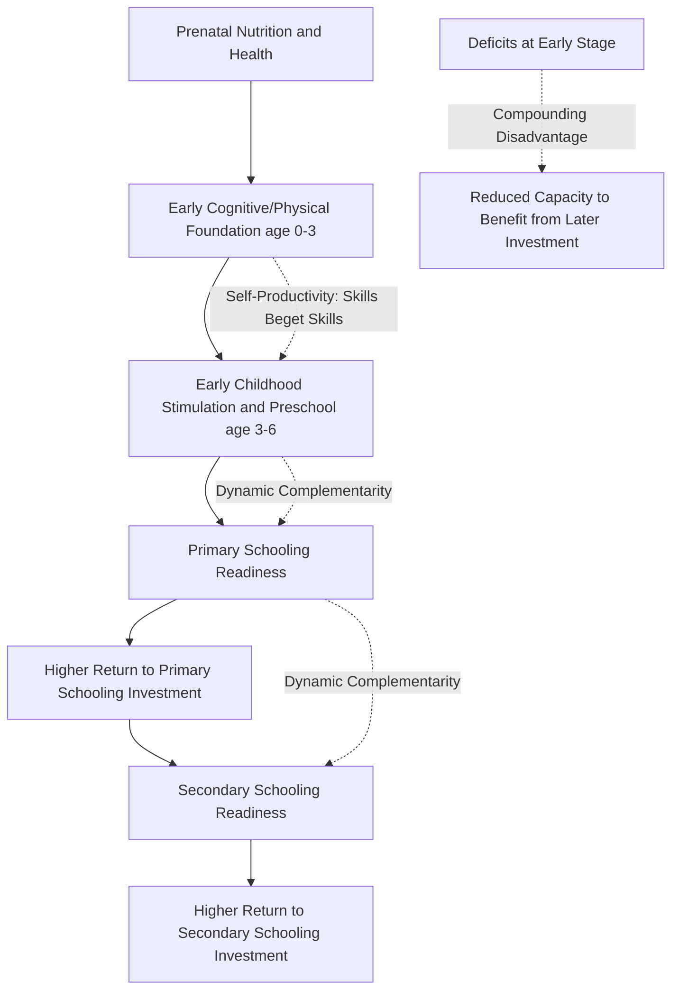
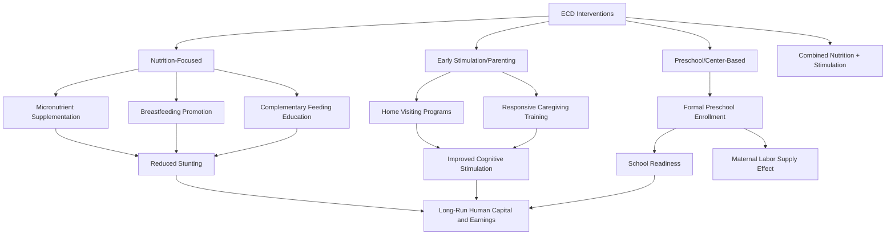

## Early Childhood Development Interventions

### Overview

Early childhood development (ECD) interventions target the period from prenatal development through approximately age 5-8, a window increasingly identified in economics and neuroscience research as critical for cognitive, socioemotional, and physical development with disproportionate influence on later-life human capital outcomes. Development economics has drawn substantially on the work of James Heckman and collaborators in formalizing why early investment may yield higher returns than equivalent later-life investment, motivating an expanding evidence base on nutrition, stimulation, and preschool interventions in low- and middle-income countries.

### Theoretical Foundation: The Heckman Curve and Dynamic Complementarity

**Key Points**

- Heckman's dynamic skill formation framework models human capital development as a cumulative process in which skills acquired at one stage raise the productivity of investment at subsequent stages — a property termed **dynamic complementarity** or **self-productivity**: "skills beget skills, and learning begets learning"
- This generates the widely cited "Heckman Curve," a stylized representation showing the economic rate of return to human capital investment declining with the age at which investment occurs — implying investment in the prenatal-to-age-5 period has the highest expected return per dollar invested relative to later interventions such as job training or remedial adult education, holding investment quality constant
- The theoretical mechanism operates through both direct skill formation (early cognitive stimulation building neural architecture) and dynamic complementarity (a child who enters primary school with stronger foundational skills is better positioned to benefit from subsequent schooling investment) — meaning ECD investment can raise the *marginal return* to later education spending, not just contribute an independent, separable return of its own
- [Inference] The precise quantitative shape and universality of the "Heckman Curve" across all contexts and investment types is a stylized theoretical summary rather than a single directly estimated empirical curve; specific rate-of-return estimates come from individual program evaluations (discussed below) rather than one unified measurement

### Diagram: Dynamic Complementarity in Skill Formation

### Categories of ECD Interventions

#### Nutrition-Focused Interventions

**Key Points**

- Target maternal nutrition during pregnancy and child nutrition during the critical first 1,000 days (conception to age 2), the period during which stunting (impaired linear growth reflecting chronic undernutrition) and its associated cognitive effects are most strongly established
- Common intervention types include micronutrient supplementation (iron, iodine, vitamin A), promotion of exclusive breastfeeding, complementary feeding education, and, in severe-deficiency contexts, therapeutic or supplementary feeding programs
- Stunting is used in the literature both as a direct nutritional health outcome and as a proxy marker correlated with cognitive development deficits, motivating its inclusion (alongside learning-adjusted schooling) in the World Bank's Human Capital Index discussed in the school enrollment and attainment trends and quality-of-education literature

#### Early Stimulation and Parenting Interventions

**Key Points**

- Focus on improving the quality of caregiver-child interaction — responsive caregiving, play-based cognitive stimulation, language exposure — often delivered through home visiting programs by community health workers or trained facilitators, rather than requiring formal center-based infrastructure
- The Jamaica home-visiting stimulation intervention (originally studied by Grantham-McGregor and colleagues in the 1980s, with long-run follow-up work substantially advanced by Gertler, Heckman, and coauthors published in the 2010s) is among the most influential studies in this sub-literature, providing weekly home visits promoting parent-child play and cognitive stimulation to stunted toddlers
- Long-run follow-up of the Jamaica study participants into adulthood (approximately 20 years post-intervention) found that treated individuals had meaningfully higher adult earnings compared to the control group, a finding widely cited in the ECD literature as some of the strongest available evidence of long-run economic returns to an early stimulation intervention specifically [Unverified: while the Jamaica study's findings are influential and widely cited, generalizability of this specific effect size to other contexts, populations, and program designs is not established, and the sample size in the original study was relatively small]

#### Preschool / Center-Based Early Education

**Key Points**

- Formal preschool provision (before compulsory primary school entry) is evaluated both for direct cognitive/school-readiness effects and for indirect effects via maternal labor supply (freeing mothers' time for market work when childcare is otherwise a binding constraint)
- Evidence on preschool quality effects generally mirrors the broader education-quality literature discussed in quality of education versus access: access to preschool alone, absent attention to curriculum quality and caregiver/teacher training, shows more limited and heterogeneous effects on school readiness than well-implemented, quality-focused programs
- Several randomized and quasi-experimental evaluations in developing-country contexts (including studies in Mozambique, Cambodia, and India) have found preschool access associated with improved school readiness and, in some cases, persistent effects into early primary grades, though effect persistence into later grades and adulthood is less consistently documented than for the more intensively-studied nutrition and stimulation interventions [Inference: this comparative characterization of relative evidence maturity across intervention types reflects the current state of the ECD literature rather than a claim about the interventions' relative underlying effectiveness]

#### Combined/Integrated Nutrition-Stimulation Interventions

**Key Points**

- A distinct strand of research (including a multi-country trial partly motivated by the original Jamaica study, involving countries such as Colombia, Bangladesh, and others) has evaluated interventions bundling nutritional supplementation with parenting/stimulation components, testing for interaction effects between the two intervention types
- Findings on whether combined nutrition-plus-stimulation interventions produce effects larger than the sum of each component delivered separately (a test of complementarity between nutritional and stimulation inputs) are mixed across studies and remain an active area of ongoing research [Unverified: the complementarity/synergy question between nutrition and stimulation interventions has not been resolved into a single consistent finding across the multi-country evidence base]

### Diagram: ECD Intervention Types and Primary Mechanisms

### Evidence on Long-Run Economic Returns

**Key Points**

- The Jamaica stimulation study's long-run earnings follow-up (finding treated individuals' adult earnings converging toward or exceeding a non-stunted comparison group) is the most frequently cited single piece of evidence for substantial long-run economic returns to an ECD stimulation intervention, though as noted, its small original sample size and single-country context limit the confidence with which the specific magnitude generalizes elsewhere
- Broader evidence syntheses (Nores and Barnett's cross-country review, among others) generally find ECD program benefit-cost ratios reported across studies to be favorable on average, though with substantial variance across specific program types, delivery quality, and target populations, cautioning against treating any single reported benefit-cost ratio as representative of ECD investment generally [Unverified: aggregate benefit-cost estimates across the ECD literature vary substantially by study and should not be summarized into one universal figure]
- A distinct and more extensively documented U.S.-context evidence base (the Perry Preschool Project and Abecedarian Project, both with multi-decade follow-up) is frequently cited in support of high ECD returns generally, but caution is warranted extrapolating findings from these specific, intensive, small-sample U.S. programs directly to lower-resource developing-country program designs and contexts, which differ substantially in program intensity, target population baseline conditions, and complementary institutional environment [Inference: this generalizability caveat is a standard methodological caution raised when cross-applying findings from the U.S. ECD literature to developing-country policy contexts]

### Policy Rationale and Integration with Broader Human Capital Strategy

**Key Points**

- ECD investment is increasingly incorporated into the broader human capital policy framework alongside the education-quality and health interventions discussed elsewhere in this chapter, reflecting the dynamic complementarity argument that later-stage schooling investment yields higher returns when children arrive at school better prepared
- The World Bank's Human Capital Index incorporates a stunting-based proxy for early childhood health/nutritional status alongside schooling-based measures, operationalizing the ECD-schooling complementarity argument within a single cross-country comparative metric
- From an equity perspective, ECD interventions are frequently argued in the literature to have a particularly strong case for public investment given that early childhood disadvantage (poverty, poor maternal health, low-stimulation home environments) is largely outside a young child's control and, per the dynamic complementarity mechanism, compounds into larger later-life disadvantage absent early intervention — a distinct rationale from the pure efficiency/rate-of-return argument emphasized in the Heckman framework [Inference: this equity framing reflects a recurring argument in the ECD policy literature alongside, but analytically distinct from, the efficiency-based Heckman Curve argument]

### Implementation Challenges in Developing-Country Contexts

**Key Points**

- Scaling home-visiting or center-based ECD programs requires a trained workforce (community health workers, preschool teachers/caregivers) whose availability, training quality, and retention are frequently cited as binding constraints on program quality at scale, paralleling the teacher-quality challenges documented in the broader education-quality literature
- Targeting and reaching the most disadvantaged children (who theoretically stand to benefit most from ECD investment, per the compounding-disadvantage equity argument) is complicated by the same access barriers (rural remoteness, extreme poverty, limited health system contact points) that constrain other health and education interventions among the poorest populations
- Measuring ECD program impact is methodologically more complex than measuring school-age learning outcomes, since standardized, culturally-validated early childhood development assessment instruments are less mature and less widely available across diverse developing-country linguistic and cultural contexts than school-age literacy/numeracy assessments (such as EGRA/EGMA, discussed in the quality-of-education literature) [Inference: this measurement-challenge characterization reflects methodological discussion common in the ECD evaluation literature]

### Related Topics

- Quality of education versus access (dynamic complementarity linking ECD to later schooling quality)
- Education production functions (health/nutrition as inputs to later learning)
- Returns to education in developing countries (Heckman Curve as a rate-of-return framework)
- World Bank Human Capital Index and stunting-based proxy measures
- Fertility decline determinants (child health and the quantity-quality tradeoff)
- Jamaica stimulation study and long-run follow-up methodology (Gertler, Heckman et al.)
- Perry Preschool and Abecedarian Project (U.S. comparative evidence base)
- Maternal and child health economics