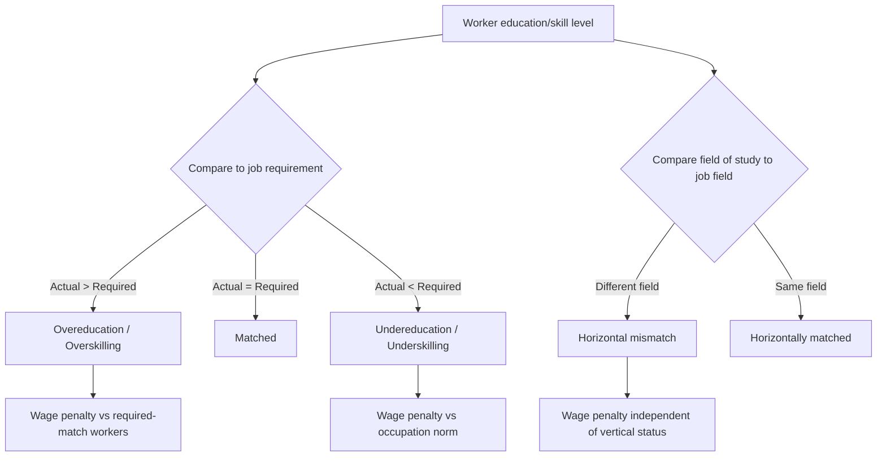

## Higher Education and Skills Mismatch

### Definition and Conceptual Framework

Skills mismatch refers to a disequilibrium between the skills possessed by the labor force (largely shaped by higher education output) and the skills demanded by employers. It is distinct from simple unemployment: mismatch can coexist with full employment if workers are misallocated across jobs rather than absent from work entirely.

The literature decomposes mismatch into several distinct phenomena:

- **Vertical mismatch (overeducation/undereducation)**: a worker's attained education level exceeds or falls short of the level required for their job
- **Horizontal mismatch**: the field of study does not align with the field of employment, regardless of level
- **Skills-based mismatch**: a gap between the specific competencies (cognitive, technical, or soft skills) possessed and those required, which may exist even absent formal qualification mismatch
- **Skills obsolescence**: skills that were once matched to job requirements depreciate over time due to technological change or lack of use

These categories are conceptually separable but empirically correlated, and studies often conflate them due to data constraints (e.g., using only qualification levels as a proxy for skills).

### Theoretical Foundations

**Human capital theory** (Becker, Mincer) predicts no persistent mismatch in competitive labor markets: wages should adjust to clear the market for each skill level, and any mismatch should be transitional, resolved through job search and mobility.

**Job competition and assignment models** (Thurow's job competition model; Sattinger's assignment models) offer an alternative: workers queue for jobs based on relative trainability signaled by education, and jobs carry fixed skill requirements independent of worker supply. Under this framework, an oversupply of educated workers does not raise the skill requirements of jobs one-for-one; instead it pushes credential inflation, with excess educated workers displacing less-educated workers into progressively lower-skill jobs ("bumping down" or "cascading").

**Signaling/screening theory** (Spence) implies that a portion of the return to education reflects sorting rather than productivity enhancement. If credentials substantially function as signals, then expansion of higher education without a matching expansion in skill-intensive job creation produces literal overqualification: workers hold credentials exceeding the productive requirements of available jobs, without a compensating increase in productivity.

**Search and matching theory** (Diamond-Mortensen-Pissarides framework) treats mismatch as a frictional phenomenon: information asymmetries, search costs, and heterogeneity in both jobs and workers generate an equilibrium unemployment/mismatch rate even when aggregate vacancies equal aggregate job seekers. The **Beveridge curve** — plotting vacancy rates against unemployment rates — shifts outward when mismatch increases, since more vacancies coexist with a given unemployment rate.

### Measurement Approaches

**Objective/statistical methods**:

- **Realized Matches (RM)**: computes the modal or mean education level within an occupation (using standardized classifications such as ISCO) and classifies workers above/below one standard deviation as over/undereducated
- **Job Analysis (JA)**: relies on external expert assessments of required education per occupation (e.g., O*NET in the US), independent of the realized workforce composition

**Subjective/self-reported methods**:

- Direct survey questions asking workers whether their education matches job requirements, or whether they use the skills they possess
- Prone to self-serving bias and reference-group effects, but capture skills mismatch dimensions that credential-based measures miss

**Skills-based direct measurement**:

- Instruments such as the OECD's **Programme for the International Assessment of Adult Competencies (PIAAC)** directly test literacy, numeracy, and problem-solving in technology-rich environments, then compare test scores to self-reported skill use on the job. This allows separation of qualification mismatch from actual skills mismatch — a worker can be "overqualified" by credential yet appropriately matched (or even underskilled) by actual competency.

**Wage-based inference**: since overeducation is empirically associated with a wage penalty relative to correctly matched workers of the same education level (though a premium relative to correctly matched workers in the same occupation), wage residuals are sometimes used to infer mismatch, though this conflates mismatch with other unobserved heterogeneity.

### The ORU (Overeducation-Required Education-Undereducation) Wage Equation

The dominant empirical specification, following Duncan and Hoffman (1981), decomposes a worker's actual years of schooling ($S_a$) into required years ($S_r$), years of overeducation ($S_o$), and years of undereducation ($S_u$):

$$S_a = S_r + S_o - S_u$$

The Mincerian wage equation is then estimated as:

$$\ln W = \beta_0 + \beta_r S_r + \beta_o S_o + \beta_u S_u + \gamma X + \varepsilon$$

where $X$ is a vector of controls (experience, tenure, sector, etc.). Robust empirical regularities across countries and time periods:

- $\beta_r > \beta_o > 0$: returns to required schooling exceed returns to surplus schooling, but surplus schooling still commands a positive wage premium (overeducated workers earn more than correctly matched workers in the same occupation, since some skill from the extra schooling has residual productivity value)
- $\beta_u < 0$: undereducated workers face a wage penalty relative to what their occupation would otherwise pay, though they typically still out-earn correctly matched workers with their own (lower) actual schooling level

This pattern is difficult to reconcile with a pure human capital, competitive-market story (which would predict $\beta_o \approx 0$, since the surplus is unused) and is more consistent with assignment/job competition models where firms partially reward credentials independent of the task's technical requirement.

### Empirical Prevalence and Trends

[Inference] Cross-country estimates of overeducation prevalence typically range from roughly 15% to over 30% of the employed graduate workforce depending on measurement method (realized matches tends to yield lower estimates than self-reported measures), country, and time period. Because measurement approaches diverge substantially, cross-study comparisons of exact rates should be treated cautiously rather than as tightly pinned parameters.

Structural drivers of rising overeducation prevalence identified in the literature:

- **Massification of higher education**: rapid expansion of tertiary enrollment (a global trend from roughly the 1990s onward) has, in many economies, outpaced the growth rate of high-skill job creation
- **Skill-biased technical change (SBTC)**: technology has generally raised relative demand for skilled labor, but the pace and sectoral distribution of this demand growth vary, creating field-specific and cohort-specific mismatches even amid aggregate skill-biased demand growth
- **Task-biased technical change / job polarization**: an alternative and increasingly dominant framework (Autor, Levy, Murnane; Goos and Manning) holds that automation substitutes for routine tasks (both cognitive and manual) at the middle of the skill distribution, while complementing non-routine cognitive tasks (top) and being largely unable to substitute for non-routine manual tasks (bottom). This produces employment polarization — growth at the top and bottom of the wage distribution, hollowing of the middle — which can strand middle-skill graduates whose training targeted routine-cognitive occupations (e.g., some clerical and administrative professional tracks)
- **Business cycle effects**: overeducation rises during downturns as graduates accept jobs below their qualification level rather than remain unemployed ("bumping down"), and this effect can persist ("scarring") even after the cycle turns

### Horizontal (Field-of-Study) Mismatch

Horizontal mismatch is analytically distinct from vertical mismatch and arises even when overall education levels are correctly calibrated to labor demand, because the *distribution across fields* does not match demand distribution across fields. Key findings:

- Horizontal mismatch is generally associated with a wage penalty independent of vertical mismatch, though the size of the penalty varies substantially by field
- Fields with more occupation-specific, licensed, or vocationally structured curricula (engineering, medicine, education, law) exhibit lower horizontal mismatch rates than general or liberal-arts-type fields, since the latter produce more transferable but less occupation-specific human capital
- [Inference] The relative wage penalty from horizontal mismatch appears comparable in magnitude to vertical mismatch in several studies, though the balance shifts by country and field, so no single ratio should be treated as a fixed stylized fact.

### Developing-Country Dimensions

Development economics places particular emphasis on structural features that shape mismatch differently than in advanced economies:

- **Dualistic labor markets**: a large informal sector absorbs graduates unable to secure formal-sector employment matching their credentials; informal employment of tertiary graduates functions as disguised unemployment/underemployment more than a market-clearing outcome
- **Public sector wage premium legacies**: in many developing economies, historical patterns of public-sector employment as the primary destination for graduates (particularly in the Middle East and North Africa, and parts of Sub-Saharan Africa) created queuing behavior — graduates wait, sometimes for years, for public-sector openings rather than accept private-sector jobs, generating measured unemployment or mismatch that reflects institutional wage-setting rather than skill deficiency
- **Supply-driven expansion without demand-side coordination**: higher education expansion in many developing countries has been driven by social-demand and political pressures (access as a right, or as elite-formation) rather than labor-market signals, producing an oversupply of certain generalist degrees relative to the technical/vocational skills demanded by industrializing sectors
- **Brain drain interactions**: mismatch can be a *driver* of skilled emigration, since domestically mismatched workers seek returns to their credentials abroad; this creates a feedback loop where domestic skill mismatch and international skill flows are jointly determined rather than independent phenomena
- **Curriculum-industry disconnect**: [Unverified as a precise magnitude, but qualitatively well-documented in World Bank and ILO skills-gap surveys] employer surveys in many developing economies report that graduates lack applied, practical, and soft skills (communication, teamwork, problem-solving) even when technical curricular content is nominally adequate, suggesting mismatch operates partly through pedagogy and industry linkage rather than curriculum content alone

### Skills Mismatch vs. Skills Shortage vs. Skills Gap

These terms are frequently used interchangeably in policy discourse but denote distinct phenomena:

| Term | Definition | Labor market signature |
| --- | --- | --- |
| Skills mismatch | Misallocation between existing worker skills and existing job requirements | Coexistence of unemployment/overqualification and unfilled vacancies |
| Skills shortage | Insufficient aggregate supply of a given skill relative to demand at prevailing wages | Persistent unfilled vacancies, rising relative wages for the skill, low unemployment in that occupation |
| Skills gap | A firm-level or aggregate deficiency between current worker competency and competency needed for a specific task or technology | Reported via employer surveys; not always visible in wage or vacancy data |

Conflating these leads to policy error: a genuine skills shortage calls for supply expansion (more graduates in the field), while a mismatch calls for reallocation (better matching mechanisms, information, or portable credentials) — and the wrong diagnosis leads to further credential inflation without demand-side improvement.

### Policy Responses

**Vocational and dual-education systems**: countries with strong vocational/apprenticeship tracks integrated with employers (Germany's dual system, Switzerland) show empirically lower youth unemployment and lower reported overeducation rates, attributed to close employer involvement in curriculum design and the signal value of vocational credentials being more occupation-specific than general academic degrees. [Inference] The causal contribution of the dual system itself, versus other confounding institutional and macroeconomic features of these economies, is difficult to isolate cleanly in cross-country comparisons.

**Labor market information systems**: improving information flow (career guidance, graduate tracer studies, labor market observatories) to prospective students before field-of-study choice, aimed at reducing horizontal mismatch driven by uninformed enrollment decisions.

**Sectoral and employer-linked training**: demand-driven training models (sector skills councils, employer co-design of curricula, work-integrated learning/internship mandates) intended to tighten the link between graduate output and immediate job requirements.

**Portable micro-credentials and competency-based frameworks**: unbundling degrees into stackable, competency-verified units intended to let workers signal specific skills directly rather than relying on broad degree classifications as a noisy proxy — reduces the "lemons problem" in credential signaling.

**Active labor market policies (ALMPs)**: job-search assistance, wage subsidies, and retraining programs targeted at reducing the duration of mismatch spells and preventing the depreciation of skills during unemployment or underemployment.

**Structural/industrial policy complement**: since mismatch can originate from insufficient demand-side skill-intensive job creation (not only supply-side miscalibration), industrial policies that upgrade the technological composition of the economy are sometimes proposed as a necessary complement to supply-side education reform — supply-side fixes alone cannot resolve mismatch if the economy is not generating enough jobs at the relevant skill tier.

### Illustrative Diagram: Mismatch Typology

### Illustrative Diagram: Beveridge Curve Shift Under Rising Mismatch (svg_diagram)

<svg xmlns="http://www.w3.org/2000/svg" viewBox="0 0 480 340">
<text x="240" y="24" text-anchor="middle" font-size="15" font-weight="bold" fill="#1a1a1a">Beveridge Curve Outward Shift (svg_diagram)</text>
<line x1="60" y1="280" x2="440" y2="280" stroke="#333" stroke-width="1.5" />
<line x1="60" y1="280" x2="60" y2="50" stroke="#333" stroke-width="1.5" />
<text x="250" y="308" text-anchor="middle" font-size="12" fill="#333">Unemployment Rate</text>
<text x="24" y="165" text-anchor="middle" font-size="12" fill="#333" transform="rotate(-90 24 165)">Vacancy Rate</text>
<path d="M 90 260 Q 150 150 260 90" fill="none" stroke="#2563eb" stroke-width="2.5" />
<text x="270" y="85" font-size="11" fill="#2563eb">Original curve (low mismatch)</text>
<path d="M 130 270 Q 190 170 300 110" fill="none" stroke="#dc2626" stroke-width="2.5" stroke-dasharray="6,4" />
<text x="305" y="130" font-size="11" fill="#dc2626">Shifted curve (high mismatch)</text>
<circle cx="180" cy="185" r="4" fill="#2563eb" />
<circle cx="230" cy="185" r="4" fill="#dc2626" />
<line x1="180" y1="185" x2="230" y2="185" stroke="#555" stroke-width="1" stroke-dasharray="2,2" />
<text x="185" y="205" font-size="10" fill="#555">same vacancy rate,</text>
<text x="185" y="217" font-size="10" fill="#555">higher unemployment</text>
</svg>

### Key Points

- Skills mismatch (vertical, horizontal, skills-based) is distinct from unemployment and can persist alongside full employment through misallocation rather than absence of jobs
- Human capital theory predicts transitional mismatch only; job competition, signaling, and search-and-matching models better explain persistent, structural mismatch
- The ORU wage regression is the standard empirical workhorse, with the robust finding $\beta_r > \beta_o > 0 > \beta_u$
- Measurement choice (realized matches, job analysis, self-report, or direct skills testing via PIAAC-type instruments) materially changes prevalence estimates and should be reported alongside any mismatch statistic
- In developing economies, dualistic labor markets, public-sector queuing, and supply-driven (rather than demand-coordinated) higher education expansion are first-order structural drivers distinct from advanced-economy dynamics
- Skills mismatch, skills shortage, and skills gap require different policy responses; misdiagnosis leads to counterproductive supply-side expansion

**Related Topics**

- Returns to education and the Mincer earnings function
- Signaling vs. human capital theory in education economics
- Job polarization and task-biased technical change
- Informal sector labor markets and dualistic economies
- Brain drain, brain circulation, and skilled migration
- Active labor market policies and program evaluation
- Vocational education and dual apprenticeship systems
- Credentialism and degree inflation
- School-to-work transition and youth unemployment
- Labor market information systems and career guidance policy