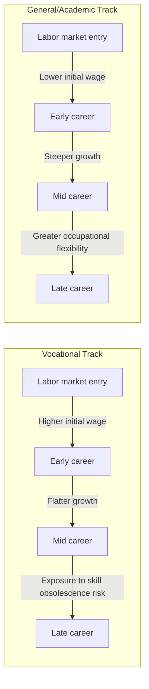

## Vocational Training and Labor Market Outcomes

### Definition and Scope

Vocational education and training (VET) encompasses education programs designed to develop occupation-specific skills for direct labor market entry, as distinguished from general academic education oriented toward broad, transferable cognitive skills. VET spans several institutional forms:

- **School-based vocational education**: classroom and workshop instruction within secondary or post-secondary institutions, with limited or no employer involvement in curriculum delivery
- **Dual/apprenticeship systems**: formal combination of workplace training under a contracted employer with part-time classroom instruction, governed by a training contract with defined duration and outcomes
- **Employer-provided training**: firm-financed and firm-delivered training, either formal (structured programs) or informal (on-the-job learning), typically for incumbent workers rather than new entrants
- **Active labor market program (ALMP) training**: publicly funded short-cycle training targeted at unemployed or disadvantaged workers, distinct from initial VET embedded in the education system

### Theoretical Framework: General vs. Specific Human Capital

Becker's distinction between general and specific human capital structures the entire economics of training:

- **General human capital**: skills that raise productivity equally across employers (e.g., literacy, numeracy, general problem-solving). Under perfect competition, competing firms bid the wage up to the worker's marginal product, so a firm providing general training captures none of the return; the worker must bear the cost (e.g., accepting a lower wage during training, or paying tuition), since any employer-financed general training would be poached by rival firms offering the trained worker the full market wage.
- **Specific human capital**: skills productive only (or primarily) at the current employer (firm-specific processes, proprietary systems, idiosyncratic team knowledge). Since specific skills are not portable, competition does not force the wage to the worker's outside marginal product; the firm can capture part of the return, and Becker's model predicts wage and training cost sharing between firm and worker to align incentives and reduce turnover-related loss on both sides.

This dichotomy explains several empirical regularities: firms underinvest in general training relative to the social optimum (since they cannot fully capture the return), apprenticeship systems compensate by having apprentices accept below-marginal-product wages during training, and firm-specific training is associated with lower turnover and longer tenure.

**Acemoglu and Pischke (1999) extended this** by showing that labor market imperfections (search frictions, minimum wages, wage compression from institutions such as collective bargaining) can lead firms to finance *general* training too, because compressed wage structures mean firms retain some of the return to general skills even without contractual lock-in — the trained worker's wage does not rise to fully match their now-higher outside option, so the firm captures rent. This reconciles the empirical observation that firms in coordinated market economies with strong wage compression (e.g., Germany) invest heavily in general-type apprenticeship training despite Becker's prediction that they should not.

### The Dual Apprenticeship System: Institutional Mechanics

The German-Austrian-Swiss dual system is the most extensively studied VET institution in the literature and functions as the reference model:

- **Contractual structure**: apprentices sign a training contract (typically 2–3.5 years) with a firm, working roughly 3–4 days per week on-site and attending vocational school 1–2 days per week for theoretical and general instruction
- **Curriculum governance**: training content is standardized nationally per occupation (several hundred recognized training occupations in Germany) and jointly designed by employer associations, trade unions, and the state — this tripartite governance is central to the system's credibility, since it prevents any single firm from producing a narrowly self-serving credential
- **Certification**: apprentices sit standardized final examinations administered by chambers of industry and commerce (or equivalent), producing a nationally recognized and portable credential despite firm-specific training delivery — this resolves the general/specific tension by making the *certification* general-purpose even when *delivery* occurs inside a single firm
- **Wage structure**: apprentice wages are set well below the marginal product of a qualified worker (often 25–35% of a starting skilled wage), which is the mechanism by which firms recoup training costs despite producing a portable credential

**Empirical evidence on outcomes**:

- [Inference] Countries with strong dual/apprenticeship systems tend to show lower youth unemployment rates than comparable OECD economies with weaker vocational tracks, though the size of the gap and how much is attributable to the training system itself (versus other labor market institutions, demographic structure, or macroeconomic conditions) is disputed in cross-country work and should not be treated as cleanly identified
- Retention rates of apprentices by their training firm are typically substantial (frequently cited in the 50–70% range across studies), consistent with a specific-human-capital or matching-quality interpretation: the apprenticeship period functions as an extended, low-cost screening mechanism for both parties
- A well-documented trade-off in the literature concerns **occupational mobility over the lifecycle**: workers trained through narrow occupation-specific VET show, on average, a wage profile that is higher immediately upon labor market entry (translating training directly into a job-ready credential) but occupation-specific training is more exposed to skill obsolescence if the trained occupation is disrupted by technological or structural change later in the worker's career, whereas general-academic-track workers show a flatter, more gradually rising profile with greater flexibility to move across occupations, a pattern reported for example by Hanushek, Schwerdt, Woessmann, and Zhang using cross-national data

### Skill-Specificity and the Technology-Exposure Trade-off

This age-earnings profile pattern generates a central policy tension: an occupation-specific VET system optimizes for smooth youth transitions into employment at the cost of potentially higher displacement risk when a trained occupation is automated or restructured, since occupation-specific human capital does not transfer smoothly to unrelated occupations. This has become more salient with accelerating automation and is a documented concern in more recent OECD Skills Outlook analyses, motivating recommendations to embed more transferable and higher-order cognitive competencies within VET curricula rather than pure task-specific training.

### Active Labor Market Training Programs

For ALMP-delivered training (as opposed to initial VET), the program evaluation literature has produced fairly consistent findings across many randomized and quasi-experimental studies (surveyed extensively by Card, Kluve, and Weber):

- **Short-run effects are frequently negative or null**, driven substantially by a **lock-in effect**: participants reduce job search intensity while enrolled in training, delaying employment relative to a comparable non-participant who continues searching
- **Medium- to long-run effects tend to turn more favorable**, with meaningful positive employment and earnings effects typically emerging roughly one to two years after program completion in many (though not all) evaluated programs, once the lock-in period has passed and the acquired skills begin generating returns
- **Program design heterogeneity dominates average effects**: classroom training programs show more mixed results than programs combining classroom instruction with a substantial on-the-job or work-experience component; targeted programs for specific disadvantaged groups (e.g., long-term unemployed, low-skilled youth) often outperform untargeted, broad-based programs
- **Publicly provided employment programs (direct job creation)** are the most consistently criticized category in the meta-analysis literature, frequently showing null or negative long-run effects, attributed to weak market signal value of the work experience gained and potential stigma effects

### Employer-Provided Training

Firm-financed training for incumbent workers exhibits several robust cross-country regularities:

- Training incidence is strongly positively correlated with worker education level ("Matthew effect" in training — those with more initial human capital receive disproportionately more subsequent firm training), which raises equity concerns since low-skilled and non-standard (temporary, part-time) workers are systematically under-trained relative to their potential returns
- Training incidence is higher in firms using more advanced technology and in larger firms, consistent with complementarity between physical/organizational capital investment and human capital investment (skill-biased technical change operating at the firm level)
- Estimated returns to employer-provided training in wage regressions are generally positive but subject to substantial upward bias from selection (more able or more motivated workers both receive more training and would have earned more regardless), and the literature has not fully resolved the magnitude of this bias despite instrumental-variable and matching-based attempts

### VET in Development Economics Context

The role and design of vocational training in low- and middle-income countries differs from advanced-economy contexts in several structural respects:

- **Weak formal-sector absorption**: where a large share of employment is informal, formal school-based VET credentials may have limited signaling value to informal-sector employers, weakening the primary mechanism through which VET is theorized to improve labor market outcomes
- **Traditional apprenticeship**: in many Sub-Saharan African and South Asian economies, informal apprenticeship (unregulated, master-craftsperson-based, without standardized curriculum or portable certification) is quantitatively the dominant mode of skill transmission for trades, operating in parallel to (and often outside) any formal TVET (technical and vocational education and training) system. [Inference] Evidence on the labor market returns to informal apprenticeship is more limited and mixed than for formal dual systems, since data infrastructure for tracking informal-sector training outcomes is considerably weaker.
- **Donor-funded short-cycle training programs**: a large experimental literature (many randomized controlled trials run by development economists, e.g., in Colombia, Kenya, and other middle-income and low-income settings) evaluates short vocational training programs targeted at unemployed youth. [Inference] Results across this literature are heterogeneous; several well-known RCTs find limited or short-lived employment effects on their own, with somewhat more consistent evidence that combining vocational training with complementary interventions (life-skills components, apprenticeship placement, wage subsidies, or capital grants for self-employment) improves outcomes relative to training alone.
- **Skills mismatch with industrial policy**: TVET system design in developing countries is frequently critiqued as insufficiently linked to the actual sectoral composition of employer demand (see also horizontal/vertical skills mismatch), with training program offerings driven more by ease of provision (e.g., generic ICT or tailoring courses) than by labor market signal, a critique frequently raised in World Bank and ILO sector reviews.

### Comparative Institutional Typology

| System type | Example countries | Governance | Certification portability | Typical youth transition outcome |
| --- | --- | --- | --- | --- |
| Dual/collective | Germany, Austria, Switzerland | Tripartite (employer, union, state) | High — nationally standardized | Comparatively smooth, low youth unemployment |
| State-directed school-based VET | France (lycée professionnel), many transition economies | State curriculum design | Moderate | Mixed; less employer buy-in risks skill relevance |
| Liberal/market-based | United States, United Kingdom (historically) | Weak coordination, employer-led where present | Low to moderate, fragmented | Higher reliance on general academic tracks and post-hoc firm training |
| Informal apprenticeship-dominant | Ghana, Nigeria, parts of South Asia | Uncoordinated, master-apprentice | Very low — no standard certification | Large informal-sector absorption, weak formal credential signal |

### Illustrative Diagram: Wage Profiles by Track Type

### Illustrative Diagram: Cost-Sharing Under General vs. Specific Human Capital (svg_diagram)

<svg xmlns="http://www.w3.org/2000/svg" viewBox="0 0 480 300">
<text x="240" y="24" text-anchor="middle" font-size="15" font-weight="bold" fill="#1a1a1a">Training Cost-Sharing (svg_diagram)</text>
<rect x="40" y="60" width="180" height="180" fill="#eff6ff" stroke="#2563eb" stroke-width="1.5" />
<text x="130" y="85" text-anchor="middle" font-size="12" font-weight="bold" fill="#1e3a8a">General Human Capital</text>
<text x="130" y="110" text-anchor="middle" font-size="10" fill="#333">Fully portable skill</text>
<text x="130" y="150" text-anchor="middle" font-size="11" fill="#1e3a8a">Worker bears cost</text>
<text x="130" y="168" text-anchor="middle" font-size="10" fill="#555">(lower training-period wage)</text>
<text x="130" y="200" text-anchor="middle" font-size="11" fill="#1e3a8a">Worker captures return</text>
<text x="130" y="216" text-anchor="middle" font-size="10" fill="#555">(competitive wage post-training)</text>
<rect x="260" y="60" width="180" height="180" fill="#fef2f2" stroke="#dc2626" stroke-width="1.5" />
<text x="350" y="85" text-anchor="middle" font-size="12" font-weight="bold" fill="#7f1d1d">Specific Human Capital</text>
<text x="350" y="110" text-anchor="middle" font-size="10" fill="#333">Firm-bound skill</text>
<text x="350" y="150" text-anchor="middle" font-size="11" fill="#7f1d1d">Cost shared</text>
<text x="350" y="168" text-anchor="middle" font-size="10" fill="#555">(firm and worker)</text>
<text x="350" y="200" text-anchor="middle" font-size="11" fill="#7f1d1d">Return shared</text>
<text x="350" y="216" text-anchor="middle" font-size="10" fill="#555">(rent split reduces turnover)</text>
</svg>

### Key Points

- The general/specific human capital dichotomy (Becker) predicts workers bear the cost of general training and firms underinvest in it; Acemoglu-Pischke show labor market imperfections and wage compression can reverse this, explaining employer-funded general training in coordinated market economies
- The dual apprenticeship system resolves the general/specific tension through tripartite governance and standardized, portable certification even when delivery is firm-specific
- Occupation-specific VET produces a labor market entry advantage but a documented later-career trade-off in occupational flexibility and exposure to skill obsolescence, relative to general academic tracks
- ALMP training evaluations consistently find a short-run lock-in effect (negative or null impact) followed by more favorable medium-run effects, with program design (work-experience component, targeting) driving substantial heterogeneity
- Employer-provided training exhibits a persistent "Matthew effect," concentrating further training investment on already higher-skilled workers
- In developing-country contexts, informal apprenticeship is often the dominant skill-transmission channel and operates largely outside formal TVET and certification systems, and short donor-funded training programs show more consistent effects when bundled with complementary interventions rather than delivered as training alone

**Related Topics**

- General vs. specific human capital and the Becker model
- Acemoglu-Pischke model of training under labor market imperfections
- Active labor market policy evaluation methodology (Card-Kluve-Weber)
- Skill-biased and task-biased technical change
- Informal sector labor markets and informal apprenticeship
- Higher education and skills mismatch
- Signaling theory and credentialism
- Randomized controlled trials in labor market program evaluation
- Comparative political economy of skill formation (Varieties of Capitalism, Hall and Soskice)
- Automation risk and occupational task content